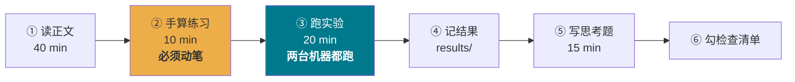

# AI Infra 系统性学习课程

> 12 周 · 84 天 · 从**物理约束**出发，一层层打通「大模型如何在真实硬件上被训练与服务」。
> 不是工具教程，是**原理课**。

<table>
<tr><td><b>强度</b></td><td>每天 1–1.5 h（读 40min + 动手 30min + 思考 15min）</td></tr>
<tr><td><b>硬件</b></td><td>Mac mini M4 / 16GB 统一内存 &nbsp;·&nbsp; Surface Laptop Studio 2 / RTX 4050 6GB</td></tr>
<tr><td><b>形式</b></td><td>图文正文 + 可运行实验 + 手算练习 + 思考题</td></tr>
</table>

## 🚀 开始

1. 读 **[SETUP.md](SETUP.md)** 配好环境（Mac 15 分钟）
2. 读 **[SYLLABUS.md](SYLLABUS.md)** 看清全貌（10 分钟，别跳过）
3. 从 **[Day 01](docs/week01/day01-ai-infra-overview.md)** 开始

> 📐 **想先打通原理？** 另有一个附加系列
> **[EXTRA-SYLLABUS.md](EXTRA-SYLLABUS.md)：Transformer 与它背后的数学**（X01–X10）,
> 讲的是「**为什么**」而不是「多少」。建议在 **Week 1 之后、Week 2 之前**插入。

```bash
uv sync                              # 一次性
uv run python labs/day01/probe.py    # Day 01 实验
uv run python labs/day02/roofline.py # Day 02 实验：画出你自己机器的 Roofline
uv run python labs/day03/gpu_anatomy.py       # Day 03 实验：峰值核算 / Tile 量化 / cache line
uv run python labs/day04/memory_hierarchy.py  # Day 04 实验：把存储金字塔逐级测出来
uv run python labs/day05/numerics.py          # Day 05 实验：把浮点数拆开看 / 量化误差
uv run python labs/day06/stack_profile.py     # Day 06 实验：软件栈开销 / 异步 / profiler

uv run python labs/extra/x01_vectors.py       # 附加 X01：向量 / 点积 / 从零训词向量
```

## 🎯 贯穿全课的主线问题

> 一个 7B 模型，在 RTX 4050（6GB / 192 GB/s）上处理
> 「2000 token 输入 → 500 token 输出」，
> **每一微秒 GPU 在做什么？瓶颈在哪？如何提升 10 倍吞吐？**

Day 01 提出，Day 84 你要能**不查资料、拿纸笔在 15 分钟内**完整回答。
中间每一天，都是在给这个问题补上一块拼图。

## 📊 进度看板

图例：⬜ 未开始 · 🟨 进行中 · ✅ 已完成 · ⭐ 重点

| 周 | 主题 | 天 | 状态 |
|---|---|---|---|
| **W1** | 地基：体系结构视角 | [01](docs/week01/day01-ai-infra-overview.md) ⭐ [02](docs/week01/day02-roofline.md) ⭐ [03](docs/week01/day03-gpu-architecture.md) [04](docs/week01/day04-memory-hierarchy.md) [05](docs/week01/day05-numeric-formats.md) [06](docs/week01/day06-software-stack.md) 07 | 🟨 6/7 |
| **附加** | **[Transformer 与背后的数学](EXTRA-SYLLABUS.md)** | [X01](docs/extra/x01-vectors.md) X02 X03 X04 X05 X06 X07 X08 X09 X10 | 🟨 1/10 |
| **W2** | Transformer 解剖 | 08 09 10 11 12 13 14 | ⬜ |
| **W3** | KV Cache 与注意力变体 | 15 ⭐ 16 ⭐ 17 18 19 20 21 | ⬜ |
| **W4** | CUDA / Triton 算子 | 22 23 24 ⭐ 25 26 27 28 | ⬜ |
| **W5** | FlashAttention / 量化 | 29 ⭐ 30 31 ⭐ 32 33 34 35 | ⬜ |
| **W6** | 训练：内存与精度 | 36 ⭐ 37 38 39 40 ⭐ 41 ⭐ 42 | ⬜ |
| **W7** | 训练：并行策略 | 43 ⭐ 44 ⭐ 45 46 47 48 49 | ⬜ |
| **W8** | 推理引擎 / vLLM | 50 51 ⭐ 52 53 54 55 ⭐ 56 | ⬜ |
| **W9** | 服务化与性能建模 | 57 58 59 60 ⭐ 61 62 63 | ⬜ |
| **W10** | 编译器与运行时 | 64 65 ⭐ 66 67 68 69 70 | ⬜ |
| **W11** | 系统 / 网络 / 运维 | 71 72 73 74 75 76 77 | ⬜ |
| **W12** | 综合实战 | 78 79 80 81 82 83 84 ⭐ | ⬜ |

## 🔑 每周核心问题

| 周 | 一句话问题 |
|---|---|
| W1 | 算力涨了 1000 倍，为什么推理还是慢？ |
| W2 | 模型的每个参数、每次乘加、每字节显存，分别花在哪？ |
| W3 | 为什么推理会分裂成性能特征完全相反的两个阶段？ |
| W4 | 一个 kernel 的性能上限由什么决定？ |
| W5 | 怎样在不改变数学结果的前提下，把访存降一个数量级？ |
| W6 | 训练 7B 为什么要 14GB 的 5~8 倍显存？ |
| W7 | 万卡集群上，模型该怎么切？ |
| W8 | 为什么一个调度器能把吞吐提升 20 倍？ |
| W9 | 给定硬件与 SLO，最大能承载多少 QPS？ |
| W10 | `torch.compile` 一行代码为什么能提速 2 倍？ |
| W11 | 从单卡到集群，工程复杂度增加在哪？ |
| W12 | 把前 11 周全部用上，你能优化出多少倍？ |

## 📁 目录结构

```
docs/weekNN/dayNN-*.md        每日正文（图文）
docs/weekNN/dayNN-notes.md    ← 你的笔记与思考题答案
labs/dayNN/                   可运行实验代码
scripts/dayNN_figs.py         配图生成脚本（可改参数重画）
assets/dayNN/                 图片
results/                      ← 你的实测数据（mac / rtx4050 分开记）
```

## 📝 每日节奏建议



**唯一的硬性要求**：手算和实验不能跳。
AI Infra 的直觉全部来自"我亲手算过这个数、亲眼看过这条曲线"。

## 💬 如何获取每日内容

在 VS Code Copilot Chat 里说：

- `生成 Day 02` —— 出下一篇正文 + 配图 + 实验
- `生成 Day 02，我昨天实验的结果是 ...` —— 结合你的实测数据定制
- `Day 01 的 T3 我想不明白` —— 针对思考题深入讲
- `我在 RTX 4050 上跑 probe.py 结果是 ...，帮我分析` —— 解读你的数据
- `重画 Day 01 图 3，把 batch 扩到 2048` —— 改脚本参数重新出图

## 🧭 学习原则

1. **自下而上**：先懂 L1 硬件约束，再看 L5 系统设计。反过来学只会背结论。
2. **一切量化**：任何结论都要能落到一个数字上（多少 GB、多少 ms、多少倍）。
3. **6GB 是特性不是限制**：小显存逼你精确计算显存，这正是 AI Infra 的核心能力。
4. **周日必复盘**：每周日有一次"闭卷手算"，不看资料算参数量/显存/FLOPs/吞吐。
