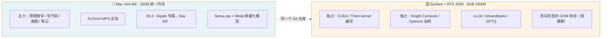

# 环境准备 · Mac mini (M4) + Surface Laptop Studio 2 (RTX 4050)

> 一次配好，用满 84 天。**先配 Mac（今天必须完成），Windows 可以拖到 Day 07 前搞定。**

---

## 0. 双机分工原则



> 建议把本仓库推到 GitHub 私有库，两台机器都 clone，笔记和实验数据同步。

---

## 1. Mac mini (Apple Silicon) —— 必做

### 1.1 基础工具链

```bash
# uv：本课程统一的 Python 环境管理器（已安装可跳过）
curl -LsSf https://astral.sh/uv/install.sh | sh

cd /Users/jh/workspace/github.com/gaopenghigh/ai2
uv sync            # 创建 .venv（Python 3.12）并安装全部依赖
uv run python -c "import torch; print(torch.__version__, torch.backends.mps.is_available())"
# 期望输出: 2.13.0 True
```

> **为什么锁 Python 3.12 而不用你系统里的 3.14？**
> PyTorch / Triton / vLLM 这类带 C++ 扩展的库，对新版 Python 的支持通常滞后 6–12 个月。
> AI Infra 领域"用最新 Python"几乎总是踩坑。这本身就是一条经验。

### 1.2 验证 GPU 可用

```bash
uv run python labs/day01/probe.py --exp 1
```

看到实测 TFLOPS 和 GB/s 就说明 MPS 正常。

### 1.3 解锁更多 GPU 显存（可选但推荐）

macOS 默认只允许 GPU 使用约 75% 的统一内存。16 GB 机器上大约 11 GB。
临时提到 13 GB（重启失效，需要 sudo，**请你自己在终端里执行**）：

```bash
sudo sysctl iogpu.wired_limit_mb=13312
```

> ⚠️ 调太高会导致系统卡死。16 GB 机器建议不超过 13312。

### 1.4 llama.cpp（Metal 后端）—— Week 3 开始用

```bash
brew install llama.cpp        # 最省事
# 或从源码编译（想看 Metal kernel 源码时用）：
#   git clone https://github.com/ggml-org/llama.cpp && cd llama.cpp
#   cmake -B build && cmake --build build --config Release -j
```

### 1.5 MLX —— Week 10 (Day 69) 用，现在可以先不装

```bash
uv add mlx mlx-lm      # 需要时再执行
```

---

## 2. Windows + RTX 4050 —— Day 07 前完成

**两套环境，各有不可替代的用途，建议都装：**

| | WSL2 + Ubuntu | 原生 Windows |
|---|---|---|
| PyTorch CUDA | ✅ | ✅ |
| Triton kernel | ✅ **推荐** | ⚠️ 支持不完整 |
| vLLM | ✅ **只能这里** | ❌ |
| CUDA C++ 编译 | ✅ | ✅ |
| **Nsight Compute 深度剖析** | ⚠️ 受限 | ✅ **推荐** |
| 显存可用量 | 略少（WSL 有开销） | 最多 |

### 2.1 前置：驱动

只需在 **Windows 侧**装最新 NVIDIA Game Ready / Studio 驱动即可。
**不要在 WSL 内部装 NVIDIA 驱动**，会破坏透传。

```powershell
# PowerShell 里验证
nvidia-smi
```
应能看到 `NVIDIA GeForce RTX 4050 Laptop GPU` 和 `6141MiB` 左右的显存。

> **Surface Laptop Studio 2 注意事项**：
> 1. 在「电源模式」里选**最佳性能**，否则 GPU 会被限到很低的 TGP，测出来的算力会差一倍。
> 2. 插电测试，电池模式下频率不稳，benchmark 数据没有可比性。
> 3. 关掉「动态刷新率」和外接显示器，减少 GPU 被占用的显存。

### 2.2 WSL2 环境

```powershell
wsl --install -d Ubuntu-24.04
```

进入 Ubuntu 后：

```bash
# 验证 GPU 透传
nvidia-smi

# 装 uv
curl -LsSf https://astral.sh/uv/install.sh | sh
source ~/.bashrc

# clone 课程仓库
git clone <你的仓库地址> ai2 && cd ai2

# 装带 CUDA 的 PyTorch（覆盖默认的 CPU 版）
uv sync
uv pip install --force-reinstall torch --index-url https://download.pytorch.org/whl/cu124

uv run python -c "import torch; print(torch.cuda.is_available(), torch.cuda.get_device_name(0))"
# 期望: True NVIDIA GeForce RTX 4050 Laptop GPU
```

跑 Day 01 实验：

```bash
uv run python labs/day01/probe.py
```

### 2.3 CUDA Toolkit（Week 4 写 kernel 时必须）

**WSL2 内**（不含驱动的版本）：
```bash
wget https://developer.download.nvidia.com/compute/cuda/repos/wsl-ubuntu/x86_64/cuda-keyring_1.1-1_all.deb
sudo dpkg -i cuda-keyring_1.1-1_all.deb
sudo apt update && sudo apt install -y cuda-toolkit-12-4
echo 'export PATH=/usr/local/cuda/bin:$PATH' >> ~/.bashrc && source ~/.bashrc
nvcc --version
```

**原生 Windows**（Nsight Compute 用）：
从 NVIDIA 官网下载 CUDA Toolkit 安装包，勾选 Nsight Compute + Nsight Systems + Visual Studio Integration。
需要先装 Visual Studio 2022（Community 版即可，勾选"使用 C++ 的桌面开发"）。

### 2.4 Nsight Compute 权限（重要，很多人卡在这）

消费级显卡默认**禁止**性能计数器访问，Nsight 会报 `ERR_NVGPUCTRPERM`。
解决：NVIDIA 控制面板 → 桌面 → 「启用开发者设置」→ 开发者 →
「管理 GPU 性能计数器」→ 选择**「允许所有用户访问 GPU 性能计数器」**→ 重启。

### 2.5 vLLM（Week 8 用，现在不用装）

```bash
uv pip install vllm     # 只在 WSL2/Linux 可用
```
> 6 GB 显存跑 vLLM 需要小模型 + 量化，Week 8 会给具体配方（比如 Qwen2.5-1.5B-Instruct-AWQ）。

---

## 3. 编辑器与阅读体验

课程文档大量使用 **Mermaid 图 + LaTeX 公式**，需要正确渲染：

```bash
code --install-extension bierner.markdown-mermaid
code --install-extension goessner.mdmath
```

- 打开任意 `docs/**/*.md`，按 `Cmd+K V` 开预览
- 图应该能正常显示；公式如果不渲染，用 `Cmd+Shift+V` 试试内置预览

---

## 4. 目录约定

```
ai2/
├── SYLLABUS.md              # 84 天完整大纲
├── SETUP.md                 # 本文件
├── README.md                # 进度看板
├── docs/weekNN/dayNN-*.md   # 每日正文
├── docs/weekNN/dayNN-notes.md  # ← 你的笔记 / 思考题答案（自己写）
├── labs/dayNN/              # 可运行实验代码
├── scripts/dayNN_figs.py    # 配图生成脚本（可改参数重画）
├── assets/dayNN/            # 生成的图片
└── results/                 # ← 你的实测数据（两台机器分别记录）
```

---

## 5. 常见问题

**Q: `uv sync` 装 torch 特别慢**
A: 换源：`export UV_INDEX_URL=https://pypi.tuna.tsinghua.edu.cn/simple`

**Q: Mac 上 MPS 报 `not implemented for ...`**
A: MPS 后端算子覆盖不全。加环境变量回落到 CPU：
`export PYTORCH_ENABLE_MPS_FALLBACK=1`（会变慢，但能跑通）

**Q: RTX 4050 跑实验 OOM**
A: **这是好事，是本课程刻意保留的教学场景。**
先自己算一遍"我需要多少显存"，再决定改哪个参数。养成这个习惯比装个大显卡有价值得多。

**Q: 两台机器测出来的数字差很多，是不是哪里错了？**
A: 大概率没错。M4 是统一内存低带宽高容量，4050 是独显高带宽低容量，
架构完全不同。**这种差异本身就是最好的教材** —— Day 02 会教你怎么解释它。
