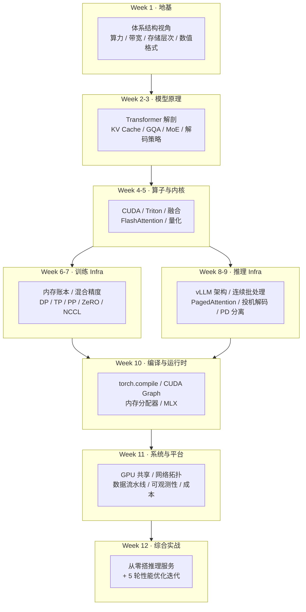

# AI Infra 系统性学习大纲（12 周 / 84 天）

> 目标：**从原理上**掌握"一个大模型如何在真实硬件上被训练和服务"的完整链路。
> 强度：每天 1–1.5 小时（阅读 ~40 min + 动手 ~30 min + 思考题 ~15 min）
> 硬件：Mac mini (Apple Silicon, 统一内存) 主力 + Surface Laptop Studio 2 (RTX 4050 6GB) 做 CUDA 实验

---

## 一、设计原则

这门课不是"工具教程合集"，而是围绕 **4 条主线** 反复穿透：

| 主线 | 一句话 | 贯穿章节 |
|---|---|---|
| **L1 硬件物理约束** | 算力(FLOPS)、带宽(GB/s)、容量(GB)、延迟(ns) 是一切设计的边界 | Week 1, 4, 11 |
| **L2 模型计算结构** | Transformer 的每个算子都对应确定的 FLOPs / 访存量 / 显存占用 | Week 2–3 |
| **L3 系统调度策略** | 批处理、并行切分、缓存复用、异步流水，本质都是"填满 L1 的空隙" | Week 6–9 |
| **L4 软件抽象层** | 从 `model(x)` 到 SASS 指令中间隔了多少层，每层做了什么优化 | Week 5, 10 |

**贯穿全课的主线案例**：
> 一个 7B 参数的 Llama 类模型，在 RTX 4050 (6GB, ~194 GB/s, ~15 TFLOPS FP16) 上
> 处理一次「2000 token 输入 → 500 token 输出」的请求，
> **每一微秒 GPU 在做什么？瓶颈在哪？如何提升 10 倍吞吐？**
>
> 这个问题在 Day 1 提出，在 Day 84 你应该能不查资料、拿纸笔在 15 分钟内完整回答。

**每日文章固定结构**：
```
① 今日目标（1 句话）        ② 直觉引入（一个反常识的现象/数字）
③ 原理推导（含公式与图）     ④ 手算练习（拿真实参数算一遍）
⑤ 动手实验（可运行代码）     ⑥ 思考题（3 道，含 1 道开放题）
⑦ 一图总结                  ⑧ 延伸阅读（论文/源码定位）
```

---

## 二、总览



---

## 三、逐日大纲

### Week 1 · 地基：用体系结构的眼睛看 AI

> **本周核心问题**：为什么 GPU 算力涨了 1000 倍，大模型推理还是慢？

| Day | 主题 | 核心问题 | 产出 |
|---|---|---|---|
| 01 | **AI Infra 全景图 & 一个 Token 的一生** | 从 HTTP 请求到吐出一个字，中间经过哪些层？ | 全景分层图 + 主线案例建模 |
| 02 | **Roofline 模型与三堵墙** | 算术强度 (Arithmetic Intensity) 决定你撞哪堵墙 | 手绘你两台机器的 Roofline 图 |
| 03 | **GPU 架构解剖** | SM / Warp / SIMT / Tensor Core 到底怎么组织的？ | RTX 4050 架构参数表 + 占用率计算 |
| 04 | **存储层次与数据搬运** | 寄存器→SMEM→L2→HBM→PCIe→磁盘，每级差多少倍？ | 延迟/带宽金字塔实测 |
| 05 | **数值格式全解** | FP32/TF32/FP16/BF16/FP8/INT8/INT4 的位分布与溢出边界 | 手写 float 位解析器，复现溢出 |
| 06 | **软件栈剖面** | `y = model(x)` 到 SASS 指令中间的 8 层抽象 | 用 profiler 抓出每层耗时 |
| 07 | **周复盘 + 实测工作坊** | 实测你两台机器的峰值算力与带宽，对比标称值 | `bench_hw.py` 跨平台基准工具 |

### Week 2 · Transformer 解剖（Infra 视角）

> **本周核心问题**：模型的每一个参数、每一次乘加、每一字节显存，分别花在哪？

| Day | 主题 | 核心问题 | 产出 |
|---|---|---|---|
| 08 | **Transformer 逐层拆解** | 推导参数量公式 $12 d^2 L$ 的来源 | 参数量计算器 |
| 09 | **注意力的计算图与复杂度** | $O(n^2 d)$ 里的常数究竟是多少？ | FLOPs 精确计算表 |
| 10 | **从零手写 GPT** | 不用 `nn.Transformer`，用 200 行跑通前向 | `minigpt.py` + 加载真实权重验证 |
| 11 | **位置编码：RoPE / ALiBi** | 为什么 RoPE 能外推？旋转矩阵的几何直觉 | RoPE 可视化动图 |
| 12 | **归一化：LayerNorm / RMSNorm** | Pre-LN vs Post-LN 为何影响训练稳定性 | 梯度范数对比实验 |
| 13 | **FFN 与激活：GELU / SwiGLU** | 为什么 FFN 占了 2/3 的参数和算力 | 算子级 FLOPs 分布饼图 |
| 14 | **周复盘：手算工作坊** | 给定模型配置，30 分钟内算出参数量/FLOPs/显存 | 手算 → 代码验证 → 误差分析 |

### Week 3 · 推理的本质：KV Cache 与注意力变体

> **本周核心问题**：为什么推理分成两个完全不同的阶段？

| Day | 主题 | 核心问题 | 产出 |
|---|---|---|---|
| 15 | **KV Cache 原理** | 没有它，生成第 n 个 token 要重算多少次？ | 有/无 Cache 的复杂度对比实验 |
| 16 | **Prefill vs Decode** | 一个 compute-bound，一个 memory-bound，差异有多大？ | 两阶段 Roofline 定位图 |
| 17 | **注意力变体：MHA/MQA/GQA/MLA** | KV Cache 从 GB 压到 MB 的数学 | 四种变体的 Cache 大小对比 |
| 18 | **MoE 原理** | 稀疏激活如何做到"参数多但算力不涨" | 手写 Top-k 路由 + 负载均衡损失 |
| 19 | **长上下文技术** | 滑窗、稀疏、StreamingLLM、YaRN 的取舍 | 上下文长度 vs 显存曲线 |
| 20 | **采样与解码策略** | 温度/top-k/top-p/beam 的工程代价 | 手写采样器，对比 logits 分布 |
| 21 | **周复盘 + 实验** | 手写完整 KV Cache 推理循环并 benchmark | `kvcache_infer.py` |

### Week 4 · 算子与 CUDA 基础

> **本周核心问题**：一个 kernel 的性能上限由什么决定？

| Day | 主题 | 核心问题 | 产出 |
|---|---|---|---|
| 22 | **CUDA 编程模型** | grid/block/thread/warp 如何映射到硬件 | 索引计算脑图 |
| 23 | **第一个 Kernel：向量加法** | 为什么它永远达不到峰值算力 | RTX 4050 上编译运行 + Nsight 分析 |
| 24 | **矩阵乘优化之路** | naive → tiling → 寄存器分块 → Tensor Core | 5 个版本逐步逼近 cuBLAS |
| 25 | **Reduction 与 Online Softmax** | 如何在一次遍历里算完 softmax | 手推 online softmax 递推式 |
| 26 | **算子融合** | 融合省的到底是什么？（不是算力） | 融合前后访存量计算 |
| 27 | **Triton 入门** | 用 Python 写出接近手写 CUDA 的性能 | Triton 版 fused LayerNorm |
| 28 | **周复盘 + 实验** | Triton 实现 fused softmax，对比 PyTorch | benchmark 曲线图 |

### Week 5 · FlashAttention 与量化

> **本周核心问题**：如何在不改变数学结果的前提下，把访存量降一个数量级？

| Day | 主题 | 核心问题 | 产出 |
|---|---|---|---|
| 29 | **FlashAttention 原理** | tiling + online softmax + 重算，IO 复杂度推导 | 手推 IO 复杂度 $O(N^2d^2/M)$ |
| 30 | **FlashAttention-2 / 3** | 并行维度重排、warp 特化、FP8 | 三代对比表 |
| 31 | **PagedAttention** | 借鉴虚拟内存分页，解决什么碎片问题 | 内存碎片模拟实验 |
| 32 | **量化基础** | 对称/非对称、per-tensor/channel/group 的误差来源 | 手写量化-反量化，测误差 |
| 33 | **权重量化：GPTQ / AWQ** | 为什么"重要权重"要保护？Hessian 的作用 | 在 RTX 4050 上跑 4-bit 模型 |
| 34 | **激活与 KV 量化** | SmoothQuant 的迁移技巧、FP8 的工程价值 | 量化前后精度/速度对比 |
| 35 | **周复盘 + 实验** | 6GB 显存跑 7B 模型：量化全流程实战 | 显存占用分解报告 |

### Week 6 · 训练 Infra：内存与精度

> **本周核心问题**：训练一个 7B 模型到底需要多少显存？为什么是 14GB 的 5~8 倍？

| Day | 主题 | 核心问题 | 产出 |
|---|---|---|---|
| 36 | **训练内存账本** | 参数/梯度/优化器状态/激活 的精确公式 | 内存分解计算器 |
| 37 | **自动微分原理** | 反向传播 = 计算图上的链式法则 | 手写 100 行 autograd 引擎 |
| 38 | **混合精度训练** | loss scaling / master weights / BF16 为何更稳 | 复现 FP16 梯度下溢 |
| 39 | **梯度检查点** | 用 $\sqrt{L}$ 次重算换 $\sqrt{L}$ 倍显存 | 时间-显存权衡曲线 |
| 40 | **数据并行与 Ring AllReduce** | 为什么通信量是 $2(N-1)/N \cdot S$ 而非 $N \cdot S$ | 手写 Ring AllReduce 模拟 |
| 41 | **ZeRO-1/2/3 与 FSDP** | 三个阶段各切什么、各省多少、各增多少通信 | ZeRO 阶段对比表 |
| 42 | **周复盘 + 实验** | 单机模拟 DDP，观测通信量与计算重叠 | 通信/计算时间线图 |

### Week 7 · 训练 Infra：并行策略

> **本周核心问题**：万卡集群上，模型该怎么切？

| Day | 主题 | 核心问题 | 产出 |
|---|---|---|---|
| 43 | **张量并行 (Megatron)** | 列切/行切的数学，为什么一层只需 2 次 AllReduce | 手推 MLP + Attention 切分 |
| 44 | **流水线并行** | GPipe vs 1F1B，气泡率 $(p-1)/(m+p-1)$ 推导 | 流水线时间线可视化 |
| 45 | **序列并行 / 上下文并行** | Ring Attention 如何切超长序列 | 切分方案对比 |
| 46 | **3D/4D 并行组合** | TP 放机内、DP 放机间的拓扑原因 | 并行策略搜索空间分析 |
| 47 | **集合通信与 NCCL** | AllReduce/AllGather/ReduceScatter/A2A 的实现与代价 | 通信原语代价表 |
| 48 | **优化器深挖** | Adam 的两个状态、数值细节、显存优化变体 | Adam 手写实现 + 状态可视化 |
| 49 | **周复盘 + 实验** | Mac 上用 MLX / PyTorch MPS 做 LoRA 微调 | 完整微调脚本 + 显存曲线 |

### Week 8 · 推理引擎：vLLM 架构

> **本周核心问题**：为什么一个调度器能把吞吐提升 20 倍？

| Day | 主题 | 核心问题 | 产出 |
|---|---|---|---|
| 50 | **推理引擎架构总览** | vLLM / SGLang / TensorRT-LLM / llama.cpp 的定位差异 | 架构对比矩阵 |
| 51 | **Continuous Batching** | 静态批 vs 连续批的 GPU 空转率计算 | 批处理模拟器 |
| 52 | **vLLM 源码走读：Scheduler** | 一个 step 里 waiting/running/swapped 如何流转 | 源码调用链注释 |
| 53 | **vLLM 源码走读：Block Manager** | 物理块/逻辑块映射、copy-on-write | 块分配过程手工模拟 |
| 54 | **Prefix Caching / RadixAttention** | 多轮对话如何复用前缀 KV | 命中率测算实验 |
| 55 | **投机解码** | 为什么"猜"能加速？接受率与期望加速比推导 | 投机解码模拟器 |
| 56 | **周复盘 + 实验** | 本地部署推理引擎并压测 | 压测报告 |

### Week 9 · 推理服务化与性能建模

> **本周核心问题**：给定硬件与 SLO，最大能承载多少 QPS？

| Day | 主题 | 核心问题 | 产出 |
|---|---|---|---|
| 57 | **PD 分离** | 为什么要把 Prefill 和 Decode 拆到不同机器 | PD 分离收益模型 |
| 58 | **Chunked Prefill 与调度** | 长请求如何不阻塞短请求 | 调度策略对比实验 |
| 59 | **服务化指标体系** | TTFT / TPOT / ITL / Goodput 的定义与陷阱 | 指标采集工具 |
| 60 | **性能建模** | 从硬件参数推导吞吐上限（不跑代码） | 解析式性能模型 |
| 61 | **约束解码** | JSON Schema / 正则如何在采样层强制 | FSM 约束解码实现 |
| 62 | **多模态推理 Infra** | ViT encoder + LLM decoder 的调度差异 | 多模态流水线图 |
| 63 | **周复盘 + 实验** | 写 benchmark 工具，画 latency-throughput 曲线 | `bench_serving.py` |

### Week 10 · 编译器与运行时

> **本周核心问题**：`torch.compile` 一行代码为什么能提速 2 倍？

| Day | 主题 | 核心问题 | 产出 |
|---|---|---|---|
| 64 | **计算图与 IR** | Dynamo 如何抓图？graph break 为何致命 | 图捕获实验 |
| 65 | **torch.compile 全流程** | Dynamo → AOTAutograd → Inductor → Triton | 逐阶段产物 dump |
| 66 | **CUDA Graph 与启动开销** | 小 kernel 场景下 launch 开销占比 | launch overhead 实测 |
| 67 | **内存分配器** | PyTorch caching allocator 与碎片化 | 显存碎片复现与分析 |
| 68 | **ONNX / TensorRT / MLIR** | 编译器生态的分层与取舍 | 生态地图 |
| 69 | **Apple Silicon: MPS / MLX** | 统一内存架构对 AI 负载的独特优势 | Mac 上跑 MLX 推理对比 |
| 70 | **周复盘 + 实验** | compile 前后 profile 对比 | 火焰图分析报告 |

### Week 11 · 系统、网络与运维

> **本周核心问题**：从单卡到集群，工程复杂度增加在哪？

| Day | 主题 | 核心问题 | 产出 |
|---|---|---|---|
| 71 | **GPU 共享技术** | 时分复用 / MPS / MIG 的隔离性与代价 | 共享方案对比 |
| 72 | **K8s + GPU 调度** | device plugin、拓扑感知、Gang Scheduling | 调度约束建模 |
| 73 | **数据流水线** | 模型加载、Dataloader、存储带宽瓶颈 | 加载耗时分解 |
| 74 | **网络：NVLink / RDMA / IB** | 拓扑如何决定并行策略 | 拓扑-策略映射表 |
| 75 | **可观测性** | Nsight / torch profiler / DCGM 各看什么 | Profiling 手册 |
| 76 | **容错与弹性** | Checkpoint 策略、失败恢复、静默错误 | Checkpoint 开销模型 |
| 77 | **周复盘：成本模型** | 每百万 token 成本如何算 | 成本计算器 |

### Week 12 · 综合实战

| Day | 主题 | 产出 |
|---|---|---|
| 78 | 项目设计：需求、SLO、架构选型 | 设计文档 |
| 79 | 实现 v0：朴素推理服务（baseline） | 可运行服务 |
| 80 | 优化 1：KV Cache + 连续批处理 | 性能对比 |
| 81 | 优化 2：量化 + 算子融合 | 性能对比 |
| 82 | 优化 3：调度策略 + Prefix Cache | 性能对比 |
| 83 | 压测、瓶颈定位、极限调优 | 完整压测报告 |
| 84 | **全课总复盘**：重答 Day 1 的主线问题 + 知识图谱 + 后续路线 | 个人知识图谱 |

---

## 四、双机分工策略

| 任务类型 | Mac mini (Apple Silicon) | Surface + RTX 4050 (6GB) |
|---|---|---|
| 原理推导 / 手算 / 画图 | ✅ 主力 | — |
| NumPy / PyTorch CPU 小实验 | ✅ 主力 | ✅ |
| MPS / MLX 加速实验 | ✅ 独占（统一内存优势） | — |
| **CUDA / Triton kernel 编写** | ❌ 不支持 | ✅ **独占** |
| Nsight Compute / Systems 剖析 | ❌ | ✅ **独占** |
| 量化模型推理（4-bit 7B） | ✅ (llama.cpp Metal) | ✅ (bitsandbytes/GPTQ) |
| vLLM 部署 | ⚠️ 有限 | ✅ (WSL2) |
| 多卡并行 | 模拟 (gloo, 多进程 CPU) | 模拟 |

> **6GB 显存不是缺点，是最好的老师**：它逼你在每个实验里都必须精确计算显存，
> 这正是 AI Infra 的核心能力。

---

## 五、评估机制

- **每周日**：复盘文 + 一次"闭卷手算"（不看资料算参数量/显存/FLOPs/吞吐）
- **每月末**：一个综合项目（Week 4 / 8 / 12）
- **通关标准**：能独立回答 Day 1 主线案例的全部子问题，并给出优化方案与量化预期

---

## 六、进度追踪

见 [README.md](README.md) 的进度看板。
