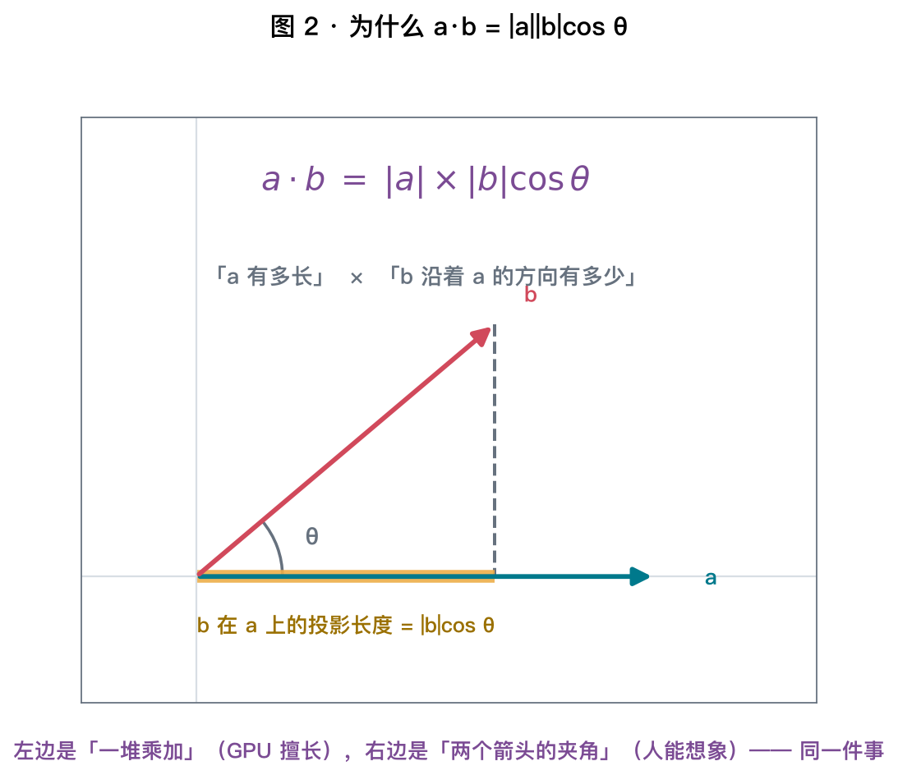
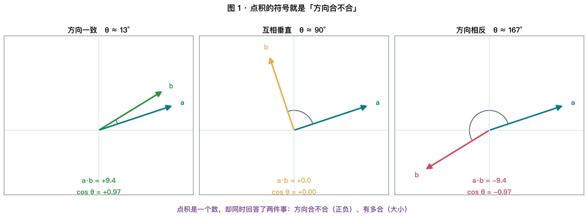
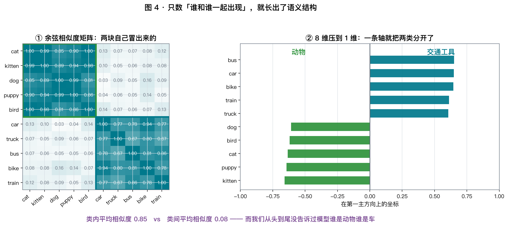
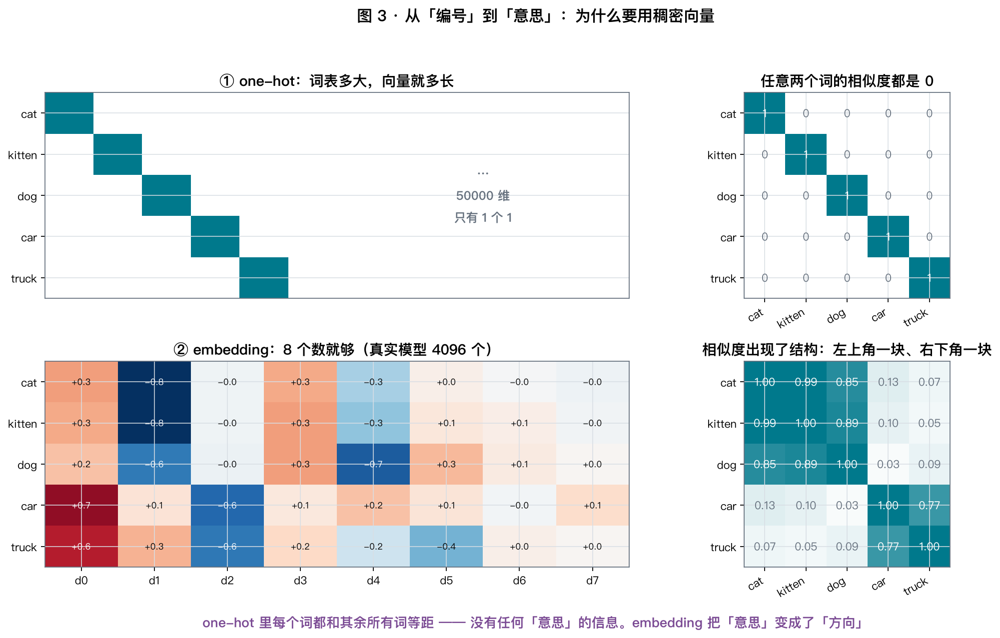
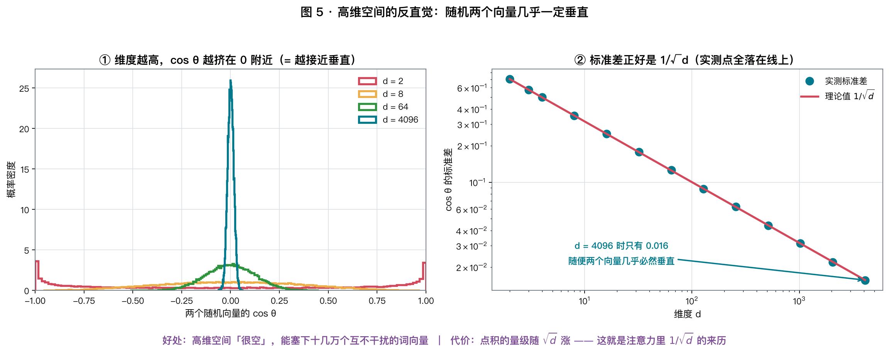
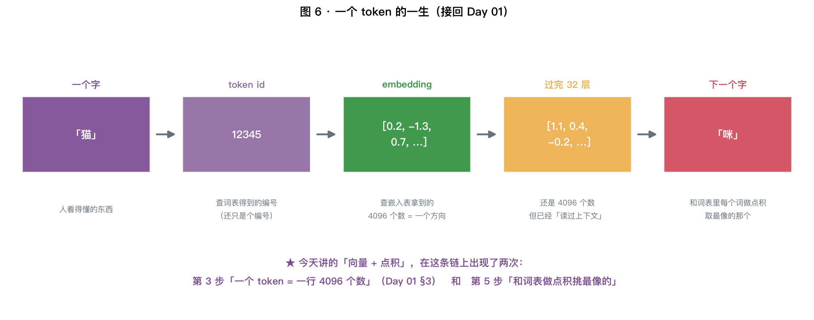
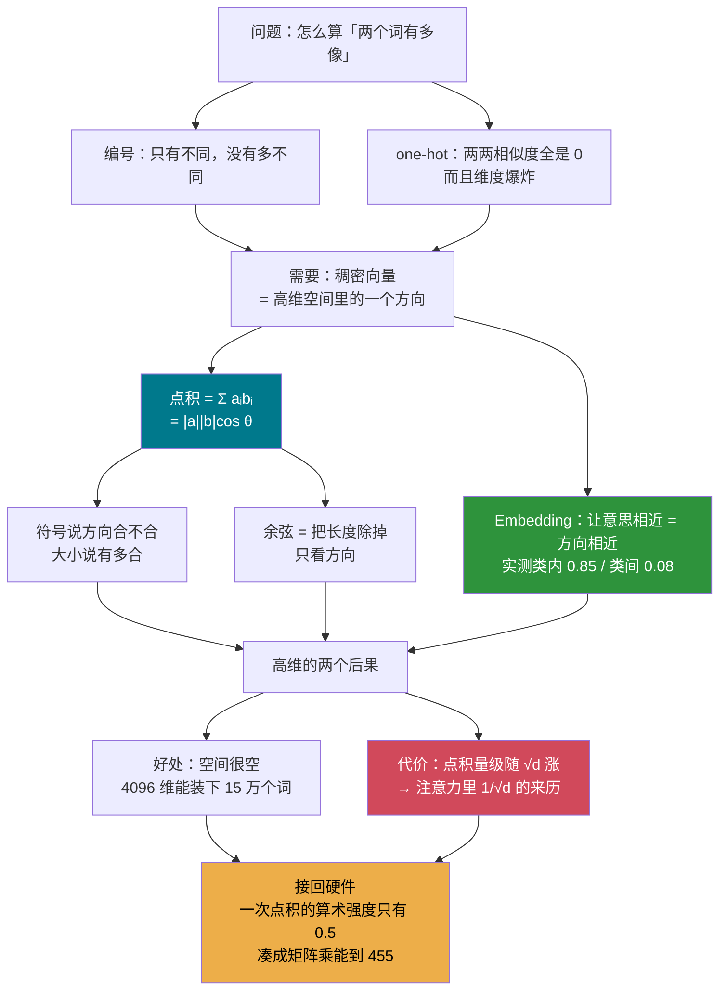

# X01 · 向量：为什么「意思」可以变成一串数

> **这是附加系列的第一讲。** 整个系列的目标是：
> 让你能真正读懂 $\text{softmax}(QK^\top/\sqrt{d})V$ 这一行 —— 每个符号为什么在那里。
>
> **今日目标**：搞清楚两件事 ——
> ① 为什么一个词可以变成一串数？② **点积凭什么能当"相似度"？**

⏱ 阅读 35 min · 动手 30 min · 思考 15 min

---

## 1. 从一个具体问题开始

**问题**：怎么让计算机知道「猫」和「狗」比「猫」和「汽车」更像？

这不是一个哲学问题，它必须有一个**能算出来的答案** —— 因为模型每一步都要用到它。

### 1.1 第一次尝试：给每个词编号

```
猫 = 1     狗 = 2     汽车 = 3     沙发 = 4
```

**立刻崩溃**：按这个编号，「猫」和「狗」差 1，「狗」和「汽车」也差 1 ——
但「狗」和「汽车」根本不像。而且「汽车」= 3 = 「猫」+ 「狗」，毫无意义。

$$
\boxed{\ \text{编号只有「不同」的信息，没有「多不同」的信息}\ }
$$

### 1.2 第二次尝试：one-hot

那就别让编号有大小关系 —— 每个词用一个只有一位是 1 的长向量：

```
猫   = [1, 0, 0, 0, ...]
狗   = [0, 1, 0, 0, ...]
汽车 = [0, 0, 1, 0, ...]
```

**这解决了"编号有大小"的毛病，但引入了一个更糟的**：

$$
\text{猫} \cdot \text{狗} = 0, \qquad \text{猫} \cdot \text{汽车} = 0, \qquad \text{任意两个词} = 0
$$

**所有词两两之间的相似度全是 0，完全等距。** 还是没有"多像"的信息。
而且 5 万个词就要 5 万维，**99.998% 的位置都是 0**。

### 1.3 于是需求变清楚了

我们需要一种表示，满足：

| 要求 | one-hot 做到了吗 |
|---|---|
| 不同的词有不同的表示 | ✅ |
| **能算出「有多像」** | ❌ 全是 0 |
| **维度不随词表爆炸** | ❌ 5 万词 = 5 万维 |

**答案就是「用一个几百上千维的稠密向量表示一个词」，也就是 embedding。**
但在讲它之前，得先搞清楚**"像"这个字到底怎么算**。

---

## 2. 向量：一串数就是一个箭头

**一个向量就是一串数**：$a = [3, 1]$。

在二维里，它就是从原点指向 $(3, 1)$ 的一个**箭头**。这个箭头有两个属性：

| 属性 | 怎么算 | 直觉 |
|---|---|---|
| **方向** | 箭头指向哪 | 「是什么」 |
| **长度**（范数） | $\lvert a\rvert = \sqrt{a_1^2 + a_2^2 + \cdots}$ | 「有多强」 |

> **长度的公式就是勾股定理**，只不过项数从 2 个变成了 $d$ 个。
> 4096 维的向量，长度就是 4096 个数的平方和再开方 —— 没有任何新东西。

**这条"箭头"的直觉在 4096 维里依然成立**，只是你画不出来。
本讲后面所有的推理，都只依赖"方向 + 长度"这一个图景。

---

## 3. 点积：一个数就概括了"两个箭头有多像"

### 3.1 算法定义：简单到有点意外

$$
\boxed{\ a \cdot b = \sum_{i=1}^{d} a_i b_i\ }
$$

**逐个位置相乘，然后全部加起来。** 就这样。

```python
def dot(a, b):
    return sum(ai * bi for ai, bi in zip(a, b))
```

### 3.2 几何含义：这才是关键



$$
\boxed{\ a \cdot b = \underbrace{|a|}_{\text{a 有多长}} \times \underbrace{|b|\cos\theta}_{\text{b 沿着 a 方向有多少}}\ }
$$

**同一个数，两副面孔**：

| | 长什么样 | 给谁看 |
|---|---|---|
| $\sum a_i b_i$ | 一堆乘加 | **给硬件** —— 正是 GPU 的 FMA（Day 03 §2） |
| $\lvert a\rvert\lvert b\rvert\cos\theta$ | 两个箭头的夹角 | **给你** —— 能想象的几何 |

（为什么这两个长得完全不同的式子会相等？**下一节就证给你看。**）

**整个注意力机制，就是在反复做这件事：一次算几百万个夹角。**

### 3.3 为什么这两个式子是同一个东西

上面直接把两个式子划了等号，但它们长得完全不像：
左边只有加法乘法，右边凭空出现了一个 $\cos$。**凭什么？**

#### 先看最简单的情况：把 a 转到横轴上

先在二维里看。把坐标系转一下，让 $a$ 刚好沿着 $x$ 轴：

```
        y
        │           b
        │          ╱┆
        │        ╱  ┆
        │      ╱    ┆  |b|·sinθ
        │    ╱      ┆
        │  ╱  θ     ┆
        └────────────┴──────────────►  x
        0        |b|·cosθ            a = (|a|, 0)
```

- $a$ 在 $x$ 轴上，所以 $a = (\,|a|,\; 0\,)$
- $b$ 和 $x$ 轴夹角是 $\theta$，按 $\sin/\cos$ 的**定义**，$b = (\,|b|\cos\theta,\; |b|\sin\theta\,)$

直接代进点积的定义：

$$
a \cdot b = \underbrace{|a| \times |b|\cos\theta}_{\text{第一个分量相乘}}
\;+\; \underbrace{0 \times |b|\sin\theta}_{\text{第二个分量相乘} = 0}
= |a||b|\cos\theta
$$

**两行就完了。** 但这里偷偷用了一个前提：**我可以随便旋转坐标系。** 凭什么？

#### 关键：点积只由三条边长决定

把 $|a-b|^2$ 展开看看（只用到 $(x-y)^2 = x^2 - 2xy + y^2$）：

$$
|a-b|^2 = \sum_i (a_i - b_i)^2
= \underbrace{\sum_i a_i^2}_{|a|^2} - 2\underbrace{\sum_i a_i b_i}_{a \cdot b} + \underbrace{\sum_i b_i^2}_{|b|^2}
$$

移一下项：

$$
\boxed{\ a \cdot b = \frac{|a|^2 + |b|^2 - |a-b|^2}{2}\ }
$$

**右边只出现了三条边的长度。** 而旋转不会改变任何一条边的长度
—— 所以旋转也不会改变点积。上面那个“把 $a$ 转到横轴”的做法，就是合法的。

> 用 §3.5 表里“有点像”那一行验算：$a = [1,2,3,4]$，$b = [2,1,4,3]$
>
> $$|a|^2 = 30,\quad |b|^2 = 30,\quad a-b = [-1,1,-1,1] \Rightarrow |a-b|^2 = 4$$
>
> $$a\cdot b = \frac{30 + 30 - 4}{2} = \frac{56}{2} = \mathbf{28}$$
>
> 和直接逐项相乘算出来的 28 一模一样 ✅

#### 另一种证法：直接套余弦定理

注意 $a$、$b$、$a-b$ 刚好组成一个三角形（就是图 2 里那个）。
高中学过的**余弦定理**直接给出：

$$
|a-b|^2 = |a|^2 + |b|^2 - 2|a||b|\cos\theta
$$

而刚刚纯代数展开得到的是：

$$
|a-b|^2 = |a|^2 + |b|^2 - 2\,(a \cdot b)
$$

两式相减，$|a|^2 + |b|^2$ 全部抵掉：

$$
-2\,(a\cdot b) = -2|a||b|\cos\theta
\quad\Longrightarrow\quad
\boxed{\ a \cdot b = |a||b|\cos\theta\ }
$$

**所以两者等价，就是余弦定理换了个写法。**

#### 那 4096 维里“夹角”还有意义吗？

**有。关键在于：任意两个向量只张成一个二维平面。**

不管 $a$ 和 $b$ 在多少维里，它们两个（加上原点）就确定了一个平面，
$a-b$ 也在这个平面里。**那个三角形是一个实打实的平面三角形**，
余弦定理一字不改地适用。

> 严格一点说：在高维里数学上是把 $\cos\theta := \dfrac{a\cdot b}{|a||b|}$ 当作**定义**的。
> 这个定义合法，因为**柯西–施瓦茨不等式**保证 $|a\cdot b| \le |a||b|$，
> 所以这个比值一定落在 $[-1, 1]$ 里，$\arccos$ 才有意义。
> 而在 2D/3D 里，这个定义和“拿量角器量出来的角”完全一致 —— 上面刚证过。

$$
\boxed{\ \text{所以在 4096 维里说“两个向量夹角 60°”，是完全严格的说法}\ }
$$

### 3.4 三种情况



| 夹角 | $\cos\theta$ | $a \cdot b$ | 含义 |
|---|---|---|---|
| $\theta \approx 0°$ | $\approx +1$ | **大正数** | 方向一致，很像 |
| $\theta = 90°$ | $0$ | **0** | 互相垂直，**完全无关** |
| $\theta \approx 180°$ | $\approx -1$ | **大负数** | 方向相反，反义 |

$$
\boxed{\ \text{点积的【符号】说方向合不合，【大小】说有多合}\ }
$$

### 3.5 实测对账

```bash
uv run python labs/extra/x01_vectors.py --exp A
```

| 这两个向量 | a | b | $a\cdot b$ | $\lvert a\rvert$ | $\lvert b\rvert$ | $\cos\theta$ | 夹角 |
|---|---|---|---|---|---|---|---|
| 完全同向 | `[1,2,3,4]` | `[2,4,6,8]` | 60.00 | 5.48 | 10.95 | **1.000** | 0.0° |
| 有点像 | `[1,2,3,4]` | `[2,1,4,3]` | 28.00 | 5.48 | 5.48 | 0.933 | 21.0° |
| 互相垂直 | `[1,0,1,0]` | `[0,1,0,1]` | **0.00** | 1.41 | 1.41 | **0.000** | 90.0° |
| 完全反向 | `[1,2,3,4]` | `[-1,-2,-3,-4]` | **−30.00** | 5.48 | 5.48 | **−1.000** | 180.0° |
| **长度差很多** | `[1,2,3,4]` | `[100,200,300,400]` | **3000.00** | 5.48 | 547.72 | **1.000** | 0.0° |

**看最后两行，这是今天最重要的一个区别。**

---

## 4. 余弦相似度：把长度除掉

上表最后一行：$a \cdot b = 3000$，一个巨大的数 —— 但它们方向**完全一样**，
只是 $b$ 长了 100 倍。

**点积同时被"方向"和"长度"影响。** 如果你只想问"意思像不像"，就得把长度除掉：

$$
\boxed{\ \cos\theta = \frac{a \cdot b}{|a|\,|b|} \in [-1, 1]\ }
$$

这就是**余弦相似度**。它只看方向，永远落在 $[-1, 1]$。

**什么时候用哪个：**

| 你想问什么 | 用哪个 | 为什么 |
|---|---|---|
| 这两个词意思像不像 | **余弦** | 长度是干扰项 |
| 这个特征在这条数据上有多强 | **点积** | 长度就是"强度"，是有用信息 |
| 注意力里的 $QK^\top$ | **点积** | 后面 X06 会解释为什么不归一化 |

---

## 5. Embedding：让"意思"变成"方向"

### 5.1 一句 1957 年的话

> **「一个词的意思，由它周围出现的词决定。」** —— J. R. Firth, 1957

这叫**分布式假说（distributional hypothesis）**。整个 embedding 的思想都在这一句里。

**如果"猫"和"狗"总是出现在相似的上下文里（都会 eat、都会 sleep、都很 cute），
那就让它们的向量方向相近。**

### 5.2 亲手做一遍：从"数数"到"几何"

```bash
uv run python labs/extra/x01_vectors.py --exp C
```

实验里我们**没有用任何神经网络**，只做了三步：

```
① 数共现   在一个 200 多句的小语料里，数「哪两个词经常一起出现」
   ↓
② PPMI     把「因为常见所以共现多」的部分除掉，只留下超出偶然的关联
   ↓
③ SVD 降维  从 83 维压到 8 维，保留最主要的几个方向
```

### 5.3 结果：类别自己冒出来了



| | 平均余弦相似度 |
|---|---|
| **类内**（动物-动物、车-车，20 对） | **0.85** |
| **类间**（动物-车，25 对） | **0.08** |

**差了一个数量级。** 而且这 10 个名词里，**每一个的最近邻 top-3 都在自己类内**。

> **请停下来体会一下**：我们从头到尾**没有告诉模型任何一个词的含义**，
> 只是数了"谁和谁一起出现"。动物就自动聚成一团、车自动聚成一团。
>
> ⚠️ **诚实地说**：这个玩具语料只有 200 多句而且很规整，所以"大类"分得很开，
> 但"cat 和 kitten 应该比 cat 和 bird 更近"这种**细粒度关系并不可靠**。
> 真实模型要用几千亿 token 才能学出稳定的细结构。

### 5.4 和 one-hot 对比



| | one-hot | embedding |
|---|---|---|
| 维度 | 词表大小（5 万 / 15 万） | **几百到几千**（GPT-2 是 768，Llama 是 4096） |
| 存的是什么 | 一个位置 | **一个方向** |
| 任意两词相似度 | **恒等于 0** | 有结构：同类高、异类低 |
| 谁决定的 | 人为编号 | **从数据里学出来的** |

**真实模型的 embedding 不是数出来的，是训出来的** ——
但目标完全一样：**让"意思相近"变成"方向相近"**。

---

## 6. 高维空间的反直觉（这条后面会反复用到）

```bash
uv run python labs/extra/x01_vectors.py --exp D
```



**实验**：在 $d$ 维里随机取两个向量，看它们的夹角。

| 维度 $d$ | $\cos\theta$ 的标准差 | $1/\sqrt{d}$ | 夹角落在 80°~100° 的比例 |
|---|---|---|---|
| 2 | 0.7052 | 0.7071 | 11.2% |
| 8 | 0.3518 | 0.3536 | 34.3% |
| 64 | 0.1243 | 0.1250 | 83.4% |
| 512 | 0.0436 | 0.0442 | **100.0%** |
| **4096** | **0.0157** | **0.0156** | **100.0%** |

$$
\boxed{\ \text{std}(\cos\theta) = \frac{1}{\sqrt{d}}\ }
$$

**第 2、3 列一模一样。** 这不是巧合，可以两行推出来：

设 $a, b$ 的每个分量都是独立的标准正态。那么

$$
a \cdot b = \sum_{i=1}^{d} a_i b_i
\quad\Rightarrow\quad
\mathbb{E}[a\cdot b] = 0,\quad \text{Var}(a \cdot b) = d
\quad\Rightarrow\quad |a \cdot b| \sim \sqrt{d}
$$

而 $|a| \approx |b| \approx \sqrt{d}$，所以

$$
\cos\theta = \frac{a\cdot b}{|a||b|} \sim \frac{\sqrt{d}}{\sqrt{d}\cdot\sqrt{d}} = \frac{1}{\sqrt{d}}
$$

### 6.1 这是好事

**高维空间"很空"。** $d = 4096$ 时随便两个方向几乎必然垂直，
意味着可以塞进**海量互不干扰的方向** —— 这就是 4096 维能装下 15 万个词向量的原因。

> 二维平面上你最多只能放 2 个互相垂直的方向；
> 4096 维里能放 4096 个**严格**垂直的方向，而**近似**垂直的方向有天文数字那么多。

### 6.2 但它也埋了个雷

注意上面的推导里出现了 $|a \cdot b| \sim \sqrt{d}$ ——
**点积的量级会随维度增长**。

$$
d = 64 \Rightarrow |a\cdot b| \sim 8, \qquad
d = 4096 \Rightarrow |a\cdot b| \sim 64
$$

**这个"越来越大的数"要送进 softmax。** 数太大会发生什么？
—— softmax 会饱和成一个近似 one-hot 的分布，梯度几乎消失。

$$
\boxed{\ \text{这正是注意力公式里那个 } 1/\sqrt{d} \text{ 的来历}\ }
$$

**X03 会讲 softmax 为什么怕大数，X06 会把这个 $\sqrt{d}$ 完整推一遍。**
今天先把这个雷埋在这儿。

---

## 7. 接回硬件：今天讲的东西在哪留下了痕迹



### 7.1 「一个 token = 一行 4096 个数」

Day 01 §3 那句话，今天有了完整的含义：

```
「猫」 →（查词表）→ id 12345 →（查嵌入表的第 12345 行）→ 4096 个数
```

**embedding 表就是一个 `(词表大小, d)` 的矩阵**，查表 = 取出某一行。

### 7.2 这张表有多大（接 Day 01 / Day 04 的显存账）

$$
\text{embedding 表字节数} = V \times d \times b
$$

| 模型 | 词表 $V$ | $d$ | fp16 大小 |
|---|---|---|---|
| GPT-2 | 50257 | 768 | 77 MB |
| Llama-2-7B | 32000 | 4096 | **262 MB** |
| Llama-3-8B | **128256** | 4096 | **1.05 GB** |
| Qwen 系列 | **151936** | 4096 | **1.24 GB** |

> **注意后两行**：词表一变大，embedding 表就能超过 1 GB ——
> **比好几层 Transformer 加起来还大**。
> 这就是为什么大词表模型的显存账要单独算（Week 2 会细算）。

### 7.3 为什么 $d$ 总是 128 的倍数（接 Day 03）

$4096 = 128 \times 32$。Day 03 §6.2 实测过：矩阵边长不是 128 的倍数，
性能直接掉 15%。**所以 $d$ 不是随便挑的，是被硬件的 tile 大小定死的。**

同理，词表也常被 padding 到 128 的倍数（32000 → 32128）。

### 7.4 一次点积的算术强度是多少（接 Day 02 / 03）

算**一个** 4096 维的点积：

$$
\text{FLOPs} = 4096\ \text{次 FMA} \times 2 = 8192,\qquad
\text{Bytes} = 2 \times 4096 \times 2\ \text{B} = 16384
$$

$$
\text{算术强度} = \frac{8192}{16384} = \mathbf{0.5}\ \text{FLOP/Byte}
$$

**0.5！** 而 M4 的平衡点是 41，4050 是 125（Day 02）。

$$
\boxed{\ \text{孤立地算一次点积，一定是重度带宽受限的}\ }
$$

> **这个 0.5 你见过** —— Day 03 §6.1 里"不分块的朴素矩阵乘"算出来的也是 0.5。
> 不是巧合：**矩阵乘就是一大堆点积**。
>
> 所以硬件上**永远不会孤立地算一个点积**，一定要凑成矩阵乘再分块（Day 03 §6），
> 让搬进片上的数据被复用几十次。
> **X02 就是讲这件事：为什么一切都要写成矩阵。**

---

## 8. 手算练习（15 分钟）

**Q1**（基本功）. 给定 $a = [2, -1, 3]$，$b = [1, 4, -2]$。
求 $a\cdot b$、$|a|$、$|b|$、$\cos\theta$。它们更像"同向"还是"反向"？

<details>
<summary>点开答案</summary>

$$
a \cdot b = 2\times1 + (-1)\times4 + 3\times(-2) = 2 - 4 - 6 = \mathbf{-8}
$$

$$
|a| = \sqrt{4+1+9} = \sqrt{14} \approx 3.742, \qquad
|b| = \sqrt{1+16+4} = \sqrt{21} \approx 4.583
$$

$$
\cos\theta = \frac{-8}{3.742 \times 4.583} = \frac{-8}{17.15} \approx \mathbf{-0.467}
$$

$$
\theta = \arccos(-0.467) \approx \mathbf{117.8°}
$$

**点积是负的 → 夹角大于 90° → 偏"反向"。**

> 注意 $-0.467$ 不算很负。在 $d=3$ 这种低维里，$|\cos\theta|$ 天然就比较大
> （§6 那张表：$d=3$ 时标准差有 0.58）。同样的 $-0.467$ 如果出现在 4096 维里，
> 那就是**极其显著**的反向关系了 —— 因为随机情况下它只有 $\pm0.016$。
</details>

**Q2**（显存账，接 Day 01）. 一个模型词表 128256、$d = 4096$。
① fp16 下 embedding 表多大？② 如果输出层（lm_head）不和它共享权重，总共多大？
③ 这占 8B 模型（fp16 共 16 GB）的百分之几？

<details>
<summary>点开答案</summary>

**① embedding 表**：

$$
128256 \times 4096 \times 2\ \text{B} = 1.0505 \times 10^9 = \mathbf{1.05\ GB}
$$

**② 不共享权重时**，输出层是一个 $(d, V)$ 的矩阵，大小完全一样：

$$
1.05 + 1.05 = \mathbf{2.10\ GB}
$$

**③ 占比**：

$$
\frac{2.10}{16} = \mathbf{13.1\%}
$$

**参数量上它只是两个矩阵，却吃掉了 13% 的显存。**

> 这就是为什么很多模型选择**权重绑定（weight tying）** ——
> 让输入 embedding 和输出层共用同一个矩阵，直接省掉一半。
> Llama 系列在小尺寸上绑定、大尺寸上不绑定，正是在这个账上做取舍。
>
> 另外注意：**这两个矩阵在 decode 时的行为完全不同** ——
> 输入 embedding 每步只读**一行**（8 KB），输出层每步要读**整个矩阵**（1.05 GB）。
> 按 Day 01 的带宽账，光输出层就要 $1.05/192 = 5.5$ ms！Week 2 会细算。
</details>

**Q3**（高维直觉）. 在 $d = 4096$ 维里随机取两个向量，
$\cos\theta$ 大约在什么范围？如果你测到两个词向量的 $\cos\theta = 0.3$，
这算"有点像"还是"极其像"？

<details>
<summary>点开答案</summary>

由 §6 的结论，随机向量的 $\cos\theta$ 服从均值 0、标准差 $1/\sqrt{4096} = 0.0156$ 的分布。

$$
\text{99.7\% 的随机对落在 } \pm 3\sigma = \pm 0.047\ \text{以内}
$$

所以 $\cos\theta = 0.3$ 相当于：

$$
\frac{0.3}{0.0156} \approx \mathbf{19\ 个标准差}
$$

**这是天文数字级别的显著。** 在 4096 维里，0.3 就是"极其像"。

> **这条极其实用**：做向量检索（RAG）时，很多人看到相似度只有 0.3 就觉得"不太相关"，
> 其实要看**维度**和**这个模型的相似度分布**。
> 正确做法是先测一批随机对的分布，再判断阈值 —— 而不是凭 0~1 的直觉。
</details>

**Q4**（接 Day 02）. 一个 batch 有 512 个 token，每个 4096 维。
要算它们**两两之间**的点积（这正是注意力的第一步）。
① 一共多少次点积？② FLOPs 和搬运字节各是多少？③ 算术强度是多少？

<details>
<summary>点开答案</summary>

**① 点积次数**：$512 \times 512 = \mathbf{262144}$ 次

**② FLOPs**：每次点积 $2d$ FLOP：

$$
262144 \times 2 \times 4096 = \mathbf{2.147 \times 10^9} = 2.15\ \text{GFLOP}
$$

**搬运字节**（fp16）：注意**不是** 262144 次各读两个向量 ——
把它写成矩阵乘 $X X^\top$，$X$ 只需要读**一遍**：

$$
\underbrace{512 \times 4096 \times 2}_{\text{读 } X} + \underbrace{512\times512\times2}_{\text{写结果}}
= 4.19 + 0.52 = \mathbf{4.72\ MB}
$$

**③ 算术强度**：

$$
\text{AI} = \frac{2.147\times10^9}{4.72\times10^6} = \mathbf{455}\ \text{FLOP/Byte}
$$

**从 0.5 涨到了 455 —— 900 倍。**

> **这就是"为什么一切都要写成矩阵"的全部答案。**
>
> | 写法 | 算术强度 | 在 4050 上（平衡点 125） |
> |---|---|---|
> | 一次一个点积 | 0.5 | 重度带宽受限 |
> | **凑成矩阵乘** | **455** | **算力受限** ✅ |
>
> 同样的数学、同样的 FLOPs，只是**换了个组织方式**，就从带宽受限变成了算力受限。
> **X02 会把这件事讲透。**
</details>

---

## 9. 动手实验（30 分钟）

```bash
uv run python labs/extra/x01_vectors.py           # 四个实验全跑
uv run python labs/extra/x01_vectors.py --exp C   # 只看词向量
```

**必做的四件事**：

1. **实验 A**：把 Q1 的两个向量加进去，和你手算的结果对一下。
2. **实验 C**：往 `FLAVOR` 里加一个新类别（比如水果 apple/banana/orange，
   配上 "the {w} is sweet" 这类句子），看新类别会不会自己聚成第三团。
3. **实验 C 进阶**：把 `window` 从 2 改成 1 和 5，观察类内/类间相似度怎么变。
   **想清楚为什么。**
4. **实验 D**：把 $d$ 改成 16384，验证 $1/\sqrt{d}$ 还成不成立。

---

## 10. 思考题

**T1（反过来想）**
§6 说高维空间里随机两个向量几乎垂直。
**那为什么词向量之间的相似度能到 0.85？** 它们不是"随机"的吗？
（提示：训练做了什么？）

**T2（接 Day 05）**
点积是一长串加法（4096 项）。Day 05 §6 说 FP16 累加到 2048 就加不动了。
**那 4096 维的点积在 FP16 下能算对吗？** 硬件是怎么处理的？

**T3（开放）**
如果让你判断两个**句子**（而不是两个词）像不像，
你会怎么用今天学的东西？把每个词的向量加起来行不行？会丢掉什么？
（提示：「狗咬人」和「人咬狗」。这个问题正是 X05 的出发点。）

---

## 11. 一图总结



**今日一句话**：
> **点积是整个 Transformer 里最基础的一个动作。**
> 它一边是"一堆乘加"（硬件擅长），一边是"两个箭头的夹角"（人能理解）——
> 而**「意思」这件事，被彻底翻译成了「方向」**。

---

## 12. 延伸阅读

| 类型 | 材料 | 建议 |
|---|---|---|
| 🎬 首推 | 3Blue1Brown《线性代数的本质》EP1–EP2、EP9 | 20 分钟，把"向量是箭头"和"点积是投影"讲透 |
| 📄 经典 | *Efficient Estimation of Word Representations* (word2vec, 1301.3781) | 只看引言和图，感受动机 |
| 📄 好文 | Jay Alammar, *The Illustrated Word2vec* | 图做得极好 |
| 🔧 玩具 | [TensorFlow Embedding Projector](https://projector.tensorflow.org) | 在浏览器里转真实的词向量空间 |
| 📄 进阶 | *Neural Word Embedding as Implicit Matrix Factorization* (NIPS'14) | 证明 word2vec ≈ 我们实验里的 PPMI+SVD |

---

## ✅ 今日检查清单

- [ ] 能说出为什么 one-hot 不行（两个理由）
- [ ] 能默写 $a\cdot b = \sum a_ib_i = \lvert a\rvert\lvert b\rvert\cos\theta$，并解释右边每一项
- [ ] **能自己推一遍这两者为什么相等**（展开 $\lvert a-b\rvert^2$ + 余弦定理，两行）
- [ ] 能说清楚**什么时候用点积、什么时候用余弦**
- [ ] 跑完实验 C，看到了类内 0.85 / 类间 0.08
- [ ] 记住 $\text{std}(\cos\theta) = 1/\sqrt{d}$，并知道 $d=4096$ 时是 **0.016**
- [ ] 知道 $1/\sqrt{d}$ 这个雷埋在哪儿了（X06 会引爆）
- [ ] 完成 Q1–Q4，特别是 **Q4 的 0.5 → 455**
- [ ] 笔记写进 `x01-notes.md`

**下一讲（X02）**：矩阵与形状。
`(B, d) @ (d, k) → (B, k)` 里每个维度到底代表什么？
为什么 `nn.Linear` 存的是转置？**为什么一切都必须写成矩阵？**
—— 这一讲会彻底解决 Day 01 你反馈的那个卡点。
