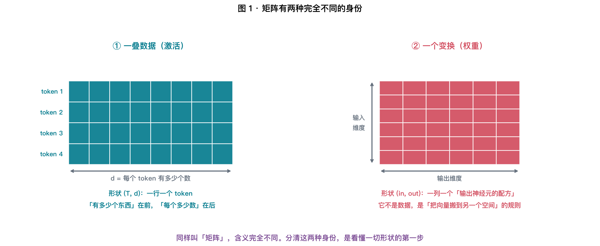
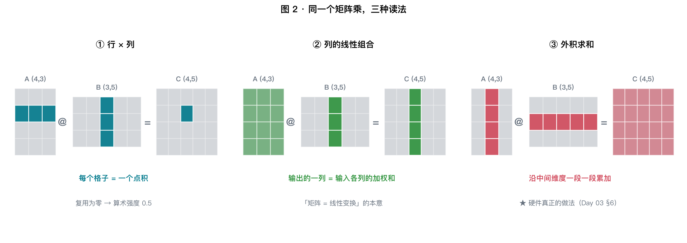
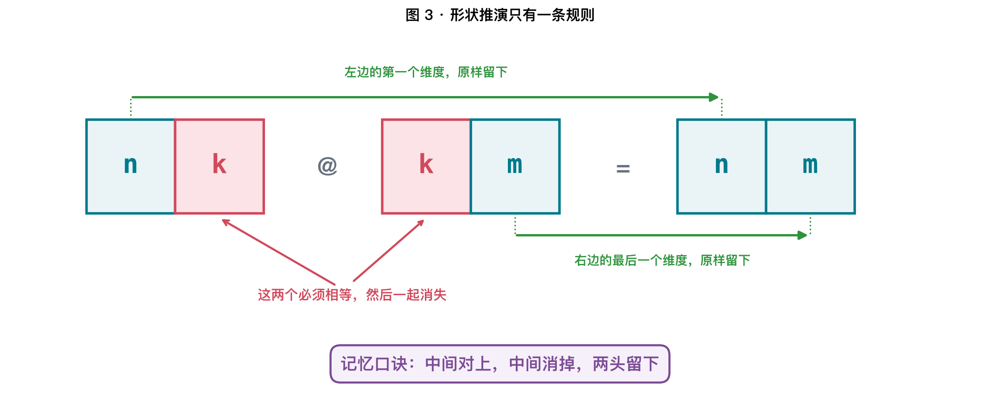
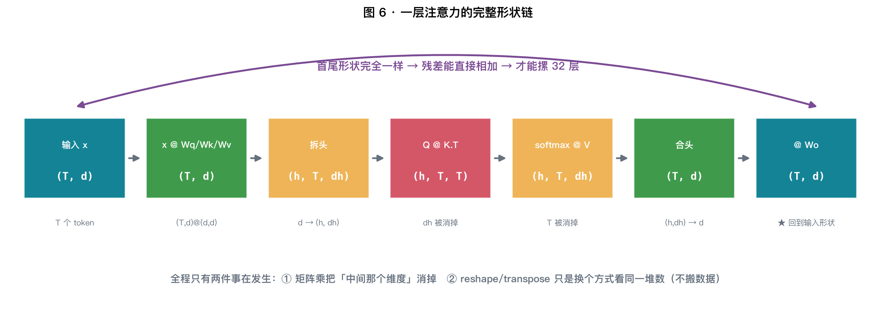
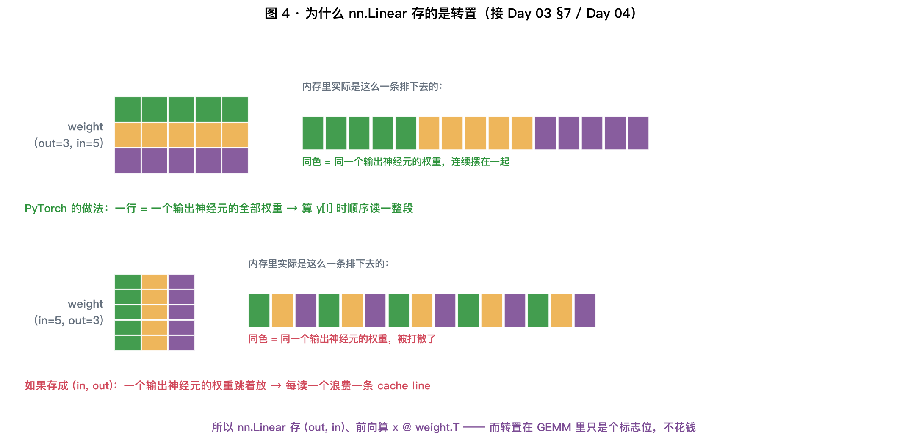
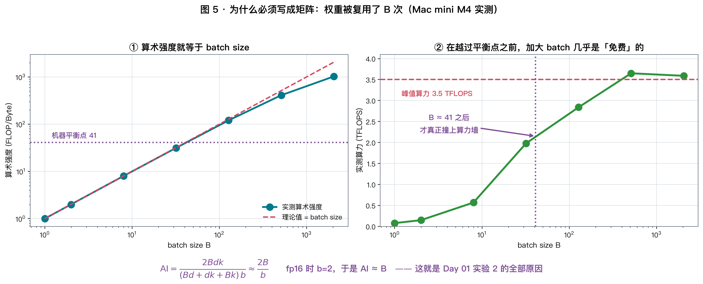
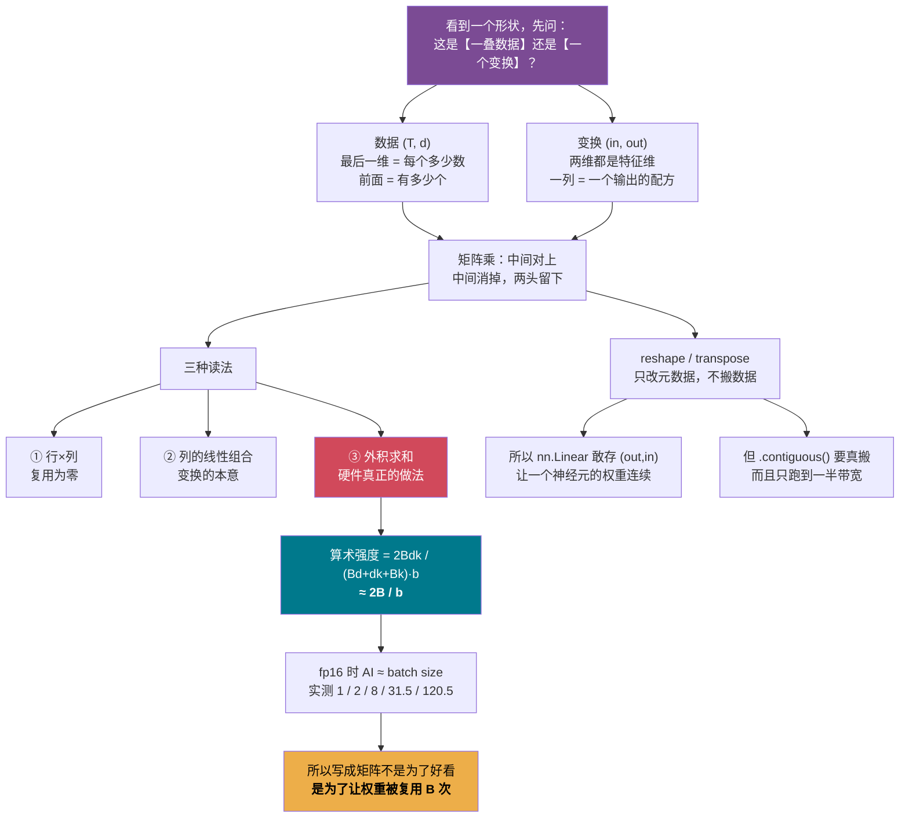

# X02 · 矩阵与形状：为什么一切都必须写成矩阵

> **今日目标**：彻底解决三件事 ——
> ① `(B, d) @ (d, k) → (B, k)` 里每个维度到底在说什么？
> ② 为什么 `nn.Linear` 存的是转置？
> ③ **X01 结尾那个「0.5 → 455，涨了 900 倍」，到底是怎么回事？**

⏱ 阅读 40 min · 动手 30 min · 思考 15 min

---

## 1. X01 留下的那个 900 倍

X01 最后算了一笔账：

| 写法 | 算术强度 | 在 4050 上（平衡点 125） |
|---|---|---|
| 一次一个点积 | **0.5** | 重度带宽受限 |
| 凑成矩阵乘 | **455** | 算力受限 |

**同样的数学、同样的 FLOPs，只是换了个组织方式，就差了 900 倍。**

今天把这件事讲透。但在那之前，得先把**形状**这件事彻底解决 ——
因为这是绝大多数人真正卡住的地方。

---

## 2. 先解决那个最常见的卡点：形状记号在说什么

### 2.1 「矩阵」这个词，其实指两种完全不同的东西



| | ① 数据（激活） | ② 变换（权重） |
|---|---|---|
| 长什么样 | `x` 的形状 `(T, d)` | `W` 的形状 `(d, k)` |
| 一行是什么 | **一个 token 的 $d$ 个数** | 无所谓 |
| 一列是什么 | 无所谓 | **一个输出神经元的「配方」** |
| 它是什么 | 一叠向量堆起来 | **把向量搬到另一个空间的规则** |
| 训练时会变吗 | 每一步都不同 | **学出来的，推理时固定** |

$$
\boxed{\ \text{看到一个形状，先问：这是「一叠数据」还是「一个变换」？}\ }
$$

**这个区分是理解一切形状的钥匙。** 后面每一步我都会标出来。

### 2.2 一条规则，读懂所有形状

$$
\boxed{\ \textbf{最后一维} = \text{「每个东西有多少个数」};\quad
\textbf{前面所有维度} = \text{「有多少个东西」}\ }
$$

拿这条规则去读，一切就都通了：

| 形状 | 怎么读 |
|---|---|
| `(4096,)` | **一个** token，4096 个数 |
| `(T, 4096)` | **T 个** token，每个 4096 个数 |
| `(B, T, 4096)` | **B 个序列 × T 个** token，每个 4096 个数 |
| `(B, h, T, 128)` | **B 个序列 × h 个头 × T 个** token，每个 128 个数 |

**注意最后一维永远是「特征维」，前面全是「计数维」。**
所以看到 `(B, h, T, dh)` 别慌 —— 前面三个只是在说"一共有 $B \times h \times T$ 个东西"。

> ⚠️ **唯一的例外就是权重矩阵**（身份②）。
> 权重的两个维度都是"特征维"：`(in, out)` 说的是「从多少维搬到多少维」。
> **所以才要先分清身份。**

### 2.3 一个具体的例子

Day 01 说「一个 token = 一行 4096 个数」。现在可以把它写全：

```
"今天天气不错"
   ↓ tokenizer
[1234, 5678, 910, 1112]           4 个 token 的 id
   ↓ 查 embedding 表 (V, d)
x.shape = (4, 4096)               ← 4 行，一行一个 token
```

---

## 3. 矩阵乘：三种读法

```bash
uv run python labs/extra/x02_shapes.py --exp A
```



同一个 $C = A B$，可以从三个完全不同的角度看。**三种算法给出完全一样的结果**
（实验里三种手写实现和 numpy 的误差都是 $5.5\times10^{-17}$，纯浮点舍入）。

### 3.1 读法一：行 × 列（教科书版）

$$
C_{ij} = \sum_t A_{it} B_{tj} = (A \text{ 的第 } i \text{ 行}) \cdot (B \text{ 的第 } j \text{ 列})
$$

**每个输出格子 = 一个点积**（X01 §3）。

- 好处：直观
- 坏处：$n\times m$ 个点积各读各的，**数据复用为零** —— 这就是 X01 §7.5 那个 0.5

### 3.2 读法二：列的线性组合（变换的视角）

这一读法最容易卡住，所以我们从最小的情形一步步搭。

#### 3.2.1 先看最简单的：矩阵 × 一个向量

$$
\begin{bmatrix} 1 & 0 & 2 \\ 0 & 1 & 3 \end{bmatrix}
\begin{bmatrix} 1 \\ 1 \\ 0 \end{bmatrix}
= \; ?
$$

按读法一（行×列）算：第一行 $\cdot$ 那个向量 $= 1{\cdot}1 + 0{\cdot}1 + 2{\cdot}0 = 1$，
第二行同理得 $1$。结果是 $\begin{bmatrix}1\\1\end{bmatrix}$。

现在换个顺序看**同一笔账**。把 $A$ 竖着切成三列：

$$
a_1 = \begin{bmatrix}1\\0\end{bmatrix},\quad
a_2 = \begin{bmatrix}0\\1\end{bmatrix},\quad
a_3 = \begin{bmatrix}2\\3\end{bmatrix}
$$

$$
\begin{bmatrix} 1 \\ 1 \\ 0 \end{bmatrix} \text{ 的三个数} \;\longrightarrow\;
\underbrace{1}_{\text{用 1 份}} a_1 \;+\; \underbrace{1}_{\text{用 1 份}} a_2 \;+\; \underbrace{0}_{\text{不用}} a_3
= \begin{bmatrix}1\\0\end{bmatrix} + \begin{bmatrix}0\\1\end{bmatrix}
= \begin{bmatrix}1\\1\end{bmatrix} \ \checkmark
$$

一模一样。但**意思完全变了**：

$$
\boxed{\ A \text{ 的每一列是一种「原料」；右边向量的每个数是「用几份」；结果是调出来的成品}\ }
$$

> **关键的思维切换**：
> 读法一把右边的向量看成「一列数，逐个和行去配对」；
> 读法二把右边的向量看成「一张**配方单**」—— 第 $t$ 个数说的是「$A$ 的第 $t$ 列用几份」。

#### 3.2.2 再看矩阵 × 矩阵：就是很多张配方单

$$
\underbrace{\begin{bmatrix} 1 & 0 & 2 \\ 0 & 1 & 3 \end{bmatrix}}_{A:\ \text{三种原料}}
\underbrace{\begin{bmatrix} 1 & 0 \\ 1 & 1 \\ 0 & 2 \end{bmatrix}}_{B:\ \text{两张配方单}}
= \underbrace{\begin{bmatrix} 1 & 4 \\ 1 & 7 \end{bmatrix}}_{C:\ \text{两个成品}}
$$

$B$ 有两列，就是两张配方单，各自独立地调一次：

| | 配方单（$B$ 的一列） | 怎么调 | 成品（$C$ 的一列） |
|---|---|---|---|
| 第 0 列 | $(1,1,0)$ | $1a_1 + 1a_2 + 0a_3$ | $(1,\,1)$ |
| 第 1 列 | $(0,1,2)$ | $0a_1 + 1a_2 + 2a_3$ | $(0,1)+(4,6)=(4,\,7)$ |

写成公式就是：

$$
\boxed{\ C \text{ 的第 } j \text{ 列} = \sum_t B_{tj} \cdot (A \text{ 的第 } t \text{ 列})\ }
$$

**$B$ 的第 $j$ 列，从头到尾只用来生产 $C$ 的第 $j$ 列，和别的列毫无关系。**
这一句是这个读法全部的价值所在，下面 3.2.5 会兑现它。

<details>
<summary><b>严格证明：读法一 ⟺ 读法二</b>（值得展开看一遍，结论比证明本身更有用）</summary>

#### 一、把话说清楚

$A \in \mathbb{R}^{n\times k}$，$B\in\mathbb{R}^{k\times m}$，$C = AB \in \mathbb{R}^{n\times m}$。

**先约定「列」是什么。** $A$ 的第 $t$ 列记作 $A_{:,t} \in \mathbb{R}^n$，
它是一个**向量**，其第 $i$ 个分量按定义就是

$$(A_{:,t})_i \;=\; A_{it} \tag{0}$$

这一行看着像废话，但它是整个证明的**唯一桥梁** —— 因为：

| | 说的是什么类型的东西 |
|---|---|
| 读法一 | **标量**等式（一个格子一个格子） |
| 读法二 | **向量**等式（一整列一整列） |

**类型不同的两个陈述没法直接比。** 要比，就得把向量拆成分量，
而拆分量的规则就是 $(0)$。

**定义（读法一）**：

$$C_{ij} \;:=\; \sum_{t=1}^{k} A_{it} B_{tj}, \qquad \forall\, 1\le i\le n,\ 1\le j\le m \tag{1}$$

**待证命题（读法二）**：

$$C_{:,j} \;=\; \sum_{t=1}^{k} B_{tj}\, A_{:,t}, \qquad \forall\, 1\le j\le m \tag{2}$$

#### 二、需要用到的三条事实

前两条是 $\mathbb{R}^n$ 中向量运算的**定义**（不是定理）：

$$(\lambda v)_i = \lambda v_i \tag{L1}$$

$$(u+v)_i = u_i + v_i \;\Longrightarrow\; \Big(\sum_{t=1}^{k} v^{(t)}\Big)_i = \sum_{t=1}^{k} v^{(t)}_i \tag{L2}$$

（右边那步对 $k$ 做一次归纳即可，有限和才成立。）

**(L1)(L2) 合起来就是一句话：「取第 $i$ 个分量」这个操作本身是线性的。**

第三条是实数乘法可交换：

$$\lambda\mu = \mu\lambda \tag{L3}$$

#### 三、证明

两个 $\mathbb{R}^n$ 中的向量相等，**当且仅当**它们每个分量都相等。
所以任取 $i$（$1\le i\le n$），只需算出 $(2)$ 式右边的第 $i$ 个分量：

$$
\begin{aligned}
\Big(\sum_{t=1}^{k} B_{tj}\,A_{:,t}\Big)_i
&= \sum_{t=1}^{k} \big(B_{tj}\,A_{:,t}\big)_i && \text{by (L2)：分量与求和可交换}\\[2pt]
&= \sum_{t=1}^{k} B_{tj}\,\big(A_{:,t}\big)_i && \text{by (L1)：标量提出来}\\[2pt]
&= \sum_{t=1}^{k} B_{tj}\,A_{it} && \text{by (0)：列的分量就是矩阵元}\\[2pt]
&= \sum_{t=1}^{k} A_{it}\,B_{tj} && \text{by (L3)：实数乘法可交换}\\[2pt]
&= C_{ij} && \text{by (1)：读法一的定义}\\[2pt]
&= \big(C_{:,j}\big)_i && \text{by (0)}
\end{aligned}
$$

$i$ 是任取的，故两向量逐分量相等，即 $(2)$ 成立。反过来，从 $(2)$ 取第 $i$ 个分量
就回到 $(1)$，所以两个方向都通。$\blacksquare$

#### 四、这个证明其实什么都没说 —— 这才是重点

整条链子里没有一步用到「矩阵」的任何性质，用的全是
「**有限和可以交换顺序、可以任意分组**」和「**实数乘法可交换**」。

换句话说：

$$
\boxed{\ \text{三种读法不是三个定理，而是同一堆乘积的三种\textbf{分组方式}}\ }
$$

把所有 $n\cdot m\cdot k$ 个**基本乘积** $P_{ijt} = A_{it}B_{tj}$ 想象成一个立方体，
任何读法都在算同一件事 $C_{ij} = \sum_t P_{ijt}$，区别只在**按什么顺序扫、把中间结果存在哪**：

| 读法 | 扫描顺序 | 一次凑齐 |
|---|---|---|
| ① | 固定 $(i,j)$，扫 $t$ | 一个**格子** |
| ② | 固定 $j$，扫 $t$，每个 $t$ 把所有 $i$ 一起做 | 一整**列** |
| ③ | 固定 $t$，把所有 $(i,j)$ 一起做 | 整个矩阵的**一层** |

<br/>

#### 五、另一条路：如果反过来，把读法二当定义呢？

上面是「以分量公式为公理」。**换一套公理，主从关系会整个反过来。**

设 $f:\mathbb{R}^k\to\mathbb{R}^n$ 线性，规定它的矩阵为 $A_{:,t} := f(e_t)$
（$e_t$ 是第 $t$ 个标准基向量）。那么对任意 $v\in\mathbb{R}^k$：

$$
f(v) \;=\; f\Big(\sum_t v_t e_t\Big) \;\overset{\text{线性}}{=}\; \sum_t v_t\, f(e_t) \;=\; \sum_t v_t\, A_{:,t}
$$

**读法二直接掉出来了，只用了「线性」两个字，一个下标都没写。**

再设 $g$ 的矩阵是 $B$，定义 $C$ 为复合映射 $f\circ g$ 的矩阵：

$$
C_{:,j} \;=\; (f\circ g)(e_j) \;=\; f\big(g(e_j)\big) \;=\; f\big(B_{:,j}\big) \;=\; \sum_t B_{tj}\, A_{:,t}
$$

取第 $i$ 个分量，得 $C_{ij} = \sum_t A_{it}B_{tj}$ —— **读法一成了推论。**

$$
\boxed{\ \text{两者互为定义、互为定理。谁是"本质"，取决于你从哪头出发}\ }
$$

工程上通常从分量公式出发（好实现）；
数学上通常从线性映射出发（好推广）。$\sum_t A_{it}B_{tj}$ 这个奇怪的形式
不是谁拍脑袋定的，而是「让矩阵乘法 = 映射复合」这一条要求**逼出来的唯一答案**。

</details>

> ⚠️ **数学上严格相等，浮点下未必逐位相同。**
> 上面的证明用到了「求和可以任意分组」—— 而**浮点加法不满足结合律**：
>
> ```
> (1.0 + 1e16) + (-1e16) = 0.0        1.0 + (1e16 + (-1e16)) = 1.0
> ```
>
> 实验里三种读法**对 $t$ 的累加顺序是一样的**，所以它们之间逐位相同；
> 但和 numpy 的 `@` 差 $10^{-17}\!\sim\!10^{-14}$（$k$ 越大差越多），
> 因为 BLAS 会分块、向量化、多线程 —— **求和顺序被改了**。
>
> 这就是为什么换 kernel、改 batch size、开 TF32 会让模型输出微微变化。
> Day 05 讲过的东西，在这里第一次咬到人。

#### 3.2.3 为什么说这才是「线性变换」的本意

一个线性变换只需要告诉你一件事：**每个坐标轴被搬到哪里去了。**
剩下的由线性性质自动决定 —— 因为任何向量都是坐标轴的组合。

而 $A$ 的第 $t$ 列，恰好就是「第 $t$ 根坐标轴被搬到了哪里」：

$$
A \begin{bmatrix}0\\1\\0\end{bmatrix} = 0\,a_1 + 1\,a_2 + 0\,a_3 = a_2
$$

$$
\boxed{\ \textbf{矩阵的第 } t \textbf{ 列} = \textbf{第 } t \textbf{ 根坐标轴的新位置}\ }
$$

所以「矩阵存了什么」这个问题的答案是：**它存的就是一组基向量的去向，一列一个。**
矩阵乘法之所以长成 $\sum_t A_{it}B_{tj}$ 那个样子，不是谁规定的，
而是「保持线性」这一条要求**逼出来**的唯一形式。

#### 3.2.4 换到神经网络的说法

我们的约定是数据在左、权重在右（Day 01 那个 $y = xW$）：

$$
\underset{(T,\,d)}{x} \; @ \; \underset{(d,\,m)}{W} \;=\; \underset{(T,\,m)}{y}
$$

- $x$ 的第 $t$ **列** = 「所有 token 的第 $t$ 号输入特征」
- $y$ 的第 $j$ **列** = 「所有 token 的第 $j$ 号输出特征」
- 读法二说：$y_{:,j} = \sum_t W_{tj} \cdot x_{:,t}$

翻译成人话：

$$
\boxed{\ \textbf{第 } j \textbf{ 号输出特征} = \textbf{各号输入特征的加权和，权重是 } W \textbf{ 的第 } j \textbf{ 列}\ }
$$

**$W$ 的一整列 = 一个输出神经元的全部权重 = 它的「配方」。**
这就兑现了 §2.1 表格里那句"一列是一个输出神经元的配方"。

一个 $d{=}4096 \to m{=}4096$ 的权重矩阵，就是 **4096 张配方单并排放着**，
每张单子上写着 4096 个数：「我这个神经元，从上一层的 4096 个特征里各取多少」。

> 顺带回收 X01 §7.2 的伏笔：输出层 $(d, V)$ 就是 $V$ 张配方单，
> 而第 $j$ 张配方单正好是**第 $j$ 个词的词向量** —— 所以那一步既能叫"矩阵乘"，
> 也能叫"和每个词向量做点积"。两种读法，同一件事。

#### 3.2.5 这个视角能换来什么（不只是"换个说法"）

**① 权重矩阵可以按列随便切。**
既然第 $j$ 列只管第 $j$ 个输出，那把 $W$ 竖着劈两半分给两张卡，
各算各的，最后把结果**横着拼起来**，答案完全不变：

```
x @ [W₁ | W₂]  ==  [ x@W₁ | x@W₂ ]        实测误差 2.8e-17
```

这就是张量并行里的 **列并行（column parallel）**，
也是结构化剪枝为什么能"砍掉整个神经元"—— 砍的就是一列。
Week 3 讲多卡切分时会直接用到这一条。

**② 它是低秩的语言。**
如果 $A$ 只有 $r$ 列真正"有用"，那不管 $B$ 里有多少张配方单，
调出来的所有成品都困在那 $r$ 种原料张成的空间里 —— 这就是 $\text{rank} \le r$，
也是 LoRA 敢用两个瘦矩阵替代一个胖矩阵的全部依据（X 系列后面会展开）。

**③ 它解释了为什么 `nn.Linear` 存 `(out, in)`。**
"一个神经元的配方"必须在内存里连续，才能一次读进来 —— 详见 §6。

> ⚠️ **一个常见的误读**：读法二里被组合的是 **$A$ 的列**，不是 $B$ 的列。
> 判断方法永远一样：**被求和掉的是中间那个维度 $k$**，
> 而 $k$ 在 $A$ 里是「列号」，在 $B$ 里是「行号」（§4.1）。

### 3.3 读法三：外积求和（硬件真正的做法）

这是三种读法里最陌生的一种，但**它是后面所有 GPU 内容的地基**，值得慢慢拆。

#### 3.3.1 先搞清楚「外积」是什么 —— 它和点积正好相反

X01 讲的**点积**是把两个向量**压成一个数**。
**外积**（outer product）反过来 —— 把两个向量**摊成一张表**：

$$
u \otimes v \;=\; \underset{(n,1)}{u} \; @ \; \underset{(1,m)}{v^{\mathsf T}} \;=\; \underset{(n,m)}{M},
\qquad M_{ij} = u_i\, v_j
$$

**就是小学的乘法表。** $u$ 竖着写在左边，$v$ 横着写在上面，格子里填两者相乘：

$$
\begin{bmatrix}2\\3\end{bmatrix} \otimes \begin{bmatrix}0 & 2\end{bmatrix}
=
\begin{array}{c|cc}
 & \mathbf{0} & \mathbf{2} \\ \hline
\mathbf{2} & 2{\times}0 & 2{\times}2 \\
\mathbf{3} & 3{\times}0 & 3{\times}2
\end{array}
= \begin{bmatrix}0 & 4\\ 0 & 6\end{bmatrix}
$$

| | 点积 $u\cdot v$ | 外积 $u \otimes v$ |
|---|---|---|
| 两个向量 | 必须**等长** | 长度**随便** |
| 形状上 | $(1,n)\,@\,(n,1) = (1,1)$ | $(n,1)\,@\,(1,m) = (n,m)$ |
| 结果 | 一个**标量** | 一个 $n\times m$ **矩阵** |
| 直觉 | 把两个向量**压扁** | 把两个向量**撑开** |

> 用 §4 的口诀验一下：$(n,\color{red}1)@(\color{red}1,m)$ —— 中间是 1，对得上，消掉，
> 剩 $(n,m)$。**外积就是「中间那维 = 1」的矩阵乘。**

#### 3.3.2 用刚才那个例子，一层一层堆出来

还是 $A$（2×3）和 $B$（3×2）。这回**横着切 $B$、竖着切 $A$**，配成三对：

$$
A = \big[\,\underbrace{\textstyle\binom{1}{0}}_{a_1}\ \underbrace{\textstyle\binom{0}{1}}_{a_2}\ \underbrace{\textstyle\binom{2}{3}}_{a_3}\,\big],
\qquad
B = \begin{bmatrix} \underbrace{1\ \ 0}_{b_1} \\[2pt] \underbrace{1\ \ 1}_{b_2} \\[2pt] \underbrace{0\ \ 2}_{b_3} \end{bmatrix}
$$

**第 $t$ 列配第 $t$ 行**（这个配对关系就是中间那个维度 $k$），各做一次外积，然后**全部加起来**：

| $t$ | $a_t$ | $b_t$ | 外积 $a_t \otimes b_t$ | 累加到目前 |
|---|---|---|---|---|
| 1 | $(1,0)$ | $(1,0)$ | $\begin{bmatrix}1&0\\0&0\end{bmatrix}$ | $\begin{bmatrix}1&0\\0&0\end{bmatrix}$ |
| 2 | $(0,1)$ | $(1,1)$ | $\begin{bmatrix}0&0\\1&1\end{bmatrix}$ | $\begin{bmatrix}1&0\\1&1\end{bmatrix}$ |
| 3 | $(2,3)$ | $(0,2)$ | $\begin{bmatrix}0&4\\0&6\end{bmatrix}$ | $\begin{bmatrix}\mathbf1&\mathbf4\\\mathbf1&\mathbf7\end{bmatrix}$ |

最后正好是 $AB = \begin{bmatrix}1&4\\1&7\end{bmatrix}$。$\checkmark$

$$
\boxed{\ C = \sum_{t=1}^{k} (A \text{ 的第 } t \text{ 列}) \otimes (B \text{ 的第 } t \text{ 行})\ }
$$

**注意每一层外积都是一个完整的 $2\times2$ 矩阵**（和 $C$ 一样大），
只是各自都不完整 —— **$k$ 层叠起来才是答案**。这就是"求和"两个字的含义。

<details>
<summary>一行代数验证</summary>

第 $t$ 层外积的 $(i,j)$ 格子是 $A_{it}B_{tj}$，$k$ 层加起来：

$$
\Big(\sum_{t} A_{:,t}\otimes B_{t,:}\Big)_{ij} = \sum_{t} A_{it}B_{tj} = C_{ij}
$$

又是同一堆乘积换了个分组方式 —— **这次是「固定 $t$，把所有 $(i,j)$ 一起做」**。

</details>

#### 3.3.3 为什么硬件非用它不可：数据复用差 128 倍

这是全篇最重要的一段。**把三种读法各自"读多少 / 算多少"数一遍**
（设 $A$ 是 $n\times k$、$B$ 是 $k\times m$，大到片上放不下，只能从显存一段段搬）：

**读法①（行×列）**：为了算 $C_{ij}$ **一个格子**，
要读 $A$ 一整行（$k$ 个数）+ $B$ 一整列（$k$ 个数），只干 $k$ 次乘加。

$$
\text{复用} = \frac{k \text{ 次乘加}}{2k \text{ 个数}} = 0.5
$$

**这 0.5 就是 X01 §7.5 那个 0.5**，一模一样 —— 因为读法一就是在做一串独立的点积。

**读法③（外积）**：读 $A$ 一列（$n$ 个数）+ $B$ 一行（$m$ 个数），
一共 $n+m$ 个数，却能把**整个 $n\times m$ 的输出**更新一遍，干 $nm$ 次乘加。

$$
\text{复用} = \frac{nm}{n+m}
$$

取 $n=m=128$（真实 kernel 的常用块大小）：

| 读法 | 一次读进 | 一次干的乘加 | 复用（乘加/数） | fp16 算术强度 |
|---|---|---|---|---|
| ① 行 × 列 | 8192 个数 | 4096 | **0.5** | **0.5** |
| ③ 外积 | **256 个数** | **16384** | **64** | **64** |

$$
\boxed{\ \textbf{同样的计算量，读法③ 少搬 128 倍的数据}\ }
$$

**原因一句话**：读法①里，$A$ 的一行被读进来只服务一个格子就扔了；
读法③里，$A$ 的一列进来后**和 $B$ 那一行的每个数都配一遍**，
$n+m$ 个数两两组合出 $nm$ 个乘积 —— **组合数比输入数多一个数量级，这就是复用的来源。**

回忆 Day 02 的屋脊线：M4 的 ridge 是 41，4050 是 125。
**读法① 的 0.5 离屋脊差两个数量级，永远趴在带宽墙上；读法③ 的 64 才够得着算力。**

#### 3.3.4 代价：$C$ 必须一直待在片上 —— 于是逼出了分块

外积求和有一个硬性要求：**每一层都要累加到同一个 $C$ 上**，
所以整个 $n\times m$ 的 $C$ 在扫完 $k$ 之前**不能离开片上存储**。

$n = m = 4096$ 的话，那是 1600 万个累加器 —— 寄存器和共享内存根本装不下。

**所以真实的 GEMM 不对整个 $C$ 做外积，而是把 $C$ 切成小块**：
一个 block 只负责 $128\times128$ 的一小片 $C$，把这 16384 个累加器**放进寄存器**，
然后沿 $k$ 方向一段一段（比如一次 32 段）地做外积累加。

```
        ┌── k 方向，一次搬 BK=32 段 ──┐
   A ▏███░░░░░░░░░░░░░░░░░░░░░░░░░░░  ← 搬进 128×32 到共享内存
        ██
   B ▏  ██                              ← 搬进 32×128 到共享内存
        ██
        ↓ 做 32 层外积，累加到寄存器里的 128×128
   C ▏ [128×128 累加器，全程不下片]
```

这就是 Day 04 Q4 那道题的全部来历：

| 那道题里的数 | 现在知道它是什么了 |
|---|---|
| $128\times128$ 的输出块 | 一次外积能覆盖的 $C$ 的大小 |
| $B_K = 32$ | 一次搬进来做几层外积 |
| SMEM $= 128{\times}32 + 32{\times}128 = 16$ KB | $A$ 的几列 + $B$ 的几行 |
| 每线程 64 个累加器（$16384 / 256$） | $C$ 那一块留在寄存器里 |
| **寄存器先撞墙，occupancy 只有 33%** | 累加器太多了 —— Day 03 Q2 的答案 |

$$
\boxed{\ \text{三种读法里只有这一种能复用数据，所以 GPU 的矩阵乘只能这么写}\ }
$$

> **Tensor Core 就是把这件事固化进硬件**：一条指令直接吃下
> $16\times16\times16$ 的一小块，做完 16 层外积累加。
> Week 4 写 CUDA 算子时，我们会亲手把这段 ASCII 图变成代码。

### 3.4 三种读法各自解决什么

| 读法 | 用在哪 | 关键性质 |
|---|---|---|
| ① 行 × 列 | 理解定义、手算 | 复用为零 |
| ② 列的线性组合 | 理解「变换」的含义、**按列切权重** | 第 $j$ 列只管第 $j$ 个输出 |
| ③ **外积求和** | **写 kernel、分块** | **唯一能复用数据的** |

一句话记住三者的区别 —— **它们只是「按什么顺序把结果拼出来」不同**：

| | 一次产出 | 一次要读 |
|---|---|---|
| ① | 一个**格子** | $A$ 一行 + $B$ 一列 |
| ② | 一整**列** | $A$ 全部 + $B$ 一列 |
| ③ | 整个矩阵的**一层** | $A$ 一列 + $B$ 一行 |

---

## 4. 形状推演：只有一条规则



$$
\boxed{\ (n,\, \color{red}{k}) \;@\; (\color{red}{k},\, m) \;=\; (n,\, m)\ }
$$

**口诀：中间对上，中间消掉，两头留下。**

- 中间那两个**必须相等**，否则报错
- 中间那两个**一起消失**
- **左边的第一个** 和 **右边的最后一个** 原样留下

### 4.1 为什么是"中间消掉"

回到读法一：$C_{ij}$ 是 $A$ 第 $i$ 行和 $B$ 第 $j$ 列的点积。
点积要求两个向量**一样长** —— 那就是 $k$。
而点积的结果是**一个数**，所以 $k$ 就"求和求没了"。

$$
\boxed{\ \text{中间那个维度 = 「被求和掉的维度」}\ }
$$

### 4.2 批量矩阵乘：前面的维度不参与

$$
(h,\, T,\, d_h) \;@\; (h,\, d_h,\, T) \;=\; (h,\, T,\, T)
$$

**前面的 $h$ 从头到尾没参与运算**，它只是在说"这样的矩阵乘要做 $h$ 次"。

$$
\boxed{\ \text{矩阵乘只动最后两维，前面所有维度原样保留}\ }
$$

配合 §2.2 那条规则，`(h, T, dh)` 读作"$h$ 个头，每个头下面 $T$ 个 token，每个 $d_h$ 个数"。
**注意力就是「每个头各算各的」，所以 $h$ 自然而然成了批量维。**

### 4.3 实测：走一遍完整的形状链

```bash
uv run python labs/extra/x02_shapes.py --exp B
```



$T=4$ 个 token、$d=64$、$h=8$ 个头、每头 $d_h=8$：

| # | 干了什么 | 输入 | 权重 | 输出 | 中间消掉的是 |
|---|---|---|---|---|---|
| 1 | 输入 | — | — | `(4, 64)` | |
| 2 | `x @ Wq` | `(4,64)` | `(64,64)` | `(4, 64)` | $d$ |
| 5 | 拆头 `view+transpose` | `(4,64)` | — | `(8, 4, 8)` | 不是矩阵乘 |
| 6 | `Q @ K.T` | `(8,4,8)` | — | `(8, 4, 4)` | $d_h$ |
| 8 | `softmax(-1)` | `(8,4,4)` | — | `(8, 4, 4)` | 形状不变 |
| 9 | `@ V` | `(8,4,4)` | — | `(8, 4, 8)` | $T$ |
| 10 | 合头 | `(8,4,8)` | — | `(4, 64)` | 不是矩阵乘 |
| 11 | `@ Wo` | `(4,64)` | `(64,64)` | **`(4, 64)`** | $d$ |

**★ 第 1 步和第 11 步的形状完全一样。**

$$
\boxed{\ \text{一层进去什么形状、出来就是什么形状 → 残差能直接加 → 才能摞 32 层}\ }
$$

这不是巧合，是**被设计成这样的**。X09 讲残差时会回到这一点。

---

## 5. reshape / transpose：换个方式看同一堆数

上表第 5、10 步不是矩阵乘。它们在干什么？

### 5.1 内存里其实只有一条直线

张量在内存里**永远是一维的一长条**。所谓"形状"，只是一组**怎么解释这条线**的元数据：

```
内存里：  [a b c d e f g h i j k l]     ← 12 个数，一条线

看成 (3,4)：  a b c d        看成 (2,6)：  a b c d e f
              e f g h                      g h i j k l
              i j k l
```

$$
\boxed{\ \texttt{view}\ /\ \texttt{reshape} \text{ 只改元数据，一个字节都不搬}\ }
$$

### 5.2 transpose 也不搬数据，它改的是 stride

**stride（步长）= 「在这一维上走一格，内存里要跳几个数」。**

```
x 形状 (3,4)，stride = (4, 1)     ← 换一行跳 4 个，换一列跳 1 个
x.T 形状 (4,3)，stride = (1, 4)   ← 只是把这两个数换了个位置
```

**数据一个字节都没动。** 这就是为什么框架里到处是 `.transpose()` / `.permute()`。

### 5.3 那什么时候必须 `.contiguous()`

转置后的张量**不再是"按行连续"**了。有些操作（比如 `.view()`）**要求连续内存**，
这时才不得不真搬一次。

```bash
uv run python labs/extra/x02_shapes.py --exp D
```

M4 实测，$4096\times4096$：

| 写法 | 耗时 | 相对 | 说明 |
|---|---|---|---|
| `x @ w.T`（懒转置） | 41.37 ms | 1.06× | 只设了个标志位 |
| `x @ w_t`（提前转置好） | 38.20 ms | 0.98× | 数据已经连续 |
| `x @ w`（不转置，参照） | 38.88 ms | 1.00× | 基准 |
| **`w.T.contiguous()`** | **1.52 ms** | — | **真搬了一遍** |

**两个结论：**

1. **`.T` 本身免费** —— 三种矩阵乘写法只差 6%，说明底层 GEMM 是用
   `transA/transB` 标志位处理转置的，**没有真的搬数据**。
2. **`.contiguous()` 才要钱** —— 1.52 ms 搬了 67 MB，
   等效带宽只有 **44 GB/s**（M4 峰值 91）。

> **为什么只有一半带宽？** 因为转置是"**读一行、写一列**" ——
> 写入端完全不连续，**每条 cache line 只用上几个字节**。
> 这就是 Day 04 §6.3 局部性实验的现场版。

---

## 6. 于是能回答：为什么 `nn.Linear` 存的是转置

```bash
uv run python labs/extra/x02_shapes.py --exp C
```

```python
lin = nn.Linear(in_features=5, out_features=3)
lin.weight.shape      # torch.Size([3, 5])   ← 是 (out, in)，不是 (in, out)!
lin(x) == x @ lin.weight.T + lin.bias        # 实测误差 0.00e+00
```



**两个理由：**

**① 数学习惯**：教科书写 $y = Wx$，$x$ 是竖着的列向量 $(in, 1)$，所以 $W$ 是 $(out, in)$。
PyTorch 沿用了 $W$ 的形状，但把数据改成了"一行一个样本"。

**② 更实际的理由：访存**（接 Day 03 §7 / Day 04）。

张量**按行连续存储**。存成 `(out, in)` 意味着：

$$
\boxed{\ \text{「第 } i \text{ 个输出神经元的全部权重」在内存里是连续的一段}\ }
$$

算 $y_i$ 时正好**顺序读一整段** —— cache line 一个字节都不浪费。
反过来存成 `(in, out)`，一个神经元的权重就被打散成跳着放的，每读一个浪费一条 line。

**而 §5.3 已经证明：转置本身不花钱。** 所以这个选择是纯赚的。

> **顺带回收 X01 §7.2 那个伏笔**：正因为 `nn.Linear` 存的是 `(V, d)`，
> 和 embedding 表形状完全一样，weight tying 才能一行赋值搞定。

---

## 7. 广播：形状不一样也能算

### 7.0 先说问题：加法本来要求形状一模一样

逐元素运算（`+ - * /`）的定义是「对应位置配对」。两个形状不同的张量，
根本没法一一配对 —— 可我们天天在干这种事：

```python
y = x @ W + bias        # x@W 是 (T, d)，bias 只有 (d,)
```

一个 $(4, 3)$ 加一个 $(3,)$，凭什么能算？

**笨办法**：把 `bias` 复制 $T$ 份，摞成一个 $(T,d)$ 的矩阵，再逐元素加。
逻辑上没问题，但**为了加一个 4096 维的向量，先造一个 $T\times4096$ 的临时矩阵** —— 太亏了。

$$
\boxed{\ \textbf{广播 = 假装复制，但不真的复制}\ }
$$

### 7.1 规则：两步，从右往左

**第一步·补齐维数**：维数少的那个，**在左边补 1**，补到两边一样长。

**第二步·逐维对齐**：从右往左看每一维，要么**相等**，要么**其中一个是 1**（那一维被"拉伸"）。
两条都不满足就报错。

```
  (4, 3, 2)                   (4, 3)                      (4, 3)
     (3, 1)  →补1→ (1,3,1)       (4,)  →补1→ (1, 4)          (3,)  →补1→ (1, 3)
─────────────────────────   ─────────────────────────   ─────────────────────────
   2 vs 1  ✓ 拉伸               3 vs 4  ✗                   3 vs 3  ✓
   3 vs 3  ✓                                                4 vs 1  ✓ 拉伸
   4 vs 1  ✓ 拉伸            RuntimeError: size of tensor
= (4, 3, 2)                  a (3) must match b (4)      = (4, 3)
```

> ⚠️ **补 1 只补在左边。** 所以 `(4,3) + (4,)` 会失败 ——
> 因为 `(4,)` 被当成 `(1,4)` 而不是 `(4,1)`。
> 想按行加就得自己写成 `(4,1)`。**这是新手第一个必踩的坑。**

**最常见的用法**就是开头那个 bias：`(T, d) + (d,)` → `(1,d)` → 每一行都加同一个向量。

### 7.2 为什么"不真的复制"能做到 —— 它就是 stride = 0

回到 §5.2：**stride = 「这一维走一格，内存里跳几个数」**。
广播干的事简单到有点狡猾 —— **把被拉伸那一维的 stride 设成 0**：

```python
b = torch.arange(4.)          # shape (4,)     stride (1,)
b.expand(3, 4)                # shape (3, 4)   stride (0, 1)   ← 第 0 维步长是 0
                              # 底层存储：还是那 4 个数，一个字节没多
```

**stride 是 0 的意思是：这一维的下标怎么变，内存地址都不动。**
于是"第 0 行"和"第 2 行"读的是同一块内存 —— 看起来复制了 3 份，实际只有 1 份。

```
逻辑上你看到的 (3,4)          内存里真实存在的
  0 1 2 3                       [0 1 2 3]     ← 就这一条
  0 1 2 3      ← 三行都指向 ↗
  0 1 2 3
```

实测（$4096\times1$ 拉成 $4096\times4096$）：

| | 底层存储 |
|---|---|
| `a.expand(4096, 4096)` | **0.016 MB**（原样没动） |
| `a.repeat(1, 4096)` | **67.1 MB**（真复制了） |

$$
\boxed{\ \texttt{expand} \text{（广播）改元数据；} \texttt{repeat} \text{ 真搬数据}\ }
$$

这和 §5 是同一个主题的第三次出现：**`view` 改形状、`transpose` 改 stride 顺序、
广播把 stride 设 0 —— 全是元数据游戏，一个字节不搬。**

> **但注意**：省下的只是**输入**。逐元素加法的**输出**是实打实的新张量，
> 该多大还是多大 —— 这正是下面 7.4 那个坑的根源。

### 7.3 因果掩码就是广播出来的

Day 01 §3 提过的因果掩码，实现只有三行：

```python
i = torch.arange(T).view(T, 1)     # (T, 1)  行号
j = torch.arange(T).view(1, T)     # (1, T)  列号
mask = j <= i                      # (T, T)  ← 广播出来的！
```

按规则走一遍：`(T,1)` vs `(1,T)`，最后一维 `1 vs T` 拉伸，倒数第二维 `T vs 1` 拉伸
→ `(T,T)`。**两个一维数组，凭空造出一个二维网格。**

第 $i$ 行第 $j$ 列的值是"$j \le i$ 吗" —— 正好是下三角。

> **这类"两个 1 维互相拉伸成 2 维网格"的写法**在位置编码、相对距离矩阵、
> 距离/相似度矩阵里到处都是。X06 讲 RoPE 时还会再用一次。

### 7.4 广播最大的坑：它不报错

```python
a = torch.randn(4096, 1)    # 4096 个数，0.016 MB
b = torch.randn(1, 4096)    # 4096 个数，0.016 MB
c = a + b                   # 你以为还是 4096 个数
c.shape                     # torch.Size([4096, 4096])
                            # 1677 万个数，67 MB —— 涨了 4096 倍
```

**没有任何报错**，只是悄悄多了几个数量级的显存和计算。

坑的根源在于**广播的失败方式是"静音"的**：形状不匹配时它不问你想干什么，
只要规则允许，它就默默给你一个更大的东西。

| 你写的 | 你以为 | 实际 |
|---|---|---|
| `(8,512) + (512,)` | 每行加偏置 | ✅ `(8,512)` 对的 |
| `(8,512) + (8,)` | 每行加一个数 | ❌ 报错（512 vs 8） |
| `(8,512) + (8,1)` | 每行加一个数 | ✅ `(8,512)` 对的 |
| `(8,1) + (512,)` | 加出 8 个或 512 个数 | ⚠️ **`(8,512)`，静音放大** |

> **防御性写法**：关键位置写 `assert x.shape == (B, T, d)`，
> 或者用 `einops` 这类库把形状写在代码里。
> **形状 bug 是深度学习最难查的一类 bug**，因为它经常不崩溃，只是结果不对。

---

## 8. 回答 X01 的问题：为什么必须写成矩阵

```bash
uv run python labs/extra/x02_shapes.py --exp E
```



### 8.1 算术强度的一般公式

设 $X$ 是 $(B, d)$、$W$ 是 $(d, k)$、每个数 $b$ 字节：

$$
\text{FLOPs} = 2Bdk, \qquad
\text{Bytes} = (\underbrace{Bd}_{\text{读 } X} + \underbrace{dk}_{\text{读 } W} + \underbrace{Bk}_{\text{写结果}}) \cdot b
$$

**当 $B \ll d, k$ 时，中间那项（权重）压倒性地大**：

$$
\text{AI} = \frac{2Bdk}{(Bd + dk + Bk)\,b} \;\approx\; \frac{2Bdk}{dk \cdot b} = \boxed{\ \frac{2B}{b}\ }
$$

fp16 时 $b = 2$，所以：

$$
\boxed{\ \textbf{算术强度} \approx \textbf{batch size}\ }
$$

### 8.2 实测验证

M4 上，$X(B, 4096) @ W(4096, 4096)$，fp16：

| batch $B$ | 搬运字节 | **算术强度** | 实测 TFLOPS | 达成率 | 在屋顶哪一侧 |
|---|---|---|---|---|---|
| **1** | 33.6 MB | **1.0** | 0.08 | 2.3% | 带宽受限 |
| 2 | 33.6 MB | **2.0** | 0.15 | 4.4% | 带宽受限 |
| 8 | 33.7 MB | **8.0** | 0.57 | 16.2% | 带宽受限 |
| 32 | 34.1 MB | **31.5** | 1.98 | 56.5% | 带宽受限 |
| **128** | 35.7 MB | **120.5** | 2.84 | 81.0% | **算力受限** |
| 512 | 41.9 MB | **409.6** | 3.65 | 104.2% | 算力受限 |
| 2048 | 67.1 MB | **1024.0** | 3.59 | 102.6% | 算力受限 |

**第 3 列几乎就等于 batch size。** 而且注意第 2 列：

$$
B: 1 \to 2048\ (\times 2048) \quad\text{但}\quad \text{搬运字节}: 33.6 \to 67.1\ \text{MB}\ (\times 2)
$$

$$
\boxed{\ \text{多算 2048 倍，只多搬了 2 倍的数据}\ }
$$

### 8.3 于是三条线索汇合了

| 来源 | 当时的说法 | 今天的解释 |
|---|---|---|
| **Day 01 实验 2** | "batch 涨 512 倍，耗时几乎不变" | 因为时间全花在搬 $W$，而 $W$ 和 $B$ 无关 |
| **Day 02 Q2** | "decode 要撞算力墙需 batch ≥ 125" | 因为 $\text{AI} \approx B$，要越过平衡点 125 |
| **X01 §7.5** | "点积 0.5，矩阵乘 455" | $B=1$ 时 AI≈1，$B$ 大了才涨上去 |

$$
\boxed{\ \text{矩阵乘不是为了写起来好看，是为了让搬进来的权重被复用 } B \text{ 次}\ }
$$

**这就是「为什么一切都必须写成矩阵」的完整答案。**

---

## 9. 接回硬件：形状留下的三处痕迹

| 现象 | 出处 | 今天的解释 |
|---|---|---|
| $d$ 必须是 128 的倍数 | Day 03 §6.2 | 形状不对齐 → tile 量化 → 掉 15% |
| GEMM 沿 $K$ 方向切段 | Day 03 Q4 | 就是 §3.3 的**外积求和** |
| 转置只跑到一半带宽 | Day 04 §6.3 | 读行写列 → cache line 浪费 |
| decode 的 AI ≈ 1 | Day 01/02 | §8.1 的公式，$B=1$ |
| `nn.Linear` 存 `(out,in)` | 今天 §6 | 让一个神经元的权重连续 |

---

## 10. 手算练习（15 分钟）

**Q1**（形状推演）. 给定 $B=2$（序列数）、$T=8$（每序列 token 数）、$d=512$、
$h=8$ 个头。写出下面每一步的形状：

```
x                                   → ?
q = x @ Wq          (Wq: 512×512)   → ?
q = q.view(B, T, h, d//h)           → ?
q = q.transpose(1, 2)               → ?
att = q @ k.transpose(-2, -1)       → ?
out = att @ v                       → ?
out = out.transpose(1,2).reshape(?) → ?
```

<details>
<summary>点开答案</summary>

| 步骤 | 形状 | 怎么来的 |
|---|---|---|
| `x` | `(2, 8, 512)` | B 个序列 × T 个 token，每个 512 个数 |
| `x @ Wq` | `(2, 8, 512)` | `(2,8,512)@(512,512)`：**只动最后两维**，中间的 512 消掉 |
| `.view(B,T,h,d//h)` | `(2, 8, 8, 64)` | 把最后一维 512 拆成 (8 头, 64) |
| `.transpose(1,2)` | `(2, 8, 8, 64)` | **形状看着一样，但含义变了**：现在是 (B, h, T, dh) |
| `q @ k.transpose(-2,-1)` | `(2, 8, 8, 8)` | `(2,8,8,64)@(2,8,64,8)`：$d_h$ 消掉，留下 $T\times T$ |
| `att @ v` | `(2, 8, 8, 64)` | `(2,8,8,8)@(2,8,8,64)`：$T$ 消掉 |
| `.transpose(1,2).reshape(2,8,512)` | `(2, 8, 512)` | 回到输入形状 |

> ⚠️ **第 3、4 步是这道题的陷阱**：$T = h = 8$ 恰好相等，
> 所以 `.transpose(1,2)` 前后形状**看起来一模一样**，但**语义完全变了**
> （从「T 个 token，每个 h 个头」变成「h 个头，每人 T 个 token」）。
>
> **这就是形状 bug 最典型的来源**：形状对上了不代表语义对了。
> 真实代码里 $T$ 和 $h$ 一般不相等，所以形状能帮你发现问题 ——
> 但一旦相等，它就沉默了。
</details>

**Q2**（参数量，接 Week 2）. 一层标准 Transformer 有：
$W_q, W_k, W_v, W_o$ 各 $(d, d)$，FFN 的 $W_{up}\ (d, 4d)$ 和 $W_{down}\ (4d, d)$。
**推出「每层参数量」的公式。** 然后代入 $d=4096$、$L=32$ 层。

<details>
<summary>点开答案</summary>

$$
\underbrace{4 d^2}_{\text{注意力的 4 个矩阵}} + \underbrace{4d^2 + 4d^2}_{\text{FFN 的两个矩阵}}
= \boxed{\ 12 d^2\ \text{每层}\ }
$$

代入 $d = 4096$：

$$
12 \times 4096^2 = 2.013 \times 10^8 = \mathbf{201.3\ M\ /\ 层}
$$

$$
\times\ 32\ \text{层} = \mathbf{6.44\ B}
$$

再加上 embedding（$32000 \times 4096 = 131$ M）和一些零碎，
**总共约 6.6 B —— 这就是「7B 模型」这个名字的由来。**

> **这个 $12d^2L$ 就是 Week 2 Day 08 要推的那个公式**，你今天已经推出来了。
>
> 注意两个细节：
> - **参数量只和 $d$、$L$ 有关，和序列长度 $T$ 完全无关** ——
>   因为权重是"变换"（身份②），不是"数据"（身份①）。
> - 现代模型用 SwiGLU，FFN 是**三个**矩阵（gate/up/down）、
>   每个约 $(d, \tfrac{8}{3}d)$，加起来还是约 $8d^2$，所以 $12d^2$ 依然成立。
</details>

**Q3**（算术强度）. 上一题那个 $d=4096$ 的 FFN，$W_{up}$ 是 $(4096, 16384)$。
fp16 下，① $B=1$ 时算术强度多少？② 要让它算力受限（4050 平衡点 125），$B$ 至少多大？
③ 那时激活要占多少显存？

<details>
<summary>点开答案</summary>

**① $B = 1$**：

$$
\text{AI} \approx \frac{2B}{b} = \frac{2 \times 1}{2} = \mathbf{1.0}
$$

（验算：FLOPs $= 2\times1\times4096\times16384 = 1.34\times10^8$；
Bytes $\approx 4096\times16384\times2 = 1.34\times10^8$ → AI = 1.0 ✓）

**② 要 AI ≥ 125**：

$$
\frac{2B}{2} \ge 125 \Rightarrow B \ge \mathbf{125}
$$

**③ 那时的激活**：输出是 $(125, 16384)$，fp16：

$$
125 \times 16384 \times 2 = 4.1\ \text{MB}
$$

只有 4 MB —— **激活很便宜，问题从来不在这里。**

> **这道题正好复现了 Day 02 Q2 的结论**：
> 4050 上要让 decode 撞算力墙，需要 $B \ge 125$。
> 激活本身只要 4 MB，**真正装不下的是 125 份 KV Cache**（Day 04 §8.3 算过：30.5 GB）。
>
> $$\boxed{\ \text{限制 batch 的从来不是激活，是 KV Cache}\ }$$
</details>

**Q4**（广播陷阱）. 下面每一行，写出结果形状；如果报错，说明为什么。

```python
a = torch.randn(8, 512)
b = torch.randn(512)
c = torch.randn(8)
d = torch.randn(8, 1)

a + b     # ?
a + c     # ?
a + d     # ?
d + b     # ?
```

<details>
<summary>点开答案</summary>

| 表达式 | 结果 | 为什么 |
|---|---|---|
| `a + b` | `(8, 512)` | 从右对齐：512 vs 512 ✓，8 vs 缺（补 1）✓。**每行加同一个向量** |
| `a + c` | **报错** | 从右对齐：512 vs **8** ✗。既不相等也没有 1 |
| `a + d` | `(8, 512)` | 512 vs 1（拉伸）✓，8 vs 8 ✓。**每行加同一个标量** |
| `d + b` | **`(8, 512)`** ⚠️ | `(8,1)` 和 `(512,)` → 右对齐：1 vs 512（拉伸），8 vs 缺 → **`(8,512)`** |

**最后一行是最危险的**：你以为在加两个"一维的东西"，结果**凭空造出了 4096 个数**，
而且**不报任何错**。

> **实用守则**：
> - 想加偏置 → 用 `(d,)`，让它自动对到最后一维
> - 想按行缩放 → 用 `(T, 1)`，**必须显式写出那个 1**
> - **关键位置加 `assert x.shape == (...)`** —— 一行断言能省你半天调试
>
> 顺带：§7.3 的因果掩码正是**故意**利用了这个"凭空造二维"的行为。
> 同一个机制，用对了是神器，用错了是静默 bug。
</details>

---

## 11. 动手实验（30 分钟）

```bash
uv run python labs/extra/x02_shapes.py           # 五个实验全跑
uv run python labs/extra/x02_shapes.py --exp B   # 只看形状追踪器
```

**必做的四件事**：

1. **实验 A**：读懂三种实现的代码，特别是 `matmul_outer` —— **它只有 3 行**，
   却是硬件真正的做法。
2. **实验 B**：把 `T, d, h` 改成 Q1 的数字，看输出和你手推的一不一样。
   **再故意把 `d` 改成不能被 `h` 整除的数，看报什么错。**
3. **实验 D**：把 `n` 从 4096 改成 512，看三种写法的差距会不会放大。
   **想清楚为什么**（提示：Day 06 §6）。
4. **实验 E**：把 `d` 改成 1024，看 AI ≈ B 这条规律还成不成立。
   **再把 dtype 换成 fp32，验证 AI ≈ 2B/b 里的那个 $b$。**

---

## 12. 思考题

**T1（反过来想）**
§8 说 $\text{AI} \approx 2B/b$。**那如果把权重量化到 INT4（$b = 0.5$）呢？**
AI 会变成 $4B$ —— 是不是说 $B = 32$ 就能撞算力墙了？
（提示：INT4 权重要先反量化成 fp16 才能进 Tensor Core，那这个 $b$ 到底算多少？）

**T2（接 Day 03）**
§3.3 说硬件用"外积求和"是为了复用数据。
**那为什么不干脆把 $k$ 切成 1 列一段？** 那样 SMEM 用得最少。
（提示：Day 03 Q4 最后那张 $B_K$ 权衡表。）

**T3（开放）**
§2.2 那条规则说"最后一维是特征维"。
**那 KV Cache 应该存成 `(B, h, T, dh)` 还是 `(B, T, h, dh)`？**
decode 时每步要往里追加一个 token 的 K/V，哪种布局追加更快、读取更快？
（提示：Day 03 §7 的 cache line + Day 04 §6.3 的局部性。这正是 Week 3 PagedAttention 的核心问题。）

---

## 13. 一图总结



**今日一句话**：
> 形状不是记号游戏。
> **「最后一维是特征、前面是计数」** 这一条，加上 **「中间对上、中间消掉」** 那一条，
> 就能读懂任何一篇论文里的任何一个式子。
> 而**为什么一切都写成矩阵** —— 因为那是让权重被复用的唯一办法。

---

## 14. 延伸阅读

| 类型 | 材料 | 建议 |
|---|---|---|
| 🎬 首推 | 3Blue1Brown《线性代数的本质》EP3–EP4 | 「矩阵 = 线性变换」讲得最好 |
| 📄 必读 | PyTorch 文档 *Broadcasting semantics* | 5 分钟，把 §7 的规则读一遍 |
| 🔧 强推 | [einops](https://einops.rocks) 官方教程 | `rearrange(x, 'b t (h d) -> b h t d', h=8)` —— **把形状写进代码里** |
| 📄 好文 | *The Annotated Transformer*（哈佛 NLP） | 边读边看每一步的形状 |
| 🔧 工具 | `torchtyping` / `jaxtyping` | 用类型注解声明形状，静态查形状 bug |

---

## ✅ 今日检查清单

- [ ] 能一眼分辨一个矩阵是「数据」还是「变换」
- [ ] 能默写那条规则：**最后一维 = 特征，前面 = 计数**
- [ ] 能默写口诀：**中间对上，中间消掉，两头留下**
- [ ] 能说出矩阵乘的三种读法，以及**为什么硬件必须用第三种**
- [ ] 知道 `.T` / `.view()` 不搬数据，`.contiguous()` 才搬（而且只有一半带宽）
- [ ] 能说出广播的两步规则，以及它为什么不占显存（**stride = 0**）
- [ ] 能解释 `nn.Linear` 为什么存 `(out, in)`
- [ ] 能默写 $\text{AI} \approx 2B/b$，并说出它怎么解释 Day 01 实验 2
- [ ] 完成 Q1–Q4，特别是 **Q2 推出 $12d^2L$**
- [ ] 笔记写进 `x02-notes.md`

**下一讲（X03）**：Softmax 与概率。
为什么是 $e^x$ 而不是别的？为什么要减最大值？温度到底在调什么？
—— 以及 X01 埋的那个雷（$\sqrt{d}$）为什么非拆不可。
