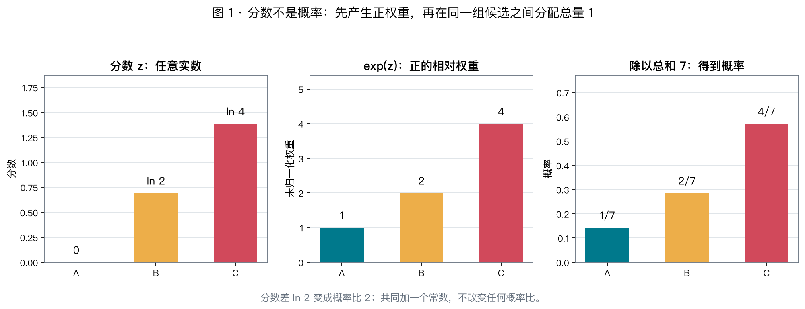
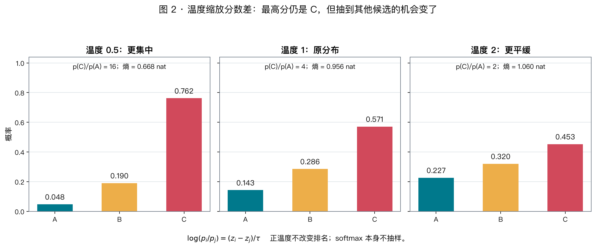
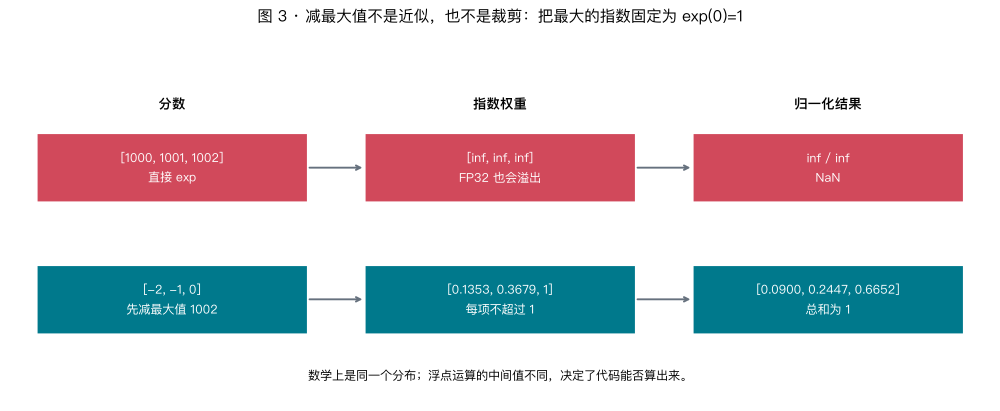
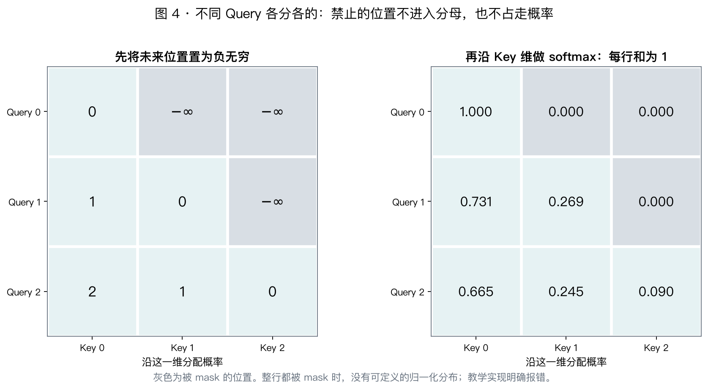

# X03 · Softmax 与概率：为什么取指数，为什么减最大值

> **今日目标**：从「怎样把任意分数变成一组概率」出发，推导 softmax，理解温度、数值稳定和 mask，并能解释它在注意力与输出词表中的不同角色。

阅读与推导 50 min · 手算 15 min · 可选演示 5–10 min · 思考 10 min

这一讲延续原理优先的节奏。实验只有几个 CPU 小张量，不跑 GPU 基准，不下载模型。前置只需 [X01 的点积](x01-vectors.md) 和 [X02 的矩阵形状](x02-matrices-shapes.md)；微积分推导放进可选折叠框。

---

## 1. 同一个分布，为什么有的写法会算成 NaN

先看三个将在本讲解释的现象：

```text
分数 [0, 1, 2] 与 [1000, 1001, 1002] 的 softmax 数学上完全一样，
但在 FP32 中直接计算第二组的 exp，会得到 [inf, inf, inf]。

调低温度会让分布更集中，但只要温度大于 0，最高分候选并不会换人。

softmax([-1000, 0]) 的第一项可能下溢为 0；
先取概率再取 log 得到 -inf，直接算 log-softmax 却能得到 -1000。
```

**数学公式等价，不代表浮点计算过程等价。** 这是 [Day 05 数值格式](../week01/day05-numeric-formats.md) 留给这一讲的问题。

---

## 2. 分数和概率是两种不同的东西

### 2.1 一行分数到底在表示什么

想象模型给三个下一 token 候选 A、B、C 打了分：

$$
z=[-1,0,1]
$$

这些数叫 **logits**，此时只是相对偏好分数：可以为负，可以大于 1，总和没有要求。分数可能来自一个线性层，也可能来自两个向量的点积。

如果要从三个互斥候选中选一个，就需要一个离散概率分布：

$$
p_i\ge0,\qquad \sum_{i=1}^{n}p_i=1
$$

这里 $n$ 是候选个数，$i$ 是候选编号。整行共用一份总量 1，而不是每个候选各有一份。

例如 $[0.2,0.3,0.5]$ 可以理解为：固定这组分数，反复独立采样，长期频率会趋近 20%、30%、50%。**一次抽样仍然只得到一个候选，不是输出半个 C。**

### 2.2 为什么不能直接除以总和

$$
p_i\overset{?}=\frac{z_i}{\sum_jz_j}
$$

上面的例子总和恰好为 0；即使分母不为 0，负分数也可能变成负概率。

先平方行不行？$[-3,1,2]$ 平方后成了 $[9,1,4]$，**原本最低分反而拿到最多权重**。

先减最小值、再除总和行不行？在不全相等时确实能造出分布，但最低分永远为 0，全相等时又需要特殊处理。这不是绝对不能用，而是在选择另一套性质。

我们希望有一种方法，至少做到：

1. 任意有限实数分数都能处理，输出为正且总和为 1。
2. 分数高的候选仍有更大的概率。
3. 给所有分数一起加同一个常数，不应改变相对偏好。
4. 分数的小变化通常带来概率的连续变化，便于训练。

**这些要求并不唯一决定 softmax。** 下面再加一个具体的建模选择，指数函数就会变得自然。

---

## 3. 为什么是 exp：把「分数差」变成「概率比」



### 3.1 先把总和问题放一边

先找一个严格为正、递增的函数 $f$，产生未归一化权重：

$$
w_i=f(z_i),\qquad p_i=\frac{w_i}{\sum_jw_j}
$$

分母负责让总和等于 1，而 $f$ 决定「相差几分，该有多大偏好差距」。

一种好解释的选择是：**分数增加一个固定量，权重就乘上一个固定倍数**，不依赖原来的起点。

例如多 $\ln2$ 分，权重翻倍；再多 $\ln2$ 分，再翻倍。这样的累加关系正好对应指数函数的乘法性质：

$$
e^{a+b}=e^ae^b
$$

因此选择 $f(z)=e^z$，得到：

$$
\boxed{\ p_i=\operatorname{softmax}(z)_i=\frac{e^{z_i}}{\sum_je^{z_j}}\ }
$$

这里 $e\approx2.71828$，$\ln$ 是以 $e$ 为底的对数；两者互相抵消，例如 $e^{\ln4}=4$。

### 3.2 最值得记住的不是分母，而是这个比值

两个候选的概率相除，分母直接消掉：

$$
\boxed{\ \frac{p_i}{p_j}=e^{z_i-z_j}\ },\qquad
\boxed{\ \ln\frac{p_i}{p_j}=z_i-z_j\ }
$$

所以 logits 可以理解为**相差多少对数概率**。例如：

| 分数差 $z_i-z_j$ | 概率比 $p_i/p_j$ |
|---|---:|
| $0$ | 1 |
| $\ln2\approx0.693$ | 2 |
| $\ln10\approx2.303$ | 10 |
| $-\ln2$ | 1/2 |

对图 1 取一个好手算的例子：

$$
z=[0,\ln2,\ln4]\quad\Rightarrow\quad e^z=[1,2,4]
$$
$$
p=\left[\frac17,\frac27,\frac47\right]
\approx[0.143,0.286,0.571]
$$

C 比 A 高 $\ln4$ 分，概率就是四倍。**不是说 C 的概率等于 $\ln4$，也不是说高四分就高四倍。**

反过来，任意所有项都为正的概率分布，都可以用 $z_i=\ln p_i$ 表示；因为 $\sum p_i=1$，再次 softmax 就会还原它。

### 3.3 为什么共同平移不改变结果

给每个分数都加 $c$：

$$
\frac{e^{z_i+c}}{\sum_je^{z_j+c}}
=\frac{e^ce^{z_i}}{e^c\sum_je^{z_j}}
=\frac{e^{z_i}}{\sum_je^{z_j}}
$$

**改变的是共同基准，不是候选之间的分数差。** 因此同一概率分布对应无穷多组 logits，它们可以相差一个整行共享的常数。

但乘一个常数不同：它会放大或缩小分数差，从而改变概率比。这正是下一节的温度。

### 3.4 为什么用 e，不用 2？为什么不用 sigmoid？

**用 $2^z$ 也可以**，因为 $2^z=e^{z\ln2}$，等价于先把分数乘 $\ln2$。任何底数大于 1 的指数，都可以吸收到一个尺度参数里。选 $e$ 让对数和导数表达最简洁，不是只有它能把数字变成概率。

对两个候选，softmax 还能化为 sigmoid：

$$
p_1=\frac{e^{z_1}}{e^{z_1}+e^{z_2}}
=\frac{1}{1+e^{-(z_1-z_2)}}=\operatorname{sigmoid}(z_1-z_2)
$$

区别在于使用方式：**softmax 为同一组互斥候选分配总量 1；分别做 sigmoid 常用于多个可同时成立的二元标签，其输出不要求总和为 1。** 后一种用法也不意味着现实中的标签一定独立。

还有 sparsemax、entmax 等替代方案，能够产生不同的稀疏分布。理解 softmax 的性质，比记住「只能用 exp」更重要。

---

## 4. 温度：不是给模型加随机噪声，而是缩放偏好差距



### 4.1 温度进入公式的地方

用 $\tau>0$ 表示温度：

$$
p_i(\tau)=\frac{e^{z_i/\tau}}{\sum_je^{z_j/\tau}},\qquad
\ln\frac{p_i(\tau)}{p_j(\tau)}=\frac{z_i-z_j}{\tau}
$$

**低温放大分数差，高温缩小分数差。** 对同一组 $[0,\ln2,\ln4]$：

| 温度 | 未归一化权重 | 概率 A / B / C | C 与 A 的概率比 |
|---|---|---|---:|
| $0.5$ | $[1,4,16]$ | $[0.0476,0.1905,0.7619]$ | 16 |
| $1$ | $[1,2,4]$ | $[0.1429,0.2857,0.5714]$ | 4 |
| $2$ | $[1,\sqrt2,2]$ | $[0.2265,0.3204,0.4531]$ | 2 |

最高分仍是 C。只要温度为正，数学上的排名不会变；变的是抽到其他候选的机会。

### 4.2 Softmax、argmax、采样不要混为一谈

| 操作 | 输入与输出 | 是否随机 |
|---|---|---|
| softmax | 分数向量 → 概率向量 | 否 |
| argmax | 分数或概率 → 最大项的下标 | 否，需有并列处理规则 |
| 按概率采样 | 概率向量 → 一个候选下标 | 是 |

如果最后始终用 argmax，那么改变正温度不会改变本轮选中的最高分候选（忽略有限精度与并列处理差异）。

API 中的 `temperature=0` 往往是选择贪心解码的**特殊约定**，不是把 0 代入上面的除法。教学实现明确拒绝非正温度。

固定有限个、有限分数的候选时：

$$
\tau\to\infty:\quad p_i\to1/n
$$

当 $\tau\to0^+$ 且最大值唯一，概率集中到最大项；如果有 $k$ 个并列最大项，极限在它们之间各分 $1/k$，不是公式自动选其中某一个。被 $-\infty$ mask 的候选不参与这些有效候选的分配。

### 4.3 用熵描述「集中」与「平缓」

定义：

$$
H(p)=-\sum_i p_i\ln p_i
$$

约定 $0\ln0=0$。使用自然对数时单位叫 nat；若换成以 2 为底的对数，单位是 bit。

可以把 $-\ln p_i$ 理解为某个结果发生时的「意外程度」，熵是对这种意外程度的平均。近乎必定发生的结果没什么意外，均匀分布则最不确定。

$$
0\le H(p)\le\ln n
$$

三个候选的上限为 $\ln3\approx1.099$。本例温度 $0.5/1/2$ 时，熵分别为 **0.668 / 0.956 / 1.060 nat**。

对固定有限 logits 和固定有效候选集合，升高温度使熵不减。但不能把它简单翻译成「答案更有创意」或「准确率更低」：内容质量还取决于模型、提示、候选集合和采样策略。

<details>
<summary>可选推导：softmax 也是「偏好高分，但不太早押死」的折中</summary>

如果寻找使下式最大的分布：

$$
\sum_i p_i z_i+\tau H(p),\qquad \sum_i p_i=1,\ p_i\ge0
$$

第一项奖励平均选中高分项，第二项奖励分散程度。温度决定第二项的权重。

用一个乘子 $\lambda$ 加入总和约束，对 $p_i$ 求导：

$$
z_i-\tau(\ln p_i+1)+\lambda=0
$$
$$
p_i=e^{z_i/\tau}\cdot e^{\lambda/\tau-1}
$$

后面一项对所有候选相同；利用总和为 1，就得到 softmax。有限分数、$\tau>0$ 下，熵的严格凹性给出唯一最优分布。

还不熟求导的话，可以跳过，X04 会补基础。今天只需记住：**指数归一化也可以从「期望分数 + 熵」这个明确目标推出来，而不只是一个凑巧好用的公式。**

</details>

### 4.4 概率很高，不等于事实一定正确

softmax 保证的是**合法分布**，不是预测校准。即使输入是随意编的分数，它仍会输出总和为 1 的概率。

模型给某个 token 0.99 的概率，不等于「这段回答有 99% 的事实正确率」。它通常是给定上下文下的下一 token 概率。

注意力里又不同：softmax 输出是一组用于混合 Value 的系数，不是直接在判断某句话的真假。两处都用同一个数学函数，但候选轴的语义不同。

---

## 5. 为什么减最大值：消掉共同基准，保护中间值



### 5.1 问题不是最终概率太大，而是中间的 exp 太大

FP16 能表示的最大有限值是 65504：

$$
\ln65504\approx11.09
$$

所以 $e^{12}\approx162755$ 已经超出 FP16 范围。FP32 的指数上溢边界约在输入 88.7 附近，输入 1000 更不用说。

明明最终概率都应在 $[0,1]$，中间却可能出现 `inf/inf`，输出 NaN。

### 5.2 用平移不变性重写，而不是硬裁剪

设 $m=\max_jz_j$：

$$
\boxed{\ p_i=\frac{e^{z_i-m}}{\sum_je^{z_j-m}}\ }
$$

由于所有 $z_i-m\le0$，所以每个指数不超过 1，至少有一项等于 $e^0=1$。对有限 logits，在精确算术中：

$$
1\le\sum_je^{z_j-m}\le n
$$

这同时避免了所有指数一起下溢成零。$[1000,1001,1002]$ 和 $[-1002,-1001,-1000]$ 都可以平移成 $[-2,-1,0]$。

**数学上是精确等价，不是近似，不是把极端值裁掉，也不是换了温度。** 选最大值而不是随便一个常数，是为了让最大的指数恰好为 1。

带温度时，可以写成：

$$
u_i=\frac{z_i-m}{\tau},\qquad p_i=\frac{e^{u_i}}{\sum_je^{u_j}}
$$

先减最大值再除温度，也能避免共同的大偏移在先除以很小温度时提前溢出。但它不是对任意极端 dtype 范围和任意接近零的温度都免疫，分数差、温度和中间表示仍需合理。

### 5.3 减最大值不是全部，还要考虑归约精度

如果有 70000 个相等分数，平移后每项指数都是 1。**单项没有上溢，但总和 70000 仍存不进 FP16。**

本讲实验中：

```text
70000 个 1 的求和，输出 FP16：inf
70000 个 1 的求和，输出 FP32：70000
```

因此教学实现将 FP16/BF16/FP32 输入统一升到 FP32 进行计算，FP64 输入保留 FP64；输出也保留对应工作精度，不再自动降回 FP16。

实际框架的内部累加 dtype 由后端实现决定，不能因为输入是 FP16 就认定所有中间步骤都用 FP16。需要显式 FP32 输出时，PyTorch 提供：

```python
probs = torch.softmax(logits, dim=-1, dtype=torch.float32)
```

若输入转换之前已经丢失信息，后面升精度也救不回来。比如 FP32 的 $[2048,2049]$ 转为 FP16 后，在本机示例中都变成 2048：

```text
原始分数的概率：     [0.2689, 0.7311]
先降为 FP16 再计算： [0.5000, 0.5000]
```

这再次接回 Day 05：**范围够不够，和精度够不够，是两个不同问题。**

### 5.4 尾部下溢不是一定消失了

即使减过最大值，$e^{-1000}$ 在 FP32 中仍然会变为 0。理想实数下，有限 logits 的 softmax 每项都严格大于 0；浮点输出则可能包含精确的 0。

很小的尾部项舍入为零，对某些加权和影响很小，但不能一概忽略：如果下一步需要它的对数，这个零就会变成 $-\infty$。第 7 节专门处理这个问题。

---

## 6. 接回 X02 的形状：到底对哪一维做 softmax



### 6.1 先问「谁和谁竞争这份总量 1」

Softmax 保持输入形状，不会把候选维消掉：

| 输入 | 归一化轴 | 含义 |
|---|---|---|
| logits $(B,V)$ | $V$ | 每个样本在词表候选之间分配概率 |
| logits $(B,T,V)$ | $V$ | 每个位置分别预测下一 token |
| attention scores $(B,h,T_q,T_k)$ | $T_k$ | 每个 Query 在可访问的 Key 位置之间分配权重 |

这里 $B$ 为 batch，$V$ 为词表大小，$h$ 为头数。不能机械背「最后一维永远是特征」：**在分数张量里，最后一维是参与竞争的候选，而不是原来的特征维 $d_h$。**

只要上述布局成立，就用 `dim=-1`。换了布局，也要重新检查轴。

以 $(B,T,V)$ 为例：

```text
logits                              (B, T, V)
amax(dim=-1, keepdim=True)           (B, T, 1)
logits - maximum                    (B, T, V)
exp                                 (B, T, V)
sum(dim=-1, keepdim=True)            (B, T, 1)
除以各自的总和                      (B, T, V)
```

`keepdim=True` 留下长度为 1 的候选维，使广播恰好对上。把整个张量求一个总和，会把不同样本、不同 Query 的分布错误地混在一起。

### 6.2 为什么 mask 要放在 softmax 前

因果注意力要求第 $i$ 个 Query 不能访问未来的 Key。将禁止位置的分数设为 $-\infty$，其指数就是 0，因此**不进入分母，也不占走概率**。

图 4 第一行只允许 Key 0，归一化结果必须为 $[1,0,0]$。

如果先对 $[0,1,2]$ 做 softmax，再把后两项直接清零，就得到 $[0.0900,0,0]$，行和不是 1。

理论上可以在清零后再次归一化，但若允许位置的概率在第一次 softmax 中已经下溢为零，事后重归一化也可能失败。**最直接的做法是先 mask，再算稳定 softmax。**

### 6.3 整行都被 mask，不是「答案全为零」那么简单

如果一行全为 $-\infty$，没有任何可选候选。指数全为 0，原公式是 $0/0$；减最大值则先遇到 $-\infty-(-\infty)$。

这不是一个有定义的概率分布。用一个很大的有限负数代替 mask 也不万能：整行都填相同有限负数时，softmax 反而给出均匀分布。

完整的 attention API 可以额外约定全 mask 行输出零等行为，但那是 API 的特殊语义，不是普通 softmax 公式自动得到的答案。**本讲教学实现选择报错**，要求调用方处理空候选行；也拒绝 NaN 和 $+\infty$ 输入。

---

## 7. 从概率到训练：为什么用 log-softmax，而不是 log(softmax)

### 7.1 正确类别拿到的概率，怎样变成损失

设正确类别编号为 $y$，最简单的单样本分类损失是：

$$
\mathcal L=-\ln p_y
$$

模型给正确类别的概率越小，损失越大：

| $p_y$ | $-\ln p_y$ |
|---|---:|
| 1 | 0 |
| 0.5 | 0.693 |
| 0.1 | 2.303 |
| 0.01 | 4.605 |

为什么是负对数？对训练样本，最大化正确类别概率的乘积，等价于最大化其对数之和，也就是最小化负对数之和。对自回归文本，整段概率本来就是逐 token 条件概率的乘积，取对数后同样变为求和。

若目标是一组概率 $q_i$，则变为交叉熵 $-\sum_iq_i\ln p_i$；one-hot 目标只有正确类别为 1，正好退化为 $-\ln p_y$。它和分布自身的熵 $-\sum_i p_i\ln p_i$ 不是同一件事。

### 7.2 中间概率可能表示不了，但它的对数表示得了

对 $z=[-1000,0]$，第一项概率极小，FP32 下通常下溢为 0：

$$
\ln(\operatorname{softmax}(z)_1)=\ln0=-\infty\quad\text{（先算概率的浮点结果）}
$$

但先化简公式：

$$
\ln p_i=z_i-\ln\sum_je^{z_j}
$$

再令 $u_i=(z_i-m)/\tau$，在平移后的空间计算：

$$
\boxed{\ \operatorname{logsoftmax}(z/\tau)_i=u_i-\ln\sum_je^{u_j}\ }
$$

本例返回约 $[-1000,0]$，正确类别若为第一项，损失就是约 1000，而不是 `inf`。

**不是把 0 神奇地恢复成了小概率，而是压根没把它作为概率物化出来。** 直接保留其对数，避免了那一步的信息损失。

这个技巧与 log-sum-exp 一脉相承。温度为 1 时：

$$
\operatorname{LSE}(z)=\ln\sum_je^{z_j}
=m+\ln\sum_je^{z_j-m}
$$

单独求 LSE 用右边的写法；求 log-softmax 时，直接用平移后的 $u$，还可以避免再用两个带很大共同偏移的数相减。

### 7.3 实际训练直接传 logits

对 logits 形状 $(B,V)$，PyTorch 的类别索引目标为 $(B,)$、dtype 为 `torch.long`：

```python
loss = torch.nn.functional.cross_entropy(logits, targets)
```

`cross_entropy` 接收未归一化的 logits，不需要先 softmax。对于类别索引目标，它在数学上相当于 log-softmax 后取负对数似然损失。

若语言模型 logits 是 $(B,T,V)$，先把前两维摊成样本维：

```python
loss = torch.nn.functional.cross_entropy(
    logits.reshape(-1, logits.shape[-1]),
    targets.reshape(-1),
)
```

这里假设 `targets` 已与“预测下一个 token”的位置对齐；padding 是否忽略还需按任务指定 `ignore_index`。不能把 $(B,T,V)$ 原样传入后，指望这个损失 API 自动把最后一维认成类别维。

<details>
<summary>通往 X04：softmax 接上交叉熵后，梯度是什么样</summary>

对 $p=\operatorname{softmax}(z/\tau)$、正确类别 $y$，单样本、无类别加权、无 label smoothing 的损失 $\mathcal L=-\ln p_y$ 满足：

$$
\frac{\partial\mathcal L}{\partial z_i}
=\frac{p_i-\mathbf1[i=y]}{\tau}
$$

其中 $\mathbf1[i=y]$ 在正确类别处为 1，其他地方为 0。

例如 $\tau=1$、$p=[1/7,2/7,4/7]$，正确类别为 A，梯度是 $[-6/7,2/7,4/7]$。沿梯度的反方向调整，会提高 A 的分数、压低另两项的分数。

因此「softmax 很集中」不等于「交叉熵对 logits 的梯度一定都很小」：**如果模型非常自信但选错了，正确类别对应的梯度仍可接近 -1**（$\tau=1$）。具体怎么从导数走到更新，X04 再推。

</details>

---

## 8. 接回硬件：一个没有大权重矩阵的操作，为什么仍值得优化

### 8.1 存的是 FP16，不代表每一步都应算 FP16

这讲与 Day 05 的三个连接是：

| 风险 | 例子 | 对策 |
|---|---|---|
| 指数上溢 | FP16 中 $e^{12}$ 超范围 | 减最大值 |
| 归约范围或精度不足 | 70000 个 1 的 FP16 输出为 inf | 使用合适的工作与输出精度 |
| 尾部概率下溢后再取 log | $\ln0=-\infty$ | 直接 log-softmax / 交叉熵 |

减最大值、提高工作精度、重写计算表达式，解决的是不同环节的问题，不能互相替代。

### 8.2 Softmax 不只是逐元素 exp，还有跨一行的归约

每一行至少在数学上涉及：最大值、指数、总和、归一化。最大值和总和都需要汇集这一行多个元素的信息，这叫 **reduction（归约）**。

如果逐个调用 `max → subtract → exp → sum → divide`，可能产生多次 kernel 启动、中间张量和显存往返。一个合适的融合 kernel 可以复用寄存器或共享内存中的数据，减少这些开销。

因此它接回 [Day 04 的存储层次](../week01/day04-memory-hierarchy.md) 和 [Day 06 的软件栈](../week01/day06-software-stack.md)，而不只是“指数函数贵”。具体瓶颈可能是启动、带宽、归约或特殊函数吞吐，取决于形状和实现；不能一律当成某一种受限。

### 8.3 为什么这会通向 FlashAttention

注意力分数形状为 $(B,h,T_q,T_k)$，完整 prefill 常有 $T_q=T_k=T$。仅这一张分数张量就有 $BhT^2$ 个元素。

例如 $B=1,h=32,T=4096$，若以 FP16 物化一张完整分数表：

$$
1\times32\times4096^2\times2\ \text{Byte}=1\ \text{GiB}
$$

这还没加其他激活。即使有因果 mask，普通稠密分配也可能仍占满方阵空间。

所以 FlashAttention 不只是“把 exp 写快一些”，更重要的是**分块计算，不把整张分数与概率矩阵写到显存里**。

一个初步线索：一段分数可以用最大值 $m$ 和移位指数和 $s=\sum e^{z_i-m}$ 描述归一化状态。两段的状态可以合并：

$$
m=\max(m_A,m_B),\qquad
s=e^{m_A-m}s_A+e^{m_B-m}s_B
$$

两个缩放因子都是把各自旧基准换成共同新基准，仍然是同一个求和。若要同时得到注意力输出，还要相应维护 Value 的加权和；**单有 $m,s$ 并不能恢复所有逐项概率**。

今天理解“分块也能更新同一个分母”即可。Online Softmax 的完整递推与 IO 分析留给主线 Day 25/29。

### 8.4 接上 X01 留下的 $\sqrt d$

X01 讨论高维点积的尺度。在注意力里，如果 Query/Key 各分量近似独立、零均值且单位方差，原始点积的标准差约随 $\sqrt{d_h}$ 增长。

softmax 对**分数差**敏感。头越宽，原始点积的典型尺度越大，未经控制就更容易得到过于尖锐的分布。

$$
\operatorname{softmax}\left(\frac{QK^\top}{\sqrt{d_h}}\right)
$$

除以 $\sqrt{d_h}$ 在数学形式上就像给原始点积设置一个随维度变化的温度，抵消这部分尺度增长。实际训练并不严格满足这些统计假设，但它解释了这个因子的来源。

它与**输出采样温度**不是同一个控制旋钮：前者用在模型内部的注意力匹配，后者用在词表 logits 上。X06 会把前者从 Q/K/V 的完整过程里再推一遍。

---

## 9. 手算练习

### Q1 · 平移和缩放，哪个保持分布

对 $z=[0,\ln2,\ln4]$，分别求 $\operatorname{softmax}(z)$、$\operatorname{softmax}(z+100)$、$\operatorname{softmax}(2z)$。若只取 argmax，三种结果有什么区别？

<details>
<summary>答案：共同平移消掉，缩放改变概率比</summary>

$$
\operatorname{softmax}(z)=[1,2,4]/7
$$

共同加 100 时，每个指数都乘 $e^{100}$，分子分母消掉，数学结果完全相同；实际计算应使用减最大值写法，避免上溢。

$$
\operatorname{softmax}(2z)=[1,4,16]/21
$$

第三种等于温度 $0.5$，分布更集中。三种情况最高分都是 C，argmax 不变。

</details>

### Q2 · 没有合法候选时，不要伪造答案

一行 logits 为 $[0,\ln2,\ln4]$，只允许 A、B。正确分布是多少？若先 softmax 再把 C 置零，会得到什么？若 A、B、C 都被禁止呢？

<details>
<summary>答案：分母也必须排除 C</summary>

正确分数为 $[0,\ln2,-\infty]$，指数为 $[1,2,0]$：

$$
p=[1/3,2/3,0]
$$

先 softmax 再直接清零会得到 $[1/7,2/7,0]$，行和只有 $3/7$。

在这组小数值中再除以 $3/7$ 可以恢复正确分布，但并不是最稳健的通用路径。整行禁止时没有可归一化的有效分布，教学代码报错，不能把均匀分布或全零解释为普通 softmax 的数学结果。

</details>

### Q3 · 概率下溢，损失也必须变成无穷吗

logits 为 $[-1000,0]$，正确类别是第一项。先求 softmax 再取负对数会怎样？用稳定 log-softmax 呢？当 $\tau=1$ 时，对两项 logits 的交叉熵梯度约为多少？

<details>
<summary>答案：绕过表示不了的中间概率</summary>

直接物化概率时，FP32 的第一项可能变成 0，损失 $-\ln0=+\infty$。

改为稳定形式：

$$
\mathcal L=1000+\ln(1+e^{-1000})\approx1000
$$

浮点中返回有限的 1000。依据第 7 节的预告公式，梯度约为 $[-1,1]$：模型非常自信但预测错了，并不是没有纠正信号。

</details>

### Q4 · Softmax 之后该怎样与 Value 相乘

注意力分数形状为 $(2,4,3,5)$，Value 形状为 $(2,4,5,8)$。softmax 沿哪一维？归约保留维度后的最大值是什么形状？最终加权和是什么形状？

<details>
<summary>答案：每个 Query 在 5 个 Key 之间分配权重</summary>

归一化轴是最后一维，即 5 个 Key。最大值和指数总和都为 $(2,4,3,1)$。

softmax 输出仍为 $(2,4,3,5)$，乘 Value：

$$
(2,4,3,5)@(2,4,5,8)\to(2,4,3,8)
$$

Key 维 5 被矩阵乘汇总掉，每个 Query 得到 8 维输出。如果对 Query 维 3 归一化，形状仍可能完全相同，但每行不再是“这个 Query 应如何分配关注”的分布。

</details>

---

## 10. 可选动手：一个文件，三组短演示

[x03_softmax.py](../../labs/extra/x03_softmax.py) 提供 `stable_softmax` 与 `stable_log_softmax`，以及：

```bash
uv run python labs/extra/x03_softmax.py
uv run python labs/extra/x03_softmax.py --exp A
uv run python labs/extra/x03_softmax.py --exp B
uv run python labs/extra/x03_softmax.py --exp C
uv run python labs/extra/x03_softmax.py --check
```

| 演示 | 只需要观察什么 |
|---|---|
| A · 温度 | 温度 0.5/1/2 时，C/A 的概率比分别为 16/4/2；共同加 1000 后概率仅有舍入误差 |
| B · 数值 | 直接指数的上溢/下溢、log-softmax 的有限损失、FP16 归约和输入舍入 |
| C · 形状与 mask | 正确 mask 后每行和为 1；先归一化再清零不满足它；全 mask 行明确报错 |

对**非空、有限分数、正且有限的温度**，最核心的代码只有：

```python
def softmax_rows(logits, temperature=1.0):
    work = logits if logits.dtype == torch.float64 else logits.float()
    maximum = work.amax(dim=-1, keepdim=True)
    shifted = (work - maximum) / temperature
    weights = shifted.exp()
    return weights / weights.sum(dim=-1, keepdim=True)
```

完整脚本额外做了 dtype、空输入、温度、NaN/$+\infty$、全 mask 行检查，并允许部分位置使用 $-\infty$ mask。`--check` 对照 PyTorch 的 softmax、log-softmax、交叉熵与 autograd，覆盖一维/二维/三维输入和四种 dtype。

这份代码是**数值正确性教学实现，不是高性能 GPU kernel**；输入检查本身若用在 GPU 热路径还可能触发同步。实际模型优先用框架的原生或融合算子，不要因为教学代码易懂就直接替换生产实现。

时间少可以只做 Q1、Q2，再运行 B；没有必须填写的性能跑分表。

---

## 11. 思考题

**T1 · 加入第四个候选会发生什么？**

固定 A、B、C 的 logits，加入一个新候选 D。A 与 B 的绝对概率会怎样变化？$p_A/p_B$ 会变吗？如果新候选是旧候选的近似重复，这种“竞争总量 1”的机制可能带来什么问题？

**T2 · 每块各做一个 softmax，为什么不能直接拼起来？**

把一行分成两块，每块分别归一化后，拼起来的总和是多少？要得到整行正确分布，为什么需要知道两块的相对尺度，而不能只保留各块自己的概率？

**T3 · 开放：概率最高的答案一定可信吗？**

一个模型对错误候选给出 0.99 的概率。提高输出温度会让它“知道自己错了”吗？怎样区分改变分布的尖锐程度、改变候选排名、改进模型知识和校准预测概率？

---

## 12. 一图总结

```text
一组互相竞争的候选分数 z
       |
       +-- 确定候选轴：不同样本 / Query 分开归一化
       +-- 应用 mask：禁止位置不参与分母
       +-- 检查每行至少有一个有效候选
       |
       v
u = (z - 行最大值) / 正温度
       |
       +-- 概率：exp(u) / sum(exp(u))
       |       +-- Attention：作为 Value 的混合系数
       |       +-- 词表输出：交给 argmax 或采样策略
       |
       +-- 对数概率：u - log(sum(exp(u)))
               +-- 训练：正确类别的负对数概率
```

**今日一句话**：

> Softmax 把分数差变成概率比；温度调整差距，减最大值保护中间值，候选轴决定谁和谁竞争。公式给的是分布，不是采样结果，更不是事实可信度的保证。

---

## 13. 延伸阅读

| 材料 | 今天建议看什么 |
|---|---|
| [PyTorch softmax 文档](https://docs.pytorch.org/docs/2.13/generated/torch.nn.functional.softmax.html) | `dim` 决定归一化轴，`dtype` 在计算前转换输入 |
| [PyTorch log-softmax 文档](https://docs.pytorch.org/docs/2.13/generated/torch.nn.functional.log_softmax.html) | 为什么不直接分开做 log 和 softmax |
| [PyTorch CrossEntropyLoss 文档](https://docs.pytorch.org/docs/2.13/generated/torch.nn.CrossEntropyLoss.html) | 输入是 logits；类别轴和 target 形状约定 |
| [Accurately Computing the Log-Sum-Exp and Softmax Functions](https://arxiv.org/abs/1909.03469) | 数值分析视角：平移公式、舍入误差与低精度 |
| [Online Normalizer Calculation for Softmax](https://arxiv.org/abs/1805.02867) | 分块更新归一化状态，后续主线的铺垫 |

文档链接固定到与本地验证相同的 PyTorch 2.13 系列，避免随 `stable` 跳转混入其他版本的接口约定。

## 今日检查清单

- [ ] 能区分 logits、概率、argmax 与采样
- [ ] 能从概率比解释为什么用 exp，并知道它不是唯一选择
- [ ] 能证明共同加常数不改变分布，而缩放会改变分布
- [ ] 能用温度解释概率比的变化，知道正温度不改变排名
- [ ] 能解释减最大值为何避免指数上溢，以及为什么还需要合适的归约精度
- [ ] 能确定候选轴，解释 `keepdim=True`，并处理 mask / 全 mask 行
- [ ] 知道交叉熵接收 logits，不先物化可能下溢的概率再取 log
- [ ] 能把 softmax 的归约与中间张量接回数值格式、存储层次和融合
- [ ] 完成至少两道手算，将疑问记入 [x03-notes.md](x03-notes.md)

**下一讲 X04：梯度与反向传播。** 今天已经能得到一个衡量“模型猜得多差”的标量损失；下一步是把这个标量沿着计算图传回每一张权重矩阵，解释模型到底如何学会调整自己的分数。