# Day 01 · AI Infra 全景图 & 一个 Token 的一生

> **今日目标**：建立整门课的坐标系 —— 搞清楚"从一个 HTTP 请求到吐出一个汉字"中间隔了多少层，
> 以及为什么**几乎所有 AI Infra 的优化，本质上都在对付同一个敌人**。

⏱ 阅读 55 min · 动手 30 min · 思考 15 min
（§3 是给不熟悉 Transformer 内部结构的人补的地基，熟的话省 15 min）

---

## 1. 先看一个反常识的数字

Apple M4 的 GPU 峰值算力约 **4.3 TFLOPS**（每秒 4.3 万亿次浮点运算）。
用它跑一个 7B 模型（INT4 量化），实测速度大约 **25 token/s**。

我们来算一下这台机器"真正在算"的比例：

$$
\text{每个 token 需要的运算} = 2 \times 7\times10^9 = 1.4 \times 10^{10}\ \text{FLOPs}
$$

（为什么是 $2P$？每个参数参与一次乘法 + 一次加法，Day 08 会严格推导。）

$$
\text{实际算力利用} = \frac{1.4\times10^{10} \times 25}{4.3\times10^{12}} = \frac{3.5\times10^{11}}{4.3\times10^{12}} \approx \mathbf{8.1\%}
$$

**GPU 有 92% 的时间在发呆。**

这不是驱动没装好，也不是代码写得烂。这是一个**物理必然**。
理解它为什么必然，以及有哪几条路可以绕过去 —— 这就是 AI Infra 的全部。

---

## 2. AI Infra 全景：一共有几层？

先给整门课一张地图。往后 83 天，每一天你都能在这张图上找到自己的位置。

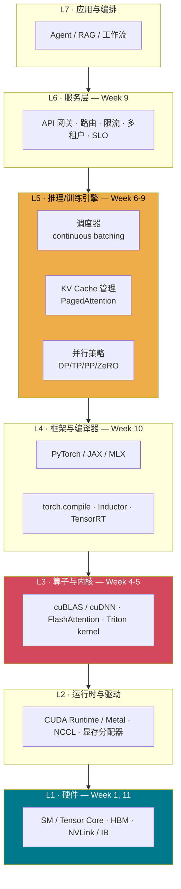

> **重要提醒**：很多人学 AI Infra 从 L5/L6 开始（学 vLLM 怎么用、K8s 怎么配），
> 结果是"知其然不知其所以然"，遇到性能问题只会试参数。
> 这门课从 **L1 往上打**，因为 L1 的物理约束决定了 L5 的所有设计。

---

## 3. 打地基：Prefill 与 Decode 到底是什么

> 后面所有内容都建立在这两个词上。这一节从"一个 token 在模型里长什么样"开始讲，
> **已经很熟的可以直接跳到 §4**。

### 3.1 一个 token = 一行数字

模型不认识汉字，只认识数字。

```
"今"  →  查 embedding 表  →  [0.2, -1.1, 0.5, 0.3, ...]   ← 4096 个数
```

**一个 token = 一行 4096 个数**。那 4 个 token 就是 4 行，摞成一个表格（矩阵）：

```
        列0    列1    列2    列3   ... (共 4096 列)
今  →   0.2   -1.1    0.5    0.3  ...
天  →   0.9    0.1   -0.4    1.2  ...
天  →   0.9    0.1   -0.4    1.2  ...
气  →  -0.3    0.7    0.8   -0.5  ...
```

这就是后面会反复出现的 $X_{(4,\,4096)}$ ——
**4 = 有几个 token，4096 = 每个 token 用几个数表示**。仅此而已。

### 3.2 模型在干的事：表格 × 权重

模型每一层的核心动作就是一次矩阵乘法：

$$
\text{输入表格} \times \text{权重矩阵} = \text{输出表格}
$$

**权重 $W$ 是训练好的、固定不动的东西**（那 70 亿个参数、3.5 GB），不随输入变化。

关键就在这里：

| 你喂进去几行 | 运算 | $W$ 要从显存读几遍 |
|---|---|---|
| 2000 行（prefill） | $X_{(2000,4096)} \times W_{(4096,4096)}$ | **1 遍（3.5 GB）** |
| 1 行（decode） | $X_{(1,4096)} \times W_{(4096,4096)}$ | **1 遍（3.5 GB）** |

**喂 2000 行和喂 1 行，$W$ 都得完整读一遍 3.5 GB。**
区别只在于：这趟搬运服务了 2000 个 token，还是只服务了 1 个。

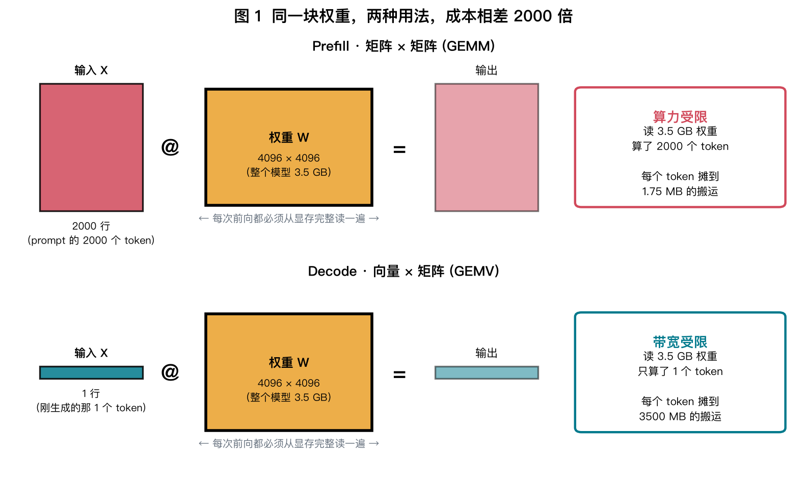

> **如果上面还是抽象，换个说法**：
> 把 $W$ 想成一本 **3.5 GB 的超厚字典**，锁在楼下仓库。你桌子（GPU 片上缓存）小得可怜放不下，
> **每次用都得跑下楼搬一趟**。
> - **Prefill**：搬一趟，一口气查 2000 个词 → 每词摊 1.75 MB 的跑腿成本
> - **Decode**：搬一趟，只查 1 个词，放回去；下个词再搬一趟 → 每词摊 3500 MB
>
> **跑腿的路程一模一样，干的活差 2000 倍。**
> 这也顺带解释了为什么"把 32 个用户批在一起"是白赚的 —— 字典反正都搬上来了，多查几个不要钱。

### 3.3 插一句：$W$ 的形状为什么是 (4096, 4096)？

矩阵乘法的规则是 $(m,k) \times (k,n) = (m,n)$，所以：

$$
\boxed{\ W\ \text{的行数} = \text{输入几维}, \qquad W\ \text{的列数} = \text{输出几维}\ }
$$

用一个 3 维 → 2 维的小例子看清楚，$W[i][j]$ 的含义是"输入第 $i$ 维对输出第 $j$ 维的贡献强度"：

|  | →y0 | →y1 |
|---|---|---|
| **x0→** | W[0][0] | W[0][1] |
| **x1→** | W[1][0] | W[1][1] |
| **x2→** | W[2][0] | W[2][1] |

数一下要几个权重：$3 \times 2 = 6$ → 所以 $W$ 是 **3 行 2 列**。

**那为什么 Llama 的输出维度也是 4096？因为残差连接逼的**：

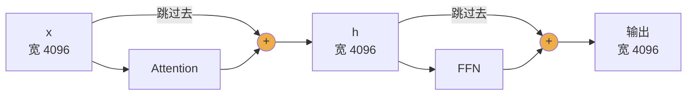

那两个 `+` 要求：Attention 的输出必须能**加回**原来的 `x`，所以形状必须一模一样。
于是这条"主干"（residual stream）的宽度从第 1 层到第 32 层**锁死在 4096**，这个数就叫 `d_model`。

**但不是所有 $W$ 都是方阵。** 真实的 Llama-2-7B 每层有 **7 个**不同的 $W$：

| 权重 | 形状（输入→输出） | 方阵？ | 参数量 |
|---|---|---|---|
| `q_proj` `k_proj` `v_proj` `o_proj` | 4096 → 4096 | 是 | 4 × 16.8 M |
| `gate_proj` `up_proj` | 4096 → **11008** | 否，**胖出去** | 2 × 45.1 M |
| `down_proj` | **11008** → 4096 | 否，**收回来** | 45.1 M |

```
4096 ──gate/up──▶ 11008 ──down──▶ 4096
      胖出去做非线性变换       收回来接主干
```

验算（`d=4096, L=32, d_ffn=11008, vocab=32000`）：

```
attn / layer     67,108,864   (33.2%)
ffn  / layer    135,266,304   (66.8%)   ← FFN 占了 2/3，Day 13 细讲
per layer       202,375,168
× 32 层       6,476,005,376
embed + head    262,144,000
TOTAL         6,738,149,376  = 6.74 B   ← "7B" 的来历
```

所以图 1 里那"一个 3.5 GB 的 $W$"是**教学简化**，实际是 $32 \times 7 = 224$ 个矩阵串起来。
但**结论完全不变**：这 224 个矩阵，不管你喂 1 个还是 2000 个 token，每一个都得完整读一遍。

> ⚠️ **必踩的坑**：PyTorch 的 `nn.Linear` **存权重时是反着存的** ——
> 存成 `(输出维度, 输入维度)`，计算时用 `x @ W.T`。
> ```python
> nn.Linear(4096, 11008).weight.shape   # torch.Size([11008, 4096])  ← 反的！
> ```
> Day 10 手写 GPT 时，这是第一个会让你崩溃的地方。

### 3.4 为什么 prompt 能一次全塞进去

自回归模型的规矩是：**第 $i$ 个 token 只能看它前面的**，不能偷看未来。
听起来必须一个一个来 —— 但注意，**prompt 的 4 个字你早就知道了**，不用等谁生成。

所以只要用一个**因果掩码**把未来挡住，并行算 4 行的结果，和老实串行算 4 次，**完全一样**：

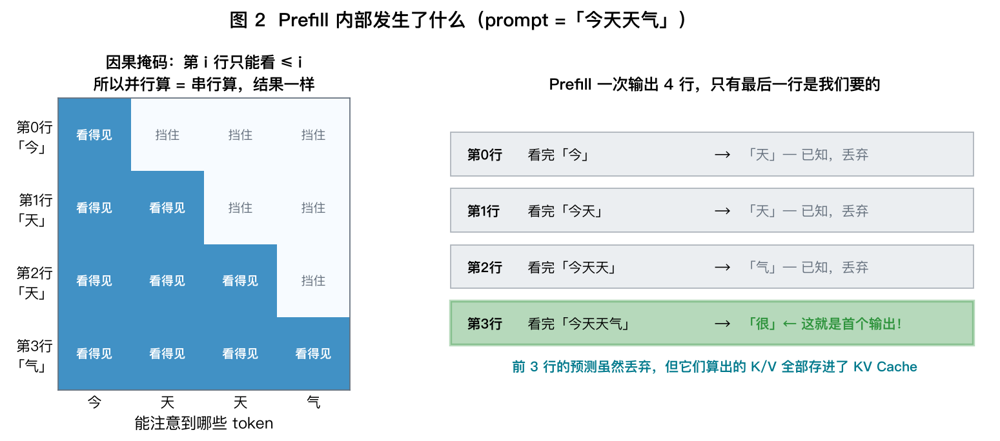

输入 4 行，输出也是 4 行，每行的含义是"看完前面这些字之后，下一个字是什么"：

| 输出 | 在预测什么 | 有用吗 |
|---|---|---|
| 第 0 行 | 看完「今」猜下一个 | 已知是「天」→ 丢弃 |
| 第 1 行 | 看完「今天」猜下一个 | 已知是「天」→ 丢弃 |
| 第 2 行 | 看完「今天天」猜下一个 | 已知是「气」→ 丢弃 |
| **第 3 行** | 看完「今天天气」猜下一个 | **不知道！这就是首个输出 →「很」** |

**前 3 行白算了吗？没有。** 它们算出的 K/V 全部存进了 **KV Cache**。
接下来生成「好」时要回头看「今天天气很」这 5 个字，前 4 个的 K/V 直接从 cache 取，不用重算。

> **这就是 prefill 这个名字的来历**：它的产出不只是第一个 token，
> 更是把整个 prompt 的 KV Cache「**预先填满**」。

### 3.5 那 decode 为什么不能也这样干

```
prefill  :  [今 天 天 气]   → 4 行一起算 → 出「很」
decode 1 :  [很]           → 1 行       → 出「好」
decode 2 :  [好]           → 1 行       → 出「。」
```

想批量算？**做不到** ——「好」这个字在「很」生成出来之前根本不存在，没法提前塞进表格。
这个串行性是自回归的**本质**，绕不过去。

于是后面所有优化都在想歪招绕开它：

| 歪招 | 思路 | 学在 |
|---|---|---|
| **Continuous Batching** | 一个用户凑不够行数，就把 32 个用户的当前 token 摞成 32 行 | Day 51 |
| **投机解码** | 用小模型先"猜"出后面 5 个字，一起塞进去验证 | Day 55 |
| **量化** | 字典本身做薄，每趟少搬点 | Week 5 |

### 3.6 一句话记住

> **Prefill** = prompt 已知 → 能摞成大表格一次算完 → 权重搬运被摊薄 → **GPU 忙着算**
> **Decode** = 下一个字未知 → 只能一行一行挤 → 权重搬运摊不薄 → **GPU 忙着等**

---

## 4. 一个 Token 的一生

现在跟着一个真实请求走一遍。场景：

> 用户发送 2000 token 的 prompt，模型（Llama-2-7B，INT4）生成 500 token 回复。
> 硬件：RTX 4050 Laptop（6 GB 显存，192 GB/s 带宽）。

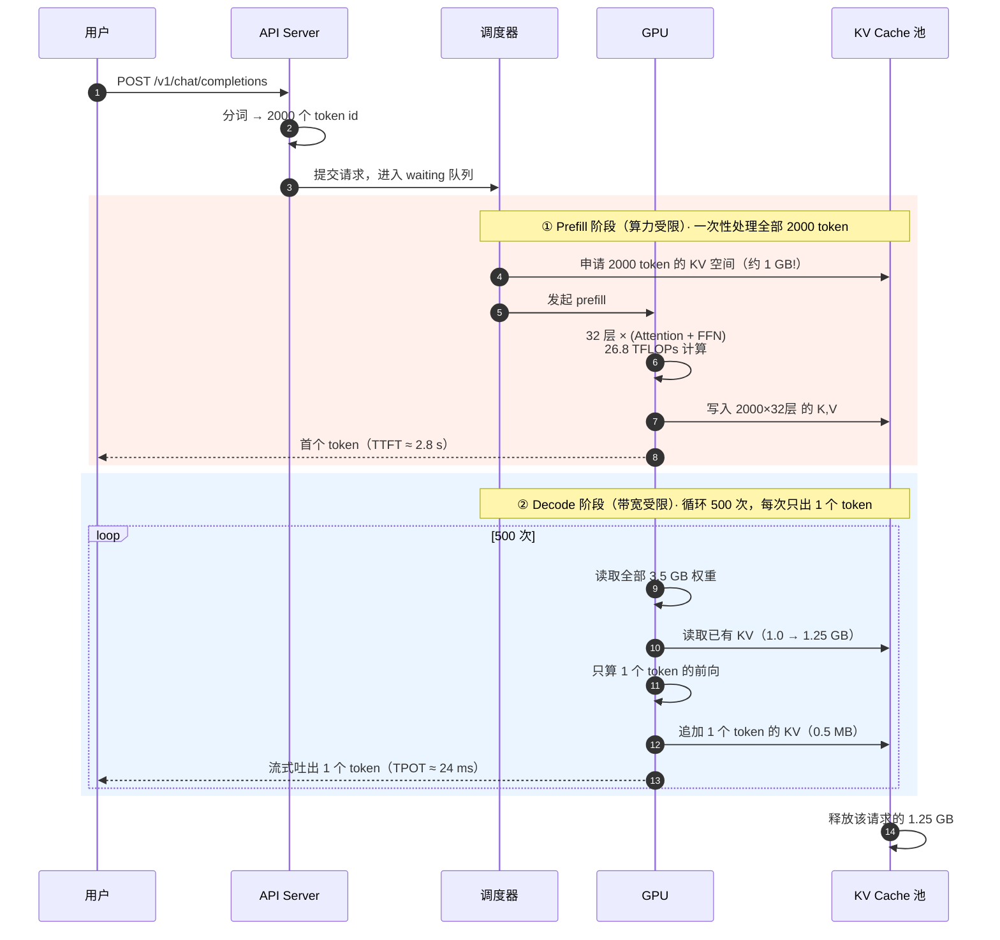

### 4.1 把这两个阶段的账算清楚

| | **Prefill** | **Decode**（单步） |
|---|---|---|
| 一次处理 token 数 | 2000 | **1** |
| 计算量 | $2 \times 6.7\text{B} \times 2000 = 26.8$ TFLOPs | $2 \times 6.7\text{B} \times 1 = 13.4$ GFLOPs |
| 必须读的权重 | 3.5 GB（**读 1 次，用 2000 遍**） | 3.5 GB（**读 1 次，用 1 遍**） |
| 算术强度 | ≈ 2000 FLOP/Byte | ≈ **1** FLOP/Byte |
| 瓶颈 | **算力**（GPU 忙） | **带宽**（GPU 等） |
| 耗时估算 | $26.8 / 9.6 \approx 2.8$ s | $\frac{3.5 + 1.1}{192} \approx 24$ ms |
| 优化方向 | 提高 MFU、chunked prefill | 量化、批处理、投机解码 |

> **这张表是整门课最重要的一张表。** 后面 80 天，你会不断回来看它。

**同一个模型、同一块卡，两个阶段的性能特征完全相反。**
这个割裂，直接催生了：连续批处理、chunked prefill、PD 分离、投机解码……
几乎所有现代推理引擎的核心设计。

---

## 5. 三堵墙：一切性能问题的归宿

任何一个算子在 GPU 上跑，只可能撞三堵墙之一：

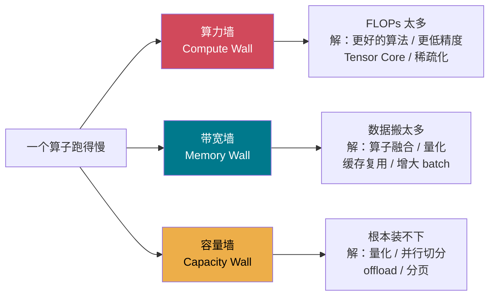

而**大模型推理 99% 的时间撞的是第二堵墙**。为什么？看这张图：

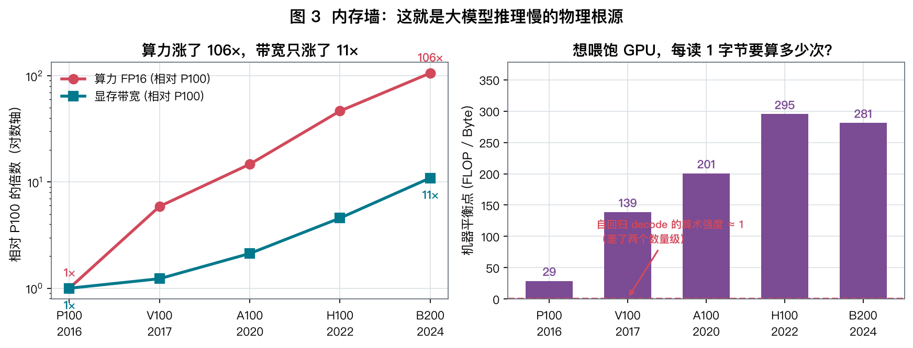

**左图**：从 P100 到 B200 的 8 年间，算力涨了 **106 倍**，显存带宽只涨了 **11 倍**。
**右图**：这个剪刀差意味着，想喂饱一块 H100，你每从显存读 1 个字节，就得做 **295 次运算**。

而自回归解码时，每读一个权重字节只做 **1 次** 运算（batch=1，FP16）。

$$
\frac{295}{1} \approx 300\ \text{倍的差距}
$$

**GPU 的算力有 99.7% 用不上。** 这就是开头那个 8% 的来源（M4 的平衡点低一些，所以数字好看点）。

---

## 6. 核心概念：算术强度（Arithmetic Intensity）

这是 AI Infra 最重要的一个量，请务必内化：

$$
\boxed{\ \text{AI} = \frac{\text{这个算子需要的浮点运算次数}}{\text{这个算子必须搬运的字节数}}\ \left[\frac{\text{FLOP}}{\text{Byte}}\right]}
$$

每台机器有一个**平衡点（ridge point）**：

$$
\text{Ridge} = \frac{\text{峰值算力 (FLOP/s)}}{\text{峰值带宽 (Byte/s)}}
$$

| 机器 | 峰值算力 (FP16) | 峰值带宽 | 平衡点 |
|---|---|---|---|
| Apple M4 (10-core GPU) | 4.3 TFLOPS | 120 GB/s | **36** |
| RTX 4050 Laptop | ~24 TFLOPS | 192 GB/s | **125** |
| A100 80GB | 312 TFLOPS | 2039 GB/s | **153** |
| H100 SXM | 989 TFLOPS | 3350 GB/s | **295** |

**判据极其简单**：

- $\text{AI} < \text{Ridge}$ → **带宽受限**，加算力没用，要减少数据搬运
- $\text{AI} > \text{Ridge}$ → **算力受限**，减少搬运没用，要提高计算效率

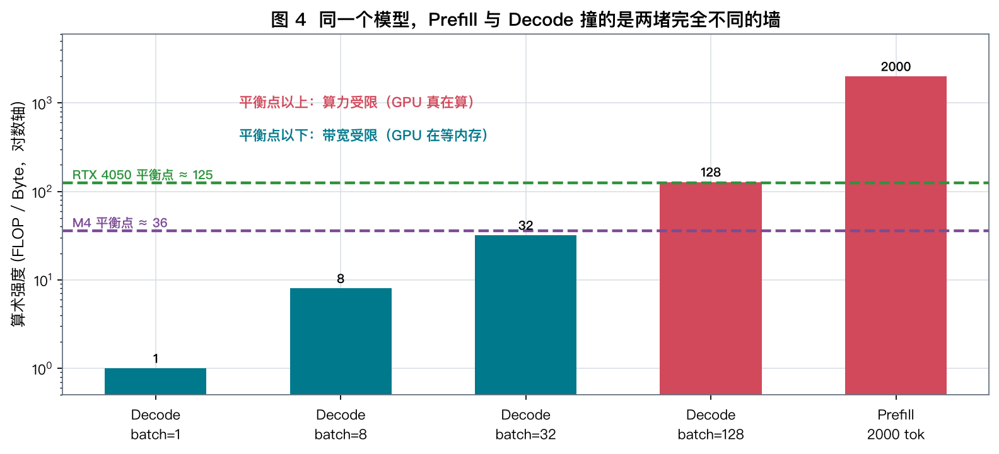

**读懂这张图，你就理解了连续批处理**：
decode 的算术强度约等于 batch size。要让 RTX 4050 的 GPU 真正忙起来，
你需要把 **128 个请求批在一起**。这就是 vLLM 存在的全部理由。

---

## 7. 你的两台机器能干什么

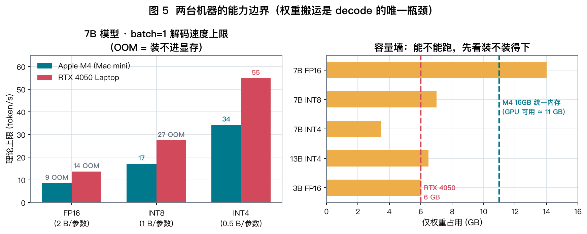

**左图**是一条铁律：

$$
\boxed{\ \text{decode 速度上限} = \frac{\text{显存带宽}}{\text{权重总字节数}}\ \text{(token/s)}}
$$

生成 1 个 token，模型的**每一个权重都必须从显存里读出来一次**。
这是信息论层面的下界，无法绕过。想变快只有三条路：

| 路径 | 做法 | 收益 | 学在哪 |
|---|---|---|---|
| ① 减少字节 | 量化 FP16→INT4 | 4× | Week 5 |
| ② 摊薄成本 | 增大 batch | ~batch 倍（有上限） | Week 8 |
| ③ 一次多出几个 | 投机解码 | 2~3× | Day 55 |

**右图**是容量墙。注意一个有趣的事实：

- **RTX 4050**：带宽更高（192 vs 120），但只有 6 GB → 7B INT8 都装不下
- **M4 Mac mini**：带宽较低，但 16 GB 统一内存（GPU 可用 ~11 GB）→ 能跑 7B INT8

> 这正是 Apple Silicon 统一内存架构（UMA）的独特之处：**没有 PCIe，CPU/GPU 共享同一块物理内存，
> 零拷贝**。代价是带宽比独显低。Day 69 会深入。

---

## 8. 手算练习（10 分钟，请拿纸笔）

用 Llama-2-7B 的真实配置：

```
n_layers = 32,  d_model = 4096,  n_heads = 32,  head_dim = 128
d_ffn    = 11008,  vocab = 32000
```

**Q1**. 每个 token 的 KV Cache 占多少字节（FP16）？

<details>
<summary>点开答案</summary>

$$
2\ (\text{K 和 V}) \times 32\ (\text{层}) \times 4096\ (\text{每层 KV 维度}) \times 2\ \text{Byte} = 524288\ \text{B} = \mathbf{512\ KB / token}
$$

**记住这个数**：Llama-2-7B 每个 token 半兆。2000 token 的上下文就是 **1 GB**。
</details>

**Q2**. RTX 4050 只有 6 GB。装完 3.5 GB 的 INT4 权重后，最多能存多少 token 的 KV Cache？
（假设 CUDA 上下文 + 激活占 0.8 GB）

<details>
<summary>点开答案</summary>

$$
\frac{6 - 3.5 - 0.8}{0.5\ \text{MB}} = \frac{1.7 \times 1024\ \text{MB}}{0.5\ \text{MB}} \approx \mathbf{3480\ \text{token}}
$$

也就是说：**这块卡最多同时服务 1 个 3.4K 上下文的请求，或者 3 个 1K 上下文的请求。**
KV Cache 而非权重，才是并发数的真正瓶颈 —— 这是 Week 3 和 Week 8 的核心矛盾。
</details>

**Q3**. 如果换成 Llama-3-8B（用了 GQA，只有 8 个 KV head 而非 32 个），
每 token 的 KV 是多少？能存多少 token？

<details>
<summary>点开答案</summary>

KV 维度从 $32 \times 128 = 4096$ 降到 $8 \times 128 = 1024$，是原来的 1/4：

$$
2 \times 32 \times 1024 \times 2 = 131072\ \text{B} = \mathbf{128\ KB/token}
$$

可存 token 数变成约 **13900**。**一个架构改动，把并发能力提升了 4 倍。**
这就是为什么现在所有新模型都用 GQA/MQA/MLA（Day 17）。
</details>

### 8.4 加餐：真实模型对照（2023 → 2026）

上面三题算的是 2023 年的模型。把这套算法套到今天的主流开源模型上，会看到一个惊人的趋势。

```bash
uv run python labs/day01/mem_calc.py --budget 6
```

所有参数取自 HuggingFace 上的真实 `config.json`：

| 模型 | KV 架构 | KV dtype | **每 token KV** | **1M 上下文 KV** | 相对 Llama-2-7B |
|---|---|---|---:|---:|---:|
| Llama-2-7B (2023) | MHA，32 KV 头 | BF16 | 512 KB | 512 GB | 1× |
| Qwen3-32B (2025) | GQA，8 KV 头 | BF16 | 256 KB | 256 GB | 1/2 |
| Qwen3-30B-A3B (2025) | MoE + GQA，4 KV 头 | BF16 | 96 KB | 96 GB | 1/5 |
| **Qwen3.8-27B (2026)** | 混合：48 层线性注意力 + 16 层全注意力 | BF16 | **64 KB** | **64 GB** | 1/8 |
| DeepSeek-V3 (2024) | MLA，KV 压成 512 维隐向量 | FP8 | 34.3 KB | 34.3 GB | 1/15 |
| **DeepSeek-V4-Flash (2026)** | MLA + CSA(4×)/HCA(128×) | FP8 | **5.6 KB** | **5.6 GB** | **1/92** |

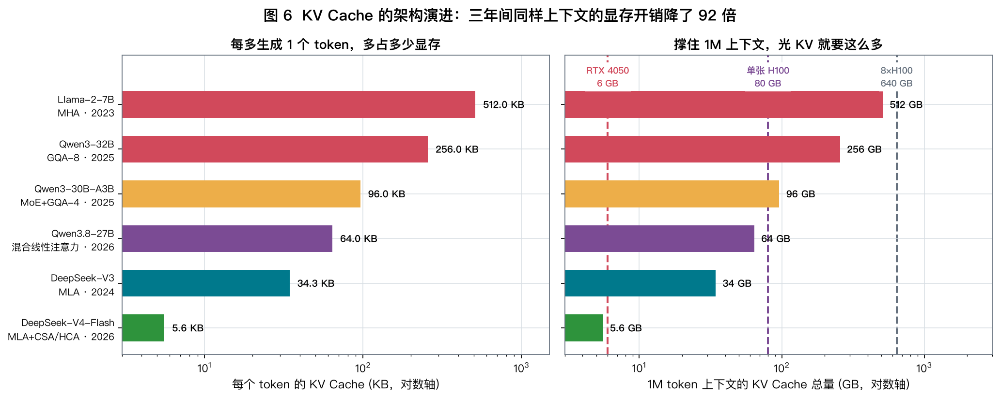

**四个关键读法：**

1. **1M 上下文用 Llama-2 的架构要 512 GB KV** —— 8 张 H100 全部显存只够存一条序列。
   长上下文不是"训练时把窗口开大"就行，它首先是一个**显存问题**。

2. **降本的每一步都是架构改动，不是硬件进步**：
   ```
   MHA          32 个 KV 头，每头独立          512 KB
   → GQA         多个 Q 头共享 1 个 KV 头        256 → 96 KB
   → 混合线性     大部分层的状态不随长度增长      64 KB
   → MLA         KV 先压成低秩隐向量再缓存        34 KB
   → CSA/HCA     不同层用不同压缩率（4× / 128×）  5.6 KB
   ```

3. **Qwen3.8-27B 的巧思**：64 层里只有 16 层是全注意力（`full_attention_interval: 4`），
   其余 48 层是**线性注意力** —— 它的状态是固定大小的矩阵（本模型约 151 MB/序列），
   **不随上下文长度增长**。所以上下文从 1K 涨到 1M，那 48 层的开销一点没变。

4. **DeepSeek-V4-Flash 的 5.6 KB/token 意味着什么**：
   1M 上下文只要 5.6 GB KV —— **理论上塞得进你那块 RTX 4050**（如果 304B 的权重放得下的话 😅）。
   官方论文的说法是「1M 上下文下只需 V3.2 的 10% KV 和 27% FLOPs」。

> **给你的实感**：同样 6 GB 显存全部拿来放 KV，
> Llama-2-7B 只能存 12K token，DeepSeek-V4-Flash 能存 **113 万** token。差 92 倍。

<details>
<summary>这些数字我是怎么算出来的（点开看推导）</summary>

**GQA/MHA 路线**（Llama、Qwen3）：

$$
\text{KV/token} = \underbrace{2}_{K,V} \times L_{\text{层数}} \times n_{kv} \times d_{head} \times \text{bytes}
$$

Qwen3.8-27B 的特殊之处：$L$ 只算 `layer_types` 里的 `full_attention` 层（64 层中的 16 层）。

**MLA 路线**（DeepSeek）：不缓存完整的 K/V，只缓存一个低秩隐向量 + 解耦的 RoPE key：

$$
\text{KV/token} = \sum_{\ell=1}^{L} \frac{d_{\text{latent}} + d_{\text{rope}}}{r_\ell} \times \text{bytes}
\qquad (d_{\text{latent}}=512,\ d_{\text{rope}}=64)
$$

V3 的所有层 $r_\ell = 1$，共 61 层 → $61 \times 576 = 35136$ 字节 (FP8)。

V4-Flash 的 `config.json` 里有一个 `compress_ratios` 数组，43 层分别是
`[0, 0, 4, 128, 4, 128, ..., 0, 0, 0]` —— 5 层不压缩、19 层压 4×(CSA)、19 层压 128×(HCA)：

$$
5\times576 + 19\times\frac{576}{4} + 19\times\frac{576}{128} = 5701\ \text{字节} \approx 5.6\ \text{KB}
$$

⚠️ **不确定性声明**：`compress_ratios` 的确切语义我是从
config 字段名 + 论文摘要（"hybrid attention combining Compressed Sparse Attention (CSA)
and Heavily Compressed Attention (HCA)"）反推的，未逐行核对源码。
另外 V4 还有一个稀疏注意力索引器（`index_topk: 512`，vLLM 里对应 `use_fp4_indexer_cache`），
会额外占一点显存，上表未计入。**这个数应视为同量级估算，不是精确值。**

Day 17 我们会把 MHA/MQA/GQA/MLA 的数学推一遍，届时你可以自己验证这张表。
</details>

---

## 9. 动手实验（30 分钟）

```bash
cd /Users/jh/workspace/github.com/gaopenghigh/ai2
uv run python labs/day01/probe.py
```

三个实验：实测峰值 → 撞墙演示 → 用实测数据做预测。

### 我在 M4 Mac mini 上的实测结果

```
实测峰值算力  3.62 TFLOPS   (标称 4.3，效率 84%)
实测峰值带宽  92.4 GB/s     (标称 120，效率 77%)
机器平衡点    39 FLOP/Byte  ← 和理论值 36 高度吻合
```

**实验 2 的输出，是今天最值得盯着看 3 分钟的东西**：

| batch B | FLOPs | 耗时 | 相对 B=1 | 实测 TFLOPS |
|---|---|---|---|---|
| 1 | 0.03 G | 383 µs | 1.00× | 0.09 |
| 8 | 0.27 G | 406 µs | 1.06× | 0.66 |
| **16** | 0.54 G | **378 µs** | **0.99×** | 1.42 |
| 32 | 1.07 G | 496 µs | 1.30× | 2.16 |
| 128 | 4.29 G | 1226 µs | 3.20× | 3.50 |
| 512 | 17.18 G | 4711 µs | 12.30× | 3.65 |

**读法**：

1. **B=1 → B=16，运算量涨了 16 倍，耗时反而少了 1%。**
   多出来的计算是"白送的"，因为 GPU 本来就在等内存。
   → 这就是 continuous batching 能把吞吐提 10 倍以上的物理原因。

2. **B=1 时实测 0.09 TFLOPS，只有峰值的 2.5%。** 和开头那个 8% 是同一件事。

3. 验证一下 B=1 到底是不是撞在带宽墙上：
   权重 $4096^2 \times 2\text{B} = 33.5$ MB，理论最短耗时 $33.5/92.4 = 363\ \mu s$，
   实测 383 µs → **达到了带宽 roofline 的 95%**。
   这个 kernel 已经写到极致了，问题不在代码，在物理。

4. **B ≥ 32 后耗时开始线性增长** —— 算术强度越过了平衡点 39，翻墙成功，
   从此进入算力受限区，实测 TFLOPS 稳定在 3.6（接近峰值）。

> **在你的 Windows / RTX 4050 上再跑一遍**（见 [SETUP.md](../../SETUP.md)）。
> 你会看到拐点出现在 B≈128 左右，因为它的平衡点是 125。**记录下两组数据，明天会用。**

---

## 10. 回到主线案例

现在你应该能回答 Day 1 版本的主线问题了：

> **Q**：7B 模型（INT4）在 RTX 4050 上处理「2000 token 输入 → 500 token 输出」，
> 耗时多少？瓶颈在哪？

```
TTFT (prefill)  = 26.8 TFLOPs / 9.6 TFLOPS(MFU 40%)  ≈ 2.8 s     ← 算力受限
TPOT (decode)   = (3.5 GB 权重 + ~1.1 GB KV) / 192 GB/s ≈ 24 ms   ← 带宽受限
总输出时间       = 500 × 24 ms                          ≈ 12.0 s
端到端           ≈ 14.8 s
```

**瓶颈拆解**：
- Decode 占了总时间的 81%，而它的 GPU 算力利用率不到 1%
- Decode 时间里，76% 花在读权重，24% 花在读 KV Cache
- 并发能力被 KV Cache 卡死在 ~1 个长请求

**那么，如何提升 10 倍吞吐？** 今天先记住方向，Week 8-9 会给出完整答案：

| 手段 | 攻击的是 | 预期收益 |
|---|---|---|
| 连续批处理 | decode 的算术强度 | 吞吐 ×10~20 |
| GQA / MLA | KV Cache 大小 | 并发 ×4~8 |
| PagedAttention | KV 内存碎片 | 并发 ×2~4 |
| 投机解码 | 每步只出 1 个 token | 延迟 ×2~3 |
| Chunked Prefill | prefill 阻塞 decode | 尾延迟改善 |

---

## 11. 思考题

**T1（计算题）**
你想在 M4 Mac mini（11 GB 可用，92 GB/s 实测带宽）上服务 Llama-3-8B (GQA, 128 KB/token)，
INT4 量化（4 GB）。要求支持 8 个并发请求，每个 8K 上下文。
显存够吗？decode 速度大约多少？

**T2（推理题）**
实验 2 里，B 从 1 到 16 耗时不变。
那么在一个**真实的推理服务**中，是不是把 batch 开到 16 就一定能让吞吐涨 16 倍？
有哪些因素会让实际收益打折？（提示：想想每个请求的上下文长度、到达时间、输出长度都不一样）

**T3（开放题）**
文中说"decode 的算术强度 ≈ batch size"。
但如果我用 **MoE 模型**（比如 8 个专家只激活 2 个），
batch 内不同请求可能路由到不同专家 —— 这时算术强度还等于 batch size 吗？
这会给推理系统带来什么新问题？
（想不出来没关系，Day 18 见。今天只要能意识到"这里有问题"就够了。）

> 把你的答案写在 `docs/week01/day01-notes.md` 里。明天开头会核对 T1。

---

## 12. 一图总结

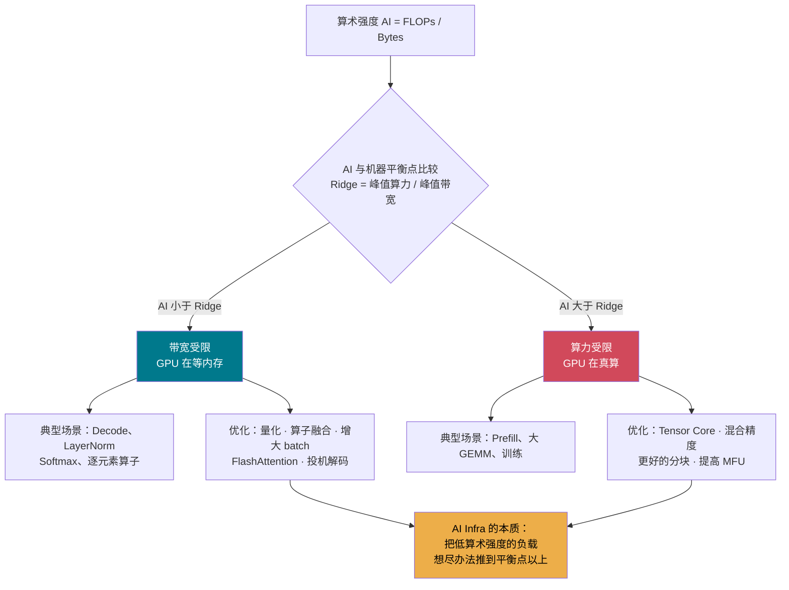

**今日一句话**：
> 大模型推理不是"算不过来"，而是"**读不过来**"。
> 你未来学的每一项技术 —— 量化、融合、批处理、缓存、并行 ——
> 都是在回答同一个问题：**如何让搬到片上的每一个字节，被多用几次。**

---

## 13. 延伸阅读

| 类型 | 材料 | 建议 |
|---|---|---|
| 📄 必读 | Williams et al., *Roofline: An Insightful Visual Performance Model* (2009) | 只看第 2-3 节，20 分钟 |
| 📄 强烈推荐 | *Efficiently Scaling Transformer Inference* (Google, 2022) | 今天只看第 2 节的成本模型 |
| 🔧 工具 | NVIDIA *GPU Performance Background* 文档 | 查表用 |
| 📊 数据 | TechPowerUp GPU Database | 查任意 GPU 的算力/带宽 |
| 🎬 可选 | Horace He, *Making Deep Learning Go Brrrr From First Principles* | 博客，本课 Week 1 的最佳同伴读物 |

---

## ✅ 今日检查清单

- [ ] 能不看资料说出算术强度的定义和"三堵墙"
- [ ] 在 Mac 上跑完 `probe.py`，记录了实测算力/带宽/平衡点
- [ ] **在 Windows RTX 4050 上也跑了一遍**，记录了两组数据的差异
- [ ] 完成手算 Q1-Q3
- [ ] 思考题写进了 `day01-notes.md`

**明天（Day 02）**：Roofline 模型 —— 我们把今天的散点，画成一张能预测任意算子性能的完整图。
