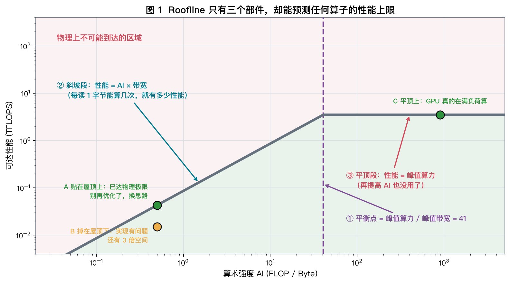
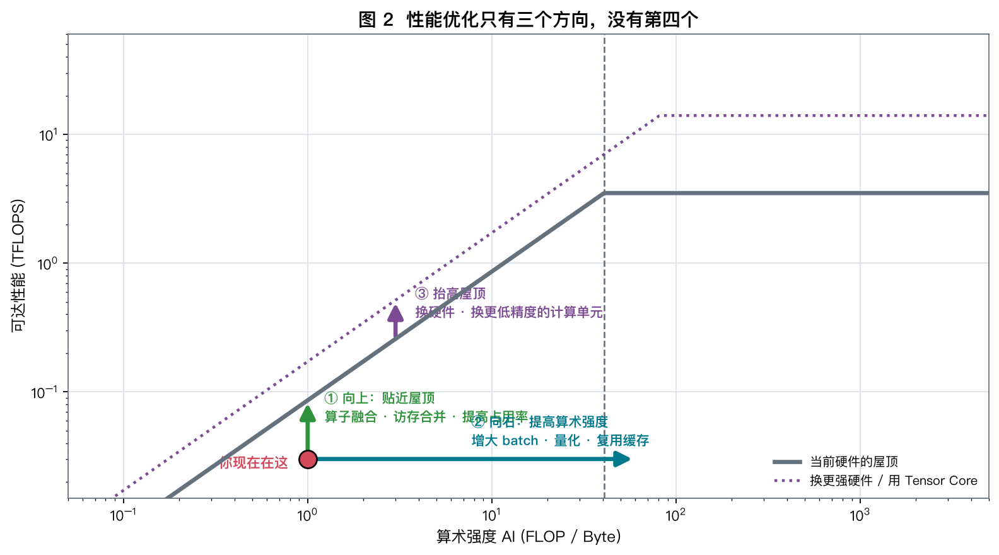
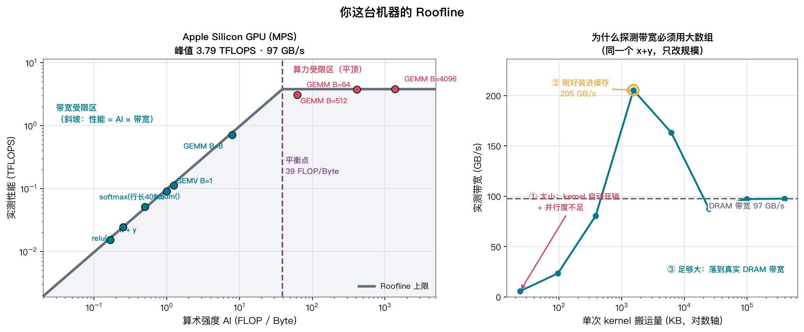
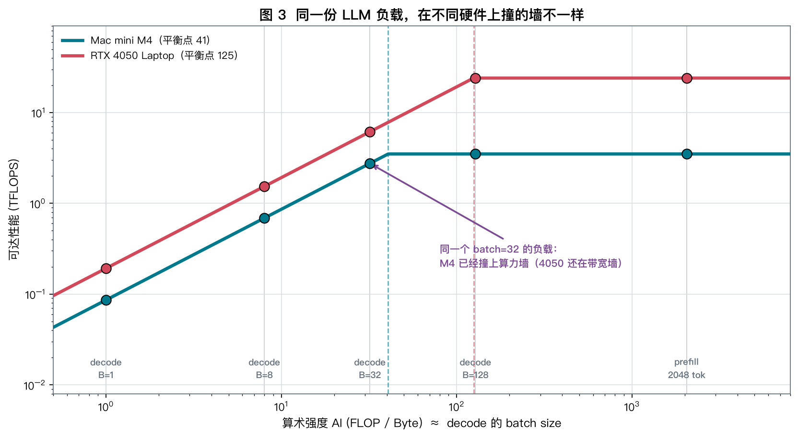
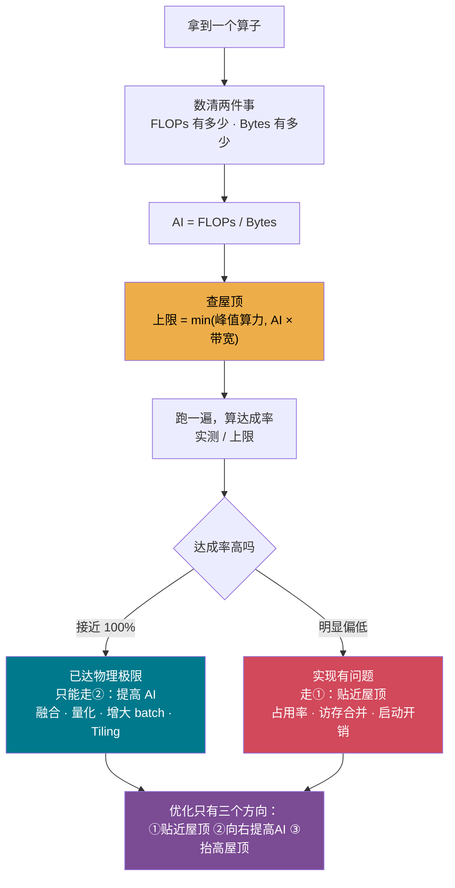

# Day 02 · Roofline：一把能预测性能上限的尺子

> **今日目标**：把昨天的定性直觉（"算术强度决定撞哪堵墙"）升级成一个**定量工具** ——
> 给你任何一个算子，不用跑，先算出它的性能上限；跑完之后，能判断"还有没有优化空间"。

⏱ 阅读 40 min · 动手 35 min · 思考 15 min

---

## 1. 昨天你学到的，今天要变成能用的

| | Day 01 | Day 02 |
|---|---|---|
| 你能说 | "decode 是带宽受限的" | "decode 在我这台机器上的性能上限是 **0.085 TFLOPS**" |
| 你能做 | 判断撞哪堵墙 | **在写代码之前**就算出上限；跑完判断实现是否到位 |
| 缺什么 | 只有一个平衡点，是个"是/否"判断 | 一条完整的曲线，任何 AI 都能查到上限 |

---

## 2. 先看一个反常识的现象

昨天实验 2 里，`X(B,4096) @ W(4096,4096)` 这个运算，B 从 1 涨到 4096：

- 计算量涨了 **4096 倍**
- 硬件一点没变
- 但**实测性能从 0.08 TFLOPS 涨到了 3.46 TFLOPS，涨了 43 倍**

同一段代码、同一块 GPU，为什么性能能差 43 倍？更关键的是：

> **43 倍是巧合吗？还是有一个公式能提前算出来？**

有。而且这个公式只需要**两个硬件参数 + 一个算子属性**。

---

## 3. 推导：从两个下界，得到一个上界

一个算子跑完，至少要花多少时间？有两个硬性约束：

$$
t \ge \frac{\text{FLOPs}}{P} \quad (\text{算不完}), \qquad
t \ge \frac{\text{Bytes}}{B} \quad (\text{搬不完})
$$

其中 $P$ = 峰值算力 (FLOP/s)，$B$ = 峰值带宽 (Byte/s)。

**关键一步**：现代 GPU 可以**一边搬一边算**（访存与计算重叠）。
所以两个约束不是相加，而是取**较大者**：

$$
t \ge \max\!\left(\frac{\text{FLOPs}}{P},\ \frac{\text{Bytes}}{B}\right)
$$

把它变成性能（FLOP/s）：

$$
\text{Perf} = \frac{\text{FLOPs}}{t}
\le \frac{\text{FLOPs}}{\max\left(\frac{\text{FLOPs}}{P},\ \frac{\text{Bytes}}{B}\right)}
= \min\!\left(P,\ \frac{\text{FLOPs}}{\text{Bytes}} \cdot B\right)
$$

而 $\dfrac{\text{FLOPs}}{\text{Bytes}}$ 就是昨天的**算术强度 AI**。于是：

$$
\boxed{\ \text{Perf} \le \min\bigl(\underbrace{P}_{\text{算力天花板}},\ \underbrace{\text{AI} \times B}_{\text{带宽天花板}}\bigr)\ }
$$

**这就是 Roofline。** 一个 min、两个硬件参数，没别的。

在对数坐标上画出来，它是一条"斜坡 + 平顶"的折线 —— 长得像屋顶，所以叫 Roofline。

---

## 4. 解剖这个屋顶



**三个部件**：

| 部件 | 公式 | 含义 |
|---|---|---|
| ① 平衡点（ridge） | $P / B$ | 斜坡与平顶的交点。AI 在它左边 = 带宽受限，右边 = 算力受限 |
| ② 斜坡段 | $\text{Perf} = \text{AI} \times B$ | 带宽受限区。**AI 翻倍，性能就翻倍** |
| ③ 平顶段 | $\text{Perf} = P$ | 算力受限区。**AI 再涨也没用** |

**一个点在图上只有三种位置，对应三种完全不同的行动**：

| 位置 | 含义 | 你该做什么 |
|---|---|---|
| **A** 贴在屋顶上 | 已达物理极限 | **停止微观优化**，去改算法/改数据布局（提高 AI） |
| **B** 掉在屋顶下 | 实现没写好 | 查占用率、访存合并、kernel 启动开销 |
| 屋顶上方 | 不可能 | 你的 FLOPs/Bytes 算错了，或者命中了缓存 |

> **B 类的价值最大**：Roofline 告诉你"这里还有 3 倍空间"，
> 而不是让你在一个已经贴顶的算子上白费两天。

---

## 5. 亲手把真实算子打到屋顶上

```bash
uv run python labs/day02/roofline.py
```

我在 M4 上的结果（**峰值 3.53 TFLOPS / 85 GB/s / 平衡点 41**）：

| 算子 | AI | 屋顶允许 | 实测 | 达成率 | 墙 |
|---|---:|---:|---:|---:|---|
| `x + y` | 0.17 | 0.014 T | 0.014 T | **101%** | 带宽 |
| `relu(x)` | 0.25 | 0.021 T | 0.022 T | **103%** | 带宽 |
| `x.sum()` | 0.50 | 0.043 T | 0.047 T | **110%** | 带宽 |
| `softmax` (行长 4096) | 1.25 | 0.107 T | 0.094 T | 89% | 带宽 |
| **GEMV B=1** | 1.00 | 0.085 T | 0.082 T | **96%** | 带宽 |
| GEMM B=8 | 7.97 | 0.679 T | 0.625 T | 92% | 带宽 |
| GEMM B=64 | 62 | 3.528 T | 2.916 T | **83%** | 算力 |
| GEMM B=512 | 410 | 3.528 T | 3.528 T | **100%** | 算力 |
| GEMM B=4096 | 1365 | 3.528 T | 3.460 T | 98% | 算力 |

**这张表最震撼的地方**：9 个完全不同的算子，性能横跨 **250 倍**（0.014 → 3.53 TFLOPS），
但**每一个都精确地落在同一条屋顶线上**。

$$
\text{性能差 250 倍，不是因为代码质量，而是因为 AI 差 8000 倍。}
$$

**注意 GEMV B=1 达成率 96%** —— 这就是 decode。它不是"写得烂"，
它已经**跑到了这台机器的物理极限**。想让它变快，只有把点往右挪（提高 AI），没有第二条路。

**GEMM B=64 只有 83%**，是全场最低 —— 它刚过平衡点，正处在"两堵墙都快撞上"的尴尬地带，
这类点通常是优化收益最高的（Day 24 会回来收拾它）。

> 达成率 >100% 的几行（`x.sum()` 110%）不是穿墙了，是**峰值探测偶尔低估**，
> 或者数据部分命中了缓存 —— 这正好引出下一节。

---

## 6. 优化只有三个方向，没有第四个



一旦把算子画在 Roofline 上，**所有优化手段都能归到三个箭头之一**：

| 方向 | 做什么 | 具体技术 | 学在 |
|---|---|---|---|
| **① 向上**：贴近屋顶 | 改进实现，把浪费掉的带宽/算力捡回来 | 算子融合、访存合并、提高占用率、消除 kernel 启动开销 | Week 4 |
| **② 向右**：提高算术强度 | 让搬进来的每个字节被多用几次 | 增大 batch、量化、Tiling 复用缓存、FlashAttention | Week 3/5/8 |
| **③ 抬高屋顶** | 换更强的硬件或更低精度的计算单元 | Tensor Core、FP8/INT4、换卡 | Week 1/5 |

**新手最常犯的错**：算子明明贴在屋顶上（A 类），还在拼命做①。

**举个能立刻算出收益的例子**（昨天 `why_bandwidth.py` 抓到的）：

```
x + y + z 未融合：tmp = x+y (3个数组) → tmp+z (3个数组) = 6 个数组
x + y + z   融合：一次读 x,y,z，寄存器里算完，写一次 out = 4 个数组
                                                    加速上限 = 6/4 = 1.5×
```

如果是 **7 个逐元素算子串起来**（LayerNorm + GELU + ... 这种很常见）：

$$
\text{未融合} = 7 \times 2 = 14\ \text{个数组}, \qquad
\text{融合后} = 2\ \text{个数组}, \qquad
\textbf{加速上限 } 7\times
$$

这就是 `torch.compile` 那一行代码提速 2 倍的来源（Day 65）。

---

## 7. 第三堵墙：数据太少，连带宽都吃不满

Roofline 有个隐含假设：**你有足够多的并行工作可做**。现实往往不满足。

跑实验的右图（同一个 `x + y`，只改数组大小）：



带宽不是一个常数，而是一条曲线，分三段：

| 区间 | 现象 | 原因 |
|---|---|---|
| ① 数据 < 100 KB | 只有 3~16 GB/s | **kernel 启动开销**（几十微秒）+ 并行度不足 |
| ② 数据 1~6 MB | 冲到 **185 GB/s**（超过 DRAM 带宽两倍） | **命中片上缓存**，压根没走内存总线 |
| ③ 数据 > 25 MB | 稳定在 85 GB/s | 装不下缓存，落到真实 DRAM 带宽 |

**② 区间就是"达成率 110%"的真相**，也是所有 tiling / 分块优化的目标：
**想办法让数据待在缓存里，等于给自己换了一个两倍高的屋顶**（分层 Roofline，Day 04 展开）。

**① 区间背后是 Little's Law**：

$$
\text{必须同时在飞的数据量} = \text{带宽} \times \text{延迟}
$$

M4 的内存延迟约 350 ns，带宽 85 GB/s：

$$
85 \times 10^9 \times 350 \times 10^{-9} \approx \mathbf{30\ KB}
$$

**任何时刻必须有 30 KB 的读请求同时在路上，才能填满带宽。**
数据只有 24 KB 的话，物理上不可能达到峰值 —— 这跟你代码写得好不好无关。

> **对 LLM 的直接影响**：decode 阶段每步只处理 1 个 token，
> 很多算子（LayerNorm、RoPE、逐元素）的数据量都在几百 KB 量级，
> **同时踩在 ① 和斜坡最左端**。这是 CUDA Graph（Day 66）要解决的问题。

---

## 8. 把 LLM 打到屋顶上



同一份负载（7B 模型，FP16 权重），在你两台机器上：

| 负载 | AI | M4 上限 | 4050 上限 | M4 撞什么墙 | 4050 撞什么墙 |
|---|---:|---:|---:|---|---|
| decode B=1 | 1 | 0.085 T | 0.19 T | 带宽 | 带宽 |
| decode B=8 | 8 | 0.68 T | 1.54 T | 带宽 | 带宽 |
| **decode B=32** | 32 | **3.53 T（撞顶）** | 6.1 T | **算力** | **带宽** |
| decode B=128 | 128 | 3.53 T | 24 T（撞顶） | 算力 | 算力 |
| prefill 2048 tok | 2048 | 3.53 T | 24 T | 算力 | 算力 |

**读出三个非平凡的结论**：

1. **同一个 batch=32 的负载，在两台机器上撞的墙不一样。**
   M4 已经满负荷了（再加 batch 只增延迟不增吞吐），4050 还有 4 倍空间。
   → **最优 batch size 是硬件的函数，不能照抄别人的配置。**

2. **M4 的平衡点低（41）反而是优势**：它更容易被"喂饱"，batch 32 就够。
   4050 平衡点 125，要 batch 128 才能吃满 —— 但它只有 6 GB 显存，
   **根本存不下 128 条序列的 KV Cache**（这就是 Q2 的手算题）。

3. **prefill 永远在平顶上** —— 所以 prefill 的优化方向只有①和③（提高 MFU、用 Tensor Core），
   而 decode 的优化方向主要是②（提高 AI）。**两个阶段该做的优化完全不同。**

---

## 9. 手算练习（15 分钟）

**Q1**. LayerNorm 作用在 $(4096, 4096)$ 的 fp16 张量上（约 8 FLOP/元素）。
在 M4（3.53 TFLOPS / 85 GB/s）上，它的 AI 是多少？耗时下界是多少？

<details>
<summary>点开答案</summary>

$N = 4096 \times 4096 = 16.8\text{M}$ 个元素。读一遍写一遍 → 每元素 4 字节：

$$
\text{Bytes} = 4N = 67\ \text{MB}, \qquad \text{FLOPs} = 8N = 134\ \text{MFLOP}
$$

$$
\text{AI} = \frac{8N}{4N} = \mathbf{2\ \text{FLOP/Byte}}
$$

2 远小于平衡点 41 → **带宽受限**，上限 $= 2 \times 85 = 170$ GFLOPS（峰值的 4.8%）。

$$
t_{\min} = \frac{67\times10^6}{85\times10^9} \approx \mathbf{0.79\ ms}
$$

**注意**：不管你的 LayerNorm 写得多好，都不可能快过 0.79 ms。
唯一的出路是**跟相邻算子融合**，把中间结果留在片上（②号方向）。
</details>

**Q2**（重点题）. 你想让 RTX 4050（平衡点 125）的 decode 撞到算力墙。
假设用 Llama-3-8B（GQA，128 KB/token），每个请求 2000 token 上下文。
需要多大 batch？显存够吗？

<details>
<summary>点开答案</summary>

要撞算力墙，需要 $\text{AI} \ge 125$，而 decode 的 AI ≈ batch size：

$$
\text{batch} \ge \mathbf{125}
$$

这 125 条序列的 KV Cache：

$$
125 \times 2000 \times 128\ \text{KB} = 32{,}000{,}000\ \text{KB} \approx \mathbf{30.5\ GB}
$$

而这张卡总共只有 **6 GB**，还要装 4 GB 的模型权重。

**结论：RTX 4050 上的 decode 永远不可能撞到算力墙。**
它的 GPU 算力有 95% 以上是结构性浪费的，且无法通过任何软件优化挽回。

> **这才是 Day 01 那个"GPU 有 92% 时间在发呆"的完整答案**：
> 不是没优化，是**显存容量限制了 batch，batch 限制了 AI，AI 限制了性能**。
> 三者环环相扣 —— 所以 KV Cache 压缩（GQA/MLA/量化）才是推理优化的命门。
</details>

**Q3**. 一条 7 个逐元素算子的链（每个读 1 写 1）。融合前后的加速比上限是多少？

<details>
<summary>点开答案</summary>

$$
\text{未融合} = 7 \times 2 = 14\ \text{个数组}, \qquad
\text{融合后} = 1\ \text{读} + 1\ \text{写} = 2\ \text{个数组}
$$

$$
\text{加速比上限} = \frac{14}{2} = \mathbf{7\times}
$$

在 Roofline 上看：AI 从 $\frac{7N}{14 \cdot 2N}$ 提高到 $\frac{7N}{2 \cdot 2N}$，也是 7 倍 —— **纯粹的②号方向**。
</details>

---

## 10. 动手实验（35 分钟）

```bash
# 1. 画出你这台机器的 Roofline（会存到 results/roofline_<设备>.png）
uv run python labs/day02/roofline.py

# 2. 换个矩阵规模，看点会怎么移动
uv run python labs/day02/roofline.py --n 2048
```

**做完请回答**（写进 notes）：

1. 你的平衡点是多少？和 Day 01 测的一致吗？
2. 哪个算子的达成率最低？为什么？
3. 带宽曲线的峰值出现在多大的数据量？那个峰值除以 DRAM 带宽是多少倍？

**进阶（推荐）**：往 `build_ops()` 里加一个你自己的算子。
只要如实填写它的 `flops` 和 `bytes`，它就会自动出现在图上。
**这个动作会强迫你精确思考"我这个算子到底搬了多少字节"** —— 这是本课最重要的肌肉记忆。

> **在 RTX 4050 上也跑一遍**。你会看到一张形状完全不同的屋顶：
> 平顶更高（24 vs 3.5 TFLOPS）、拐点更靠右（125 vs 41）。
> 同一批算子在两张图上的**相对位置**会告诉你很多东西。

---

## 11. 思考题

**T1（对账）**
昨天实验 2 你测到拐点在 **B=64**，但今天算出平衡点是 **41**。
为什么不是正好在 41？（提示：想想 GEMM B=64 的达成率只有 83%）

**T2（诊断）**
`x.sum()` 的达成率是 110%，"穿过了屋顶"。列举**至少两种**可能的原因，
并各设计一个实验来区分它们。

**T3（开放）**
FlashAttention 的核心是"不把 $N \times N$ 的注意力矩阵写回显存"。
用今天学的语言描述：它在 Roofline 上把点往哪个方向挪了？挪了多远？
（提示：算一下标准 attention 和 FlashAttention 各自的 Bytes。想不出来没关系，Day 29 见。）

---

## 12. 一图总结



**今日一句话**：
> Roofline 的价值不在于"算出上限"，而在于**告诉你别在哪儿浪费时间**。
> 一个贴在屋顶上的算子，再优化 100 行代码也快不了 1% ——
> 你要做的是**把它挪到屋顶的另一个位置去**。

---

## 13. 延伸阅读

| 类型 | 材料 | 建议 |
|---|---|---|
| 📄 原始论文 | Williams, Waterman, Patterson, *Roofline: An Insightful Visual Performance Model* (CACM 2009) | 今天看第 2-3 节，30 分钟 |
| 📄 进阶 | Ilic et al., *Cache-aware Roofline Model* (2014) | 只看分层屋顶那张图 |
| 🔧 工具 | NVIDIA Nsight Compute 内置 Roofline 视图 | Week 4 在 4050 上用 |
| 🔧 工具 | Intel Advisor / `likwid-perfctr` | CPU 侧的同类工具 |
| 🎬 强推 | Horace He, *Making Deep Learning Go Brrrr From First Principles* | 今天读完它，跟本课完全同频 |
| 📊 数据 | 你自己的 `results/roofline_*.png` | **这才是最重要的参考资料** |

---

## ✅ 今日检查清单

- [ ] 能默写 $\text{Perf} \le \min(P,\ \text{AI} \times B)$ 并说出推导
- [ ] 在 Mac 上跑出了自己的 Roofline 图，记下了平衡点
- [ ] **在 RTX 4050 上也跑了**，对比了两张图的形状差异
- [ ] 完成手算 Q1–Q3（**Q2 必做**，它是 Week 3 和 Week 8 的引子）
- [ ] 能说出优化的三个方向，并各举一个例子
- [ ] 思考题写进了 `day02-notes.md`

**明天（Day 03）**：GPU 架构解剖 —— 屋顶的两个数字（峰值算力、峰值带宽）到底是怎么来的？
我们钻进 SM、Warp 和 Tensor Core 里面看。
