# Day 03 · GPU 架构解剖：屋顶的两个数字从哪来

> **今日目标**：钻进 GPU 内部，搞清楚 **3.53 TFLOPS 和 85 GB/s 是怎么乘出来的**，
> 以及 Day 02 那些"达成率 83%"的缺口，具体丢在了哪三个地方。

⏱ 阅读 40 min · 动手 35 min · 思考 15 min

---

## 1. 今天补上 Day 02 的最后一块拼图

Day 02 你学会了用 Roofline 判断"还有没有优化空间"。但有两个问题没答：

| 问题 | 今天的答案 |
|---|---|
| 屋顶的高度（峰值算力/带宽）是**怎么定的**？ | §2 §3：四个硬件参数连乘（连“7500”这种数字从哪来也一并讲了） |
| 达成率不到 100%，缺口**具体丢在哪**？ | §6 §7 §8：Tile 量化 / 访存不合并 / 占用率不足 |

---

## 2. 峰值算力 = 四个数连乘

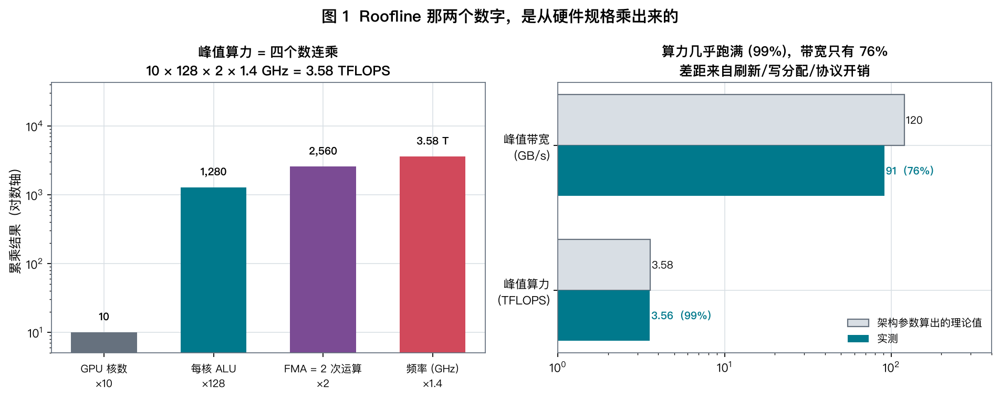

$$
\boxed{\ P = \underbrace{N_{\text{核}}}_{\text{有几个核}} \times \underbrace{A}_{\text{每核几个 ALU}} \times \underbrace{2}_{\text{FMA 算 2 次}} \times \underbrace{f}_{\text{频率}}\ }
$$

**为什么是 ×2**：GPU 的基本运算指令是 **FMA**（Fused Multiply-Add，$d = a \times b + c$），
一条指令、一个周期，完成**一次乘法 + 一次加法**。业界统一按 2 次浮点运算计。

代入 Mac mini M4：

$$
10 \text{ 核} \times 128 \text{ ALU} \times 2 \times 1.40\ \text{GHz} = \mathbf{3.58\ \text{TFLOPS}}
$$

**而我在 Day 02 实测的是 3.53～3.58 TFLOPS —— 达成率 99%。**

> 这个 99% 值得停下来体会一下：一个纯粹从**硬件规格表**乘出来的数字，
> 精确预测了 PyTorch 跑一个 4096³ 矩阵乘的实际性能。
> **这就是"从原理上掌握"的意思** —— 你不需要跑代码就知道答案。

---

## 3. 峰值带宽 = 总线宽度 × 每线速率

$$
\boxed{\ B = \frac{\text{总线位宽}}{8} \times \text{每根线每秒传多少 Gb}\ }
$$

| 机器 | 位宽 | 内存类型与速率 | 理论带宽 | 实测 | 达成率 |
|---|---|---|---|---|---|
| Mac mini M4 | 128 bit | LPDDR5X-7500 | **120 GB/s** | 91 | **76%** |
| RTX 4050 Laptop | 96 bit | GDDR6 @ 16 Gbps | **192 GB/s** | 待你测 | ~75-85% |

**注意算力能到 99%，带宽却只有 76%。** 这不是巧合：

| 损耗来源 | 说明 |
|---|---|
| DRAM 刷新 | 每隔几十微秒必须停下来刷新电容，期间不能读写 |
| 行激活 / tRC | 访问新的一行要先"打开"它，有固定延迟 |
| 写分配 | 写一条 cache line 前往往要先把它读进来（Day 01 提过的 STREAM 惯例问题） |
| 协议开销 | 命令、地址、ECC 占用总线时隙 |

**记住这个经验值：带宽实测通常是标称的 70~85%，算力实测通常是 85~99%。**
以后看到别人报的数字，可以立刻判断合不合理。

### 3.1 "每根线每秒传多少 Gb"是怎么知道的？

这个数**就写在内存型号里**，只是名字有点绕。

**`LPDDR5X-7500` 里的 7500，单位是 MT/s（每秒百万次传输）。**
每根数据线每次传输 1 个 bit，所以：

$$
7500\ \text{MT/s} = 7.5\ \text{GT/s} = \mathbf{7.5\ Gbps\ 每根线}
$$

**为什么叫 DDR**：Double Data Rate —— 实际时钟只有 **3750 MHz**，
但在时钟的**上升沿和下降沿各传一次**，所以每秒传 7500 M 次。

```
时钟  ┐_┌─┐_┌─┐_┌─┐_┌     3750 MHz
数据  ╳═╳═╳═╳═╳═╳═╳═╳     每个沿都传 → 7500 MT/s
      ↑ ↑ ↑ ↑ ↑ ↑ ↑ ↑
```

GDDR6 更激进：它有一条独立的高速数据时钟（WCK），配合 8n 预取，
厂商标的 "2000 MHz 显存频率" 实际对应 $2000 \times 8 = \mathbf{16\ Gbps}$ 每根线。

> ⚠️ **这是数据手册里最容易被搞混的地方**。同一颗显存，你会看到三种说法：
> 「2000 MHz」（基础时钟）、「16000 MHz 等效频率」（营销话术）、「16 Gbps」（真正有用的数)。
> **只认最后一个。**

| 内存类型 | 每 pin 速率 | 用在哪 |
|---|---|---|
| DDR5-6400 | 6.4 Gbps | 台式机内存 |
| **LPDDR5X-7500** | **7.5 Gbps** | **M4 (base)** |
| LPDDR5X-8533 | 8.5 Gbps | M4 Pro / Max |
| **GDDR6** | **16 Gbps** | **RTX 4050** |
| GDDR6X (PAM4) | 21 Gbps | RTX 4090 |
| GDDR7 (PAM3) | 32 Gbps | RTX 50 系 |
| HBM2e | 3.2 Gbps | A100 |
| HBM3 | 5.2 Gbps | H100 |
| HBM3e | 8.0 Gbps | B200 |

**注意最后三行：HBM 的每 pin 速率反而是最慢的**（3~8 Gbps，还不如手机内存）。
它靠的是另一条路：

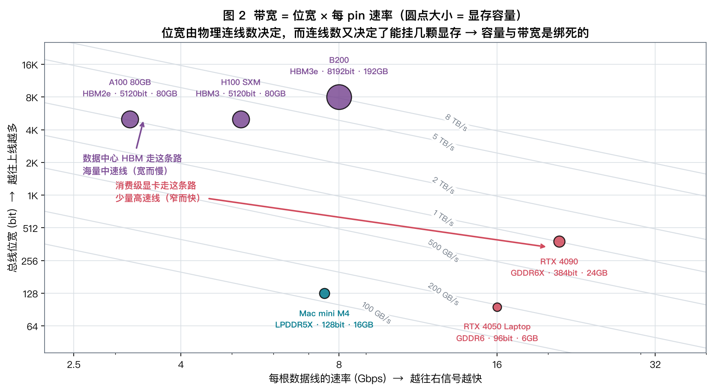

$$
\text{H100} = \underbrace{5120\ \text{bit}}_{\text{5 个 HBM stack}} \div 8 \times 5.2\ \text{Gbps} = \mathbf{3328\ GB/s}
$$

**信号跑得越快，走线越难做（串扰、功耗、PCB 层数）。所以想要大带宽有两条路：**

| 路线 | 做法 | 代价 |
|---|---|---|
| **窄而快**（GDDR） | 少量走线，把频率拉到极限 | 功耗高、位宽受 PCB 限制 |
| **宽而慢**（HBM） | 硅中介层上堆几千根线，频率反而降下来 | 贵、必须和 GPU 封装在一起 |

### 3.2 一个推论：容量和带宽是绑死的

总线位宽不是随便定的，它等于**你挂了几颗显存芯片**：

```
一颗 GDDR6 芯片 = 32 bit 位宽 + 2 GB 容量

RTX 4050:  3 颗 → 3 × 32 = 96 bit,  3 × 2 GB = 6 GB    ← 就是你那块卡
RTX 4060:  4 颗 → 128 bit,          8 GB
RTX 4090: 12 颗 → 384 bit,         24 GB
```

$$
\boxed{\ \text{显存容量和带宽，来自同一个物理事实：你挂了几颗芯片}\ }
$$

> **所以"6 GB 但带宽 1 TB/s 的卡"根本不存在。**
> 你手上那块 4050 只有 192 GB/s，不是英伟达小气 ——
> 是**只有 3 颗芯片能挂**，物理上就这么多线。
>
> 反过来也解释了为什么 H100 是 80 GB 而不是 8 GB：
> 要 3.35 TB/s 就必须堆 5 个 HBM stack，而**每个 stack 天然就有 16 GB**。
> 大显存不是"顺便给的"，是**为了带宽不得不带上的**。

**这条推论会在 Week 8 变得很重要**：当你为推理服务选卡时，
"每 GB 显存能配多少带宽"是一个近似固定的比值 —— 你没法只买其中一个。

---

## 4. GPU 是怎么组织的

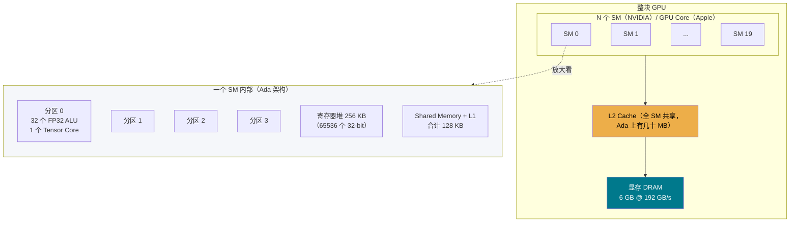

**三个关键数量级**（Ada / RTX 4050）：

| 层级 | 容量 | 延迟 | 带宽 |
|---|---|---|---|
| 寄存器 | 256 KB / SM | ~1 周期 | 极高 |
| Shared Memory / L1 | 128 KB / SM | ~30 周期 | 很高 |
| L2 | ~24-32 MB（全卡共享） | ~200 周期 | 高 |
| **显存 DRAM** | **6 GB** | **~400-600 周期** | **192 GB/s** |

> **每往下一层，容量涨 100 倍，速度掉 10 倍。**
> Day 04 会把这个金字塔实测一遍。

---

## 5. SIMT：真正的执行单位是 warp，不是线程

### 5.0 先理清四个层级：Grid / Block / Warp / Thread

后面反复出现的 **block**，指的是 **thread block（线程块）** —— CUDA 编程模型里
你亲手指定的一组线程。启动 kernel 时那对尖括号写的就是它：

```cuda
myKernel<<< 1024, 256 >>>(...);
//           ↑     ↑
//    1024 个 block  每个 block 256 个线程   →  总共 262144 个线程
```

完整的四层是这样嵌套的：

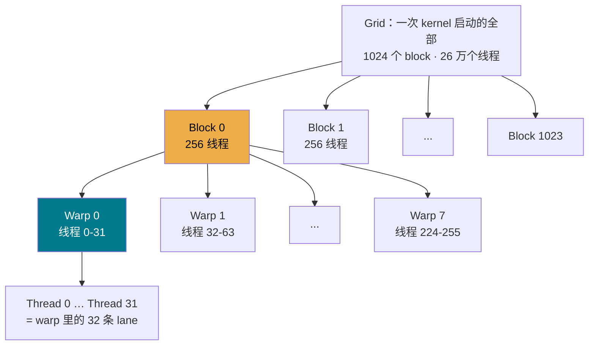

| 层级 | 谁定的 | 多大 | 关键性质 |
|---|---|---|---|
| **Grid** | 你写的 `<<<1024, ...>>>` | 几千~几百万线程 | 一次 kernel 启动的全部工作 |
| **Block** | 你写的 `<<<..., 256>>>` | 通常 128~1024 线程 | **资源分配和调度的单位** |
| **Warp** | **硬件自动切**，你管不着 | **恒定 32** | **真正的执行单位**（§5.1） |
| **Thread** | 编程模型的虚构 | 1 | 就是 warp 里的一条 lane |

**Block 有三条硬性规则，解释了前面所有跟它有关的说法：**

| 规则 | 后果 |
|---|---|
| ① 一个 block **整块**上同一个 SM，**绝不拆到两个 SM** | 所以 §8.2 才按 block 算资源；block 开太大可能一个都放不下 |
| ② block 一上台就**跑到结束才下台**（同一 kernel 内不被换出） | 所以才有“block 跑完，腾出寄存器”这句话 |
| ③ block **之间无法同步**，执行顺序不保证 | 想全局同步？只能结束 kernel 再起一个 |

**为什么需要 block 这一层？** 因为有两样东西的作用域**正好是 block**：

- **Shared Memory** —— 同一个 block 的线程能共享，跨 block 不行
- **`__syncthreads()`** —— 同一个 block 内的线程可以对齐到同一点，跨 block 不行

> 换句话说：**block 就是“能互相协作的那一撮线程”**。
> 硬件为了保证它们能协作，才必须把整块放在同一个 SM 上（共享同一份 Shared Memory）。

#### 这一层把 §6 的 tile 和 §5 的 warp 串起来了

```
数学上:   输出矩阵的一个 128×128 tile
   ↓  一一对应
编程上:   一个 thread block（比如 256 个线程）
   ↓  硬件自动切
硬件上:   8 个 warp，全部驻留在【同一个】SM 上
   ↓  分时复用
执行时:   每周期 4 个调度器各挑 1 个 warp，喂给 32 条 lane
```

**这条链就是“数学 → 硬件”的完整映射**，后面每次讲 kernel 优化都要用到它。

### 5.1 warp：硬件真正调度的东西

GPU 上你写的是“每个线程干什么”，但硬件**永远以 32 个线程为一组**（NVIDIA 叫 **warp**，
Apple 叫 **SIMD-group**）调度和执行 —— 它们**共用一个指令指针**。

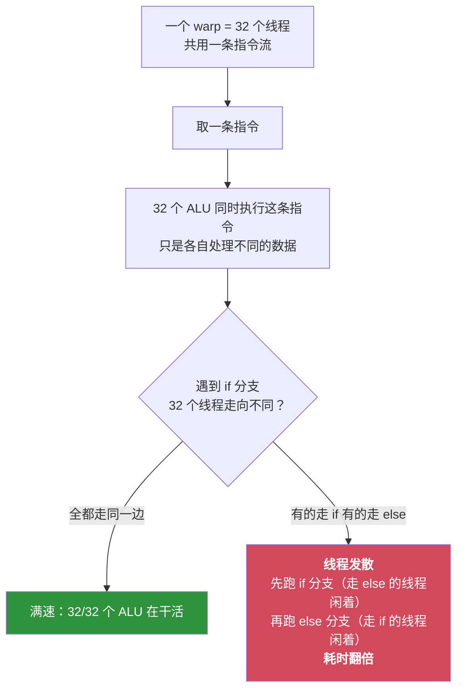

**三个直接推论**：

1. **block 大小应该是 32 的倍数**。开 100 个线程，硬件实际调度 4 个 warp = 128 个线程槽，
   有 28 个白白浪费。
2. **`if/else` 在 GPU 上很贵**，前提是同一个 warp 内部走向不一致。
   如果整个 warp 走同一边，一点代价都没有。
3. **这也是 Tile 量化的根源** —— 下面就看。

### 5.2 一个容易想反的点：谁才是“虚的”

很自然会觉得：*线程是真实的执行体，warp 只是把它们捆一捆的虚拟概念。*

**实际上恰好反过来。**

硬件里根本不存在“能独立执行一个线程”的部件。取指令、译码、发射、记分板 ——
**这整套控制通路都只有一套，侍候着 32 条数据通道（lane）**。
你写的“线程”，在硬件上就是 **warp 里的一条 lane**，它没有自己的指令流。

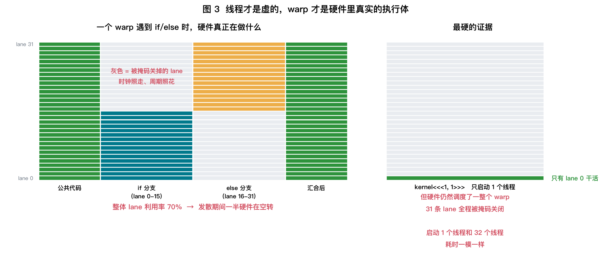

**两个细节能坐实这件事**：

1. **分支发散为什么要花钱？** 如果 32 个线程真是独立执行体，各走各的应该不花额外代价。
   它花钱，恰恰证明了**只有一条指令流**：硬件只能先跑 if（把 else 的 lane 掩掉），
   再跑 else（把 if 的 lane 掩掉）。**被掩掉的 lane 时钟照走、周期照花。**

2. **启动 1 个线程和 32 个线程，耗时一模一样。**
   因为硬件没办法“只跑 1 个线程”，它只能调度一整个 warp，把另外 31 条 lane 掩掉。

### 5.3 那一个 warp 在硬件上到底占了什么

自然会想问：*那一个 warp 是不是就对应芯片上的一块晶体管？*

**一半对。得把两件事分开：**

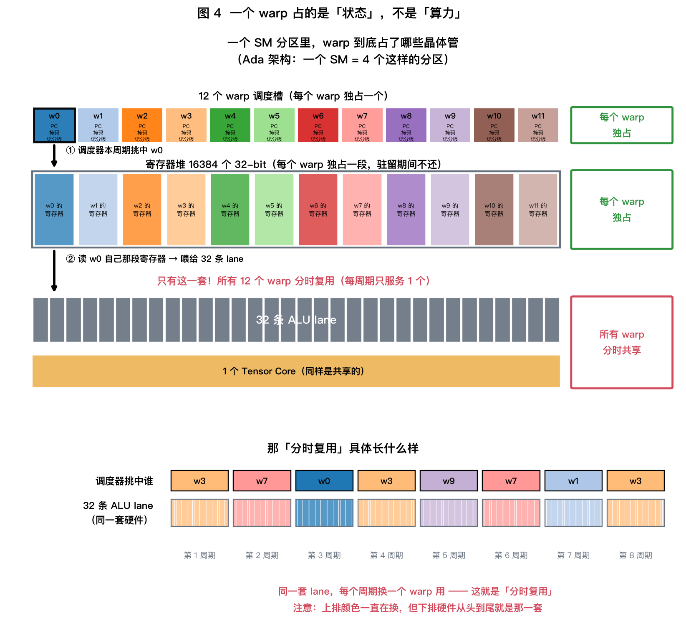

| 部件 | 归属 | 说明 |
|---|---|---|
| **warp 调度槽**（PC · 活动掩码 · 记分板 · barrier 状态） | **独占** ✅ | 硬件里硬硬刻好的 12 个表项（每 SM 48 个） |
| **寄存器** | **独占** ✅ | 从上台到下台，这段物理地址就是它的 |
| **32 条 ALU lane** | **共享** ❌ | 只有一套，12 个 warp 分时复用 |
| **Tensor Core / 访存单元 / L1** | **共享** ❌ | 同上 |

**所以准确的说法是**：

$$
\text{一个驻留的 warp} = \underbrace{\text{一个调度槽表项}}_{独占的晶体管} + \underbrace{\text{一段寄存器地址}}_{独占的晶体管} + \underbrace{\text{对 ALU 阵列的使用权}}_{和别人轮着用}
$$

#### 什么是一条 "lane"

**一条 lane = 一个 FP32 ALU 电路 + 它到寄存器堆某一列的固定连线。**

32 条 lane 并排站着，**共用一套取指/译码/发射逻辑**：

```
                    ┌─────────────────────┐
                    │  取指 · 译码 · 发射   │  ← 只有一套（"工头"）
                    └──────────┬──────────┘
                               │ 一句口令，广播给所有 lane
        ┌──────────┬───────────┼───────────┬──────────┐
        ▼          ▼           ▼           ▼          ▼
     ┌─────┐    ┌─────┐     ┌─────┐     ┌─────┐   ┌─────┐
     │ALU 0│    │ALU 1│     │ALU 2│ ... │ALU30│   │ALU31│  ← 32 条 lane
     └──┬──┘    └──┬──┘     └──┬──┘     └──┬──┘   └──┬──┘
        │          │           │           │        │
     线程0的     线程1的      线程2的      线程30的  线程31的
     寄存器      寄存器       寄存器       寄存器    寄存器
```

**两个关键性质**：

1. **lane $i$ 永远只处理 warp 里的线程 $i$**，而且**只能读线程 $i$ 那一列寄存器**。
   这就是为什么"跨线程交换数据"需要专门的指令（`__shfl_sync`）—— 平时 lane 之间是看不见彼此的。
2. **32 条 lane 没有自己的指令**。它们同一时刻只能做同一个动作，区别仅在于各自的数据不同。

> ⚠️ 我前面说的"流水线的 32 个工位"这个比喻**不准确**，容易让人以为是串联的。
> 更准确的说法是：
>
> ```
> 32 条 lane = 车间里【并排】的 32 张一模一样的工作台
>              每张台子有自己的工具（ALU）
>              但只有一个工头，喊一句口令，32 张台子同时做同一个动作
> ```

#### 关键：寄存器堆是一块二维阵列

上面这句话里我特意**没说**"每张台子有自己的料架" —— 因为那样说会导致一个矛盾：
*lane 有自己的寄存器，warp 也有自己的寄存器，到底是谁的？*

**答案：两者分的是不同的维度。寄存器堆只有一块，但它是二维寻址的。**

$$
\text{物理寄存器} = \text{寄存器堆}[\ \underbrace{\text{行}}_{\text{哪个 warp 的第几号寄存器}}\ ][\ \underbrace{\text{列}}_{\text{哪条 lane}}\ ]
$$

| 维度 | 谁来分 | 性质 |
|---|---|---|
| **列**（32 列） | **lane** | **焊死的连线**，lane $i$ 物理上只连得到第 $i$ 列，永远不变 |
| **行**（很多行） | **warp** | **分配出来的**，每个驻留 warp 拿到连续的一段行 |

所以更准确的比喻是：

```
料架 = 一整面货架墙，共 32 列 × 很多层
       · 第 i 列 永远只归第 i 张工作台够得着（物理位置固定）
       · 每个 warp 分到连续的几"层"
```

#### 于是"切换不用搬"就顺理成章了

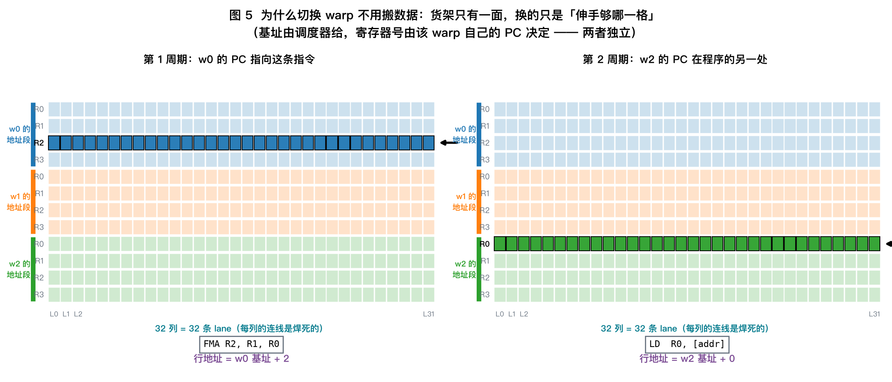

**先明确两句话，别混**：

| | 是否相同 |
|---|---|
| **同一个 warp 内的 32 条 lane** | **执行同一条指令** ✅（所以才叫 SIMT） |
| **不同的 warp 之间** | **各有各的 PC，通常在程序的不同位置** ✅ |

所以图里 w0 在执行 `FMA R2, R1, R0`，而 w2 的 PC 早已走到别处，正在执行 `LD R0, [addr]`。

**行地址由两个独立的部分相加**：

$$
\text{行地址} = \underbrace{\text{warp 基址}}_{\text{调度器给的，切换时换}} + \underbrace{\text{寄存器号}}_{\text{该 warp 自己的 PC 指向的那条指令里写死的}}
$$

换 warp 时，工头喊的是「**现在轮到第 2 排货架的人干活**」：
w2 的 32 张台子同时按**自己那条指令**去够自己那格 —— **没有任何东西被搬动**。

#### 一个容易忽略的细节：为什么每个 warp 的地址段一样宽

注意图里三个 warp 的地址段**高度完全相同**（各 4 行）。这不是画着好看：

**一次 kernel 启动，所有 warp 跑的是同一份代码**，编译器给这个 kernel
定死了"每线程用 $R$ 个寄存器"（就是 §8.2 公式里的那个 $R$）。
所以每个 warp 都拿到**同样宽度**的一段地址，只是起点不同。

```
w0 的基址 = 0 × R
w1 的基址 = 1 × R
w2 的基址 = 2 × R      ← 切换时改的就是这个乘数
```

> **这也解释了 §8.2 那个公式为什么长那样**：
> $$\text{可驻留 warp} = \frac{65536}{R \times 32}$$
> 分母就是"一个 warp 占几格货架" —— 整面墙除以每人一段，能站几个人。
> **$R$ 是编译器定的，所以占用率在你写完 kernel 的那一刻就注定了。**

**两个 warp 的数据本来就同时躺在同一块寄存器堆里的不同行**，谁也没占谁的地方，
所以根本不存在"腾地方"的问题。

#### 对比 CPU：为什么 CPU 就必须搬

| | CPU 核 | GPU SM |
|---|---|---|
| 物理寄存器总量 | x86-64 约 **1~3 KB**（16 个通用 + 32 个 SIMD） | **256 KB** |
| 能同时装下几个执行体的现场 | **1 个** | **最多 48 个 warp** |
| 换人时 | 寄存器要给下一个线程用 → **必须存到内存再取回** | 各住各的行 → **什么都不用做** |

$$
\boxed{\ \text{GPU 的寄存器堆比 CPU 大两个数量级，不是为了"算得快"，是为了"不用保存现场"}\ }
$$

**这就是那个权衡的物理来源**：GPU 花掉巨量芯片面积堆寄存器，换来零开销切换；
代价就是 warp 数量被死死卡在 48 —— 也就是 §8 那个占用率问题。

#### 什么叫 "分时复用"

既然工作台只有 32 张，而候着的 warp 有 12 个，那就**按周期轮着用**。

回到**图 4 的下半部分**那条逐周期时间线：

```
周期:        1     2     3     4     5     6     7     8
调度器挑中:  w3    w7    w0    w3    w9    w7    w1    w3
32条 lane:  ███   ███   ███   ███   ███   ███   ███   ███
            ↑ 上面颜色一直在换，下面这排硬件从头到尾就是同一套
```

**每个周期，调度器只挑 1 个"就绪"的 warp**，把它的指令广播给 32 条 lane。
下个周期就可能换成另一个 warp。

**为什么下个周期就能换人？** 因为 ALU 内部是**流水线化**的 ——
一条 FMA 指令要好几级流水才算完，但**发射**只占 1 个周期。
发射完这个 warp 的指令，下一周期立刻能发射另一个 warp 的，不用等结果出来。

> **这正是"切换零开销"的物理含义**：换 warp 不需要搬任何数据，
> 只是让**多路选择器**指向另一段寄存器地址而已 —— 一个周期的事。

（题外话：Ada 的一个分区有 32 条 lane，warp 也是 32 线程，所以一条指令发射占 1 周期。
Turing 每分区只有 16 条 lane，同一条 warp 指令得占 2 个周期 —— 这也是架构代际差异之一。）

把三个概念并排放一下：

| 东西 | 是什么 | 归谁 |
|---|---|---|
| **32 张工作台**（lane / ALU） | 干活的电路 | **公共**，每周期换一个 warp 用 |
| **货架墙的第 $i$ 列** | 焊死的连线 | **归第 $i$ 张台子**，永远不变 |
| **货架墙的某几层** | 分配出来的地址段 | **归某个 warp**，驻留期间不还 |

这个图景一下子解释了三件事：

| 现象 | 原因 |
|---|---|
| 切换 warp **零开销** | 数据没动，只是行地址的基址换了个数 |
| warp 数量**硬限 48** | 货架总共就那么多层，都是刻在芯片上的 |
| 一个 warp **不"占着"ALU** | 工作台是公共的，用完这一周期就让给下一个 |

> **一句话**：warp 确实占着真实的晶体管，但占的是"**状态**"（调度槽 + 那几层货架），
> 不是"**算力**"（工作台）。
> **这正是占用率能发挥作用的前提** —— 如果每个 warp 都独占一套 ALU，
> 那"多驻留几个 warp"就不可能了。

#### 那"把新 warp 搬上 SM"这一步，要访问内存吗？

自然会想：驻留期间切换是免费的，但**分配货架**（把新 block 放上 SM）总得花点什么吧？

**答案有点反直觉：这一步同样不碰 DRAM。**

原因是一个容易被忽略的事实：**新 block 的寄存器不需要初始化。**

```
CPU 换线程：  从内存里的 TCB 把上一个线程存的寄存器值【读回来】   ← 必须访存
GPU 上新block：寄存器里是上一个 block 留下的垃圾值，【就这么用】   ← 不用访存
               kernel 代码的头几条指令自己会去 load 需要的数据
```

所以硬件要做的只有几件纯片上的簿记：

1. 在资源位图里划走一段寄存器地址 + 一段 shared memory
2. 把空闲的 warp 调度槽的 PC 设成 kernel 入口
3. 活动掩码置为全 1（尾块除外）

**全是片上锁存器的更新，一次 DRAM 都不用走。**（shared memory 同样不清零，
所以 CUDA 里读未初始化的 shared memory 会拿到上个 block 的垃圾。）

#### 但确实有代价 —— 只是代价在别处

把四种"切换"的量级并排放，差了 **5 个数量级**：

| 动作 | 谁干的 | 代价 | 碰 DRAM 吗 |
|---|---|---|---|
| **驻留 warp 之间切换** | warp 调度器 | **0 周期** | ❌ |
| **新 block 上 SM** | SM 资源分配器 | 几十~几百周期 | ❌ 寄存器不初始化 |
| **新 block 的第一次访存** | kernel 代码自己 | ~500 周期 | ✅ **cache 是冷的** |
| **一次 kernel 启动**（host 发起） | 驱动 + GPU 前端 | **5~20 µs** | ✅ 命令缓冲 + 参数 |

```
驻留 warp 切换      │                                             0 周期
block 上 SM        │█                                        ~100 周期
冷 cache 首次访存   │█████                                    ~500 周期
kernel 启动(host)  │████████████████████████████████   ~20000 周期
```

**真正贵的是最后一行 —— 比 warp 切换贵了一万倍以上。**

> 这条会在两个地方回来找你：
> - **Day 66（CUDA Graph）**：decode 阶段每步要发几百个小 kernel，
>   光启动开销就吃掉大半时间 —— CUDA Graph 就是把这些启动预先"录制"下来。
> - **持久化 kernel（persistent kernel）**：干脆只启动一次，让 block 常驻循环取活干，
>   彻底躲开反复的 block 上下台。
>
> ⚠️ 中间两行的具体周期数英伟达没有公开，这里是数量级估计；
> 第一行和第四行是可以实测的（Day 66 你会亲手量最后一行）。

### 5.4 那 warp 和 CPU 线程到底差在哪

| | CPU 线程 | GPU warp |
|---|---|---|
| 谁创建的 | 操作系统的**软件抽象** | 硬件自动按 32 个一组切分 |
| 上下文存在哪 | 内存里的 TCB | **物理寄存器里，驻留期间独占** |
| 切换成本 | 微秒级（存/取寄存器、刷 TLB） | **零**（不用存，因为没人抢它的寄存器） |
| 数量上限 | 几乎无限（内存够就行） | **硬性 48 个 / SM** |
| 你能直接控制吗 | 能（`pthread_create`） | 不能，由 block 大小间接决定 |

> **一句话拉通：**
> CPU 线程是“**多开便宜、切换昂贵**”（上下文放内存，要个几 KB；切换要存现场）；
> GPU warp 是“**多开昂贵、切换免费**”（上下文占物理寄存器，硬限 48 个；切换不用存）。
>
> **这一条就推出了 GPU 的整个设计哲学**：既然切换免费，就用“献神”藏延迟（§8）；
> 既然多开昂贵，寄存器就成了硬硬的瓶颈。

---

## 6. 缺口之一：Tile 量化（形状对不齐）

### 6.0 先搞清楚：什么是 Tile

**Tile = 输出矩阵上的一个小方块。**

GPU 算 $C = A \times B$ 时，**不可能**把整个矩阵一次读进片上 —— 一个 $4096^2$ 的 fp16 矩阵有 32 MB，
而一个 SM 的 Shared Memory 只有 **128 KB**（Day 03 §4 的表）。差了 250 倍。

所以硬件的做法是**分块**：

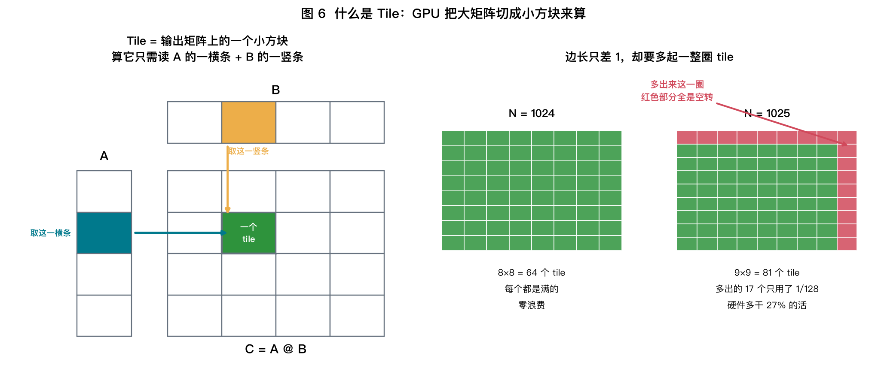

1. 把输出矩阵 $C$ 切成固定大小的方块，比如 $128 \times 128$
2. **一个方块（tile）交给一个 thread block 负责**（就是 §5.0 那条映射链）
3. 算这个 tile 只需要读 $A$ 的**一横条** 和 $B$ 的**一竖条**
4. 这两条塞进 Shared Memory，**块内的 128×128 个输出反复复用它们**

### 6.1 为什么非要分块：这就是 Day 02 的②号方向

不分块的朴素写法，每个输出元素 $C[i][j]$ 要读 $A$ 的一整行和 $B$ 的一整列（$2N$ 个数），做 $2N$ 次运算：

$$
\text{AI}_{\text{朴素}} = \frac{2N}{2N \times 2\ \text{Byte}} = \mathbf{0.5}\ \text{FLOP/Byte}
$$

**0.5 远低于任何机器的平衡点 —— 矩阵乘会变成带宽受限的！**

分块之后，一个 $T \times T$ 的 tile：

$$
\text{FLOPs} = 2T^2N, \qquad \text{Bytes} = \underbrace{(TN + NT)}_{A\text{ 横条} + B\text{ 竖条}} \times 2 = 4TN
$$

$$
\boxed{\ \text{AI}_{\text{分块}} = \frac{2T^2N}{4TN} = \frac{T}{2}\ }
$$

代进去看：

| Tile 大小 $T$ | 算术强度 | 在 M4 上（平衡点 41） | 在 4050 上（平衡点 125） |
|---|---:|---|---|
| 不分块 | 0.5 | 带宽受限 ❌ | 带宽受限 ❌ |
| 16 | 8 | 带宽受限 ❌ | 带宽受限 ❌ |
| 64 | 32 | 勉强 | 带宽受限 ❌ |
| **128** | **64** | **算力受限 ✅** | 接近 |
| 256 | 128 | 算力受限 ✅ | **算力受限 ✅** |

> **这就是 128 这个数字的来历**：它不是随便挑的，是**刚好能把矩阵乘推过平衡点的最小块**。
> Tile 太小 → 撞带宽墙；太大 → Shared Memory 装不下、占用率崩掉（Day 03 §8 的 Q2）。
>
> **分块（tiling）就是 Day 02 说的②号方向"提高算术强度"在硬件上的具体实现。**
> 你后面会一次次遇到同一个思想：FlashAttention 是对 attention 分块，
> PagedAttention 是对 KV Cache 分块，本质都是"让搬进片上的数据被多用几次"。

### 6.2 于是就有了 Tile 量化

既然按固定大小切块，**边长不是块大小的整数倍时，最后一圈块就是残缺的**：

```bash
uv run python labs/day03/gpu_anatomy.py --exp B
```

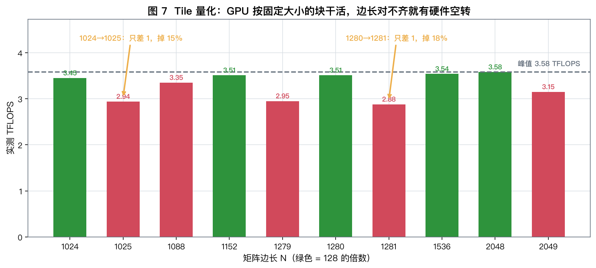

M4 实测，矩阵边长只差 1：

| N | 实测 TFLOPS | N | 实测 TFLOPS | 掉了多少 |
|---|---|---|---|---|
| 1024 | 3.45 | **1025** | **2.94** | **−15%** |
| 1280 | 3.51 | **1281** | **2.88** | **−18%** |
| 2048 | 3.58 | **2049** | **3.15** | **−12%** |

**原因**：回到 §6.0 那张图（图 6）的右半边：

```
N = 1024 → 切成 8×8 = 64 个完整的 128×128 块        ✅ 每块都满
N = 1025 → 切成 9×9 = 81 个块，其中 17 个只用了 1/128  ❌ 大量硬件空转
```

多出来的那 1 行 1 列，逼着硬件多起一整圈块，而这些块 **127/128 的算力在空转**。
硬件实际干了 $81/64 = 1.27$ 倍的活，而你只多要了 0.2% 的结果。

> **这就是为什么所有模型的 `hidden_size` 都是 128 的倍数**：
> Llama-2-7B 是 4096，Qwen3-32B 是 5120，DeepSeek-V3 是 7168。
> 不是审美，是**硬件约束**。
>
> 同理，Day 08 你会看到词表大小也常被 padding 到 128 的倍数（32000 → 32128）。

---

## 7. 缺口之二：访存不合并（cache line 浪费）

### 7.0 先说清楚：实验到底在测什么

实验代码只有一行关键逻辑：

```python
x = torch.randn(2_000_000, stride)   # 一个很高、很窄的矩阵
x[:, 0].sum()                        # 只读第 0 列
```

**为什么"读一列"是关键**：张量在内存里是**按行连续存放**的（row-major）。
所以同一列的元素，在内存里**不是挨着的** —— 它们被整整一行的数据隔开：

```
stride = 4 时，内存实际长这样（fp16，每个数 2 字节）：

地址:   0    2    4    6    8   10   12   14   16   18 ...
内容: [x00][x01][x02][x03][x10][x11][x12][x13][x20][x21] ...
       ↑                   ↑                   ↑
     要用            要用              要用
       └──── 隔了 8 字节 ────┘
```

$$
\boxed{\ \text{相邻有用元素间隔} = \text{stride} \times \text{每个元素几字节}\ }
$$

**这个实验的巧妙之处**：不管 stride 是多少，**我们真正要用的数据永远是 4 MB**
（200 万个 fp16）。变的只是"这 4 MB 在内存里摊得多开"。

### 7.1 硬件的最小搬运单位是一整条 cache line

关键事实：**你哪怕只要 1 个字节，DRAM 也会给你搬一整条 cache line（通常 64 或 128 字节）。**
所以"摊得越开"就意味着"搬回来的东西里废料越多"：

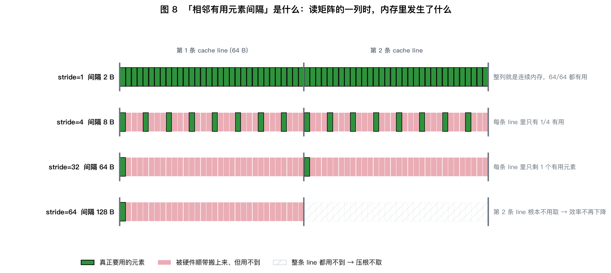

看最后一行的关键变化：当间隔达到 **128 B**（超过一条 line）时，
**第 2 条 line 里一个有用元素都没有，硬件就干脆不取它了**。
于是"废料比例"不再恶化 —— 曲线就在这里变平。

### 7.2 实测：曲线在哪变平，哪里就是 cache line

```bash
uv run python labs/day03/gpu_anatomy.py --exp C
```

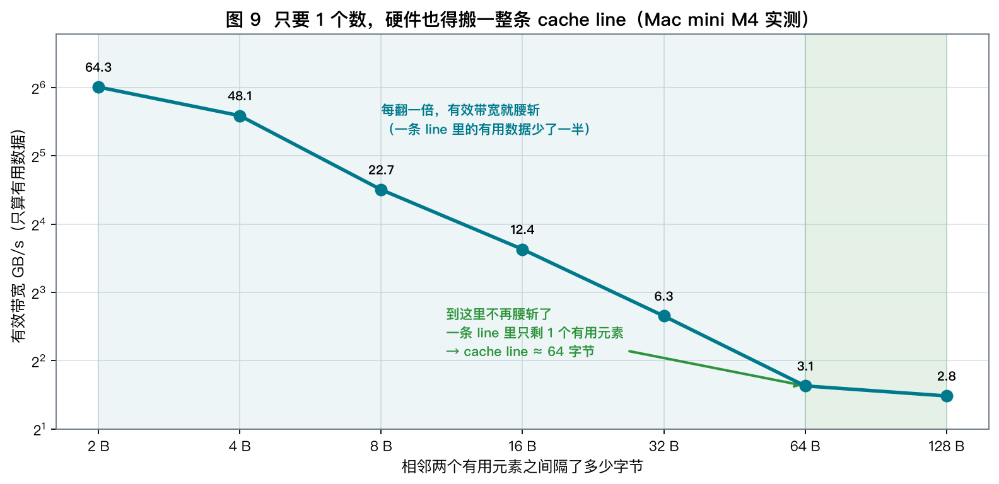

实验做的事：读一个 `(2M, stride)` 矩阵的**第 0 列**，用到的数据永远是 4 MB，
只改变"相邻两个有用元素隔多远"。

| 相邻有用元素间隔 | 2 B | 4 B | 8 B | 16 B | 32 B | **64 B** | 128 B |
|---|---|---|---|---|---|---|---|
| 有效带宽 (GB/s) | 64.3 | 48.1 | 22.7 | 12.4 | 6.3 | **3.1** | **2.8** |
| 相对第一列 | 100% | 75% | 35% | 19% | 10% | 5% | 4% |

**注意"有效带宽"的定义**：分子只算**真正要用的那 4 MB**，不算搬回来的废料。
所以它衡量的是"你实际拿到手的有用数据速率"。

**读法一：每翻一倍就腰斩。** 间隔翻倍 → 一条 line 里的有用元素减半 → 废料比例翻倍。

**读法二（关键）：间隔从 64 B 翻到 128 B 时，只掉了 10%，前面每次都掉一半。**

$$
\text{曲线在这里变平} \Rightarrow \text{cache line} \approx \mathbf{64\ 字节}
$$

因为一旦间隔 ≥ line 大小，**每条 line 里就只剩 1 个有用元素了，不可能更糟**；
再往上加间隔，只是让硬件跳过整条 line 不取而已（图 8 最后一行）。

> **这是 PagedAttention（Day 31）为什么要精心设计 block 布局的原因**：
> KV Cache 如果排得不好，读一个 token 的 K 就得搬十几条无用的 line。
>
> 也解释了一件你早晚会遇到的事：**同样的数学，`[batch, head, seq, dim]` 和
> `[batch, seq, head, dim]` 两种布局的性能能差好几倍** —— 差别全在这张图上。

---

## 8. 缺口之三：占用率不足（warp 不够多）

### 8.0 澄清一个常见误解："驻留"到底什么意思

很容易这样想：*寄存器被用光了，剩下的 warp 只能闲在那儿没电。*

**方向对了一半，但关键一点反了：那些 warp 根本还没被放上 SM。**

假设你启动一个 kernel，总共 100 万个线程 = 31250 个 warp。它们是这样分批上台的：

```
      31250 个 warp（你启动的全部）
              │
              ▼
      ┌───────────────┐
      │  尚未派发      │  ← 绝大多数 warp 在这里：它们【什么实体都没有】
      │ (只是一个计数器) │     不占显存、不占寄存器（马上细说）
      └───────┬───────┘
              │  某个 block 跑完，腾出寄存器和 shared memory
              ▼
      ┌───────────────┐
      │  驻留在 SM 上   │  ← 只有这些 warp 占着寄存器
      │  (16 / 48 个)  │     它们随时可以被发射
      └───────┬───────┘
              │  每周期，4 个 warp 调度器各挑 1 个"就绪"的 warp
              ▼
      ┌───────────────┐
      │  本周期正在执行 │  ← 只有 4 个
      └───────────────┘
```

所以有**三个不同的数**，别混淆：

| 概念 | 数量级 | 含义 |
|---|---|---|
| 启动的 warp 总数 | 几万 | 你的 kernel 一共要干多少活 |
| **驻留 warp 数** | **≤ 48** | **当前占着这个 SM 的寄存器、随时可发射的** |
| 每周期发射数 | 4 | Ada 每 SM 有 4 个 warp 调度器 |

**"驻留"的本质是：这个 warp 独占了一份寄存器，所以切换到它时不需要保存/恢复现场。**
这就是 GPU 上下文切换零开销的原因 —— 也正是寄存器会成为瓶颈的原因。

#### 那"尚未派发"的那几万个 warp，到底存在哪？

很自然会猜：*是不是躺在显存里，SM 从显存把它们捞上来跑？*

**答案有点意外：哪儿都不存在。既不在显存，也不在片上。**

GPU 里**没有**一张"待运行 warp 表"。整个 grid 尚未派发的部分，在硬件上就是**一个计数器**：

```
GigaThread Engine（全卡一个，又名 Compute Work Distributor）
├─ gridDim   = 31250     ← 一共要派发多少个 block（launch 时写死的常数）
├─ next_blk  = 137       ← 下一个要派发的编号
└─ 每当某个 SM 报告"我腾出资源了"：
       把 next_blk 的当前值交给它，然后 next_blk++
```

**"第 20000 个 block"在被派发之前，不是一份数据，而是一个还没数到的数。** 就像这个循环：

```c
for (int i = 0; i < 31250; i++) { ... }
```

`i = 20000` 那次迭代"存在哪里"？**它不存在**，它只是被循环边界蕴含着。
GPU 的 block 派发就是这个循环的硬件版本。

**派发一个 block，硬件做的全部事情是：**

| 步骤 | 数据从哪来 |
|---|---|
| 划走一段寄存器 + shared memory | 片上资源位图 |
| 把 `blockIdx` 写进 SM 的 block 槽 | **就是那个计数器的当前值** |
| 把几个 warp 槽的 PC 设成 kernel 入口 | launch 命令里的入口地址 |
| 活动掩码置全 1 | 常数 |

**没有任何一步是"从显存里读出这个 block 的状态"** —— 因为它压根没有状态。
（正好接上 §5.3 那句"新 block 的寄存器不需要初始化"：没有现场可恢复。）

#### 和 CPU 一对照，差别就很刺眼

| | CPU 的就绪线程 | GPU 的未派发 block |
|---|---|---|
| 在内存里占地方吗 | **占**：每线程一个 `task_struct` + 内核栈，约 **8~16 KB** | **不占**：全卡就一个计数器 |
| 谁维护 | 操作系统的软件队列（链表/红黑树） | 硬件里的一个寄存器 |
| 开 100 万个的代价 | **十几 GB 内存**，根本开不起 | **0**，把 `gridDim` 改个数而已 |
| 能中途换出吗 | 能，把寄存器存回内存 | **不能**，没有可存的东西（§5.0 规则 ②） |

$$
\boxed{\ \text{GPU 敢让你"启动百万线程"，恰恰是因为它们在被派发前【什么都不是】}\ }
$$

**这一条一口气解释了四件事**：

| 现象 | 原因 |
|---|---|
| 启动 100 万线程和 1000 线程，**启动开销一样** | 没有 per-thread 的分配动作 |
| **block 执行顺序不保证**（§5.0 规则 ③） | 计数器是"谁先空谁先拿"，跟编号顺序无关 |
| block **不能被抢占、不能迁移** | 没有可保存的现场 |
| `blockIdx` 是**广播出来的**，不是每线程存一份 | 它就是派发时写进 block 槽的那个数 |

> ⚠️ **两个例外，别搞混**：
> - **kernel 代码和 kernel 参数**确实在显存里（走指令 cache / constant bank），
>   但那是**全 grid 共用一份**，不是每个 warp 一份。
> - **寄存器溢出（local memory）**确实会占显存，但那是**已驻留** warp 的事 ——
>   寄存器不够用时编译器把变量甩到显存，代价极大（Day 24 会撞上）。

### 8.1 那为什么驻留少了会慢？

不是因为"有硬件没通电"，而是因为**没有足够的备胎顶上**。

回忆 Day 02 的 Little's Law：内存延迟约 200~600 周期。
一个 warp 发出读请求后就卡住了，SM 这时要找**另一个已就绪的 warp** 来发射。

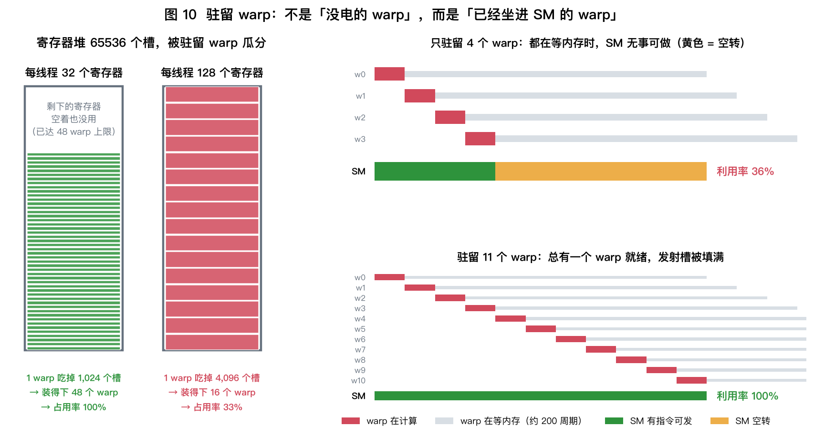

**左半边**：寄存器堆一共 65536 个槽，一个 warp 吃掉 $R \times 32$ 个。
$R=32$ 时能装 48 个（撞上限），$R=128$ 时只能装 16 个。

**右半边（关键）**：假设一个 warp 算 20 周期、然后等内存 200 周期。

- **只驻留 4 个 warp**：4 个轮流算完 $4 \times 20 = 80$ 周期后，全都在等内存 →
  **SM 有 64% 的时间无事可发，利用率只有 36%**
- **驻留 11 个 warp**：$11 \times 20 = 220$ 周期刚好盖住整个周期 →
  **总有一个 warp 就绪，发射槽被填满，利用率 100%**

$$
\boxed{\ \text{要藏住延迟，需要的驻留 warp 数} \approx \frac{\text{内存延迟}}{\text{每个 warp 的计算时长}}\ }
$$

> **所以占用率的作用不是"多用点硬件"，而是"多备几个待发的 warp"。**
> 这也解释了为什么 §8 末尾说"占用率 50% 往往就够了"——
> 只要备胎数量超过了上面这个比值，再多也没用。

### 8.2 三个资源，谁先耗尽谁说了算

$$
\text{占用率 (Occupancy)} = \frac{\text{SM 上实际驻留的 warp 数}}{\text{SM 最多能驻留的 warp 数}}
$$

**Ada 架构（RTX 4050）每个 SM 的硬上限**：
| 资源 | 上限 |
|---|---|
| 最大线程数 | 1536（= **48 个 warp**） |
| 寄存器堆 | 65536 个 32-bit |
| Shared Memory | 最多 100 KB（与 L1 共用 128 KB） |
| 最大 block 数 | 24 |

**算法是"先算能放几个 block，再乘回 warp"** —— 因为 block 不能拆（§5.0 规则①）：

| 步 | 算什么 | 公式 |
|---|---|---|
| 0 | 每 block 几个 warp | $w = T / 32$ |
| 1 | **寄存器**允许几个 block | $\left\lfloor \left\lfloor \dfrac{65536}{R \times 32} \right\rfloor \Big/ w \right\rfloor$ |
| 2 | **共享内存**允许几个 block | $\left\lfloor \dfrac{100\ \text{KB}}{S} \right\rfloor$ |
| 3 | **线程上限**允许几个 block | $\left\lfloor \dfrac{1536}{T} \right\rfloor$ |

$$
\text{可驻留 warp} = \min(\text{步1},\ \text{步2},\ \text{步3},\ \underbrace{24}_{block\ 硬上限}) \times w,
\qquad
\text{占用率} = \frac{\text{可驻留 warp}}{48}
$$

其中 $R$ = 每线程用几个寄存器（**编译器定的**，`nvcc -Xptxas -v` 能打印出来），
$S$ = 每 block 声明了多少 shared memory，$T$ = block 大小。
**§11 的 Q2 会把这四步完整算一遍。**

**寄存器是最常见的瓶颈**：

| 每线程寄存器数 | 可驻留 warp | 占用率 |
|---|---|---|
| 32 | 64 → 封顶 48 | **100%** |
| 40 | 51 → 封顶 48 | **100%** |
| 64 | 32 | **67%** |
| 128 | 16 | **33%** |
| 255（上限） | 8 | **17%** |

> **这解释了一个反直觉现象**：把 kernel 写得"更聪明"（用更多寄存器缓存中间结果），
> 反而可能让性能下降 —— 因为占用率掉了，延迟藏不住了。
> **Day 24 手写矩阵乘时，你会亲身撞上这个权衡。**

**但占用率不是越高越好**：占用率 50% 往往就足以藏住延迟。
真正的判据是"带宽有没有跑满"，不是"占用率有没有到 100%"。

---

## 9. Tensor Core：唯一能抬高屋顶的东西

Day 02 说优化有三个方向，其中**③抬高屋顶**几乎全靠它。

**普通 ALU vs Tensor Core**：

| | 普通 FP32 ALU | Tensor Core |
|---|---|---|
| 一条指令做什么 | 1 次 FMA（2 个标量） | **一整个小矩阵块**（如 $16\times8\times16$ 的 MMA） |
| 一条指令的运算量 | 2 FLOP | **4096 FLOP** |
| 吃什么形状 | 任意 | **只吃矩阵乘** |
| 精度 | FP32 | FP16/BF16/FP8/INT8 输入，FP32 累加 |

我在 M4 上跑实验 D 的结果：

| 精度 | 实测 TFLOPS | 相对 FP32 |
|---|---|---|
| FP32 | 3.19 | 1.00× |
| FP16 | 3.58 | **1.12×** |
| BF16 | 3.61 | **1.13×** |

**只有 1.12 倍。** 说明 M4 的 GPU 在这条路径上**没有独立的矩阵加速单元**，
FP16 的收益基本只来自"少搬一半数据"。

> 🔬 **今天最重要的对比实验**：在 RTX 4050 上跑同一段代码。
> Ada 的 Tensor Core 会让 FP16 达到 FP32 的 **2 倍以上**。
> **这个差值就是 Tensor Core 的贡献，你能亲手把它量出来。**

**但请记住 Tensor Core 的致命限制：它只吃矩阵乘。**

```
GEMM / Attention 的 QK^T 和 PV   →  Tensor Core 全速  ✅
LayerNorm / RMSNorm / GELU / RoPE →  完全用不上，走普通 ALU  ❌
逐元素加法 / KV Cache 拼接        →  完全用不上  ❌
```

这就是为什么"算力涨了 1000 倍，推理还是慢"——
**涨的那 1000 倍只发生在矩阵乘上，而 decode 阶段的瓶颈根本不在矩阵乘的算力上。**

---

## 10. 你两台机器的架构参数表

| | Mac mini M4 | RTX 4050 Laptop (AD107) |
|---|---|---|
| 核数 | 10 GPU cores | 20 SM |
| 每核 ALU (FP32) | 128 | 128 |
| ALU 总数 | 1,280 | 2,560 |
| 频率 | ~1.40 GHz | ~2.37 GHz（受 TGP 影响大） |
| **理论 FP32 算力** | **3.58 TFLOPS** | **12.13 TFLOPS** |
| 矩阵加速单元 | 无独立单元（实测 1.12×） | **80 个 4th-gen Tensor Core** |
| **理论 FP16 算力** | ~3.6 TFLOPS | **~24 TFLOPS** |
| warp / SIMD-group | 32 | 32 |
| 显存位宽 | 128 bit | 96 bit |
| 内存类型 | LPDDR5X-7500（统一内存） | GDDR6 @ 16 Gbps |
| **理论带宽** | **120 GB/s** | **192 GB/s** |
| 容量 | 16 GB（GPU 可用 ~11） | **6 GB** |
| **平衡点** | **~30**（无 TC） | **~125**（用 TC） |

> **一句话总结两台机器的性格**：
> M4 = 算力弱、带宽中、**容量大**、平衡点低（容易喂饱）
> 4050 = 算力强（靠 TC）、带宽高、**容量极小**、平衡点高（很难喂饱）

---

## 11. 手算练习（15 分钟）

**Q1**. RTX 4050 的理论 FP32 算力是多少？如果 Surface 在"平衡"电源模式下降频到 1.6 GHz 呢？

<details>
<summary>点开答案</summary>

$$
20 \text{ SM} \times 128 \times 2 \times 2.37\ \text{GHz} = \mathbf{12.13\ \text{TFLOPS}}
$$

降频到 1.6 GHz：

$$
20 \times 128 \times 2 \times 1.6 = \mathbf{8.19\ \text{TFLOPS}}\quad(\text{掉 32\%})
$$

**这就是 SETUP.md 里反复强调"插电 + 最佳性能"的原因。**
笔记本 GPU 的频率随 TGP 大幅波动，不控制这个变量，你测出来的数据没有可比性。
</details>

**Q2**（占用率）. 一个 kernel 每线程用 **72 个寄存器**，block 大小 256 线程，
每 block 用 **48 KB** shared memory。在 Ada SM 上占用率是多少？瓶颈是哪个资源？

<details>
<summary>点开答案</summary>

**先把两组数分开：一组是题目给的，一组是硬件固定的。**

| 来源 | 符号 | 值 | 哪来的 |
|---|---|---|---|
| 你的 kernel | $R$ 每线程寄存器数 | 72 | 编译器定的，`nvcc -Xptxas -v` 能打印 |
| 你的 kernel | $T$ block 大小 | 256 线程 | 你在 `<<<..., 256>>>` 里写的 |
| 你的 kernel | $S$ 每 block 共享内存 | 48 KB | 你在 kernel 里 `__shared__` 声明的 |
| **Ada 硬件** | 寄存器堆总量 | **65536** | §8.2 的表 |
| **Ada 硬件** | 共享内存总量 | **100 KB** | §8.2 的表 |
| **Ada 硬件** | 最大线程数 | **1536**（= 48 warp） | §8.2 的表 |
| **Ada 硬件** | 最大 block 数 | **24** | §8.2 的表 |

**关键前提（§5.0 规则①）：block 是整块上 SM 的，不能拆。**
所以全程先算"能放几个 **block**"，最后再乘回 warp。

---

**第 0 步：一个 block 是几个 warp？**

$$
w = \frac{T}{32} = \frac{256}{32} = \mathbf{8}\ \text{个 warp}
$$

**第 1 步：寄存器够放几个 block？**

寄存器是**按 warp 整体分配**的（§5.3 的二维货架：一个 warp 占连续的几行 × 32 列）：

$$
\underbrace{72}_{每线程} \times \underbrace{32}_{一个\,warp\,的线程数} = \mathbf{2304}\ \text{个寄存器 / warp}
$$

整个寄存器堆能装几个 warp：

$$
\left\lfloor \frac{65536}{2304} \right\rfloor = \lfloor 28.4 \rfloor = \mathbf{28}\ \text{个 warp}
$$

但 warp 不能零着放，得按 block 凑整：

$$
\left\lfloor \frac{28}{8} \right\rfloor = \mathbf{3}\ \text{个 block}
$$

> 验算：3 个 block 要 $3 \times 8 \times 2304 = 55296 \le 65536$ ✅；
> 放第 4 个就要 $73728 > 65536$ ❌。
> （那剩下的 10240 个寄存器呢？**浪费掉了** —— 不够再放一整个 block。）

**第 2 步：共享内存够放几个 block？**

$$
\left\lfloor \frac{100\ \text{KB}}{48\ \text{KB}} \right\rfloor = \mathbf{2}\ \text{个 block}
$$

> 验算：2 个用掉 96 KB，只剩 4 KB，塞不下第 3 个。

**第 3 步：线程数上限允许几个 block？**

$$
\left\lfloor \frac{1536}{256} \right\rfloor = \mathbf{6}\ \text{个 block}
$$

**第 4 步：谁小听谁的**

$$
\text{可驻留 block} = \min(\underbrace{3}_{寄存器},\ \underbrace{2}_{共享内存},\ \underbrace{6}_{线程数},\ \underbrace{24}_{block\,上限}) = \mathbf{2}
$$

$$
\text{驻留 warp} = 2 \times 8 = \mathbf{16}
\quad\Rightarrow\quad
\text{占用率} = \frac{16}{48} = \mathbf{33\%}
$$

---

**瓶颈是 Shared Memory** —— 它只允许 2 个 block，比寄存器允许的 3 个还少。

**怎么修**：把 48 KB 降到 32 KB（比如 tile 从 128×128 改成 128×96）：

$$
\left\lfloor \frac{100}{32} \right\rfloor = 3 \Rightarrow \min(3,\ 3,\ 6,\ 24) = 3\ \text{block} = 24\ \text{warp} \Rightarrow \mathbf{50\%}
$$

> 注意此时**寄存器和共享内存同时成为瓶颈**（都只允许 3 个）——
> 再往下压共享内存已经没用了，得同时降寄存器才行。
>
> 这正是 FlashAttention（Day 29）调 tile 大小时要反复权衡的东西：
> tile 开大 → shared memory 用得多 → 占用率降 → 延迟藏不住。

</details>

**Q3**（连接 Day 02）. Llama-2-7B 的 `hidden_size = 4096`，`d_ffn = 11008`。
11008 是 128 的倍数吗？如果不是，会有 Tile 量化损失吗？

<details>
<summary>点开答案</summary>

$$
11008 = 128 \times 86 \quad \Rightarrow \quad \textbf{是 128 的整数倍} ✅
$$

（顺带一提：$11008 = 4096 \times \frac{8}{3}$ 向上取整到 128 的倍数 —— SwiGLU 要求 FFN 隐层约为 $\frac{8}{3}d$，
但设计者**特意把它凑到了 128 的倍数**。Day 13 会讲这个取整。）

**所有主流模型的每一个维度，都是被这样"对齐"过的。** 这不是巧合。

</details>

**Q4**（显存设计）. 英伟达能不能出一块「6 GB 显存、带宽 1 TB/s」的卡？为什么？

<details>
<summary>点开答案</summary>

用 GDDR6 (16 Gbps) 做到 1 TB/s 需要的位宽：

$$
\frac{1000\ \text{GB/s} \times 8}{16\ \text{Gbps}} = \mathbf{500\ bit} \Rightarrow 向上取到 512\ \text{bit}
$$

512 bit 需要 $512 \div 32 = \mathbf{16}$ 颗 GDDR6 芯片。
而每颗至少 2 GB，所以容量至少是：

$$
16 \times 2 = \mathbf{32\ GB} \quad \gg \quad 6\ \text{GB}
$$

**结论：做不到。** 想要 1 TB/s 就必须挂 16 颗芯片，而 16 颗芯片天然就是 32 GB。
除非专门定制 1 GB 容量的芯片（没人会为这个开模）。

> 这道题的现实意义：你在选卡时，**容量和带宽不能分开挑**。
> 想要高带宽，就必须为用不上的容量付钱；
> 反过来，你那块 6 GB 的卡带宽低，**是物理决定的，不是厂商小气**。

</details>

---

## 12. 动手实验（35 分钟）

```bash
uv run python labs/day03/gpu_anatomy.py           # 四个实验全跑
uv run python labs/day03/gpu_anatomy.py --exp D   # 只看 Tensor Core
```

**必做的三件事**：

1. **对账**：架构参数算出的理论峰值 vs 你的实测，达成率多少？
2. **在 RTX 4050 上跑实验 D**，记录 FP16 相对 FP32 的倍数。
   把它和 M4 的 1.12× 对比 —— **差值就是 Tensor Core**。
3. **在 RTX 4050 上跑实验 C**，找出它的 cache line 大小。
   （提示：NVIDIA 的 L1 line 是 128 B，但访存事务粒度是 32 B，你测出来会是哪个？）

**注意**：跑 4050 之前一定要**插电 + 选"最佳性能"电源模式**，否则频率对不上，
架构核算会看起来"不准"（其实是你的频率参数填错了）。

---

## 13. 思考题

**T1（对账）**
你在 4050 上实测的 FP32 算力，除以理论值 12.13 TFLOPS，是多少？
如果明显低于 85%，用 `nvidia-smi -q -d CLOCK` 查一下实际运行频率，重新算一遍理论值。
**能对上吗？对不上还差在哪？**

**T2（推理）**
实验 B 里，M4 上 N=1088（是 64 的倍数但不是 128 的倍数）达到了 93%，
介于对齐（98%）和完全不对齐（82%）之间。
**这说明 M4 上矩阵乘的 tile 大小可能是多少？** 设计一个实验验证你的猜测。
（提示：用 §6.1 的公式 $\text{AI} = T/2$ 反推 —— M4 平衡点是 41，那 $T$ 至少要多大？）

**T3（开放）**
Day 01 说 decode 的算术强度 ≈ 1，撞带宽墙。今天又知道 Tensor Core 只吃矩阵乘。
**那么：给 decode 阶段配一块 Tensor Core 算力翻 10 倍的卡，有用吗？**
如果没用，厂商为什么还在拼命堆 Tensor Core？（提示：想想训练、prefill、以及投机解码）

---

## 14. 一图总结

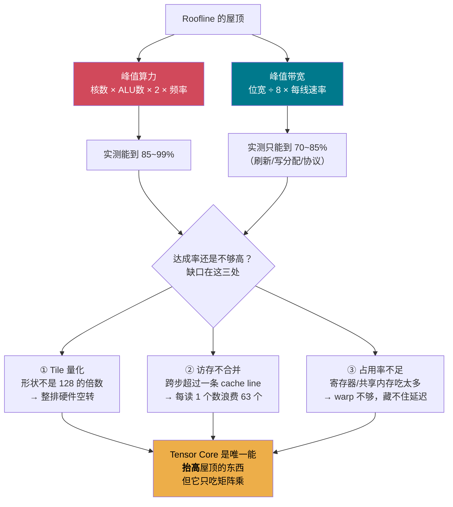

**今日一句话**：
> 峰值算力是**乘出来的**，不是玄学；达成率的缺口也是**能拆开数清楚的**，不是玄学。
> 而 Tensor Core 那 10 倍算力，只对矩阵乘有效 ——
> **这正是 decode 阶段永远快不起来的架构根源。**

---

## 15. 延伸阅读

| 类型 | 材料 | 建议 |
|---|---|---|
| 📄 权威 | NVIDIA *Ada Lovelace Architecture Whitepaper* | 只看 SM 结构那几页 |
| 📄 必备 | CUDA C Programming Guide, *Compute Capabilities* 表 | 查每代 SM 的硬上限，收藏 |
| 📄 好文 | NVIDIA *Matrix Multiplication Background User's Guide* | Tile 量化讲得最清楚 |
| 🍎 Apple | *Metal Shading Language Spec* + WWDC "Discover Metal 3" | SIMD-group / threadgroup 概念 |
| 🔧 工具 | CUDA Occupancy Calculator（已集成进 Nsight Compute） | Week 4 用 |
| 📊 数据 | TechPowerUp GPU Database | 查任意 GPU 的 SM 数/频率/位宽 |

---

## ✅ 今日检查清单

- [ ] 能默写峰值算力和峰值带宽的两个公式，并说出"×2"是哪来的
- [ ] 在 Mac 上跑完四个实验，理论 vs 实测对上了
- [ ] **在 RTX 4050 上跑了实验 D**，量出了 Tensor Core 的实际收益
- [ ] 完成 Q1–Q3，特别是 Q2 的占用率计算
- [ ] 能说出达成率缺口的三个来源，并各举一个例子
- [ ] 笔记写进 `day03-notes.md`

**明天（Day 04）**：存储层次金字塔 —— 寄存器 → SMEM → L2 → HBM → PCIe → SSD，
每一级差多少倍？我们把这个金字塔**逐级实测**出来，并解释今天那个"1~6 MB 时带宽冲到 185 GB/s"的现象。
