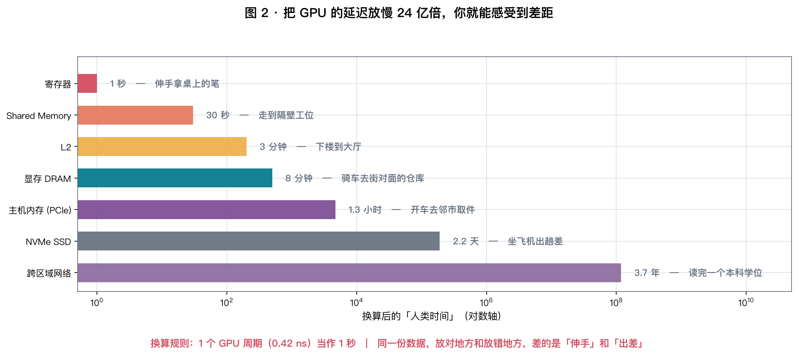
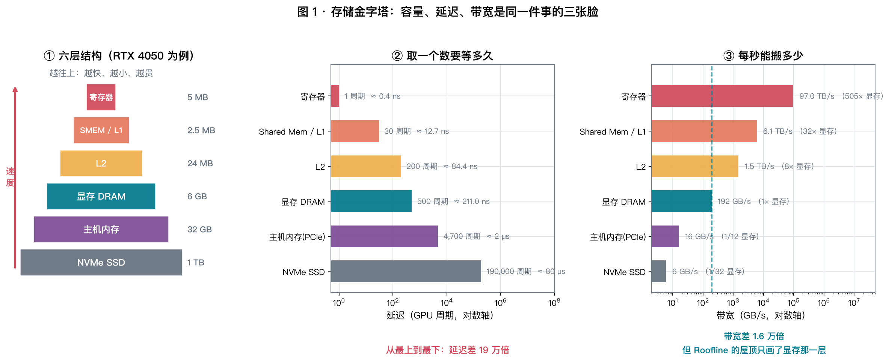
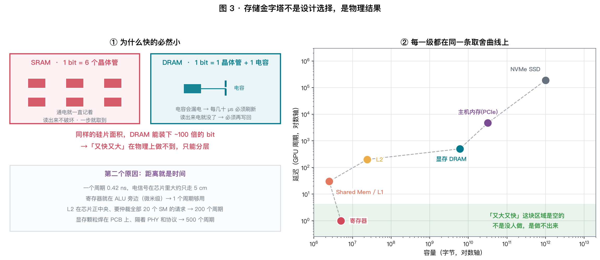
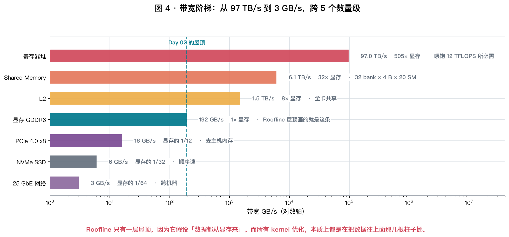
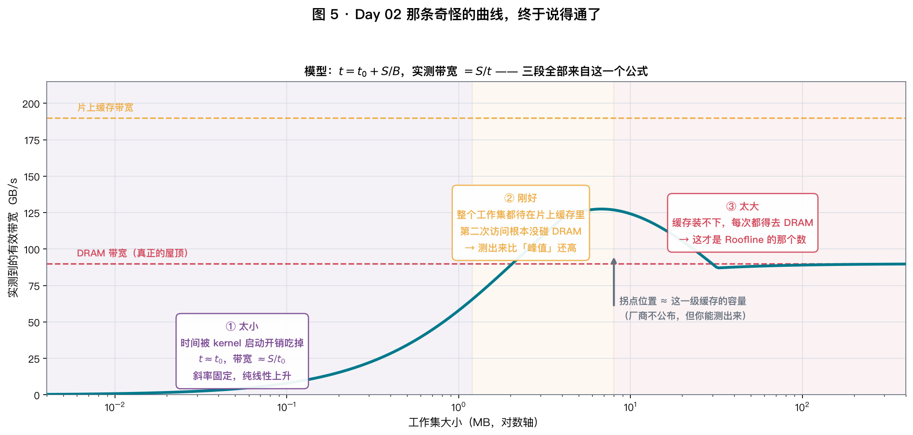
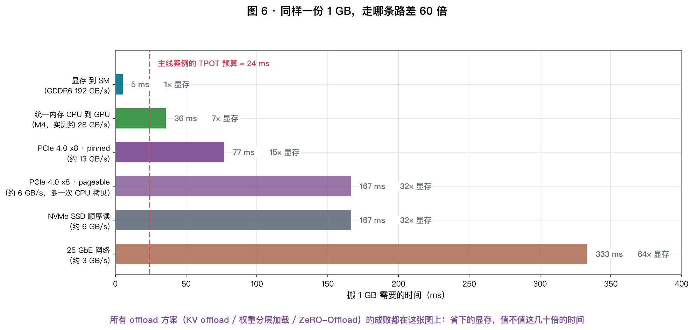
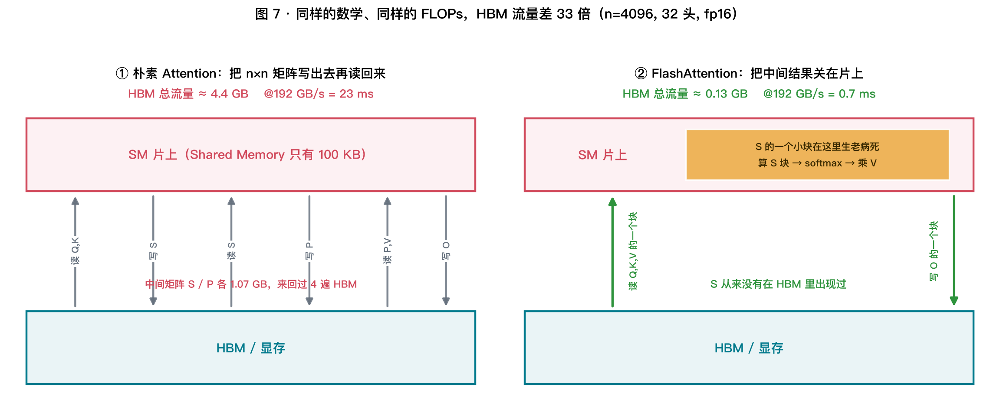
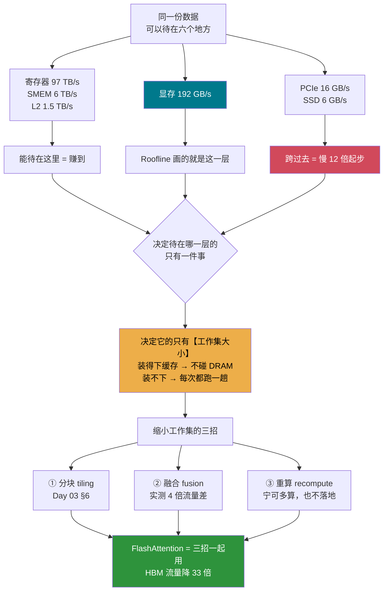

# Day 04 · 存储层次：Roofline 的屋顶其实有六层

> **今日目标**：把 Day 02 那条"1~6 MB 时带宽反而冲到 185 GB/s"的怪曲线彻底解释清楚，
> 并且亲手把 **寄存器 → SMEM → L2 → 显存 → PCIe → SSD** 这个金字塔**逐级测出来**。

⏱ 阅读 40 min · 动手 35 min · 思考 15 min

---

## 1. 今天要还 Day 02 欠的一笔账

Day 02 你测出了"峰值带宽 85 GB/s"，但扫描曲线上有一段很别扭：

| 数据量 | 实测带宽 | 当时的解释 |
|---|---|---|
| < 100 KB | 很低 | "启动开销" |
| 1~6 MB | **185 GB/s** | ？？？比"峰值"还高一倍 |
| > 25 MB | 85 GB/s | "这才是真的" |

**比峰值还高的带宽，显然说明"峰值"这个词被用错了。**

问题出在 Roofline 的一个隐含假设上：**它假设所有数据都从显存来**。
可实际上，一份数据可能待在六个不同的地方，速度差了四个数量级。

| 问题 | 今天的答案 |
|---|---|
| 那六层分别是什么，各差多少倍？ | §3 §5 |
| 为什么必须分层，不能"又大又快"？ | §4 |
| 那条怪曲线到底怎么回事？ | §6 |
| 数据要跨过 PCIe 时会发生什么？ | §7 |
| 这些和 LLM 推理有什么关系？ | §8 |

---

## 2. 先感受一下差距有多大

**把 GPU 的时间放慢 24 亿倍**（1 个周期 = 1 秒），差距立刻变得可以想象：



| 数据在哪 | 真实延迟 | 换算成人类时间 | 相当于 |
|---|---|---|---|
| 寄存器 | 1 周期 | 1 秒 | 伸手拿桌上的笔 |
| Shared Memory | 30 周期 | 30 秒 | 走到隔壁工位 |
| L2 | 200 周期 | 3 分钟 | 下楼到大厅 |
| **显存 DRAM** | **500 周期** | **8 分钟** | **骑车去街对面的仓库** |
| 主机内存（过 PCIe） | ~4700 周期 | 1.3 小时 | 开车去邻市取件 |
| NVMe SSD | ~19 万周期 | 2.2 天 | 坐飞机出趟差 |
| 跨区域网络 | ~1.2 亿周期 | **3.7 年** | 读完一个本科学位 |

> **Day 01 说"内存墙"，Day 02 说"带宽是屋顶"，其实说的都只是第 4 行。**
> 上面三行是你**可以争取**的，下面三行是你**要拼命躲开**的。
>
> 这也是整个 AI Infra 领域最核心的一句话：
> **算法优化的上限是常数倍，而把数据挪上一层，收益是数量级的。**

---

## 3. 六层金字塔的全貌



以 RTX 4050（Ada，20 SM @ 2.37 GHz）为例：

| 层级 | 容量 | 延迟 | 带宽 | 归谁 |
|---|---|---|---|---|
| 寄存器 | 256 KB/SM，全卡 **5 MB** | 1 周期 | ~97 TB/s | 每个 warp 独占一段（Day 03 §5.3） |
| Shared Mem / L1 | 128 KB/SM，全卡 **2.5 MB** | ~30 周期 | ~6.1 TB/s | 每个 block 独占一段 |
| L2 | **~24 MB** | ~200 周期 | ~1.5 TB/s | 全卡共享 |
| **显存 DRAM** | **6 GB** | **~500 周期** | **192 GB/s** | 全卡共享 |
| 主机内存 | 32 GB | ~2 µs | ~16 GB/s（PCIe 4.0 x8） | 要过 PCIe |
| NVMe SSD | 1 TB | ~80 µs | ~6 GB/s | 要过文件系统 |

**三条规律，记住就够用**：

$$
\text{每往下一层：容量} \times 100,\quad \text{延迟} \times 10,\quad \text{带宽} \div 10
$$

> ⚠️ 上表里 L2 容量、L2/SMEM 带宽这几个数**厂商并不总是公布**，
> 而且同一代芯片的不同型号差别很大。
> **今天最重要的技能，就是不查手册也能把它们测出来**（§6.2）。

### 3.1 "97 TB/s"这个数是怎么来的

寄存器带宽听起来离谱，但它其实是**被算力反推出来的**：

RTX 4050 峰值 12.13 TFLOPS，也就是每秒 $6.07 \times 10^{12}$ 次 FMA。
每次 FMA（$d = a\times b + c$）要读 3 个操作数、写 1 个结果，每个 4 字节：

$$
6.07\times10^{12} \times 16\ \text{Byte} = \mathbf{97\ TB/s}
$$

$$
\boxed{\ \text{寄存器带宽不是"设计得很高"，而是"不这么高，ALU 就会饿死"}\ }
$$

**这条推理反过来也成立**：任何一级存储，只要它的带宽跟不上 ALU 的胃口，
计算就会停在那儿等 —— 这就是整个金字塔存在的理由。

---

## 4. 为什么必然是金字塔

自然会想问：*既然快的那么好，为什么不全用寄存器？*

**因为物理不允许。有两个独立的原因。**



### 4.1 原因一：存 1 个 bit 要几个晶体管

| | SRAM（寄存器 / SMEM / L1 / L2） | DRAM（显存 / 内存） |
|---|---|---|
| 一个 bit 用什么存 | **6 个晶体管**（互锁的双反相器） | **1 个晶体管 + 1 个电容** |
| 要刷新吗 | 不用，通电就一直记着 | **要**，电容漏电，每几十 µs 刷一遍 |
| 读出来会怎样 | 不破坏，直接读 | **破坏性读出**，电放掉了必须再写回 |
| 同样面积能存多少 | 1× | **~100×** |

**这就是 §3 那张表里"容量差 100 倍"的物理来源。**
DRAM 那次"必须再写回"，也正是 Day 03 §3 说的"带宽只能达到标称 70~85%"的原因之一。

### 4.2 原因二：距离就是时间

一个周期 0.42 ns。光在真空里 0.42 ns 走 12.6 cm，芯片里的电信号大约只有一半，
所以 **一个周期内信号最多跑 5 cm 左右**。

```
寄存器   就在 ALU 旁边，几十微米      →  1 个周期够用
SMEM     在同一个 SM 里，~1 mm        →  30 个周期
L2       在芯片正中央，还要仲裁 20 个 SM 的请求  →  200 个周期
显存     焊在 PCB 上，隔着 PHY 和 DRAM 协议     →  500 个周期
主机内存 隔着 PCIe 链路、根复合体、DMA 引擎      →  ~4700 个周期
```

**注意 L2 那一行**：它离得并不远（几毫米），慢的主要不是距离，
而是**它是全卡共享的**——20 个 SM 同时来敲门，交叉开关要排队仲裁。
**共享 = 要仲裁 = 慢**，这条规律在后面讲 NVLink、讲分布式训练时还会反复出现。

### 4.3 一个推论：缓存不是"优化"，是唯一的出路

既然"又大又快"物理上做不到，那唯一的活路就是：

$$
\boxed{\ \text{用一小块快的，去装那些"马上还要再用"的数据}\ }
$$

这就是**缓存**，也是接下来整节的主角。而它能不能奏效，只取决于一个问题：
**你马上还要再用的那些数据，加起来有多大？**

---

## 5. 带宽阶梯：屋顶其实有六层



| 层级 | 带宽 | 相对显存 |
|---|---|---|
| 寄存器堆 | ~97 TB/s | **505×** |
| Shared Memory | ~6.1 TB/s | 32× |
| L2 | ~1.5 TB/s | 8× |
| **显存 GDDR6** | **192 GB/s** | **1×（Day 02 的屋顶）** |
| PCIe 4.0 x8 | ~16 GB/s | 1/12 |
| NVMe SSD | ~6 GB/s | 1/32 |
| 25 GbE 网络 | ~3 GB/s | 1/64 |

> **重新理解 Day 02 的 Roofline**：
> 它画的那一条斜线，用的是**显存**带宽。
> 如果你的数据能待在 L2 里，那条斜线的斜率就应该 ×8；待在 SMEM 里，×32。
>
> **所以"撞了带宽墙"从来不是终点，只是问句的开始：撞的是哪一层的墙？**
> - 撞显存墙 → 想办法让数据留在 L2/SMEM（分块、融合）
> - 撞 PCIe 墙 → 想办法别让数据跨过去（别 offload，或者和计算重叠）

---

## 6. 工作集：那条怪曲线的真相

### 6.0 先定义清楚：什么叫"工作集"

**工作集（working set）= 一段时间内你反复访问的那些数据，加起来有多大。**

注意不是"数据总量"，是"**反复访问**的那部分"。举例：

```
遍历一个 1 GB 的数组，每个元素只读一次
  → 工作集其实很小（读完就不要了），缓存帮不上忙也不需要帮

反复读同一个 8 MB 的权重矩阵 1000 次
  → 工作集 = 8 MB。只要缓存装得下，后 999 次都不用碰 DRAM
```

$$
\boxed{\ \text{工作集} \le \text{缓存容量} \Rightarrow \text{几乎不碰 DRAM}\ }
$$

### 6.1 三段模型：一个公式就能解释全部

一次 kernel 调用的耗时可以写成：

$$
\boxed{\ t = \underbrace{t_0}_{\text{固定启动开销}} + \underbrace{\frac{S}{B}}_{\text{搬运时间}}\ }
$$

而你测到的"有效带宽"是 $S/t$，于是：

$$
\text{有效带宽} = \frac{S}{t_0 + S/B}
$$



| 段 | 条件 | 发生了什么 | 你测到什么 |
|---|---|---|---|
| ① 太小 | $S \ll B\,t_0$ | 时间几乎全是启动开销 | 带宽 $\approx S/t_0$，**随 $S$ 线性上升** |
| ② 刚好 | $S \le$ 缓存容量 | 第二次访问全部命中，**没碰 DRAM** | $B$ 取的是**缓存带宽**，比"峰值"还高 |
| ③ 太大 | $S \gg$ 缓存容量 | 每次都得去 DRAM | $B$ 取的是 **DRAM 带宽**，这才是 Roofline 的那个数 |

**Day 02 那条曲线的三段，全部来自这一个公式。**

### 6.2 实测：从曲线上直接读出三个硬件参数

```bash
uv run python labs/day04/memory_hierarchy.py --exp A
```

实验做的事：`y.copy_(x)`，每个元素读 1 次写 1 次，纯访存。
工作集 = `x + y` 的字节数。**只改大小，kernel 一个字都不变。**

关键在第 4 列：**把 $t_0$ 减掉再算带宽**，$S/(t - t_0)$。台阶一下子就露出来了：

| 工作集 | 单次耗时 | 有效带宽 $S/t$ | **扣掉启动开销 $S/(t-t_0)$** | 段 |
|---|---|---|---|---|
| 4 KB | 7.2 µs | 0.6 | — | ① |
| 256 KB | 5.3 µs | 49 | — | ① |
| 1 MB | 8.1 µs | 129 | — | ① |
| **2 MB** | 13.6 µs | 154 | **335** | ② |
| 4 MB | 41.3 µs | 102 | **124** | ② |
| **8 MB** | 68.6 µs | 122 | **137** | ② |
| **16 MB** | 193.0 µs | 87 | **90** | ③ |
| 64 MB | 738.6 µs | 91 | **92** | ③ |
| 256 MB | 2947 µs | 91 | **91** | ③ |

**从这一张表里，我直接读出了三个 Apple 从来没公布过的数**：

$$
t_0 \approx \mathbf{7.4\ µs}\ (\text{kernel 启动开销}),\quad
B_{\text{DRAM}} \approx \mathbf{91\ GB/s},\quad
\text{缓存拐点} \in \mathbf{[8, 16]\ MB}
$$

> **这就是"从原理上掌握"的第二种含义**：
> Day 03 是"用规格表预测实测"，今天是**"用实测反推规格表"**。
> 两个方向都能走通，你对这台机器的理解才算闭环。

**回头看 Day 02 那个 185 GB/s**：它落在第②段。当时的数据没扣掉 $t_0$，
所以既没到真正的缓存带宽（335），也高于 DRAM 带宽（91）—— 一个混合体。

### 6.3 局部性：为什么"随机访问慢"这句话不完整

```bash
uv run python labs/day04/memory_hierarchy.py --exp B
```

实验设计得很干净：**永远只取 26 万个元素，只改"它们散落在多大的范围里"**。

| 源数组大小 | 顺序取 ns/个 | 随机取 ns/个 | **随机 / 顺序** |
|---|---|---|---|
| 0.5 MB | 0.34 | 0.43 | 1.26× |
| 1 MB | 0.34 | 0.35 | **1.02×** |
| 2 MB | 0.33 | 0.33 | **1.00×** |
| 4 MB | 0.36 | 0.48 | 1.35× |
| **8 MB** | 0.34 | 0.55 | 1.63× |
| **16 MB** | 0.37 | 1.01 | 2.71× |
| 64 MB | 0.34 | 1.21 | 3.57× |
| 256 MB | 0.43 | 2.07 | **4.84×** |

**读法**：源数组小的时候，随机和顺序**一样快**（比值 1.00）。
只有当数组大到装不下缓存，随机访问才开始付出代价。

$$
\boxed{\ \text{慢的不是"随机"，是"工作集超出了缓存"}\ }
$$

> **两个实验互相印证**：实验 A 说拐点在 8~16 MB，实验 B 说比值从 8 MB 开始起飞。
> 用两种完全不同的方法量到同一个数 —— 这就是它真的存在的证据。

**这也是"局部性（locality）"这个词的全部含义**：

| | 意思 | 在 LLM 里的例子 |
|---|---|---|
| **时间局部性** | 刚用过的马上还会再用 | 权重矩阵在一个 batch 内被反复用 |
| **空间局部性** | 用了一个，旁边的马上也要用 | 一个 token 的 K 和 V 挨着存（Day 03 §7） |

---

## 7. 跨过那道墙：PCIe 与统一内存

```bash
uv run python labs/day04/memory_hierarchy.py --exp C
```



M4 实测（搬 256 MB）：

| 方向 / 方式 | 耗时 | 带宽 | 对比显存内部 |
|---|---|---|---|
| 显存 → 显存（读+写） | 5.94 ms | 90.4 GB/s | 1.00× |
| 主机 → GPU | 9.49 ms | **28.3 GB/s** | 0.31× |
| GPU → 主机 | 9.39 ms | 28.6 GB/s | 0.32× |

### 7.1 M4 的统一内存 ≠ 零拷贝

这里有个反直觉的点：**M4 的 CPU 和 GPU 用的是同一块物理内存**，
理论上根本不需要拷贝。可 `.to("mps")` 明明花了 9.49 ms。

**原因**：PyTorch 的 CPU 张量分配在普通堆页上，不是 Metal buffer。
跨过去必须真拷一次。

$$
\boxed{\ \text{统一内存省掉的是"过 PCIe"，不是"拷贝"本身}\ }
$$

想真正零拷贝，得让框架**一开始就在共享缓冲区里分配** —— MLX 就是这么设计的，
这也是 MLX 在 Mac 上比 PyTorch/MPS 快的一个重要原因（Day 07 会实测）。

### 7.2 NVIDIA 上的 pinned 内存

在 4050 上你会多看到一行 `pinned`，而且明显更快。原因：

```
pageable（普通内存）：
   OS 可能随时把这页换出去 → DMA 引擎不敢直接读
   → 驱动先把数据拷进一块内部锁页缓冲区，再发起 DMA
   → 【多搬了一整遍】

pinned（页锁定）：
   页被钉死在物理内存里 → DMA 直接读 → 省掉那次拷贝
   代价：钉住的页不能换出，开太多会挤占系统内存
```

**这就是所有推理框架都用 `pin_memory=True` 的原因**，也是 `non_blocking=True`
（异步拷贝、和计算重叠）**必须**配合 pinned 内存才有效的原因。

### 7.3 offload 的经济学：省显存值不值？

现在可以给"把东西挪到 CPU 内存去"这类方案算账了。以主线案例为例：

**Llama-2-7B INT4，上下文 2500 token，RTX 4050（192 GB/s 显存，13 GB/s PCIe）**

| 方案 | 每个 token 要搬什么 | 耗时 |
|---|---|---|
| 全在显存 | 权重 3.5 GB + KV 1.15 GB，都 @192 | $\frac{4.65}{192} = \mathbf{24\ ms}$ |
| KV 放 CPU 内存 | 权重 3.5 @192 + KV 1.15 @13 | $18.2 + 88.5 = \mathbf{107\ ms}$ |
| 20% 权重放 CPU | 2.8 @192 + 0.7 @13 + KV 6 ms | $14.6 + 53.8 + 6 = \mathbf{74\ ms}$ |

$$
\boxed{\ \text{PCIe 实测比显存慢 } \tfrac{192}{13} \approx 15\ \text{倍，所以 offload 的量必须远小于总量的 } \tfrac{1}{15}\ }
$$

> **但这不代表 offload 没用。** 它换来的是"能不能跑"：
> 装不下就是 0 token/s，装下了哪怕 4 倍慢也是能用的。
> **Week 8 讲的所有 offload 方案，本质都在这条线上找平衡点。**

---

## 8. 这一切在 LLM 上长什么样

### 8.1 算子融合：数学一样，流量差 4 倍

```bash
uv run python labs/day04/memory_hierarchy.py --exp D
```

同一个式子 $y = \text{relu}(2x+1)^2$，$x$ 有 64 MB：

| 实现 | 显存流量 | 耗时 | **等效带宽** |
|---|---|---|---|
| eager（4 个独立 kernel） | 512 MB | 5.65 ms | **95 GB/s** |
| torch.compile（融合成 1 个） | 128 MB | **1.44 ms** | **93 GB/s** |

**请重点看最后一列：两者的等效带宽几乎一样。**

$$
\text{两个实现都已经把显存带宽跑满了} \Rightarrow \text{融合没有把屋顶抬高一点点}
$$

它只是把**要搬的东西减少了 4 倍**，于是快了 3.9 倍。

```
eager:   读x→写a  读a→写b  读b→写c  读c→写y     每步都过一遍显存
融合后:  读x→[乘2, 加1, relu, 平方 全在寄存器里]→写y   只过一遍
```

> 这就是 Day 02 说的**②号方向"提高算术强度"**在最小尺度上的样子，
> 也是 Week 10 讲 TorchInductor / Triton 时的全部动机。

### 8.2 FlashAttention：同一个思想，放大到 attention



朴素 attention 的问题在于那个 $n \times n$ 的中间矩阵。取 $n = 4096$、32 个头、fp16：

$$
S = QK^\top \text{ 的大小} = 4096^2 \times 2\ \text{B} \times 32\ \text{头} = \mathbf{1.07\ GB}
$$

而 $Q, K, V, O$ 加起来才 $4 \times 4096 \times 128 \times 2 \times 32 = \mathbf{0.13\ GB}$。

**朴素实现要让这 1.07 GB 来回过 4 遍 HBM**（写 S、读 S、写 P、读 P）：

| | HBM 流量 | @192 GB/s |
|---|---|---|
| 朴素 | $0.13 + 4 \times 1.07 = \mathbf{4.4\ GB}$ | 23 ms |
| FlashAttention | $\approx \mathbf{0.13\ GB}$ | **0.7 ms** |

**FLOPs 一模一样，中间矩阵从来没在 HBM 里出现过。**
它被切成小块，在 Shared Memory 里算完 softmax、乘完 V 就扔掉。

> 这正是 §4.3 那句话的极致应用：
> **"用一小块快的，去装那些马上还要再用的数据"** —— 只不过要重新设计算法，
> 让"马上还要再用的数据"刚好塞得进 100 KB 的 Shared Memory。
> Day 29 你会亲手推一遍它的在线 softmax。

### 8.3 主线案例：终于能把 24 ms 拆开了

Day 01 我们给主线案例估了 **TPOT ≈ 24 ms**，当时只说"权重搬运主导"。
现在可以拆到每一项：

**7B INT4，上下文 2500 token（2000 in + 500 out），RTX 4050**

| 项目 | 大小 | 每 token 搬运耗时 |
|---|---|---|
| 权重（INT4） | 3.5 GB | $3.5/192 = 18.2$ ms |
| KV Cache（MHA，512 KB/token × 2250 平均） | 1.15 GB | $1.15/192 = 6.0$ ms |
| **合计** | **4.65 GB** | **24.2 ms** ✅ |

**再看显存装得下吗**（KV 按满上下文 2500 token 算：$512\ \text{KB} \times 2500 = 1.28$ GB）：

$$
3.5\ (\text{权重}) + 1.28\ (\text{KV}) + \sim1.0\ (\text{框架/激活}) = \mathbf{5.78\ GB} \quad \text{vs} \quad 6\ \text{GB}
$$

**刚好卡在门口。** 而且这意味着 —— **batch 只能是 1**：

$$
\text{还能塞几个序列} = \frac{6 - 3.5 - 1.0}{1.28} = 1.17 \Rightarrow \mathbf{1}
$$

> **注意这里权重和 KV 的性质完全不同**：
> - **权重是所有序列共享的** → batch 增大，它被摊薄（Day 01 实验 2）
> - **KV 是每个序列自己的** → batch 增大，它**线性增长**，摊不薄
>
> 所以 $\text{TPOT}(B) = \dfrac{3.5 + B \times 1.15}{192}$ 秒，
> 而 $B$ 又被显存容量死死卡住 —— **这正是 Day 02 Q2 那个结论的另一个面孔。**

**如果换一个 GQA 模型呢？** 假设 KV/token 降到 128 KB（Day 01 §8.4 表里 Qwen3 系列的量级）：

| | KV/序列（满） | 能放几个序列 | 每步搬运 | TPOT | 吞吐 |
|---|---|---|---|---|---|
| MHA（512 KB/token） | 1.28 GB | **1** | 4.65 GB | 24.2 ms | **41 tok/s** |
| GQA（128 KB/token） | 0.32 GB | **4** | 4.65 GB | 24.2 ms | **165 tok/s** |

**注意两行的「每步搬运」完全一样，TPOT 也一样** —— 因为 KV 小了 4 倍，正好多塞下 4 个序列，
加起来的 KV 流量不变。但**每一步吐出的 token 从 1 个变成 4 个**：

$$
\boxed{\ \text{同一块卡、同样的参数量，只因为注意力架构不同，吞吐差 4 倍}\ }
$$

这就是 GQA / MLA 存在的全部理由 —— Week 3 会把它推导干净。

---

## 9. 手算练习（15 分钟）

**Q1**（读曲线）. 某台机器实测：工作集 1 MB 时耗时 12 µs，工作集 64 MB 时耗时 700 µs，
工作集 128 MB 时耗时 1380 µs。求 $t_0$ 和 DRAM 带宽。

<details>
<summary>点开答案</summary>

**先求带宽**：用最大的两个点做差，$t_0$ 会被自动消掉：

$$
B = \frac{128 - 64\ \text{MB}}{1380 - 700\ \text{µs}} = \frac{67.1\ \text{MB}}{680\ \text{µs}} = \mathbf{98.7\ GB/s}
$$

**再求 $t_0$**：代回 128 MB 那个点：

$$
t_0 = 1380 - \frac{134.2\ \text{MB}}{98.7\ \text{GB/s}} = 1380 - 1360 = \mathbf{20\ µs}
$$

**验算 1 MB 那个点**：$20 + \frac{1.05}{98.7}\times10^3 = 20 + 10.6 = 30.6$ µs，
但实测只有 12 µs —— **比模型预测的还快**。

$$
\Rightarrow \text{1 MB 时命中了缓存，那一段的 } B \text{ 远大于 98.7}
$$

> **这就是读这类曲线的标准手法**：用大尺寸拟合出 DRAM 段的直线，
> 哪个点明显跑在直线下方，哪个点就还在缓存里。
</details>

**Q2**（offload 算账）. 你想在 6 GB 的 4050 上跑一个 13B INT4 模型（权重 6.5 GB，装不下）。
方案是把 20% 的层放在 CPU 内存里，用时加载。PCIe 实测 13 GB/s。
**TPOT 会变成多少？相比"假如显存够大"慢几倍？**

<details>
<summary>点开答案</summary>

**假如显存够大**（全部走显存）：

$$
\frac{6.5\ \text{GB}}{192\ \text{GB/s}} = \mathbf{33.9\ ms}
$$

**实际方案**：

$$
\underbrace{\frac{6.5 \times 0.8}{192}}_{\text{显存里那 80\%}} + \underbrace{\frac{6.5 \times 0.2}{13}}_{\text{走 PCIe 那 20\%}}
= 27.1 + 100 = \mathbf{127\ ms}
$$

$$
\text{慢了 } \frac{127}{33.9} = \mathbf{3.7\ 倍}
$$

**注意那 20% 贡献了 79% 的时间。** 这正是 §7.3 那条判据：

$$
\text{PCIe 比显存慢 } \frac{192}{13} = 15\ \text{倍} \Rightarrow \text{offload 的比例必须远小于 } \frac{1}{15}
$$

**可以怎么救**：用异步拷贝（pinned + `non_blocking`）让 **第 $k$ 层的传输**
和 **第 $k-1$ 层的计算**重叠。理想情况下能藏掉一部分，但藏不掉超出的部分 ——
因为传输时间（100 ms）远大于计算时间（27 ms），**重叠之后仍然是 100 ms 打底**。

> 这就是 Little's Law 在系统级的样子：**重叠只能藏住较小的那一项。**
</details>

**Q3**（FlashAttention）. 上下文从 4096 涨到 16384（4 倍），朴素 attention 和
FlashAttention 的 HBM 流量各涨几倍？

<details>
<summary>点开答案</summary>

| | 流量的量级 | $n$ 涨 4 倍 |
|---|---|---|
| 朴素（主导项是 $n^2$ 的中间矩阵） | $O(n^2)$ | **16 倍** |
| FlashAttention（只有 Q/K/V/O） | $O(n d)$ | **4 倍** |

代入具体数（32 头，fp16）：

| $n$ | 朴素 | Flash | 比值 |
|---|---|---|---|
| 4096 | 4.4 GB | 0.13 GB | 33× |
| 16384 | 69.3 GB | 0.54 GB | **128×** |

$$
\boxed{\ \text{上下文越长，FlashAttention 的优势越大 —— 而且是平方级地拉开}\ }
$$

**这就是为什么长上下文是被 FlashAttention "解锁"的**：
不是因为算力不够，是因为在它之前，那个 $n\times n$ 矩阵光是写出去就装不下、也搬不动。
</details>

**Q4**（连接 Day 03）. Day 03 §6 说矩阵乘要分成 $128\times128$ 的 tile，
一个 tile 需要多少 Shared Memory？Ada 的 SM 只有 100 KB，放得下几个 block？

<details>
<summary>点开答案</summary>

**第 0 步：先算"整条"有多大 —— 会发现根本放不下**

Day 03 §6 说算一个 $128\times128$ 的 tile，要读 $A$ 的**一横条**和 $B$ 的**一竖条**。
但那两条有多长？取 $N = 4096$、fp16：

$$
A \text{ 的一横条} = 128 \times 4096 \times 2\ \text{B} = \mathbf{1\ MB},\qquad
B \text{ 的一竖条} = 4096 \times 128 \times 2\ \text{B} = \mathbf{1\ MB}
$$

$$
\text{合计 2 MB} \quad \text{vs} \quad \text{SMEM 只有 100 KB} \Rightarrow \textbf{差 20 倍，放不下}
$$

**所以"把一横条一竖条放进 SMEM"这句话是简化说法。** 真实的做法要再切一刀。

**第 1 步：沿 $K$ 方向再切成小段，流水地过**

把长度 $N$ 的那个方向切成一段一段，每段 $B_K$ 列（典型取 8 / 16 / 32 / 64，这里取 **32**）：

```
        K 方向（长度 N = 4096）
        ├──32──┼──32──┼──32──┼ ... ┼──32──┤     共 128 段

第 1 轮:  搬 A 的 128×32 和 B 的 32×128 进 SMEM → 算出部分和，累加
第 2 轮:  搬下一段 → 继续累加
  ...
第 128 轮: 累加完毕，把 C 的 128×128 写回显存
```

**关键：SMEM 里同时只需要装下【一段】，不是整条。**

**第 2 步：一段要多少 SMEM**

$$
\underbrace{128 \times 32}_{A\text{ 的一小块}} + \underbrace{32 \times 128}_{B\text{ 的一小块}}
= 8192\ \text{个元素} \times 2\ \text{B} = \mathbf{16\ KB}
$$

**第 3 步：双缓冲，×2**

如果只有一块缓冲区，每轮都得"搬完 → 算 → 搬完 → 算"，
搬的时候 ALU 全在干等（那可是 ~500 周期的 DRAM 延迟）。

所以真实 kernel 开**两块**缓冲区，交替使用：

```
缓冲区 A: [算第 k 段]      [预取第 k+2 段]  [算第 k+2 段]
缓冲区 B: [预取第 k+1 段]  [算第 k+1 段]    [预取第 k+3 段]
          └─ 搬运和计算在时间上重叠，延迟被藏住 ─┘
```

$$
S = 16\ \text{KB} \times 2 = \mathbf{32\ KB / block}
$$

**第 4 步：100 KB 能放几个**

$$
\left\lfloor \frac{100}{32} \right\rfloor = \mathbf{3\ 个 block}
$$

（3 个用掉 96 KB，剩 4 KB 放不下第 4 个）

**这就是 Day 03 Q2 里"降到 32 KB 就能放 3 个 block"那个数字的真实来历。**

---

#### 但还有个更要命的东西没算：累加器在哪？

$C$ 的那 $128 \times 128$ 个部分和，要从第 1 轮一直累加到第 128 轮。
它们**不在 SMEM，在寄存器里**：

$$
\frac{128 \times 128\ \text{个 fp32 累加器}}{256\ \text{个线程}} = \mathbf{64\ 个寄存器 / 线程}
$$

再加上索引、指针、预取的临时值，真实 GEMM kernel 的 $R$ 常在 **100~168**。
套 Day 03 §8.2 的公式（取 $R = 128$）：

$$
\left\lfloor\frac{65536}{128 \times 32}\right\rfloor = 16\ \text{warp}
\Rightarrow \left\lfloor\frac{16}{8}\right\rfloor = \mathbf{2\ 个 block}
$$

$$
\text{最终} = \min(\underbrace{3}_{\text{SMEM}},\ \underbrace{2}_{\text{寄存器}}) = 2\ \text{block} \Rightarrow \text{占用率仅 } \mathbf{33\%}
$$

**寄存器反而先耗尽了。** 这正是 Day 03 §8.2 那句"把 kernel 写得更聪明反而可能变慢"的真实案例：

$$
\text{tile 开大} \to \text{累加器多} \to \text{寄存器吃紧} \to \text{占用率掉}
$$

> **那 GEMM 为什么还能跑到 99% 峰值（Day 03 §2）？**
> 因为它根本不靠占用率藏延迟，它靠的是**双缓冲**——
> 延迟已经被显式地和计算重叠掉了，不需要"多备几个 warp"这种被动手段。
>
> **这是一条很重要的经验**：占用率低不一定是问题，
> 前提是你用别的办法把延迟藏住了。

#### 最后澄清一个容易混的点：$B_K$ 为什么可以随便选？

因为 $B_K$ **不影响从 DRAM 读的总字节数** —— 无论切成多少段，
$A$ 的那一横条、$B$ 的那一竖条，每个元素都还是只从 DRAM 读一次。

$$
\boxed{\ B_K \text{ 决定"一次搬多少"（SMEM 用量）};\quad T=128 \text{ 决定"搬来的数据被复用多少次"（算术强度）}\ }
$$

所以 Day 03 §6.1 那个 $\text{AI} = T/2$ 和 $B_K$ 完全无关。
$B_K$ 是纯粹的**占用率 / 同步开销**的调参旋钮：

| $B_K$ | SMEM（双缓冲） | 同步次数 | 权衡 |
|---|---|---|---|
| 8 | 8 KB | 512 次 | 占用率高，但 `__syncthreads()` 太频繁 |
| **32** | **32 KB** | **128 次** | **常见的甜点** |
| 64 | 64 KB | 64 次 | 同步少，但一个 SM 只放得下 1 个 block |

> 顺带看清了一条完整的因果链：
> **cache line（Day 03 §7）→ tile 大小（Day 03 §6）→ SMEM 用量（今天）→ 占用率（Day 03 §8）**
> 全部是同一个约束在不同尺度上的投影。

</details>

---

## 10. 动手实验（35 分钟）

```bash
uv run python labs/day04/memory_hierarchy.py           # 四个实验全跑
uv run python labs/day04/memory_hierarchy.py --exp A   # 只跑工作集扫描
```

**必做的四件事**：

1. **量出你机器的 $t_0$ 和缓存拐点**（实验 A 的第 4 列），填进 `day04-notes.md`。
2. **用实验 B 交叉验证拐点**：比值开始起飞的位置，应该和实验 A 的拐点吻合。
   **两个方法测出同一个数，才算真的测到了。**
3. **在 RTX 4050 上跑实验 C**，比较 pinned 和 pageable。
   预期：pinned ≈ 13 GB/s，pageable ≈ 6 GB/s，而显存内部 ≈ 190 GB/s。
   **把这三个数的比例记住，它是所有 offload 决策的依据。**
4. **实验 D 看最后一列**：确认融合前后的等效带宽几乎相同 ——
   这是"瓶颈是搬运不是计算"最直接的证据。

---

## 11. 思考题

**T1（对账）**
你在 4050 上测出的缓存拐点是多少？和 TechPowerUp 上查到的 L2 容量对得上吗？
如果测出来明显偏小，想想为什么 —— **提示：L2 是全卡共享的，你的 kernel 独占它吗？**

**T2（推理）**
实验 A 里，如果我把 `y.copy_(x)` 换成 `x.sum()`（只读不写），
工作集的定义要怎么改？拐点位置会往哪边移？**先预测，再改代码验证。**

**T3（开放）**
Day 01 说 decode 撞带宽墙，今天说"数据挪上一层收益是数量级的"。
**那么：能不能把 7B 模型的权重塞进 L2（24 MB）？** 如果不能，
差多少倍？要让权重能待在片上，模型得小到什么程度？
（提示：这正是 **MoE** 和 **投机解码的小草稿模型** 在做的事 —— Week 3/5 见。）

---

## 12. 一图总结



**今日一句话**：
> Roofline 只有一层屋顶，是因为它假设数据都从显存来。
> 而真实的优化，**几乎全部是在把数据往上挪一层** ——
> 分块、融合、重算，三招不同的外表，一个共同的目的：
> **让工作集小到能待在快的那一层里。**

---

## 13. 延伸阅读

| 类型 | 材料 | 建议 |
|---|---|---|
| 📄 经典 | Hennessy & Patterson《计算机体系结构：量化研究方法》第 2 章 | 存储层次的标准教材，看图表就够 |
| 📄 必读 | FlashAttention 论文 (arXiv 2205.14135) §2 | 只看"IO-aware"那节，今天全能看懂 |
| 📄 数据 | Jeff Dean, *Latency Numbers Every Programmer Should Know* | §2 那张表的祖师爷 |
| 🔧 工具 | `nvidia-smi topo -m` / Nsight Systems 的 Memory 视图 | 看真实的拷贝时间线 |
| 🍎 Apple | WWDC *Optimize Metal Performance for Apple Silicon* | 统一内存与 `MTLStorageMode` |
| 📊 参考 | TechPowerUp GPU Database（查 L2 容量） | 和你测出来的对账 |

---

## ✅ 今日检查清单

- [ ] 能默写 $t = t_0 + S/B$，并说出三段各自对应什么
- [ ] 跑完实验 A，量出了自己机器的 $t_0$、DRAM 带宽、缓存拐点
- [ ] 跑完实验 B，比值起飞的位置和实验 A 的拐点对上了
- [ ] **在 RTX 4050 上跑了实验 C**，记下 pinned / pageable / 显存内部 三个带宽
- [ ] 能解释"随机访问慢"这句话为什么不完整
- [ ] 能把主线案例的 24 ms 拆成权重 18 ms + KV 6 ms
- [ ] 完成 Q1–Q4，特别是 Q2 的 offload 算账
- [ ] 笔记写进 `day04-notes.md`

**明天（Day 05）**：数值格式全解 —— FP32 / TF32 / FP16 / BF16 / FP8 / INT8 / INT4
的位分布到底长什么样？为什么 BF16 训练稳、FP16 会溢出？
我们**手写一个 float 位解析器**，亲手把 NaN 和 Inf 造出来。
