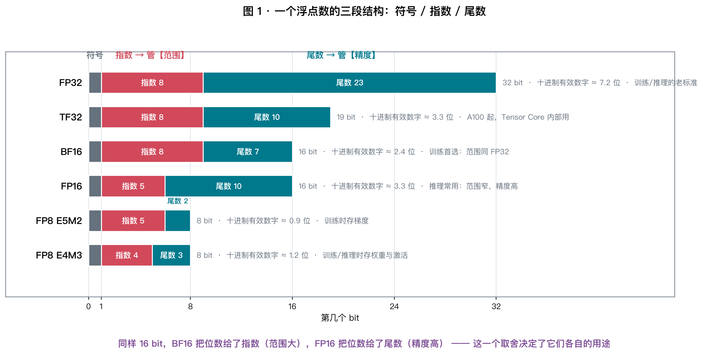
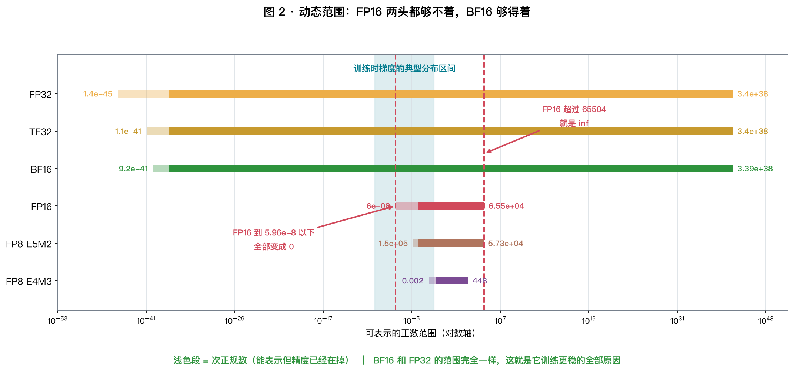
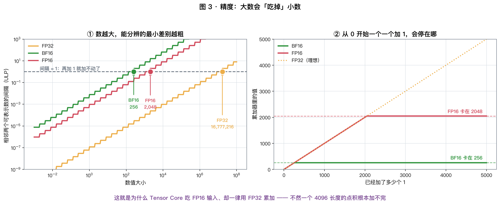
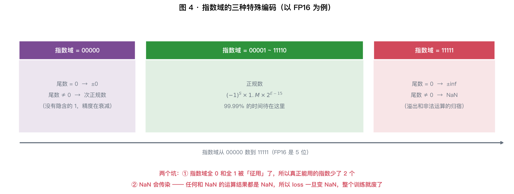
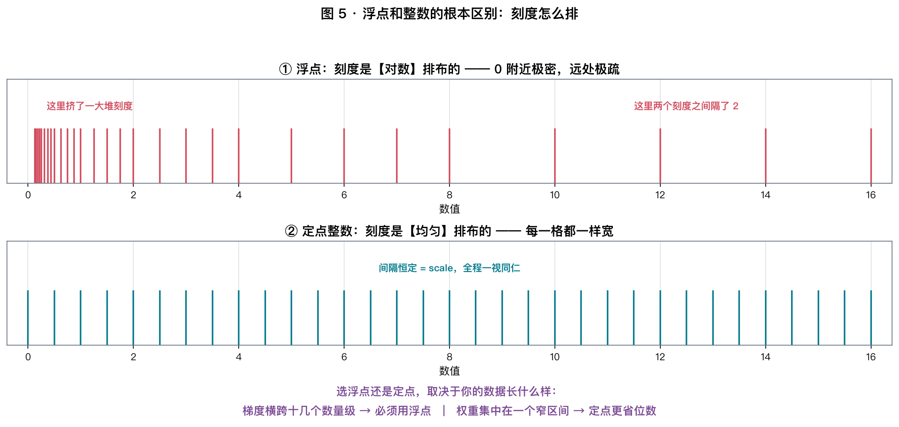
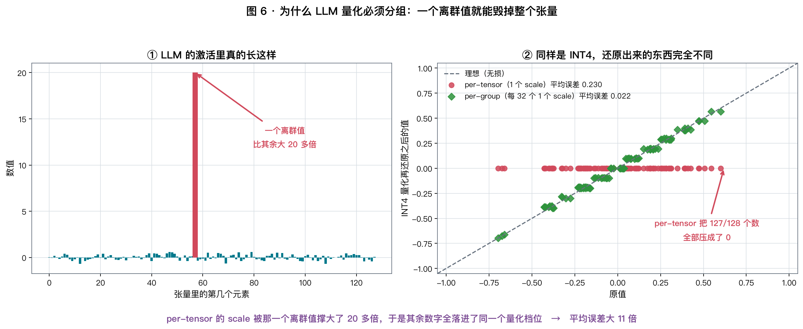
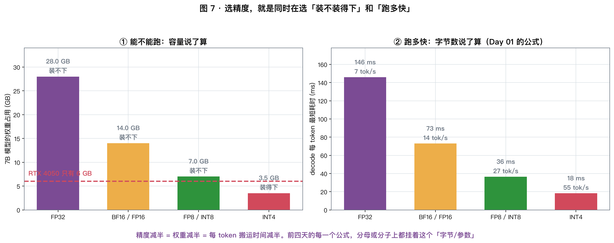
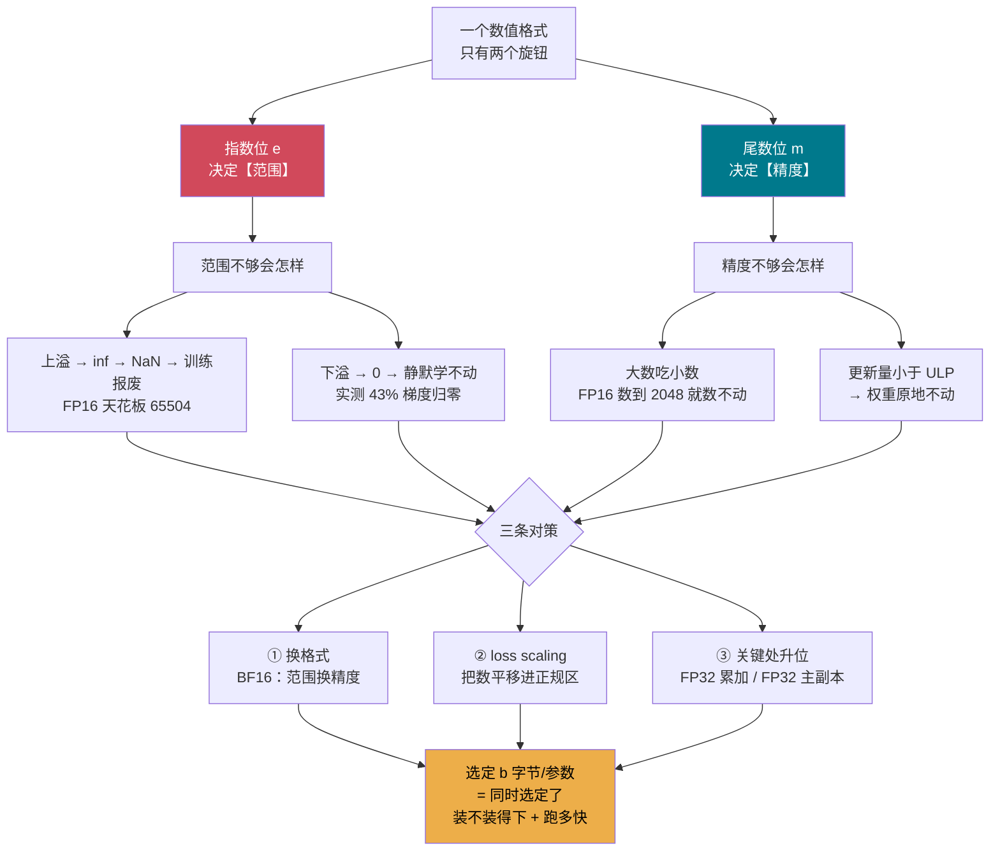

# Day 05 · 数值格式：那些字节里到底装的是什么

> **今日目标**：把 FP32 / BF16 / FP16 / FP8 / INT8 / INT4 一次讲透 ——
> 它们的位是怎么分的、边界在哪、什么时候会静默出错，
> 以及为什么"选精度"其实是在同时选**装不装得下**和**跑多快**。

⏱ 阅读 40 min · 动手 35 min · 思考 15 min

---

## 1. 前四天都在数字节，今天看字节里装的是什么

回头看一眼，前四天的每一个公式里都藏着同一个符号 $b$（**每个参数占几字节**）：

| 天 | 公式 | $b$ 在哪 |
|---|---|---|
| Day 01 | decode 上限 $= \dfrac{\text{BW}}{P \cdot b}$ | 分母 |
| Day 01 | KV/token $= 2 \cdot L \cdot n_{kv} \cdot d_h \cdot b$ | 直接乘 |
| Day 02 | 算术强度 $= \dfrac{\text{FLOPs}}{\text{Bytes}}$ | 分母（Bytes $\propto b$） |
| Day 03 | Tile 的 $\text{AI} = T/2$ | 按 fp16 算出来的 |
| Day 04 | 工作集大小 | 直接乘 |

**我们一直在假设 $b$ 是个可以随便挑的数。今天来看它到底能挑到多小，代价是什么。**

---

## 2. 三个反常识的数

在往下读之前，先看三个我在实验里实测出来的结果：

```
① FP16 里，从 0 开始一个一个加 1，加到 2048 就【再也加不动了】
   —— 不报错，acc 就停在那儿，你加多少次都是 2048

② 一个梯度张量转成 FP16，43.4% 的值【直接变成 0】
   —— 不报错，模型只是悄悄学不动了

③ 一个权重矩阵里混进一个离群值，INT4 per-tensor 量化后
   100% 的权重都变成了 0，输出误差 99.85%
```

**这三件事的共同点：全都是静默的。** 没有异常、没有 NaN，只有结果慢慢变坏。
今天就是要让你**看到它们发生之前的那些位**。

---

## 3. 从头说起：一个数怎么变成一串 0/1

先把 IEEE 754 放一边。**浮点数不是从天上掉下来的，它是被逼出来的。**
这一节我们从"计算机只有开关"开始，一步步把它推出来。

### 3.1 计算机里只有开关，位本身没有含义

一个 **bit** 就是一个开关，只有两种状态。$n$ 个 bit 就是 $2^n$ 种状态。

$$
\boxed{\ n \text{ 个 bit，无论怎么用，最多只能表示 } 2^n \text{ 个不同的东西}\ }
$$

这是一条**铁律**。16 个 bit 就是 65536 种状态，
你可以让它表示 0~65535，也可以表示 −32768~32767，还可以表示浮点数 ——
**但永远只有 65536 个"格子"**，多一个都没有。

**更重要的一点：一串位本身没有含义，含义完全来自"我们约定怎么解释它"。**

同样是 `01000001` 这 8 个 bit：

| 解释方式 | 得到什么 |
|---|---|
| 无符号整数 | 65 |
| ASCII 字符 | `A` |
| FP8 E4M3 浮点数 | 2.25 |
| 某个 GPU 指令的操作码 | 一条加法指令 |

**所以"格式"这个词的意思就是：一套解释这些位的规则。** 今天讲的全部内容，都是在讲规则。

### 3.2 整数很直接：位置计数法

十进制的 `205` 其实是一个求和式：

$$
205 = 2\times10^2 + 0\times10^1 + 5\times10^0
$$

二进制一模一样，只是底数换成 2：

```
    1    1    0    0    1    1    0    1
  128   64   32   16    8    4    2    1     ← 每一位代表多少
  128 + 64 +  0 +  0 +  8 +  4 +  0 +  1  =  205
```

$n$ 位无符号整数能表示 $0 \sim 2^n-1$，**每一格的间隔恒定是 1**。
（负数用**补码**：最高位代表 $-2^{n-1}$，这样加减法电路可以完全复用，不展开。）

### 3.3 麻烦从小数开始：第一次尝试是"定点"

最直觉的做法：**把小数点焊在一个固定位置**。
比如 8 位，约定前 4 位是整数、后 4 位是小数：

```
    0    1    0    1  ·   1    0    1    0
    8    4    2    1     1/2  1/4  1/8  1/16
    0  + 4  + 0  + 1  +  1/2 + 0 + 1/8 + 0   =  5.625
```

这套方案**能用，而且现在也在用**（金融、DSP、以及今天 §8 要讲的 INT8/INT4 量化）。
但它有个死穴 —— 看看小数点放在不同位置的后果：

| 8 位定点，小数点位置 | 能表示的范围 | 最小刻度 |
|---|---|---|
| 整数 8 位 + 小数 0 位 | 0 ~ 255 | 1 |
| 整数 4 位 + 小数 4 位 | 0 ~ 15.9375 | 1/16 = 0.0625 |
| 整数 0 位 + 小数 8 位 | 0 ~ 0.996 | 1/256 = 0.0039 |

$$
\boxed{\ \text{范围} \times \text{精度} = \text{常数。总位数是一份预算，两边此消彼长}\ }
$$

**这就是定点数的死穴。** 举个极端例子：

```
阿伏伽德罗常数  6.02e23
电子电荷        1.6e-19
想用同一种定点格式同时表示这两个数，跨了 42 个数量级
→ 需要 log2(10^42) ≈ 140 位
→ 而其中绝大多数位，在任何一个具体的数上都是 0
```

**140 位里 90% 都在存 0，纯属浪费。**

### 3.4 人类早就解决过这个问题：科学计数法

我们从来不写 `602000000000000000000000`，而是写 $6.02 \times 10^{23}$。
这一步做了什么？**把"精确到什么程度"和"在哪个数量级"拆成了两个独立的东西**：

| | 存什么 | 管什么 |
|---|---|---|
| **有效数字** | 6.02 | **精度** —— 我知道到小数点后几位 |
| **指数** | 23 | **范围** —— 这个数有多大 |

**关键在于这两部分各存各的，互不挤占预算。** 而且效率完全不同：

| 多给 1 位给谁 | 效果 |
|---|---|
| 定点数多 1 位 | 范围 **×2**（线性） |
| 浮点数的**尾数**多 1 位 | 精度 **×2**（线性） |
| 浮点数的**指数**多 1 位 | 范围 **平方**（指数级！） |

指数位为什么这么猛？因为 $e$ 位指数能表达的最大数量级本身是 $2^{2^{e-1}}$ 这个量级 ——
$e$ 加 1，指数上限翻倍，可表示的最大值就被**平方**了。

对照 FP16 和 BF16 就一目了然（两者总位数完全相同，只是指数位 5 → 8）：

$$
\text{FP16 (e=5)}:\ \max \approx 2^{16} = 65504
\quad\xrightarrow{\ \text{指数位 +3}\ }\quad
\text{BF16 (e=8)}:\ \max \approx 2^{128} = 3.4\times10^{38}
$$

**多给 3 位指数，范围涨了 $10^{33}$ 倍。** 这就是 §4 那张取舍表的根源。

### 3.5 于是有了浮点：二进制版的科学计数法



把科学计数法搬进二进制，就得到了 IEEE 754：

$$
\boxed{\ x = (-1)^{S} \times \underbrace{1.M}_{\text{有效数字（尾数）}} \times \underbrace{2}_{\text{基数}}^{\ \underbrace{E - \text{bias}}_{\text{数量级（指数）}}}\ }
\qquad \text{bias} = 2^{e-1} - 1
$$

三段一一对应：

| 科学计数法 $-6.02 \times 10^{23}$ | 浮点 | 占几位 |
|---|---|---|
| 前面那个负号 | $S$ | **1 位** |
| 有效数字 `6.02` | 尾数 $1.M$ | $m$ 位 |
| 指数 `23` | 指数域 $E$（存的是 $23 + \text{bias}$） | $e$ 位 |

> **"浮点"这个名字的由来**：小数点的位置由指数决定，是**浮动**的。
> 同一种 32 位格式，既能表示 $10^{38}$ 也能表示 $10^{-38}$ ——
> 代价是**任何时候都只有 24 位有效数字**，多出来的位全换成范围了。

### 3.6 三个设计细节，每一个都有明确的理由

#### ① 为什么基数是 2 不是 10

因为乘以 $2^k$ 在硬件上就是**移位**，几乎不花代价；乘以 $10^k$ 得真做乘法。

> 十进制浮点确实存在（IEEE 754 decimal，金融行业在用，因为它能精确表示 0.1），
> 但慢一个数量级，科学计算和 AI 都不用。

#### ② 为什么是 $1.M$ 不是 $0.M$：规格化

同一个数可以有很多种写法：

$$
12 = 1.5 \times 2^3 = 0.75 \times 2^4 = 3.0 \times 2^2 = \ldots
$$

**如果不做约定，同一个数就有多种位模式**，比较大小、判断相等都会变得很麻烦。
所以 IEEE 规定：**有效数字必须落在 $[1, 2)$ 区间**，这叫**规格化（normalized）**。

于是有了一个漂亮的副作用：

$$
\text{有效数字} \in [1, 2) \Rightarrow \text{二进制首位永远是 } 1 \Rightarrow \textbf{不用存}
$$

**白赚一位精度。** 所以 FP16 的 10 位尾数，实际提供的是 **11 位**有效数字 ——
§4 那张表里"十进制有效位"一列算的就是 $\log_{10}(2^{m+1})$。

> 这也预告了 §7 的一个坑：既然"首位是 1"是被硬性假设的，
> 那**接近 0 的数就没法规格化了**（$0.001 \times 2^{-14}$ 已经到指数下限，没法再往下挪）。
> IEEE 的处理办法就是**次正规数**：指数域全 0 时，隐含位改成 0。

#### ③ 为什么指数要减一个 bias

指数需要**有正有负**（$10^{23}$ 和 $10^{-19}$）。三种做法：

| 方案 | 问题 |
|---|---|
| 给指数再加一个符号位 | 出现 `+0` 和 `−0` 两个指数，浪费一个编码 |
| 指数用补码 | 比较大小时要特殊处理符号位 |
| **偏移（bias）**：存 `真实指数 + bias` | **无脑好用** |

bias 的妙处：存进去的永远是非负数，于是

$$
\boxed{\ \text{两个正浮点数，直接当作无符号整数比大小，结果就是对的}\ }
$$

因为位从高到低依次是 符号 → 指数 → 尾数，正好是**优先级从高到低**。
硬件可以直接复用整数比较器 —— 这是个非常划算的设计。

$\text{bias} = 2^{e-1}-1$，所以 FP16（$e=5$）的 bias 是 15，真实指数范围 $-14 \sim +15$。
（为什么不是 $-15 \sim +16$？因为指数域全 0 和全 1 被征用了，§7 讲。）

### 3.7 现在来亲手拆一个：0.1 长什么样

```bash
uv run python labs/day05/numerics.py --exp A
```

`x = 0.1` 的表示：

| | 符号 | 指数域 | 实际指数 | 尾数域 | 还原出来 |
|---|---|---|---|---|---|
| FP32 | 0 | `01111011` = 123 | 123−127 = **−4** | `10011001100110011001101` | **0.100000001490116…** |
| BF16 | 0 | `01111011` = 123 | 123−127 = −4 | `1001101` | 0.10009765625 |
| FP16 | 0 | `01011` = 11 | 11−15 = −4 | `1001100110` | 0.0999755859375 |

**一步步验算 FP32 那一行**：

$$
\text{指数域 } 01111011_2 = 123 \;\Rightarrow\; \text{真实指数} = 123 - 127 = -4
$$

$$
\text{尾数域 } 10011001100110011001101_2 = 5033165 \;\Rightarrow\; 1.M = 1 + \frac{5033165}{2^{23}} = 1.60000002384
$$

$$
x = 1.60000002384 \times 2^{-4} = 1.60000002384 \times 0.0625 = \mathbf{0.100000001490116\ldots}
$$

**为什么存不准**：把 0.1 手动转成二进制看看 ——

```
0.1 × 2 = 0.2  →  0
0.2 × 2 = 0.4  →  0
0.4 × 2 = 0.8  →  0
0.8 × 2 = 1.6  →  1  （余 0.6）
0.6 × 2 = 1.2  →  1  （余 0.2）
0.2 × 2 = 0.4  →  0     ← 回到第 2 步，开始循环
```

$$
0.1_{10} = 0.0\overline{0011}_2
$$

$$
\boxed{\ \text{0.1 在二进制里是无限循环小数，任何有限位数都存不准}\ }
$$

**这就是 `0.1 + 0.2 != 0.3` 的全部原因。** 和语言无关、和 Python 无关，
是"用二进制表示十进制小数"这件事本身的性质。

> 反过来，**只有 $k/2^j$ 形式的小数能精确存**（0.5、0.25、0.125、0.375…）。
> 所以浮点数**永远不要用 `==` 判断相等**，用 `abs(a-b) < tol`。
> PyTorch 提供了 `torch.allclose(a, b, rtol=..., atol=...)` 就是干这个的。

---

## 4. 七种格式并排看

```bash
uv run python labs/day05/numerics.py --exp B
```

| 格式 (1+e+m) | 最大值 | 最小正规数 | 最小次正规数 | eps = $2^{-m}$ | 十进制有效位 |
|---|---|---|---|---|---|
| **FP32** (1+8+23) | 3.403e38 | 1.175e−38 | 1.401e−45 | 1.192e−07 | **7.2** |
| **BF16** (1+8+7) | 3.39e38 | 1.175e−38 | 9.184e−41 | **0.0078** | **2.4** |
| **FP16** (1+5+10) | **65504** | 6.104e−05 | 5.96e−08 | **0.00098** | **3.3** |
| FP8 E4M3 (1+4+3) | 448 | 0.01562 | 0.001953 | 0.125 | 1.2 |
| FP8 E5M2 (1+5+2) | 57344 | 6.104e−05 | 1.526e−05 | 0.25 | 0.9 |

**三个公式，全部只需要 $(e, m)$ 两个数**：

$$
\text{max} = (2 - 2^{-m}) \times 2^{\,2^e - 2 - \text{bias}},\quad
\text{min}_{\text{normal}} = 2^{\,1-\text{bias}},\quad
\text{eps} = 2^{-m}
$$

> $2^e - 2$ 而不是 $2^e - 1$，是因为**指数域全 1 被征用给 inf/NaN 了**（§7）。

### 关键取舍：同样 16 位，两条完全不同的路

| | BF16 | FP16 |
|---|---|---|
| 位怎么分 | 指数 **8** / 尾数 7 | 指数 5 / 尾数 **10** |
| 范围 | **和 FP32 完全一样** | 只有 6.1e−5 ~ 65504 |
| 精度 | eps = 0.0078（2.4 位十进制） | eps = 0.00098（3.3 位） |
| 从 FP32 转过去 | **直接砍掉低 16 位** | 要重新算指数，可能溢出 |
| 谁在用 | **训练默认值** | 推理、以及有 loss scaling 的训练 |

$$
\boxed{\ \text{指数位管范围，尾数位管精度。16 位就那么多，只能二选一}\ }
$$

---

## 5. 动态范围：FP16 为什么会炸



### 5.1 上溢：超过 65504 就是 inf

FP16 的天花板只有 **65504**。听起来不小，但：

```
attention 的 QK^T 在 softmax 之前，logits 很容易到几百
再乘上一个大的 scale，或者梯度爆炸一下 → 直接 inf
inf 参与任何运算 → NaN → 传染给整个模型 → 训练报废
```

而且有个更隐蔽的坑：**BF16 也存不下 65504**。

```
BF16 只有 7 位尾数：65504 = 1.99902… × 2^15
1.99902 的尾数需要 127.875/128 → 进位 → 变成 2.0 × 2^15 = 65536
```

实验 A 实测确认：`BF16(65504) = 65536`。范围够，不代表精度够。

### 5.2 下溢：更致命，因为它完全静默

FP16 的地板是 **5.96e−8**（最小次正规数），再小就是 0。

而深度学习的梯度，量级常常在 **1e−11 ~ 1e−3** 之间。

```bash
uv run python labs/day05/numerics.py --exp D
```

100 万个模拟梯度（量级对数均匀分布在 1e−11 ~ 1e−3）：

| 做法 | 下溢成 0 | 溢出成 inf | 活下来那些的平均相对误差 | 点评 |
|---|---|---|---|---|
| **直接转 FP16** | **43.4%** | 0.0% | 5.24e−02 | 一半没了，而且是静默的 |
| **直接转 BF16** | **0.0%** | 0.0% | 1.40e−03 | 一个不丢，零调参 |
| FP16 + loss scaling ×2¹² | 0.0% | 0.0% | 1.75e−02 | 不再归零，但大多还在次正规区 |
| FP16 + loss scaling ×2¹⁶ | 0.0% | 0.0% | 1.35e−03 | 追平 BF16 |
| **FP16 + loss scaling ×2²⁴** | 0.0% | 0.0% | **1.75e−04** | 拿到了 FP16 该有的精度 |
| FP16 + loss scaling ×2²⁸ | 0.0% | **7.7%** | 1.75e−04 | 放大过头，开始撞 65504 |

**43.4% 的梯度直接变成 0。** 那些参数这一步**根本没更新**，
而你看不到任何报错 —— 只会发现 loss 降得比预期慢。

### 5.3 loss scaling：不只是防下溢

$$
\text{loss} \to S \cdot \text{loss}
\;\Rightarrow\;
\text{所有梯度} \to S \cdot g
\;\Rightarrow\;
\text{优化器更新前再除以 } S
$$

链式法则保证了梯度整体等比例放大，所以这个操作**在数学上完全无损**。

但上表第 3 行揭示了一个容易忽略的点：**光"不归零"是不够的**。
$S = 2^{12}$ 时，很多梯度虽然没变 0，却落在了**次正规区**——
那里没有隐含的 1，精度是**逐位衰减**的，误差反而比 BF16 还大 10 倍。

$$
\boxed{\ \text{loss scaling 的目标是把梯度推进「正规数」区间，而不只是推出 0}\ }
$$

**而窗口很窄**：$2^{24}$ 刚好，$2^{28}$ 就开始溢出。所以真实框架用**动态 loss scaling**：
出 inf 就把 $S$ 减半、连续几百步正常就翻倍，自动在窗口里游走。

### 5.4 于是 BF16 赢了

| | FP16 | BF16 |
|---|---|---|
| 最好能到的精度 | **1.75e−04**（好 8 倍） | 1.40e−03 |
| 代价 | 要维护动态 loss scaling，窗口窄 | **什么都不用做** |

$$
\boxed{\ \text{BF16 用 3 位精度，换掉了整套 loss scaling 机制}\ }
$$

这就是 A100 之后所有大模型训练都默认 BF16 的原因。
**不是因为它更准，是因为它更省心** —— 而在训练几千 GPU-小时的场景下，"省心"比"更准"值钱得多。

---

## 6. 精度：大数会吃掉小数



### 6.1 ULP：相邻两个可表示数隔多远

浮点数在数轴上**不是均匀分布**的。数值 $x$ 附近，相邻两个可表示数的间隔是：

$$
\text{ULP}(x) = 2^{\lfloor \log_2 x \rfloor - m}
$$

**数越大，间隔越粗。** 于是必然出现一个临界点：**当间隔 ≥ 1 时，再加 1 就加不动了。**

$$
\text{ULP} \ge 1 \iff \lfloor \log_2 x \rfloor \ge m \iff x \ge 2^{m+1}
$$

| 格式 | $m$ | 数不动的位置 $2^{m+1}$ |
|---|---|---|
| **FP16** | 10 | **2,048** |
| **BF16** | 7 | **256** |
| FP32 | 23 | 16,777,216 |

### 6.2 实测：真的就停在那儿

```bash
uv run python labs/day05/numerics.py --exp C
```

| dtype | 手推 $2^{m+1}$ | 实测停住的位置 |
|---|---|---|
| FP16 | 2,048 | **2,048** ✅ |
| BF16 | 256 | **256** ✅ |

**为什么正好是这里**：数值到了 $2^{m+1}$，间隔变成 2，
这时 `acc + 1` 落在两个刻度的**正中间**，按 IEEE 的"四舍六入五取偶"又被拉回原处。

### 6.3 同一件事的三种翻车方式

把 65536 个 1 加起来（正确答案 65536）：

| 求和方式 | 结果 | 错在哪 |
|---|---|---|
| 朴素逐个累加（FP16） | **2,048** | **精度不够**：尾数太短，小数被大数吃掉 |
| `torch.sum()`（FP16 树形累加） | **inf** | **范围不够**：65536 > 65504 |
| `torch.sum(dtype=torch.float32)` | **65,536** | 正确 |

**这三行是今天最值得记住的一张表**：

- 第 1 行栽在**精度**（§6）
- 第 2 行栽在**范围**（§5）—— 树形求和治好了精度，却撞上了天花板
- 只有**升位累加**同时解决两个问题

### 6.4 于是 Tensor Core 一律用 FP32 累加

Day 03 §9 说 Tensor Core 吃 FP16 输入。但它的**累加器永远是 FP32**：

$$
\underbrace{\text{FP16} \times \text{FP16}}_{\text{输入省带宽}} \to \underbrace{\text{FP32 累加}}_{\text{保证加得完}}
$$

一个 $d = 4096$ 的点积要累加 4096 项。如果用 FP16 累加，
按 §6.1，累加器一超过 2048 就开始丢数 —— **算出来的结果直接是错的**。

> **实践守则**：所有**归约类**算子（`sum` / `mean` / `softmax` / `LayerNorm` / 点积）
> 在半精度下都必须**显式升位**。PyTorch 不同后端的默认行为并不一致，
> 别赌，写 `dtype=torch.float32`。

---

## 7. 指数域的三种特殊编码



指数域的两个极端取值被"征用"了：

| 指数域 | 尾数 = 0 | 尾数 ≠ 0 |
|---|---|---|
| **全 0** | ±0 | **次正规数**（没有隐含的 1） |
| 中间值 | 正规数 $(-1)^S \times 1.M \times 2^{E-\text{bias}}$ | 同左 |
| **全 1** | **±inf** | **NaN** |

**两个必须知道的性质**：

1. **次正规数的精度是逐位衰减的。** 正规数永远有 $m+1$ 位有效数字，
   次正规数则越靠近 0 有效位越少，到最后只剩 1 位。
   这就是 §5.3 里"$S=2^{12}$ 时误差反而大"的原因。

2. **NaN 会传染。** 任何和 NaN 的运算结果都是 NaN，而且 `NaN != NaN`。
   所以 loss 一旦变 NaN，梯度全是 NaN，权重全是 NaN，**整个训练直接报废**。

> 顺带一个坑：很多 GPU 默认开启 **FTZ（flush-to-zero）**，
> 把次正规数直接当 0 处理 —— 因为处理次正规数在硬件上要走慢速路径。
> 这意味着**同一段代码在 CPU 和 GPU 上可能给出不同结果**。

---

## 8. 整数量化：换一套刻度



### 8.1 根本区别：刻度怎么排

| | 浮点 | 定点整数 |
|---|---|---|
| 刻度排布 | **对数**：0 附近极密，远处极疏 | **均匀**：每格一样宽 |
| 擅长什么 | 横跨很多数量级的数据（**梯度**） | 集中在窄区间的数据（**权重**） |
| 每个数带什么 | 自带指数 | **共用一个 scale** |

**权重的分布恰好是钟形、集中在 0 附近的窄区间** —— 这正是定点数的主场。
所以 LLM 量化几乎都是**权重用整数、激活看情况**。

### 8.2 量化公式

对称量化（最常用）：

$$
s = \frac{\max|W|}{q_{\max}}, \qquad
q = \text{clamp}\!\left(\text{round}\!\left(\frac{W}{s}\right), -q_{\max}, q_{\max}\right), \qquad
\hat{W} = s \cdot q
$$

其中 INT8 的 $q_{\max} = 127$，INT4 的 $q_{\max} = 7$。

**注意 $s$ 由 $\max|W|$ 决定** —— 这就是下一节所有麻烦的根源。

### 8.3 离群值：一个数就能毁掉整个张量



LLM 的激活里**真的存在**比其余大几十倍的离群值（LLM.int8() 论文的核心发现）。
一旦有一个，$s$ 就被撑大 20 倍，其余所有数被压进极少数几个档位。

**解法：分组（per-group）。** 每 32 或 128 个数用自己的 $s$，
把损害**关在一个组里**。

### 8.4 实测：差距比想象的大得多

```bash
uv run python labs/day05/numerics.py --exp E
```

`2048×2048` 的权重矩阵，指标是**矩阵乘输出的相对误差**（这才是模型真正在乎的）：

| 方案 | 干净的权重 | 注入 1 个 20 倍离群值后 |
|---|---|---|
| INT8 per-tensor | 1.16% | **23.05%** |
| INT8 per-group 128 | 0.65% | **0.66%**（纹丝不动） |
| INT4 per-tensor | 20.95% | **99.85%**（100% 权重归零） |
| INT4 per-group 128 | 11.76% | **11.76%**（纹丝不动） |
| INT4 per-group 32 | 9.71% | 9.70% |

**四个结论**：

1. **干净权重下 INT8 per-tensor 就够用**（1% 误差）。
2. **一个离群值就让 per-tensor 全线崩溃** —— INT4 甚至把 100% 的权重压成了 0。
3. **per-group 完全免疫**（0.66% 和 11.76%，和干净时一模一样）。
   代价：每 128 个数多存一个 FP16 scale = $\frac{2}{64}$ = **+3.1% 体积**。
4. ⚠️ **但 INT4 per-group 的误差仍有 ~12%** ——
   光靠"四舍五入到最近的格子"是**不够用**的。

> 第 4 条很重要：真正能用的 INT4 方案（GPTQ / AWQ / GGUF）都在做额外的事 ——
> 用校准数据做**误差补偿**，或者按重要性对通道**预缩放**。
> **Week 5 会把这两条路都推导一遍。今天你已经知道它们要解决的是什么问题了。**

---

## 9. 回到 Infra：选精度就是在选屋顶



### 9.1 一个数字，改写前四天的所有公式

7B 模型，RTX 4050（192 GB/s，6 GB）：

| 精度 | $b$ | 权重 | 装得下 6 GB？ | decode 每 token | 上限 |
|---|---|---|---|---|---|
| FP32 | 4 | 28.0 GB | ❌ | 146 ms | 7 tok/s |
| BF16 / FP16 | 2 | 14.0 GB | ❌ | 73 ms | 14 tok/s |
| FP8 / INT8 | 1 | 7.0 GB | ❌（差一点） | 36 ms | 27 tok/s |
| **INT4** | **0.5** | **3.5 GB** | ✅ | **18 ms** | **55 tok/s** |

**注意 INT4 per-group 128 的真实体积**（把 scale 算进去）：

$$
\frac{128 \times 4\ \text{bit} + 16\ \text{bit}}{128} = 4.125\ \text{bit/参数}
\;\Rightarrow\; 7\text{B} \times \frac{4.125}{8} = \mathbf{3.61\ GB}
$$

### 9.2 一个副作用：量化会把算子往右推

Day 02 的算术强度 $\text{AI} = \text{FLOPs}/\text{Bytes}$。
**降精度时 FLOPs 不变、Bytes 减半 → AI 翻倍。**

decode 阶段（batch = $B$）：

$$
\text{AI} = \frac{2 P B}{P b} = \frac{2B}{b}
$$

| 精度 | $b$ | $B=1$ 时的 AI | 4050 平衡点 |
|---|---|---|---|
| FP16 | 2 | **1** | 125 |
| INT8 | 1 | **2** | 125 |
| INT4 | 0.5 | **4** | 125 |

$$
\boxed{\ \text{量化把 decode 的算术强度从 1 提到 4，但离平衡点 125 还差 31 倍}\ }
$$

**所以量化提速是实打实的（搬得少了），但它永远不能把 decode 变成算力受限。**
这和 Day 02 Q2 的结论完全一致 —— 从另一个角度又验证了一次。

### 9.3 训练的账要重算：为什么是 16 字节/参数

推理只要存权重，训练要存的东西多得多。**BF16 混合精度 + Adam** 的标准配置：

| 存什么 | 精度 | 字节/参数 |
|---|---|---|
| 权重（计算用） | BF16 | 2 |
| 梯度 | BF16 | 2 |
| **权重主副本**（累加用） | **FP32** | **4** |
| Adam 一阶动量 $m$ | FP32 | 4 |
| Adam 二阶动量 $v$ | FP32 | 4 |
| **合计** | | **16** |

$$
7\text{B} \times 16\ \text{B/参数} = \mathbf{112\ GB}\quad(\text{还没算激活})
$$

**为什么必须留一份 FP32 主副本**：优化器每步的更新量 $\eta \cdot \hat{m}$ 常常在 $10^{-7}$ 量级，
而权重本身在 $10^{-2}$ 量级。按 §6.1：

$$
\text{ULP}_{\text{BF16}}(10^{-2}) = 2^{-7-7} \approx 6\times10^{-5} \;\gg\; 10^{-7}
$$

**更新量比 ULP 小了 600 倍 —— 直接被吃掉，权重根本不动。**
所以主副本必须是 FP32（$\text{ULP} \approx 10^{-9}$，够用）。

> 这一条直接解释了 Week 6/7 的两个主题：
> **ZeRO** 就是把这 16 字节切开分给多张卡；
> **8-bit 优化器**（bitsandbytes）就是把那两个 4 字节的动量压到 1 字节。

---

## 10. 手算练习（15 分钟）

**Q1**（拆位）. 把 FP16 位串 `0 10001 1001000000` 还原成十进制。
再还原 `0 00000 0000000001`。

<details>
<summary>点开答案</summary>

**第一个**：$S=0$，$E = 10001_2 = 17$，$M = 1001000000_2 = 576$，bias $= 15$

$$
E - \text{bias} = 17 - 15 = 2,\qquad
1.M = 1 + \frac{576}{1024} = 1.5625
$$

$$
x = 1.5625 \times 2^2 = \mathbf{6.25}
$$

**第二个**：指数域**全 0** → 走次正规数的公式（**没有隐含的 1**）：

$$
x = \frac{M}{2^{m}} \times 2^{\,1-\text{bias}}
= \frac{1}{1024} \times 2^{-14}
= 2^{-24} = \mathbf{5.96\times10^{-8}}
$$

**这就是 FP16 能表示的最小正数**，也是 §5.2 里 43% 梯度归零的那条线。
</details>

**Q2**（BF16 的坑）. FP16 的最大值是 65504。把这个数存进 BF16 会得到什么？
BF16 的范围明明大得多，为什么？

<details>
<summary>点开答案</summary>

$$
65504 = 1.99902\ldots \times 2^{15}
$$

BF16 只有 7 位尾数，能表示的尾数刻度是 $\frac{k}{128}$：

$$
0.99902 \times 128 = 127.875 \;\xrightarrow{\text{四舍五入}}\; 128
$$

进位后尾数溢出到指数：

$$
2.0 \times 2^{15} = \mathbf{65536}
$$

**范围够，不代表精度够。** 这两件事必须分开看：

| | 能不能表示这个量级 | 能不能表示这个具体的数 |
|---|---|---|
| 管这事的 | **指数位** | **尾数位** |
| BF16 对 65504 | 能（远没到 3.4e38） | **不能**（最近的刻度是 65536） |

> 实践含义：BF16 适合存**量级跨度大但不要求精确**的东西（梯度、激活），
> 不适合存**需要精确累加**的东西（优化器状态、计数器）。
</details>

**Q3**（训练显存）. 用 BF16 混合精度 + Adam 全量微调一个 7B 模型，
光是"权重 + 梯度 + 优化器状态"要多少显存？
6 GB 的 4050 能跑吗？80 GB 的 H100 呢？

<details>
<summary>点开答案</summary>

$$
\underbrace{2}_{\text{BF16 权重}} + \underbrace{2}_{\text{BF16 梯度}} + \underbrace{4}_{\text{FP32 主副本}} + \underbrace{4}_{\text{Adam } m} + \underbrace{4}_{\text{Adam } v} = 16\ \text{字节/参数}
$$

$$
7 \times 10^9 \times 16 = \mathbf{112\ GB}
$$

| 卡 | 显存 | 结论 |
|---|---|---|
| RTX 4050 | 6 GB | 差 **19 倍**，完全不可能 |
| H100 | 80 GB | **仍然不够**（还没算激活和碎片） |

**推论**：单卡全量微调 7B 是做不到的。三条出路：

1. **多卡切分**（ZeRO / FSDP）—— 把 112 GB 分给 N 张卡（Week 6/7）
2. **只训一小部分**（LoRA）—— 冻结主体，只给低秩旁路留优化器状态（Week 5）
3. **压缩优化器状态**（8-bit Adam）—— 把 $m, v$ 从 4 字节压到 1 字节，16 → 10 字节

> 顺带回答了一个常见困惑：**为什么推理能在消费级卡上跑，训练不行？**
> 推理 $b_{\text{eff}} = 0.5$（INT4），训练 $b_{\text{eff}} = 16$ —— **差 32 倍。**
</details>

**Q4**（量化体积）. INT4 + group size 128，scale 用 FP16 存。
真实压缩率相对 FP16 是多少？如果 group size 改成 32 呢？
再考虑非对称量化（还要存一个 zero-point）呢？

<details>
<summary>点开答案</summary>

**每组的开销** = 组内权重 + 1 个 scale：

| 配置 | 每组字节 | 每参数 bit | 相对 FP16 |
|---|---|---|---|
| INT4，group 128，对称 | $128\times0.5 + 2 = 66$ | $\frac{66\times8}{128} = \mathbf{4.125}$ | **3.88×** |
| INT4，group 32，对称 | $32\times0.5 + 2 = 18$ | $\frac{18\times8}{32} = \mathbf{4.5}$ | 3.56× |
| INT4，group 128，非对称 | $64 + 2 + 2 = 68$ | $\mathbf{4.25}$ | 3.76× |
| INT4，group 32，非对称 | $16 + 4 = 20$ | $\mathbf{5.0}$ | 3.2× |

**读法**：

- group 从 128 缩到 32，精度更好（实验 E：11.76% → 9.71%），
  但体积多了 **9%**，压缩率从 3.88× 掉到 3.56×。
- 非对称量化多一个 zero-point，group 32 时体积直接多 **21%** ——
  所以小 group 通常配对称量化。

> **这就是 GGUF 里那一堆 `Q4_K_M` / `Q4_0` / `Q4_K_S` 后缀的含义**：
> 它们的区别就是 group size、对称/非对称、以及 scale 本身是否再量化。
> 你现在能自己算出每一种的真实体积了。
>
> 别忘了 Day 04 的账：**group 越小，反量化时要额外读的 scale 越多** ——
> 精度、体积、访存，三者互相拉扯。
</details>

---

## 11. 动手实验（35 分钟）

```bash
uv run python labs/day05/numerics.py           # 五个实验全跑
uv run python labs/day05/numerics.py --exp C   # 只看累加灾难
```

**必做的四件事**：

1. **实验 A**：改成你自己想拆的数（比如 `1/3`、`1e10`、`torch.finfo(torch.float16).max`），
   **手算一遍再和输出对**。
2. **实验 C**：确认 FP16 停在 2048、BF16 停在 256，**然后把 65536 个 1 的三行结果抄进笔记** ——
   那三种翻车方式值得单独记一页。
3. **实验 D**：把 loss scale 从 $2^{12}$ 调到 $2^{28}$，找出**你这个梯度分布下的最优 scale**。
   体会一下窗口有多窄。
4. **实验 E**：把离群值从 20 倍改成 5 倍、100 倍，看 per-tensor 从什么时候开始崩。

---

## 12. 思考题

**T1（推理）**
FP8 有两个变体：E4M3（范围小、精度高）和 E5M2（范围大、精度低）。
**为什么训练时用 E5M2 存梯度、用 E4M3 存权重和激活？**
（提示：回到 §5 那张图，看哪个量的分布更宽。）

**T2（连接 Day 03）**
Day 03 实测 M4 的 FP16 只比 FP32 快 1.12×，说明它没有独立矩阵单元。
**那么在 M4 上把模型从 FP32 换成 FP16，还有意义吗？意义在哪？**
（提示：Day 02 说优化有三个方向，量化动的是哪一个？）

**T3（开放）**
今天说"权重适合定点，梯度适合浮点"。
**那 KV Cache 呢？** 它更像权重还是更像梯度？
如果要把 KV Cache 量化到 INT8，你会 per-tensor 还是 per-group？分组沿哪个维度切？
（提示：想想 Day 03 §7 的内存布局，和 Day 04 的 cache line。）

---

## 13. 一图总结



**今日一句话**：
> 数值格式的所有麻烦，都来自同一个取舍：**16 位就那么多，指数和尾数只能二选一。**
> 而它造成的错误全都是**静默的** —— 不报错、不崩溃，只是结果慢慢变坏。
> **所以这一天的真正价值，是让你在看到 loss 不降的时候，
> 知道要去查哪几个数。**

---

## 14. 延伸阅读

| 类型 | 材料 | 建议 |
|---|---|---|
| 📄 经典 | Goldberg, *What Every Computer Scientist Should Know About Floating-Point* | 看前 3 节就够，1991 年的文章至今没过时 |
| 📄 必读 | *Mixed Precision Training* (arXiv 1710.03740) | loss scaling 和 FP32 主副本的出处 |
| 📄 必读 | *LLM.int8()* (arXiv 2208.07339) §3 | 离群值现象的原始发现 |
| 📄 标准 | OCP *8-bit Floating Point Specification (OFP8)* | E4M3 / E5M2 的官方定义 |
| 🔧 工具 | [float.exposed](https://float.exposed) | 在线拖动每一位，实时看数值变化 |
| 🔧 工具 | `torch.finfo(dtype)` | 随时查边界，别背 |
| 📄 进阶 | GPTQ (2210.17323) / AWQ (2306.00978) | Week 5 会精读，现在扫一眼动机部分 |

---

## ✅ 今日检查清单

- [ ] 能默写 $x = (-1)^S \times 1.M \times 2^{E-\text{bias}}$，并手拆一个 FP16 位串
- [ ] 能说出"指数位管范围、尾数位管精度"，并解释 BF16 和 FP16 的取舍
- [ ] 记住三个数：**FP16 天花板 65504 · 地板 5.96e−8 · 数到 2048 就数不动**
- [ ] 跑完实验 C，能解释"65536 个 1"那三行分别栽在哪
- [ ] 跑完实验 D，找到了自己那个梯度分布下的最优 loss scale
- [ ] 能解释为什么混合精度训练是 16 字节/参数，以及 FP32 主副本非留不可
- [ ] 完成 Q1–Q4，特别是 Q3 的训练显存估算
- [ ] 笔记写进 `day05-notes.md`

**明天（Day 06）**：软件栈剖面 —— 从你写的 `y = model(x)` 到 GPU 上跑的 SASS 指令，
中间隔着 8 层抽象。我们用 profiler 把**每一层的耗时抓出来**，
看看那 30% 的时间到底花在了哪里没人注意的地方。
