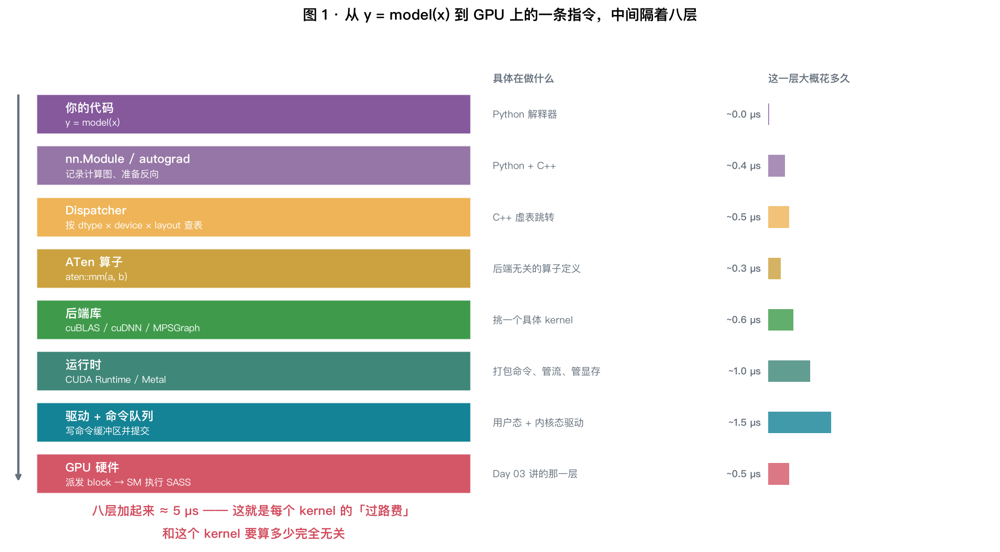
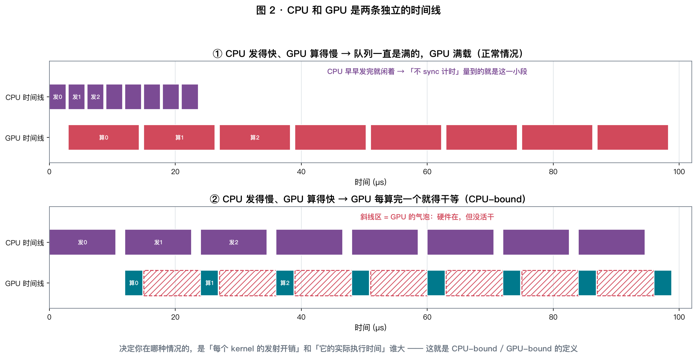
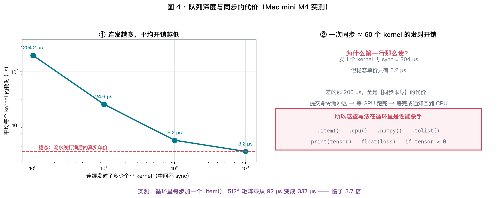
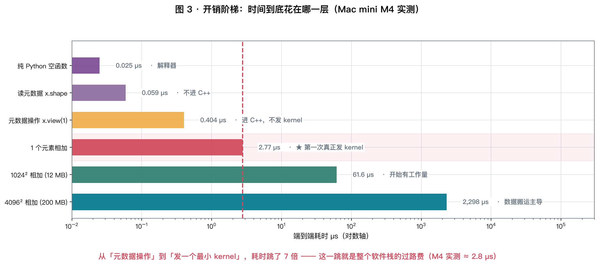
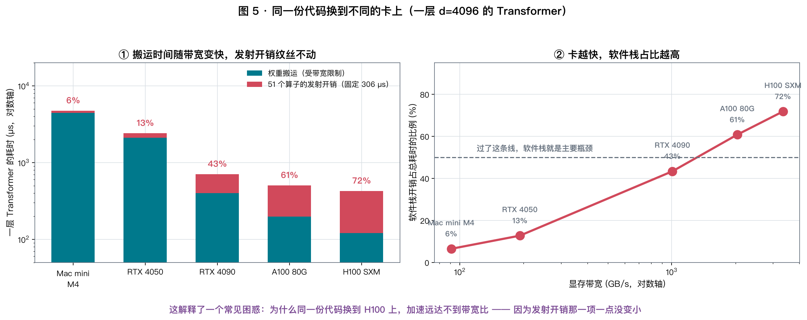
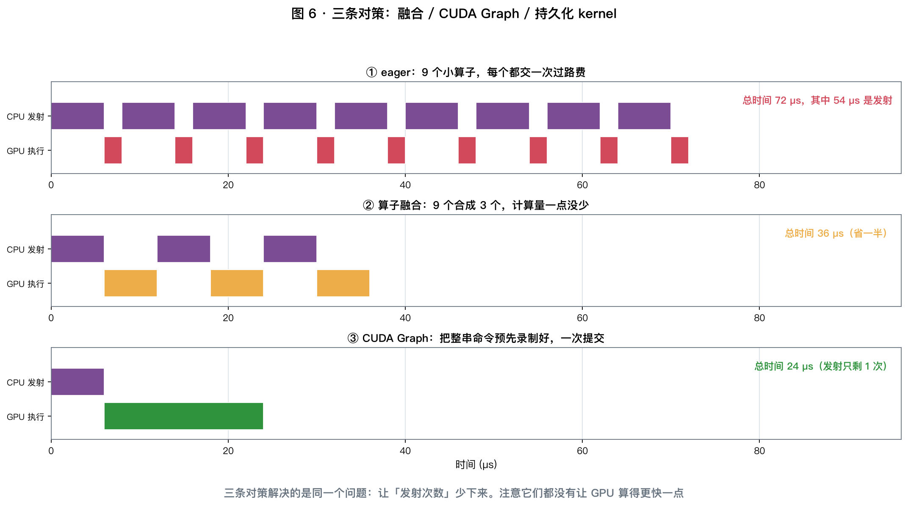
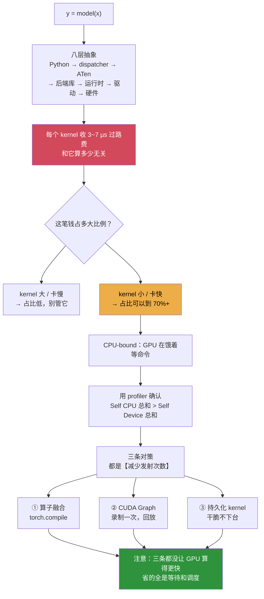

# Day 06 · 软件栈剖面：`y = model(x)` 这一行到底走了多远

> **今日目标**：把从 Python 到 GPU 指令中间的 **八层抽象**逐层拆开，
> 量出每一层的耗时，并且回答一个 Week 1 反复出现的问题 ——
> **Day 04 那个 7 µs 的 $t_0$，到底是谁收走的？**

⏱ 阅读 40 min · 动手 35 min · 思考 15 min

---

## 1. 前五天讲硬件能给你什么，今天讲软件从中拿走了多少

| 天 | 讲了什么 | 留下的问号 |
|---|---|---|
| Day 01–03 | 算力、带宽、GPU 架构 | 为什么每次计时都要 `sync()`？ |
| Day 04 | 存储层次，$t = t_0 + S/B$ | **那个 $t_0 \approx 7\ \text{µs}$ 到底是什么？** |
| Day 05 | 数值格式 | — |

今天把这两个问号一起回答掉。

---

## 2. 三个反常识的数（M4 实测）

```
① 同一个 2048³ 矩阵乘，不 sync 量出来 27 µs，sync 之后 5230 µs
   —— 差 193 倍。不 sync 的那个数完全是假的

② 发 1 个小 kernel 再同步要 204 µs，
   而连发 1000 个时平均每个只要 3.2 µs —— 差 64 倍

③ 循环里每步多写一个 .item()，同样的计算慢了 3.7 倍
   —— 而 .item() 本身"只是取一个数"
```

**这三个数说的是同一件事：CPU 和 GPU 之间隔着一条你看不见的队列。**

---

## 3. 八层抽象



你写下 `y = model(x)`，到 GPU 上真正跑起一条 SASS 指令，中间要过八道关：

| # | 这一层 | 具体在做什么 | 量级 |
|---|---|---|---|
| 1 | **你的代码** | Python 解释器执行 `y = model(x)` | ~0.03 µs |
| 2 | **nn.Module / autograd** | 记录计算图、准备反向、检查 `requires_grad` | ~0.4 µs |
| 3 | **Dispatcher** | 按 `dtype × device × layout × autograd` 查表，决定调哪个实现 | ~0.5 µs |
| 4 | **ATen 算子** | `aten::mm(a, b)` —— 后端无关的算子定义 | ~0.3 µs |
| 5 | **后端库** | cuBLAS / cuDNN / MPSGraph 挑一个具体 kernel | ~0.6 µs |
| 6 | **运行时** | CUDA Runtime / Metal：打包命令、管流、管显存 | ~1.0 µs |
| 7 | **驱动 + 命令队列** | 用户态驱动写命令缓冲区，内核态提交 | ~1.5 µs |
| 8 | **GPU 硬件** | GigaThread Engine 派发 block → SM 执行 SASS（Day 03） | ~0.5 µs |

$$
\boxed{\ \text{八层加起来} \approx 3 \sim 7\ \text{µs} = \text{Day 04 那个 } t_0\ }
$$

**而这笔钱和 kernel 要算多少完全无关。** 一个真实工作量 1 µs 的小算子，
实际要花 3+ µs —— **浪费掉三分之二**。

> ⚠️ 表里的分层耗时是**量级估计**（各层不容易单独插桩），
> 但**总和是实测的**（§6），而且和 Day 04 独立测出的 $t_0$ 对得上。

---

## 4. 最重要的一层认知：CPU 和 GPU 是两条时间线



### 4.1 `a @ a` 这一行在 CPU 上到底做了什么

**它把一条命令塞进队列，然后立刻返回。** GPU 什么时候执行，Python 完全不知道。

```python
y = a @ a          # CPU: 走完八层，把命令投进队列，返回。耗时 ~3 µs
                   # GPU: 可能几百微秒后才开始算
print("done")      # 这行会立刻打印 —— GPU 还在算呢
```

### 4.2 实测：193 倍

```bash
uv run python labs/day06/stack_profile.py --exp B
```

| 计时方式 | 量出来的耗时 | 这个数到底是什么 |
|---|---|---|
| 循环里不 sync | **27.0 µs** | 只是 CPU 把命令塞进队列的时间 |
| 循环后 sync | **5230.3 µs** | GPU 真正算完的时间 |
| 比值 | **193×** | CPU 跑得比 GPU 快这么多倍 |

$$
\boxed{\ \text{不 sync 就计时，量到的是「投递速度」，不是「计算速度」}\ }
$$

**这就是 Day 01 起每次计时都要 `sync()` 的原因** —— 埋了五天的伏笔，今天填上。

### 4.3 于是有了两种完全不同的"慢"

看图 2 的两个面板：

| | 什么情况 | 现象 | 对策 |
|---|---|---|---|
| **GPU-bound** | 发射快、执行慢 | 队列一直是满的，GPU 满载 | 回到 Day 02 的 Roofline |
| **CPU-bound** | 发射慢、执行快 | **GPU 每算完一个就干等**（图里的斜线区） | 减少发射次数（§8） |

$$
\boxed{\ \text{判据：每个 kernel 的「发射开销」 vs 「执行时间」，谁大听谁的}\ }
$$

**注意 CPU-bound 时，Roofline 完全帮不上忙** —— 算力和带宽都没跑满，
但瓶颈根本不在 GPU 上。这是 Day 02 那套工具的**盲区**，今天补上。

---

## 5. 同步有多贵，以及隐式同步的陷阱



### 5.1 队列深度实验

连续发射同一个小算子，中间不 sync，最后 sync 一次：

| 连发多少个 | 总耗时 | 平均每个 | 说明 |
|---|---|---|---|
| 1 | 204.2 µs | **204.2 µs** | 这一行几乎全是同步本身的代价 |
| 10 | 245.8 µs | 24.6 µs | 开始摊薄 |
| 100 | 516.2 µs | 5.2 µs | |
| 1000 | 3180.8 µs | **3.2 µs** | 稳态：流水线打满后的真实单价 |

$$
\boxed{\ \text{一次同步} \approx 200\ \text{µs} \approx 60\ \text{个 kernel 的发射开销}\ }
$$

**为什么这么贵**：提交命令缓冲区 → 等 GPU 跑完 → 等完成通知回到 CPU，
这是一次**完整的往返**（Day 04 §2 的表里，PCIe/驱动那一层就是微秒级的）。

### 5.2 这些写法会偷偷触发同步

```
.item()      .cpu()      .numpy()      .tolist()
print(tensor)     float(loss)     if tensor > 0     bool(mask.any())
```

共同点：**任何把张量当 Python 数值用的地方**，都必须等 GPU 算完。

**实测**：循环里每步加一个 `.item()`，512³ 矩阵乘从 92 µs 变成 **337 µs（3.7×）**。

```python
# ❌ 每步都同步，流水线被打断
for step, batch in enumerate(loader):
    loss = model(batch)
    losses.append(loss.item())          # ← 这里
    if step % 100 == 0:
        print(f"loss={loss.item():.4f}")

# ✅ 攒在 GPU 上，几百步才同步一次
for step, batch in enumerate(loader):
    loss = model(batch)
    losses.append(loss.detach())        # 还是 GPU 张量，不同步
    if step % 100 == 0:
        print(f"loss={torch.stack(losses).mean().item():.4f}")
        losses.clear()
```

> **这是新手最常踩的性能坑**，而且极难发现 —— 因为代码看起来完全正常，
> profiler 里也只是显示"某个算子特别慢"。

---

## 6. 开销阶梯实测：钱到底花在哪一层

```bash
uv run python labs/day06/stack_profile.py --exp A
```



| 这一步做了什么 | 不 sync（CPU 提交） | sync（端到端） | 说明 |
|---|---|---|---|
| ① 纯 Python 空函数 | 0.026 µs | 0.025 µs | 解释器自己 |
| ② 读元数据 `x.shape` | 0.060 µs | 0.059 µs | 不进 C++ |
| ③ 元数据操作 `x.view(1)` | 0.408 µs | 0.404 µs | 进了 C++，但不发 kernel |
| **④ 1 个元素相加** | **1.166 µs** | **2.765 µs** | ★ 第一次真正发 kernel |
| ⑤ 1024² 相加（12 MB） | 0.989 µs | 61.6 µs | 开始有工作量 |
| ⑥ 4096² 相加（200 MB） | 1.303 µs | 2298 µs | 数据搬运主导 |

**三个读法**：

1. **①→③ 全在 CPU 上，加起来不到 0.5 µs。** ——
   "Python 慢所以深度学习慢"这个说法，在这里是**站不住的**。
2. **③→④ 这一跳是全场最关键的**：0.4 → 2.8 µs，**跳了 7 倍**。
   这一跳就是"把命令交给 GPU"的全部代价。
3. **⑤⑥ 的"不 sync"列几乎不变**（~1 µs）—— 因为 CPU 侧的活和数据量无关，
   它只是投递了一条命令。**这一列就是纯粹的软件栈成本。**

### 6.1 一个反直觉的结果：换写法几乎没用

```bash
uv run python labs/day06/stack_profile.py --exp C
```

同一个加法的四种写法，1024 个元素（固定开销主导）：

| 写法 | 平均耗时 | 相对最快 |
|---|---|---|
| `a + b` | 3.04 µs | 1.06× |
| `torch.add(a, b)` | 2.96 µs | 1.03× |
| `torch.add(a, b, out=out)` | 2.88 µs | 1.00× |
| `a.add_(b)` | 2.87 µs | 1.00× |

**差别不到 6%。** 网上常说的"用 `out=` / 原地操作能提速"，效果非常有限。

**为什么？** 回到图 1：Python 包装 + dispatcher 加起来只有 ~1 µs，
而过路费的大头在**运行时 + 驱动 + 命令队列**那两三层 —— **换写法碰不到它们**。

$$
\boxed{\ \text{想省这笔钱，唯一的办法是「少发几次」，不是「换个姿势发」}\ }
$$

> （`out=` 和原地操作仍然值得写 —— 它们真正省的是**显存峰值**和分配器压力，
> 在显存紧张时很关键，只是别指望它提速。）

---

## 7. 今天最重要的结论：GPU 越快，软件栈占比越高

```bash
uv run python labs/day06/stack_profile.py --exp D
```

### 7.1 一层 Transformer 发了多少个算子

用 profiler 数了一下（$d = 4096$，权重 403 MB）：

$$
\text{一层} = \mathbf{51}\ \text{次 aten 算子调用}
$$

其中 `aten::mul` 9 次、`aten::add` 4 次、`aten::mm` 4 次、
以及一堆 `aten::to` / `aten::empty_strided` / `aten::slice` 这类**纯开销**条目。

### 7.2 在 M4 上，软件开销只占 6.5%

| batch | 每步耗时 | 有效算力 | 算力达成率 | 光搬权重就要 | 占比 |
|---|---|---|---|---|---|
| 1 | 4663.6 µs | 0.09 TFLOPS | 2.5% | 4424.8 µs | **94.9%** |
| 4 | 4582.8 µs | 0.35 | 10.0% | 4424.8 µs | 96.6% |
| 16 | 4814.7 µs | 1.34 | 38.2% | 4424.8 µs | 91.9% |
| 64 | 8154.2 µs | 3.16 | 90.3% | 4424.8 µs | 54.3% |
| 256 | 29482.9 µs | 3.50 | **99.9%** | 4424.8 µs | 15.0% |

**batch=1 时，95% 的时间在搬权重** —— 软件开销只占几个百分点。
在 M4 上，CUDA Graph 这类优化基本没意义。

### 7.3 但换一张快卡，结论完全反过来



同一份代码、同一层、同样 51 个算子（每个按 6 µs 算）：

| 机器 | 显存带宽 | 权重搬运 | 51 个算子的发射开销 | **软件开销占比** |
|---|---|---|---|---|
| Mac mini M4 | 91 GB/s | 4424.8 µs | 306 µs | **6.5%** |
| RTX 4050 | 192 GB/s | 2097.2 µs | 306 µs | **12.7%** |
| RTX 4090 | 1008 GB/s | 399.5 µs | 306 µs | **43.4%** |
| A100 80G | 2039 GB/s | 197.5 µs | 306 µs | **60.8%** |
| **H100 SXM** | 3350 GB/s | 120.2 µs | 306 µs | **71.8%** |

$$
\boxed{\ \text{软件开销占比} = \frac{N_{\text{kernel}} \times t_{\text{launch}}}
{\dfrac{\text{权重字节}}{\text{BW}} + N_{\text{kernel}} \times t_{\text{launch}}}\ }
$$

**分子完全不随硬件变快而变小。**

> **这解释了一个非常常见的困惑**：
> "为什么我把代码从 4090 搬到 H100，带宽涨了 3.3 倍，速度只涨了不到 2 倍？"
> —— 因为发射开销那 306 µs，一分没少。
>
> **也解释了为什么 vLLM / TensorRT-LLM 这类框架的价值主要体现在高端卡上**：
> 它们干的事很大程度上就是把这个分子压下去。

### 7.4 回到主线案例

Day 04 我们把 TPOT 拆成了 权重 18.2 ms + KV 6.0 ms = **24.2 ms**。
但那是**纯数据搬运的下界**。加上软件栈：

$$
7\text{B 有 32 层} \times 51\ \text{算子} = 1632\ \text{次发射} \times 5\ \text{µs} = \mathbf{8.2\ ms}
$$

| 版本 | TPOT | 说明 |
|---|---|---|
| 物理下界（Day 04） | 24.2 ms | 只算数据搬运 |
| **eager PyTorch 实测量级** | **~32 ms** | 多出来的 8 ms 全是发射开销 |
| 用了 CUDA Graph / 融合 | ~25 ms | 发射次数降到个位数 |

**软件栈能吃掉 25% 的 TPOT。** 这就是为什么"用什么框架"不是一个无关紧要的选择。

---

## 8. 三条对策



三条路，解决的是**同一个问题：让发射次数少下来**。

### 8.1 算子融合（把 N 个合成 1 个）

把 `mul → add → relu → mul` 这条链编译成一个 kernel。
**Day 04 实验 D 已经实测过：流量 512→128 MB，快 3.9 倍。**

- 怎么做：`torch.compile` / Triton / 手写 kernel
- 顺带好处：中间结果不落地，**同时省了搬运**（Day 04 §8.1）
- 局限：**只能融合逐元素/归约这类算子**，矩阵乘之间融不了

### 8.2 CUDA Graph（把整串命令录下来，一次提交）

```python
g = torch.cuda.CUDAGraph()
with torch.cuda.graph(g):
    static_out = model(static_input)     # 录制：不真的执行
# 之后每一步：
static_input.copy_(new_input)
g.replay()                                # 1 次提交，回放几百个 kernel
```

- 效果：**$N$ 次发射变成 1 次**，图 6 的第③行
- 局限：**形状必须固定**、不能有控制流、输入输出必须用固定地址的缓冲区
- 为什么对 decode 特别有用：decode 每步形状完全一样（batch × 1 个 token）—— **天生适合**

### 8.3 持久化 kernel（干脆不下台）

启动一次 kernel，让 block 常驻循环取活干（Day 03 §5.3 提过）。
彻底躲开反复的发射和 block 上下台。

- 用在哪：MegaBlocks 的 MoE、部分 all-reduce 实现、Flash-Decoding 的变体
- 局限：写起来最难，而且要自己处理同步

### 8.4 一个必须说清楚的点

$$
\boxed{\ \text{三条对策都没有让 GPU 算得更快一点}\ }
$$

它们省的全是**等待和调度**。所以：

- 如果你是 **GPU-bound**（Roofline 已经跑满），这三条**一点用都没有**
- 只有确认是 **CPU-bound**，它们才是解药

**怎么确认？看下一节。**

---

## 9. 用 profiler 判断：CPU-bound 还是 GPU-bound

```bash
uv run python labs/day06/stack_profile.py --exp E
```

### 9.1 三列，三种完全不同的含义

| 列 | 含义 | 能不能求和 |
|---|---|---|
| **Self CPU** | 这个算子**自己**在 CPU 上花的时间，不含子算子 | ✅ **只有这列能求和** |
| **CPU total** | 含子算子。`aten::matmul` 会把 `aten::mm` 算进去 | ❌ 求和必然重复计算 |
| **Self Device** | GPU 上真正执行的时间 | ✅ |

### 9.2 判据

$$
\sum \text{Self CPU} \;\;\text{vs}\;\; \sum \text{Self Device}
$$

| 结果 | 结论 | 对策 |
|---|---|---|
| CPU 总和 **>** Device 总和 | **CPU-bound**，GPU 在饿着等命令 | §8 三条对策 / 加大 batch |
| CPU 总和 **<** Device 总和 | **GPU-bound** | 回 Day 02 的 Roofline 分算力/带宽 |

### 9.3 这些条目值得警惕

```
aten::empty        aten::empty_like     aten::empty_strided
aten::to           aten::_to_copy       aten::copy_
cudaLaunchKernel   cudaMemcpyAsync      cudaStreamSynchronize
```

**它们不是你的计算，是软件栈自己的开销。** 占比高就是明确的优化信号：

- 大量 `aten::to` / `_to_copy` → 有隐式的 dtype 或 device 转换（Day 05 的坑）
- 大量 `aten::empty*` → 每步都在分配新张量，考虑预分配
- `cudaStreamSynchronize` 出现在循环里 → §5.2 的隐式同步

> ⚠️ **两台机器的差别**：
> 这个 PyTorch 版本**没有** `ProfilerActivity.MPS`，所以在 Mac 上只能拿到 CPU 侧数据。
> **本节的完整版必须在 RTX 4050 上跑** —— 那里能看到真实的 CUDA kernel 时间。
> 另外 MPS 的某些算子会在 CPU 侧阻塞等待，导致 Self CPU 把 GPU 时间也算进去，
> **数值不能直接和 CUDA 上的比**。

---

## 10. 手算练习（15 分钟）

**Q1**（判定）. 某个 kernel 在 A100 上执行要 3 µs，发射开销 5 µs。
你的模型一步要发 800 个这样的 kernel。
**这一步实际要多久？是 CPU-bound 还是 GPU-bound？用 CUDA Graph 能提速多少？**

<details>
<summary>点开答案</summary>

发射开销 5 µs **大于** 执行时间 3 µs，所以 CPU 发得比 GPU 算得慢 →
**GPU 每算完一个就得等 2 µs**（图 2 的第②种情况）。

$$
\text{总时间} = 800 \times \max(5, 3) = 800 \times 5 = \mathbf{4000\ µs}
$$

其中 GPU 真正在干活的时间只有 $800 \times 3 = 2400$ µs：

$$
\text{GPU 利用率} = \frac{2400}{4000} = \mathbf{60\%}
$$

**用 CUDA Graph 后**，发射次数降到 1 次：

$$
\text{总时间} \approx 5 + 800 \times 3 = \mathbf{2405\ µs}\quad(\text{提速 } 1.66\times)
$$

> **注意上限**：CUDA Graph 最多把时间压到 $N \times t_{\text{exec}}$，
> 也就是"GPU 满载"。**它不可能比这更快** —— 这是它的天花板。
</details>

**Q2**（主线案例）. 7B 模型 32 层，eager 模式下每层约 51 次算子调用，每次发射 5 µs。
分别算出在 RTX 4050 和 H100 上，decode 一个 token 的**发射开销占比**。
（权重 INT4 = 3.5 GB；4050 带宽 192 GB/s，H100 3350 GB/s）

<details>
<summary>点开答案</summary>

**发射开销（两台机器一样）**：

$$
32 \times 51 \times 5\ \text{µs} = 1632 \times 5 = \mathbf{8160\ µs} = 8.16\ \text{ms}
$$

**权重搬运**：

| 机器 | 计算 | 结果 |
|---|---|---|
| RTX 4050 | $3.5 / 192$ | **18.2 ms** |
| H100 | $3.5 / 3350$ | **1.04 ms** |

**占比**：

$$
\text{4050}: \frac{8.16}{18.2 + 8.16} = \mathbf{31\%}
\qquad
\text{H100}: \frac{8.16}{1.04 + 8.16} = \mathbf{89\%}
$$

**H100 上 89% 的时间在发命令，GPU 基本在闲着。**

> 这就是为什么 vLLM / TensorRT-LLM 这类框架**必须**用 CUDA Graph ——
> 在高端卡上，不用它等于把卡的性能扔掉近 9 成。
>
> 也解释了一个反直觉现象：**同一份 eager PyTorch 代码，H100 可能只比 4090 快一点点。**
</details>

**Q3**（为什么 prefill 不需要）. Q2 算出 decode 阶段发射开销占 31%。
**那 prefill 阶段呢？**（2000 个 token 一次性处理）

<details>
<summary>点开答案</summary>

**关键：发射次数和 token 数无关，但每个 kernel 的工作量涨了 2000 倍。**

| | decode（1 token） | prefill（2000 token） |
|---|---|---|
| 发射次数 | 1632 | **1632（一样）** |
| 发射开销 | 8.16 ms | **8.16 ms（一样）** |
| GPU 计算量 | $2 \times 7\text{e}9 \times 1$ = 14 GFLOP | $2\times7\text{e}9\times2000$ = 28 TFLOP |
| GPU 时间（4050 @ 12 TFLOPS 有效） | 受带宽限制 18.2 ms | $\approx$ **2333 ms** |
| **发射开销占比** | **31%** | $\dfrac{8.16}{2333} = \mathbf{0.35\%}$ |

$$
\boxed{\ \text{prefill 算力受限、kernel 巨大 → 过路费可以忽略}\ }
$$
$$
\boxed{\ \text{decode 带宽受限、kernel 极小 → 过路费占三分之一}\ }
$$

**所以 CUDA Graph 几乎只对 decode 有意义**，这也正好和它"形状必须固定"的限制吻合：
decode 每步形状完全一样，prefill 的序列长度每次都不同。

> 这是 Week 8 里 **prefill / decode 分离部署**的一个重要动机：
> 两个阶段的瓶颈完全不同，优化手段也完全不同。
</details>

**Q4**（batch 的作用）. 为什么加大 batch 能缓解软件开销？
写出 batch = $B$ 时"每个 token 的发射开销"。

<details>
<summary>点开答案</summary>

decode 时加大 batch，**发射次数完全不变**（还是 1632 个 kernel），
但一步吐出 $B$ 个 token：

$$
\text{每 token 的发射开销} = \frac{N \times t_{\text{launch}}}{B} = \frac{8160\ \text{µs}}{B}
$$

| $B$ | 每 token 发射开销 | 每 token 权重搬运（4050） |
|---|---|---|
| 1 | 8.16 ms | 18.2 ms |
| 8 | 1.02 ms | 2.28 ms |
| 32 | 0.26 ms | 0.57 ms |

**注意权重搬运也在被同样地摊薄**（Day 01 实验 2），所以**比例不变**，
但两项的绝对值都降下来了。

> **这就把 Week 1 的几条线全串起来了**：
> 加大 batch 同时改善了 ① 算力利用率（Day 02）② 权重搬运摊薄（Day 01）
> ③ 发射开销摊薄（今天）—— 三个独立的好处。
>
> **而 batch 的上限由 KV Cache 的显存占用决定**（Day 04 §8.3）。
> 这就是"连续批处理（continuous batching）"为什么是推理系统的头号优化。
</details>

---

## 11. 动手实验（35 分钟）

```bash
uv run python labs/day06/stack_profile.py           # 五个实验全跑
uv run python labs/day06/stack_profile.py --exp B   # 只看异步
```

**必做的四件事**：

1. **实验 A**：量出你机器的过路费，和 Day 04 的 $t_0$ 对一下，能不能对上。
2. **实验 B**：把 `.item()` 那一行注释掉再跑一遍，感受差别。
   然后去翻自己以前写的训练脚本，**找找有没有这个坑**。
3. **实验 D**：把 `d` 从 4096 改成 1024，看软件开销占比怎么变。
   （提示：权重变成 1/16，发射次数不变。）
4. **在 RTX 4050 上跑实验 E**，这是唯一能看到真实 CUDA kernel 时间的地方。
   **记下 Self CPU 总和与 Self CUDA 总和的比值。**

---

## 12. 思考题

**T1（对账）**
在 4050 上跑实验 D，用实测的每步耗时反推出**每个算子的实际发射开销**。
和你在实验 A 里量到的过路费一致吗？不一致的话，差在哪？

**T2（推理）**
`torch.compile` 既能融合算子（减少 kernel 数），又能减少 Python 开销。
**在 M4 上（软件开销只占 6.5%）它还值得用吗？**
Day 04 实验 D 里 `torch.compile` 明明快了 3.9 倍 —— 这两件事矛盾吗？
（提示：那 3.9 倍是从哪来的？）

**T3（开放）**
CUDA Graph 要求形状固定。但真实推理服务里，batch 大小随请求数**时刻在变**。
**框架是怎么解决这个矛盾的？**
（提示：想想"预先录制几种常见 batch 大小"，以及为此要付出什么代价。Week 8 见。）

---

## 13. 一图总结



**今日一句话**：
> Roofline 假设"GPU 一直在算"，但 GPU 很可能只是在**等你发命令**。
> 而这笔开销**不随硬件变快而变小** ——
> **所以卡越贵，软件栈越是你的瓶颈。**

---

## 14. 延伸阅读

| 类型 | 材料 | 建议 |
|---|---|---|
| 📄 必读 | PyTorch 文档 *Profiler Recipe* | 跟着跑一遍，10 分钟 |
| 📄 好文 | Horace He, *Making Deep Learning Go Brrrr From First Principles* | 今天这一天的最佳补充读物 |
| 📄 权威 | PyTorch 开发者文档 *Dispatcher* 一节 | 想搞懂第 3 层的话 |
| 📄 官方 | NVIDIA 博客 *Getting Started with CUDA Graphs* | §8.2 的出处 |
| 🔧 工具 | Nsight Systems（`nsys profile`） | 4050 上看真实时间线，比 torch.profiler 直观得多 |
| 🔧 工具 | `TORCH_LOGS=output_code python x.py` | 看 `torch.compile` 生成的 Triton 代码 |
| 📄 进阶 | vLLM 源码里的 `CUDAGraphRunner` | Week 8 会读 |

---

## ✅ 今日检查清单

- [ ] 能说出八层抽象各是什么，以及"过路费"主要在哪几层
- [ ] 能解释为什么 Day 01 起每次计时都要 `sync()`
- [ ] 记住 M4 的三个数：**过路费 2.8 µs · 一次同步 204 µs · 稳态单价 3.2 µs**
- [ ] 能默写软件开销占比的公式，并说出"为什么卡越快占比越高"
- [ ] 能列出 5 个以上会触发隐式同步的写法
- [ ] 知道三条对策**都不会让 GPU 算得更快**，只对 CPU-bound 有效
- [ ] **在 RTX 4050 上跑了实验 E**，会用 Self CPU / Self Device 判断瓶颈
- [ ] 完成 Q1–Q4，特别是 Q2 的 H100 89%
- [ ] 笔记写进 `day06-notes.md`

**明天（Day 07）**：Week 1 复盘 + 实测工作坊。
我们把这七天的公式全部串起来，做成一个**跨平台基准工具 `bench_hw.py`**，
一次性量出你两台机器的全部关键参数 ——
并且用它**闭卷复答**一遍主线案例：7B INT4 在 4050 上，TTFT 和 TPOT 各是多少？
