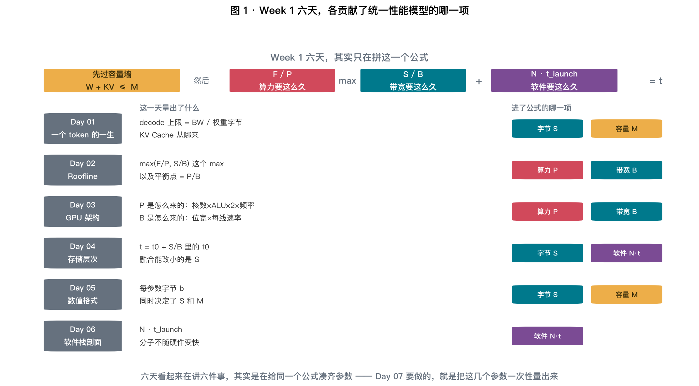
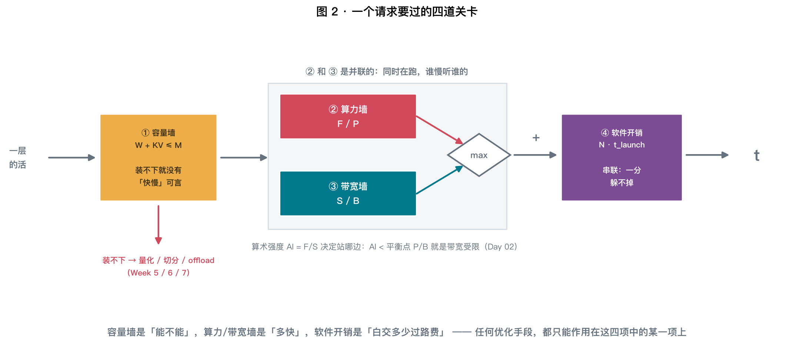
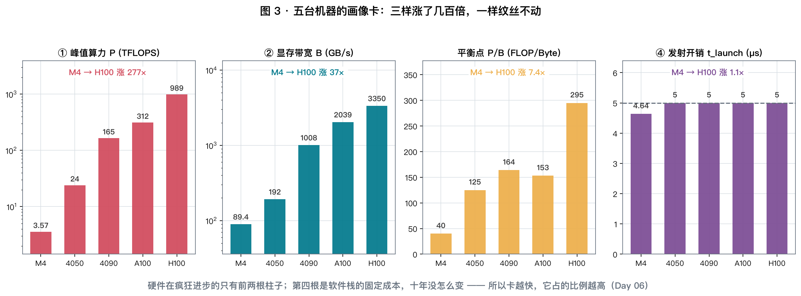
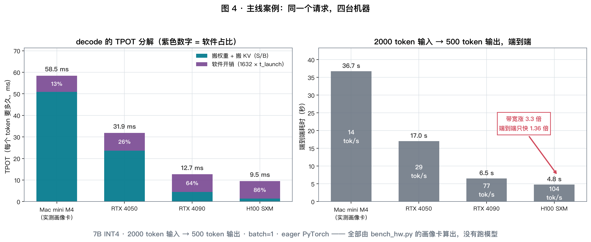
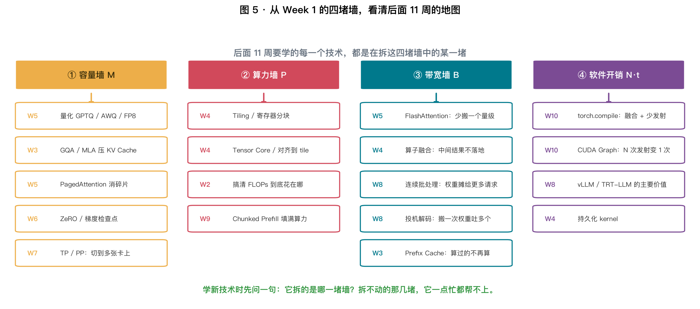
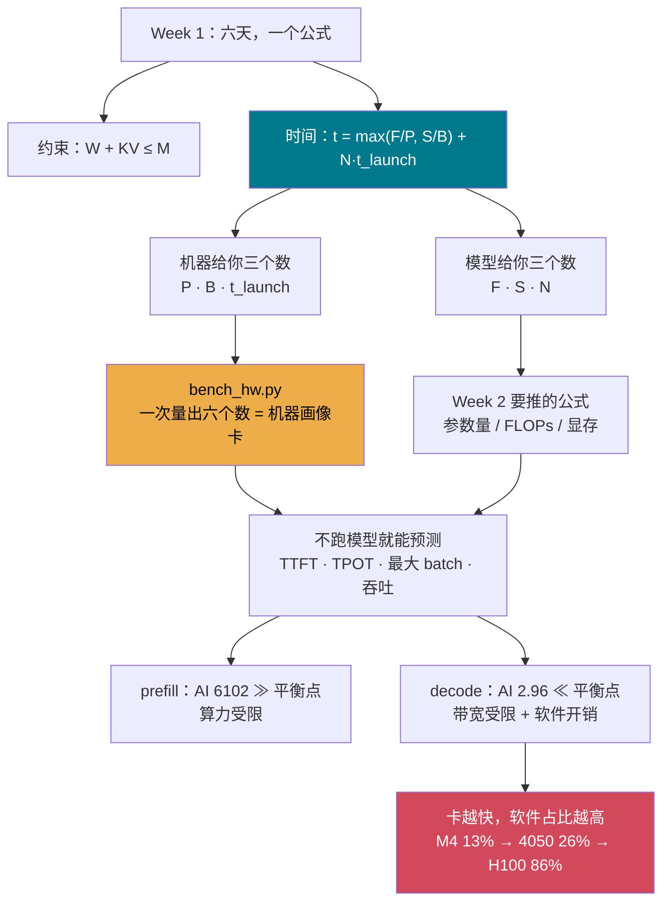

# Day 07 · Week 1 复盘 + 实测工作坊：六天，其实只在拼一个公式

> **今日目标**：把 Week 1 的六天合并成**一个统一性能模型**，
> 做成一个跨平台工具 `bench_hw.py`，一次量出你机器的**六个数**，
> 然后**不加载任何模型**，把主线案例从头到尾算一遍。

⏱ 阅读 35 min · 动手 40 min · 思考 15 min

---

## 1. 三个数，说明你这周到底学到了什么

```
① 不跑模型、不加载权重，只用六个实测数字，就能算出
   「7B INT4 在 H100 上 decode 一个 token 要 9.5 ms，其中 86% 花在发命令」

② 从 RTX 4090 换到 H100：算力涨 6.0 倍、带宽涨 3.3 倍，
   同一个请求的端到端只快 1.36 倍

③ 在 M4 上量那个「过路费 t0」，有三条完全无关的路：
   带宽曲线的拟合截距 4.66 µs · 最小 kernel 的摊薄耗时 4.75 µs · 队列深度稳态 4.64 µs
   —— 三条路差不到 2%
```

第 ③ 条是今天最该在意的一条：**同一个物理量，用三种毫不相干的方法量出同一个数，
说明模型不是编的**。这就是「工程直觉」的来源。

---

## 2. 六天，其实只在拼一个公式



### 2.1 统一性能模型

先过**容量墙**（不是速度问题，是「能不能」的问题）：

$$
\boxed{\ W + \text{KV} \;\le\; M\ }
$$

过了容量墙，才谈得上快慢：

$$
\boxed{\ t \;=\; \underbrace{\max\!\left(\frac{F}{P},\ \frac{S}{B}\right)}_{\text{硬件下界（Day 02）}}
\;+\; \underbrace{N \cdot t_{\text{launch}}}_{\text{软件过路费（Day 06）}}\ }
$$

| 符号 | 是什么 | 从哪来 |
|---|---|---|
| $F$ | 这一步要算多少 FLOPs | 模型（Week 2 会推公式） |
| $S$ | 这一步要搬多少字节 | 权重 + KV + 激活 |
| $P$ | 峰值算力 FLOP/s | **机器**（Day 01/03） |
| $B$ | 显存带宽 Byte/s | **机器**（Day 01/03/04） |
| $M$ | 可用容量 Byte | **机器**（Day 04/05） |
| $N$ | 发了几个 kernel | 模型 × 框架（Day 06） |
| $t_{\text{launch}}$ | 一个 kernel 的过路费 | **机器 × 框架**（Day 04/06） |

**左边四项是模型的事，右边三项是机器的事。** 今天要做的就是把右边三项一次性量出来。

### 2.2 一个请求要过的四道关卡



看图 2，注意两处**符号不一样**，这是最容易记混的地方：

| | 关系 | 为什么 |
|---|---|---|
| 算力墙 vs 带宽墙 | **max** | 算和搬是**并联**的：GPU 一边搬一边算，谁慢等谁 |
| 硬件 vs 软件 | **加号** | 发射是**串联**的：CPU 不把命令交出去，GPU 就没活干 |

> ⚠️ **严格讲第二行也该是 max**：CPU 可以提前把命令排进队列，理想情况下发射被完全隐藏，
> 于是 $t = \max(N t_{\text{launch}},\ \sum \max(F/P, S/B))$。
>
> 但 Day 06 实测（实验 D）出来的数**更接近加号**，原因有三：
> ① 一层里的 kernel 互相有数据依赖，不能乱序跑；
> ② 每个 kernel 收尾到下一个启动之间有间隙；
> ③ eager 模式下 CPU 也要等上一步的元数据才能构造下一步。
>
> **所以：加号是保守估计（悲观），max 是乐观估计，真实值在两者之间、偏向加号。**
> 本文一律用加号 —— 这也是 T2 要你去验证的事。

### 2.3 算术强度决定你站哪边

$$
\text{AI} = \frac{F}{S}\ \text{(FLOP/Byte)},\qquad
\text{机器平衡点} = \frac{P}{B}
$$

$\text{AI} < P/B$ → 带宽受限；$\text{AI} > P/B$ → 算力受限。这是 Day 02 的全部内容，
也是这周唯一一个**同时含模型和机器**的判据。

---

## 3. 六个数：怎么量才算数

Week 1 每天都在量东西，今天把方法收进一个工具。**关键不在于"能量出个数"，
而在于"量的方法对不对"** —— 下面每一条都是前六天踩出来的。

| # | 量 | 方法 | 出处 | 最容易量错的地方 |
|---|---|---|---|---|
| ① | 峰值算力 $P$ | 大方阵 GEMM 扫描 | Day 01/03 | 矩阵太小会被 tile 量化和固定开销吃掉 |
| ② | DRAM 带宽 $B$ | $t = t_0 + S/B$ 尾部最小二乘 | Day 04 | **不能用小尺寸**，会混进缓存 |
| ③ | 缓存拐点 | $S/(t-t_0)$ 曲线掉下来的位置 | Day 04 | $t \approx t_0$ 那几档必须扔掉 |
| ④ | 过路费 $t_0$ | 拟合截距 + 最小 kernel，两条路互证 | Day 04/06 | 单次 sync 量出来的是「同步代价」 |
| ⑤ | 稳态单价 $t_{\text{launch}}$ | 连发 1000 个不 sync | Day 06 | 发一个就 sync 会贵 40 倍 |
| ⑥ | 主机↔设备 / 可用容量 | `copy_` + 分配探测 | Day 04/05 | `empty()` 不写数据 = 没真占住 |

### 3.1 ① 算力：顺手拿到「有没有 Tensor Core」

同一份 GEMM 跑 FP16 和 FP32，比值就是答案：

$$
\frac{P_{\text{fp16}}}{P_{\text{fp32}}} \approx 1 \Rightarrow \text{没有独立矩阵单元，FP16 只是省了带宽}
$$

M4 实测 **1.10×** —— 和 Day 03 量到的 1.12× 对上了。
（在 4050 上你应该看到接近 **2×**，那才是 Tensor Core 的样子。）

### 3.2 ②③④ 一次扫描，同时拿到三个数

这是今天最值钱的手法。回到 Day 04 的模型：

$$
t = t_0 + \frac{S}{B}
$$

这是一条**直线**。对足够大的 $S$（一定落在 DRAM 上）做最小二乘：

$$
\text{斜率} = \frac{1}{B},\qquad \text{截距} = t_0
$$

M4 实测（`--exp` 里的第二段）：

| 工作集 | 搬运字节 | 耗时 | 朴素 $S/t$ | 扣掉 $t_0$ 后 $S/(t-t_0)$ |
|---|---|---|---|---|
| 0.38 MB | 0.4 MB | 5.2 µs | 75.9 GB/s | — 这一档几乎全是 $t_0$ |
| 0.75 MB | 0.8 MB | 6.0 µs | 130.7 GB/s | — |
| 1.50 MB | 1.6 MB | 7.0 µs | 223.8 GB/s | — |
| 3.00 MB | 3.1 MB | 22.6 µs | 138.9 GB/s | **175.8 GB/s** |
| 6.00 MB | 6.3 MB | 46.1 µs | 136.5 GB/s | **152.2 GB/s** |
| **12.00 MB** | 12.6 MB | 133.5 µs | 94.3 GB/s | **97.7 GB/s** ← 掉下来了 |
| 24.00 MB | 25.2 MB | 290.5 µs | 86.6 GB/s | 88.1 GB/s |
| 384.00 MB | 402.7 MB | 4503.7 µs | 89.4 GB/s | 89.5 GB/s |

三个数一次到手：

$$
B = 89.4\ \text{GB/s}\quad
t_0^{\text{拟合}} = 4.66\ \text{µs}\quad
\text{缓存拐点} \approx 6 \sim 12\ \text{MB}
$$

> ⚠️ **我在写这个工具时踩的坑**：一开始对**所有**尺寸都算 $S/(t-t_0)$，
> 结果最小的几档打印出 **196608 GB/s**。
> 原因很简单：$t$ 和 $t_0$ 是两个相近的数，相减之后**噪声被放大了几百倍**。
>
> $$\text{规则：只有 } t > 3t_0 \text{ 的那些档，}S/(t-t_0)\text{ 才有意义}$$
>
> 这不是代码 bug，是**测量方法本身的边界**。任何"扣掉基线再相除"的测法都有这个问题。

### 3.3 ⑤ 稳态单价：别用「发一个就 sync」的数

| 连发多少个 | 总耗时 | 平均每个 |
|---|---|---|
| 1 | 225.2 µs | **225.2 µs** ← 这一行几乎全是同步代价 |
| 10 | 270.2 µs | 27.0 µs |
| 100 | 677.1 µs | 6.8 µs |
| 1000 | 4644.0 µs | **4.64 µs** ← 流水线打满后的真单价 |

$$
\boxed{\ \text{一次同步} = 225\ \text{µs} \approx 48\ \text{个 kernel 的发射开销}\ }
$$

估「$N$ 个算子要多久」时，用的必须是**最后一行**那个 4.64 µs。
用第一行的 225 µs 会把估算放大 **48 倍**。

### 3.4 ⑥ 容量：`empty()` 不算数

```python
blocks.append(torch.empty(1 << 28, device=dev))     # ❌ 分配器可能只是记账
```

第一版工具在 M4 上量出「能连续分配 **19.5 GB**」—— 而这台机器一共才 16 GB 统一内存。
分配器只是记了个账，**没有真去要物理页**。加上 `fill_()` 之后：

```python
blk = torch.empty(1 << 28, dtype=torch.float16, device=dev)
blk.fill_(1.0); sync(dev)                            # ✅ 逼它真占住
```

量出 **11.5 GB**，和 Metal 报的 `recommended_max_memory` = 11.8 GB 对上了。

> **这条经验很实用**：以后看到任何显存工具报出的数比物理显存还大，
> 第一反应应该是"它只统计了虚拟分配"。

---

## 4. M4 的画像卡



```bash
uv run python labs/day07/bench_hw.py
```

```
╭──────────────────────── 机器画像卡 ────────────────────────╮
│ Apple Silicon GPU (MPS) · arm64 · Darwin                   │
│                                                            │
│ ① 峰值算力 P (fp16)     3.57 TFLOPS   (fp32 3.25，比值 1.10×)
│ ② DRAM 带宽 B          89.4 GB/s     缓存段峰值 176 GB/s
│ ③ 缓存拐点               6 MB
│ ④ 过路费 t0            4.75 µs       (拟合截距独立测出 4.66 µs)
│ ⑤ 稳态发射单价         4.64 µs       一次同步要 225 µs
│ ⑥ 主机↔设备           24.2 GB/s ↑ / 23.4 GB/s ↓
│    可用容量            11.5 GB       (标称 11.8 GB)
│                                                            │
│ 机器平衡点 = P / B = 40 FLOP/Byte                          │
╰────────────────────────────────────────────────────────────╯
```

### 4.1 三条自洽性检查（这才是复盘的意义）

| 检查 | 今天量到 | 前几天量到 | 差多少 |
|---|---|---|---|
| 峰值算力 | 3.57 TFLOPS | Day 03 的 3.56 | 0.3% |
| 平衡点 | 40 | Day 01 的 39 | 2.6% |
| $t_0$（三条路） | 4.66 / 4.75 / 4.64 µs | Day 06 的 2.8~3.2 µs | 同一量级 |

前两行对得很死。第三行有系统性偏差，值得说一句：

> $t_0$ 是**六个数里最不稳的一个**，它依赖当时的系统负载、后台进程、
> 甚至 Metal 的 shader 缓存状态。Day 06 那次量到 2.8~3.2 µs，今天量到 4.6~4.8 µs。
> **所以估算时要按量级用（"几个微秒"），不要当成物理常数。**
> 而 $P$ 和 $B$ 是真正的硬件常数，重复测的一致性远好于它。

### 4.2 图 3 的关键信息

同一张图里四根柱子，M4 → H100：

| 量 | 涨了多少倍 |
|---|---|
| 峰值算力 $P$ | **277×** |
| 显存带宽 $B$ | **37×** |
| 平衡点 $P/B$ | 7.4×（算力涨得比带宽快 → 越来越难喂饱） |
| **发射开销 $t_{\text{launch}}$** | **1.1×** |

$$
\boxed{\ \text{硬件在飞速进步，软件栈的固定成本十年没怎么动}\ }
$$

这一句就是 Day 06 那条公式的图形版，也是下一节所有反直觉结论的根源。

---

## 5. 闭卷复答：主线案例



```bash
# 用刚才存下来的画像卡预测（完全不碰硬件、不加载模型）
uv run python labs/day07/bench_hw.py --predict

# 想知道换台卡会怎样：用标称参数拼一张画像卡
uv run python labs/day07/bench_hw.py --machine rtx4050
uv run python labs/day07/bench_hw.py --machine h100
```

**题目**：7B（Llama-2 架构，MHA）· INT4 权重 · 2000 token 输入 → 500 token 输出 · batch=1

### 5.1 先过容量墙

$$
W = 6.74\times10^9 \times 0.5\ \text{B} = 3.14\ \text{GiB},\qquad
\text{KV/token} = 2 \cdot 32 \cdot 32 \cdot 128 \cdot 2 = 512\ \text{KB}
$$

$$
\text{KV}_{2500} = 2500 \times 512\ \text{KB} = 1.22\ \text{GiB}
$$

| 机器 | 可用 | 权重 + KV | 装得下 | **容量允许的最大 batch** |
|---|---|---|---|---|
| Mac mini M4 | 11.5 GB | 4.36 GB | 是 | **6** |
| RTX 4050 | 5.6 GB | 4.36 GB | 是（勉强） | **2** |
| RTX 4090 | 23.0 GB | 4.36 GB | 是 | **16** |
| H100 SXM | 78.0 GB | 4.36 GB | 是 | **61** |

**6 GB 的卡上，7B INT4 的 batch 上限是 2。** 这一条决定了后面所有吞吐数字的天花板。

### 5.2 再算速度

| 机器 | TTFT | TPOT | 端到端 | 单流吞吐 | **软件占 TPOT** |
|---|---|---|---|---|---|
| Mac mini M4（实测画像卡） | 7559 ms | 58.4 ms | 36.7 s | 13.6 tok/s | 13% |
| RTX 4050 | 1131 ms | 31.9 ms | 17.0 s | 29.4 tok/s | **26%** |
| RTX 4090 | 172 ms | 12.7 ms | 6.5 s | 77.0 tok/s | **64%** |
| H100 SXM | 35 ms | 9.5 ms | 4.8 s | 104.5 tok/s | **86%** |

三个结论，每一个都是 Week 1 的直接后果：

1. **两个阶段的瓶颈完全相反。** prefill 的 AI = 6102 ≫ 平衡点 → 算力受限；
   decode 的 AI = 2.96 ≪ 平衡点 → 带宽受限。**同一个模型、同一台机器，撞两堵不同的墙。**
2. **H100 的 TPOT 里 86% 在发命令。** 卡越快，这个比例越高（图 3 第四根柱子）。
3. **4090 → H100，带宽涨 3.3 倍，端到端只快 1.36 倍。** 因为 499 个 decode step 主导端到端，
   而 decode step 里最大的一块（8.16 ms 软件开销）**一分没少**。

### 5.3 一个必须做的修正

Day 01 我们估过「4050 上 TTFT ≈ 2.8 s」。今天算出来是 **1.13 s**。差了 2.5 倍，为什么？

| | Day 01 | 今天 |
|---|---|---|
| 用的算力 | 保守的**有效**算力（约 10 TFLOPS） | 标称峰值 **24 TFLOPS** |
| 性质 | 悲观估计 | 乐观下界 |

**两个都不算错，但必须说清楚用的是哪个。** Day 03 量到 M4 的 GEMM 达成率是 99%，
但那是**最理想的大方阵**；真实 prefill 里有 attention、有 softmax、有各种小算子，
达成率通常在 **50%~70%**。

$$
\text{真实 TTFT}_{4050} \approx \frac{1.13\ \text{s}}{0.6} \approx 1.9\ \text{s}
$$

> **这就是"标称值"和"实测值"必须分开记的原因**（`results/hardware-baseline.md` 里
> 一直是两列）。算下界用标称，做承诺用实测。

---

## 6. 手算练习（20 分钟）

**Q1（对账）**. 用 M4 的画像卡（$P=3.57$ TFLOPS，$B=89.4$ GB/s，$t_{\text{launch}}=4.64$ µs），
手算 7B INT4 在 M4 上的 TPOT（上下文按 2250 token 算），再和工具输出对一遍。

<details>
<summary>点开答案</summary>

**要搬多少字节**：

$$
S = \underbrace{3.37\times10^9}_{\text{权重 3.14 GiB}} + \underbrace{2250 \times 524288}_{\text{KV} = 1.18\times10^9} = 4.55\times10^9\ \text{B}
$$

**要算多少 FLOPs**（decode 一个 token 前向 = $2P$）：

$$
F = 2 \times 6.74\times10^9 = 1.35\times10^{10}\ \text{FLOP}
$$

**三项分别要多久**：

$$
\frac{F}{P} = \frac{1.35\times10^{10}}{3.57\times10^{12}} = 3.78\ \text{ms}
\qquad
\frac{S}{B} = \frac{4.55\times10^9}{89.4\times10^9} = 50.9\ \text{ms}
$$
$$
N \cdot t_{\text{launch}} = 32 \times 51 \times 4.64\ \text{µs} = 1632 \times 4.64 = 7.57\ \text{ms}
$$

$$
\text{TPOT} = \max(3.78,\ 50.9) + 7.57 = \mathbf{58.5\ ms}
$$

工具输出 58.44 ms。**手算和代码完全一致 —— 这就是今天要达成的状态。**

顺手检查算术强度：$\text{AI} = 1.35\times10^{10} / 4.55\times10^9 = 2.96$，
平衡点 40，差 **13 倍** → 铁定带宽受限。
</details>

**Q2（batch）**. 4050 上把 batch 从 1 加到 2（容量上限），吞吐涨几倍？
为什么不是 2 倍？

<details>
<summary>点开答案</summary>

$$
\text{batch}=1:\quad S = 3.37 + 1.18 = 4.55\ \text{GB} \Rightarrow \frac{S}{B} = 23.7\ \text{ms}
$$
$$
\text{batch}=2:\quad S = 3.37 + 2\times1.18 = 5.73\ \text{GB} \Rightarrow \frac{S}{B} = 29.8\ \text{ms}
$$

| batch | TPOT | 吞吐 |
|---|---|---|
| 1 | $23.7 + 8.16 = 31.9$ ms | 31.4 tok/s |
| 2 | $29.8 + 8.16 = 38.0$ ms | **52.6 tok/s** |

**只涨了 1.67 倍，不是 2 倍。**

原因：**权重被摊薄了，但 KV 没有。**

$$
S(B) = \underbrace{W}_{\text{摊薄}} + \underbrace{B \cdot \text{KV}_{\text{ctx}}}_{\text{线性增长}}
$$

$W = 3.37$ GB 是 1 份，而 KV 每加一路请求就多 1.18 GB。
batch 越大，KV 占比越高，摊薄的收益越小。

> **这直接引出 Week 3 的核心动机**：把 KV/token 从 MHA 的 512 KB 压到 GQA 的 128 KB，
> 同样 6 GB 的卡上 batch 上限从 2 变成 **8**，吞吐从 52.6 涨到 ~130 tok/s。
> **压 KV 不是为了省显存，是为了买 batch。**
</details>

**Q3（跨机器）**. 4090 → H100，算力涨 6.0 倍、带宽涨 3.3 倍，
为什么端到端只快 1.36 倍？分别看 TTFT 和 TPOT。

<details>
<summary>点开答案</summary>

**TTFT（算力受限，真涨了）**：

$$
\frac{27.0\ \text{TFLOP}}{165\ \text{TFLOPS}} = 163\ \text{ms} \;\longrightarrow\;
\frac{27.0}{989} = 27.3\ \text{ms}\qquad(\textbf{6.0×})
$$

**TPOT（带宽受限 + 软件，几乎没涨）**：

| | 4090 | H100 | 比值 |
|---|---|---|---|
| $S/B$ | 4.51 ms | 1.36 ms | 3.3× |
| $N \cdot t_{\text{launch}}$ | 8.16 ms | **8.16 ms** | **1.0×** |
| TPOT | 12.67 ms | 9.52 ms | **1.33×** |

**端到端由 499 次 decode 主导**：

$$
\text{4090}: 0.172 + 499 \times 0.01267 = 6.50\ \text{s}
$$
$$
\text{H100}: 0.035 + 499 \times 0.00952 = 4.78\ \text{s}\qquad(\mathbf{1.36×})
$$

$$
\boxed{\ \text{涨得最猛的那一项（算力），恰好落在占比最小的阶段（TTFT）上}\ }
$$

而占端到端 97% 的 decode，最大的一块开销**根本不是硬件**。

> **这是买卡时最容易犯的错**：看着规格表上的 TFLOPS 做决策，
> 但如果你的负载是 decode，你买的那 6 倍算力**一点用都没有**。
> 该看的是「带宽 ÷ 价格」，以及"能不能上 CUDA Graph"。
</details>

**Q4（反过来问）**. 给定 SLO：TPOT ≤ 50 ms。在 M4 上最大能跑多大的模型（INT4，GQA 128 KB/token，上下文 2000）？

<details>
<summary>点开答案</summary>

先把软件开销扣掉（它不随模型大小变 —— 只要层数不变）：

$$
\frac{S}{B} \le 50 - 7.6 = 42.4\ \text{ms}
\;\Rightarrow\;
S \le 42.4\times10^{-3} \times 89.4\times10^9 = 3.79\times10^9\ \text{B}
$$

减掉 KV：

$$
\text{KV} = 2000 \times 128\ \text{KB} = 0.26\times10^9\ \text{B}
\;\Rightarrow\;
W \le 3.53\times10^9\ \text{B}
$$

INT4 每参数 0.5 B：

$$
\boxed{\ P \le 7.1\times10^9 = \mathbf{7B}\ }
$$

**M4 在 50 ms SLO 下的上限恰好就是 7B INT4。** 13B INT4（6.5 GB）会到：

$$
\frac{6.98\times10^9 + 0.26\times10^9}{89.4\times10^9} + 7.6\ \text{ms} = 88.6\ \text{ms}\quad(\text{超标 1.8 倍})
$$

> 注意这里 **11.5 GB 的容量完全够装 13B INT4**（6.5 GB），
> **卡住你的是带宽，不是容量**。
> 「装得下」和「跑得动」是两件事 —— 这是 Week 1 最实用的一条经验。
</details>

---

## 7. 动手实验（40 分钟）

```bash
# 全量实测，输出画像卡并存成 results/profile_<backend>.json
uv run python labs/day07/bench_hw.py

# 快速版（尺寸扫小一点）
uv run python labs/day07/bench_hw.py --quick

# 之后随时用画像卡预测，不再碰硬件
uv run python labs/day07/bench_hw.py --predict --model llama3-8b --wbits 16 --batch 4

# 手里没有的卡：用标称参数拼一张画像卡
uv run python labs/day07/bench_hw.py --machine h100
```

**必做的四件事**：

1. **两台机器都跑一遍**，把六个数填进 `day07-notes.md` 和 `results/hardware-baseline.md`。
2. **在 4050 上重点看两个数**：
   - FP16 / FP32 比值 —— 应该接近 **2×**（M4 是 1.10×）。这是你第一次亲眼看到 Tensor Core。
   - 缓存拐点 —— 4050 有 24 MB L2，M4 只有 6~12 MB。曲线形状会完全不同。
3. **把画像卡里的 $B$ 换成标称值再预测一遍**（M4 改成 120，4050 改成 192），
   看 TPOT 差多少。**体会"用标称值做承诺"有多危险。**
4. **改 `--s-in` / `--s-out` / `--batch`**，找到你机器上「TPOT 刚好 50 ms」的那个 batch。

---

## 8. 思考题

**T1（自洽性）**
你在 4050 上量到的 $t_0$（拟合截距）和 $t_{\text{launch}}$（队列稳态），差多少？
如果差得很远（比如 2 倍以上），**可能是哪个环节的测法出了问题？**
（提示：想想 CUDA 的 pageable vs pinned、以及有没有别的进程在占 GPU。）

**T2（验证 §2.2 的争议）**
本文用的是 $t = \max(F/P, S/B) + N t_{\text{launch}}$（加号，保守）。
**设计一个实验，判断你的机器上到底更接近"加号"还是"max"。**
（提示：连续跑 $N$ 个**互不依赖**的小 GEMM，和跑 $N$ 个**首尾相连**的，比一比。）

**T3（开放）**
今天的模型里，$N \cdot t_{\text{launch}}$ 是唯一一项**不随硬件进步而变小**的。
按图 3 的趋势外推，**再过两代卡，decode 的软件开销占比会到多少？**
到那时，「买更快的卡」还是提升推理吞吐的有效手段吗？如果不是，钱该花在哪？

---

## 9. Week 1 的四堵墙 → 后面 11 周的地图



这张图是 Week 1 交给你的**最大一件工具**：

> **以后学任何一个新技术，先问一句：它拆的是哪一堵墙？**
>
> - FlashAttention 拆**带宽墙**（少搬一个量级）→ 你是算力受限的话，它帮不上忙
> - CUDA Graph 拆**软件开销**（$N$ 次发射变 1 次）→ 你是 GPU-bound 的话，它一点用都没有
> - 量化同时拆**容量墙**和**带宽墙**，但**永远拆不动算力墙**（Day 05 的结论）
> - 连续批处理拆的是**带宽墙**（权重摊给更多请求），而它的上限由**容量墙**决定

**大部分"这个技术没效果"的困惑，都是因为它拆的墙和你撞的墙不是同一堵。**

---

## 10. 一图总结



**今日一句话**：
> 你现在有一张**六个数的机器画像卡**，和一个**三项的公式**。
> 拿它们就能在纸上把任何模型在任何机器上的性能算个八九不离十 ——
> **后面 11 周学的每一个技术，都是在改这六个数里的某一个。**

---

## 11. 延伸阅读

| 类型 | 材料 | 建议 |
|---|---|---|
| 📄 经典 | McCalpin, *STREAM Benchmark* | 本文 ② 的方法论鼻祖，30 年了还在用 |
| 📄 必读 | Williams et al., *Roofline: An Insightful Visual Performance Model* (2009) | Day 02 的原始论文，复盘时重读一遍 |
| 📄 好文 | Horace He, *Making Deep Learning Go Brrrr From First Principles* | 「算力 / 带宽 / 开销」三分法的最佳白话版 |
| 🔧 工具 | NVIDIA `bandwidthTest` / `nbody` | CUDA samples 里的官方基准，可以和你的数对一下 |
| 🔧 工具 | `nvidia-smi -q -d CLOCK` | 4050 上先确认没降频，否则量出来的全是笔记本的功耗墙 |
| 📄 参考 | TechPowerUp GPU Database | 查标称参数（位宽、每 pin 速率、SM 数） |

---

## ✅ Week 1 毕业考（闭卷，10 分钟）

不许翻前面。能答出 8 条以上，Week 1 就算过了：

1. 写出统一性能模型的两个式子（约束 + 时间）
2. 为什么算力和带宽之间是 `max`，而软件开销是 `+`？
3. 算术强度的定义，以及它和平衡点比较的意义
4. decode 的算术强度约等于什么？
5. KV Cache 每 token 的字节数公式
6. 每 token 的前向 FLOPs 是多少（用参数量 $P$ 表示）？
7. FP16 的最大值、最小正规数、以及"数不动"的位置
8. 为什么 GPU 越快，软件栈开销占比越高？写出那个公式
9. 说出三个会触发隐式同步的写法
10. 你两台机器的平衡点分别是多少？

---

## ✅ 今日检查清单

- [ ] 能默写统一性能模型，并说清 `max` 和 `+` 各自的道理
- [ ] 在**两台机器**上跑完 `bench_hw.py`，六个数都填进了笔记
- [ ] 在 4050 上确认了 FP16/FP32 ≈ 2×（Tensor Core 的第一次现身）
- [ ] 手算 Q1 的 TPOT，和工具输出**对上了**
- [ ] 能解释 Q3：为什么 H100 端到端只比 4090 快 1.36 倍
- [ ] 理解「装得下 ≠ 跑得动」（Q4）
- [ ] 记住图 3 的 punchline：**$P$ 涨 277×，$B$ 涨 37×，$t_{\text{launch}}$ 涨 1.1×**
- [ ] 完成 Week 1 毕业考 8 条以上
- [ ] 笔记写进 `day07-notes.md`，实测数填进 `results/hardware-baseline.md`

---

**接下来怎么走**：

Week 1 讲完了「**机器能给你什么**」，Week 2 开始讲「**模型要花掉多少**」——
也就是把上面公式里的 $F$、$S$、$N$ 从模型配置里推出来。

> 📐 **强烈建议在这里插入附加系列 [X01–X10](../../EXTRA-SYLLABUS.md)**。
> Week 2 会直接推参数量 $12d^2L$ 和 FLOPs 公式，但**不会解释「为什么是这个结构」**。
> X 系列补的正是这一块（点积 → 矩阵 → softmax → 注意力 → 多头 → 位置编码）。
> 已完成 [X01 向量与点积](../extra/x01-vectors.md) 和 [X02 矩阵与形状](../extra/x02-matrices-shapes.md)。

**Day 08**：Transformer 逐层拆解 —— 把 $12d^2L$ 一项一项推出来，
然后回答一个今天绕不开的问题：**那 51 个算子到底是哪 51 个？**
