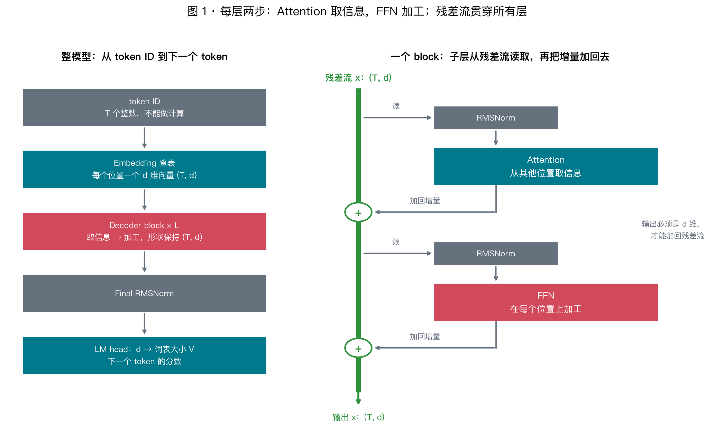
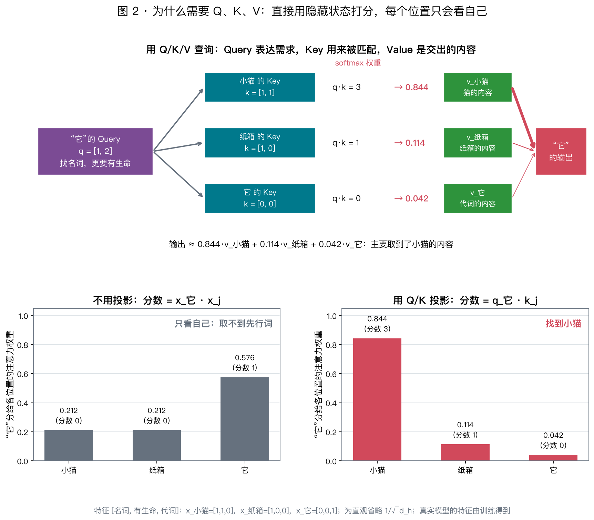
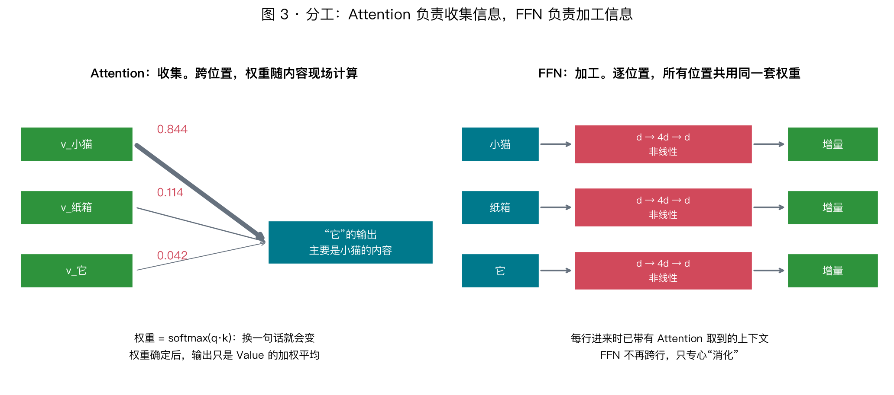
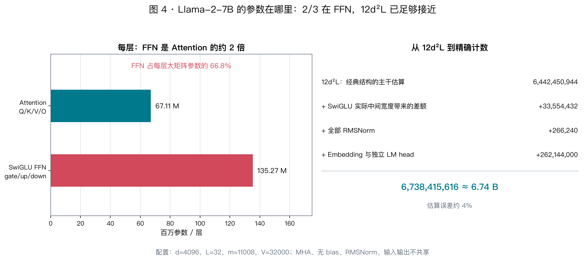

# Day 08 · Transformer 结构与参数量：每个部件为什么存在

> **今日目标**：讲清 Transformer 每个部件**要解决什么问题**，特别是 Attention 为什么需要 Q、K、V 三个不同的向量；在此基础上推出参数量公式 $12d^2L$，并核对 Llama-2-7B。

⏱ 设计动机 40 min · 参数计算 20 min · 练习 15 min

今天不跑性能实验，也不下载权重。阅读时抓住一条主线：**每个部件都是对一个具体问题的回答**。能说出“没有它会怎样”，比记住公式更重要。

---

## 0. 模型要做什么，因此需要什么

语言模型只做一件事：**给定前文，预测下一个 token**。

> 小猫钻进纸箱，随后**它**蜷成一团。

要在“它”之后接上合理的词，模型必须知道“它”指小猫而不是纸箱。这句话暴露了两个需求：

1. **从别的位置取信息**：“它”自身的 token ID 不含“猫”的意思，必须从前文把相关信息取过来。
2. **在每个位置上加工信息**：取来的信息要和已有信息组合、推理，变成更有用的表示，比如“这里是一只蜷缩的猫，后面可能接睡觉、叫声……”。

Transformer 的每一层恰好就是这两步，外加两个让深层网络能训练的辅助部件：

| 需求 | 部件 | 一句话 |
|---|---|---|
| 从别的位置取信息 | **Attention** | 按内容决定从哪些位置取、各取多少 |
| 在每个位置上加工 | **FFN** | 对每个位置单独做非线性变换 |
| 叠很多层还能训练 | **残差连接** | 每层只往表示上“加增量”，不重写 |
| 数值尺度稳定 | **Norm** | 每个子层的输入都先归一化 |

```text
token ID → Embedding → 每个位置一个 d 维向量（隐藏状态）
    ↓
重复 L 层：
    x = x + Attention(Norm(x))     ← 跨位置取信息
    x = x + FFN(Norm(x))           ← 逐位置加工
    ↓
Final Norm → LM head → 下一个 token 的分数
```



今天需要记住的公式只有三个：

$$
\text{矩阵参数量}=\text{行数}\times\text{列数},\qquad
\text{Attention}=4d^2,\qquad
\text{FFN}=8d^2
$$

---

## 1. 从 token 到向量

Tokenizer 把文本切成 token，每个 token 用一个整数 ID 表示。ID 只是编号：相邻的 ID 不代表意思相近，也没法对 ID 做“加权平均”。

所以第一步是 **Embedding**：一张可训练的表，每个 ID 查出一行 $d$ 维浮点向量。向量可以计算相似度、可以相加、可以被线性变换，后面所有运算都在这些向量上进行。

$T$ 个 token 排成矩阵 $X$，形状为 $(T,d)$：每行是一个位置的向量，称为**隐藏状态**。Llama-2-7B 的 $d=4096$。

**每一层输入 $(T,d)$，输出也是 $(T,d)$**：数值不断更新，形状保持不变。这不是巧合，而是残差连接的要求（第 4 节）——只有形状相同，才能逐元素相加，层才能一层层叠上去。

---

## 2. Attention：按内容去别的位置取信息

### 2.1 难点：不知道要去哪里取

要让“它”拿到“小猫”的信息，最直接的想法是用一组**固定权重**混合前文，比如“平均前面所有位置”或“多看上一个位置”。这行不通：

- 换一句话，“小猫”可能在第 2 个位置，也可能在第 20 个位置；
- 同一句话里，“它”需要小猫，“蜷成”可能更需要“它”；
- 输入长度每次都不同，固定权重连形状都对不上。

结论：**从哪里取、取多少，必须由当前内容现场算出来。**

### 2.2 思路：软的“查字典”

先看一个熟悉的结构——字典（哈希表）：

```text
拿一个 query 去和每个 key 比较 → 找到匹配的 key → 返回它的 value
```

Attention 就是把它“软化”：

| | 字典 | Attention |
|---|---|---|
| 匹配方式 | key 完全相等才命中 | 用点积衡量**相似程度** |
| 返回什么 | 唯一命中的那个 value | 按相似程度对所有 value **加权平均** |
| 能否训练 | 不可微 | 处处可微，可以用梯度学习“该查什么” |

每个位置都拿自己的 query，去和所有可见位置的 key 比较，按匹配程度把它们的 value 混合起来，作为自己取到的信息。

### 2.3 为什么需要 Q、K、V 三个不同的向量

最省事的做法是：**直接用隐藏状态本身**当 query、key 和 value，即用 $x_i\cdot x_j$ 打分、对 $x_j$ 加权求和。这个方案有三个致命问题：

**问题 1：每个位置最关注的总是自己。** Norm 会让各位置的向量长度相近；长度相同时，向量和自己的点积最大（柯西–施瓦茨不等式）。于是“它”最关注的是“它”，根本取不到别人的信息。

**问题 2：关系被迫对称。** $x_i\cdot x_j=x_j\cdot x_i$，“它”对“小猫”的关注度必然等于“小猫”对“它”的关注度。但关系本来是单向的：“它”需要找先行词，“小猫”并不需要找代词。

**问题 3：“我在找什么”和“我是什么”被绑在一起。** 代词要找的是“有生命的名词”，但它自己并不是名词。用同一个向量，无法同时表达“我需要什么”和“我能提供什么”。

解决办法是给同一个隐藏状态学习**三种不同的读法**：

$$
q_i=x_iW_Q,\qquad k_j=x_jW_K,\qquad v_j=x_jW_V
$$

| 向量 | 回答的问题 | 图书馆类比 |
|---|---|---|
| **Query** $q_i$ | 位置 $i$：我在找什么样的信息？ | 读者的检索需求 |
| **Key** $k_j$ | 位置 $j$：我能匹配什么样的需求？ | 书脊上的分类标签 |
| **Value** $v_j$ | 位置 $j$：被选中后，我交出什么内容？ | 书里的正文 |

逐条对照前面的三个问题：

- **Q 与 K 分开**：打分变成 $q_i\cdot k_j=x_iW_QW_K^\top x_j^\top$。中间的 $W_QW_K^\top$ 是一个学出来的“匹配规则”，它可以不对称，也不再偏向自己。“它”的 query 可以表达“找有生命的名词”，而“它”自己的 key 不必是名词。
- **K 与 V 分开**：用来**被找到**的特征（比如“我是有生命的名词”）和找到后要**传递**的内容（比如“猫、小、会蜷缩……”）往往不同。标签只需要便于匹配，正文需要承载信息。
- **三者都来自同一个 $x$**：所以叫**自**注意力。不同的只是三张可训练矩阵，它们决定了怎样从同一个向量里读出三种不同的东西。

还有一个对 infra 很关键的副作用：$k_j$ 和 $v_j$ **只依赖位置 $j$ 自己**，与谁来查询无关。因此它们可以算一次、存起来，供后面所有 query 反复使用——这就是 **KV Cache** 能成立的根本原因。反过来，$q_i$ 只在位置 $i$ 生成自己的输出时用一次，之后再也用不到，所以没有 “Q Cache”（[Day 09](day09-attention-complexity.md) §6.1 展开）。

> 上面的“找名词”“分类标签”是帮助理解的直觉。真实模型中 $W_Q,W_K,W_V$ 是训练出来的，各维度不一定对应人类能命名的概念；但“需求 / 标签 / 内容”的分工正是它们被设计成三个独立矩阵的原因。

### 2.4 一个算到底的小例子

用 3 个可解释的特征 `[名词, 有生命, 代词]` 手写隐藏状态：

```text
x_小猫 = [1, 1, 0]
x_纸箱 = [1, 0, 0]
x_它   = [0, 0, 1]
```

**不用投影**：“它”对三个位置的打分是 $x_它\cdot x_j=[0,0,1]$，只关注自己，取不到任何先行词信息。

**用投影**：假设训练后，Q/K 投影把向量映射到 `[是名词, 有生命]` 这个“匹配空间”：

```text
q_它   = [1, 2]     “要找名词，更要有生命”
k_小猫 = [1, 1]
k_纸箱 = [1, 0]
k_它   = [0, 0]     代词本身不提供这类标签
```

打分 $[3,1,0]$，softmax 后的注意力权重为：

$$
[0.844,\ 0.114,\ 0.042]
$$

“它”的输出约等于 $0.844\,v_{小猫}+0.114\,v_{纸箱}+0.042\,v_{它}$——主要取到了小猫的内容。这个例子为了直观省略了 $1/\sqrt{d_h}$ 缩放。



同一组投影下，“小猫”的 query 可以完全不同（比如它更关心自己做了什么动作），所以“小猫”看“它”的权重不必等于“它”看“小猫”的权重。

注意：这里的注意力权重是**根据当前输入算出来的激活**，换一句话就会变；训练后保存的参数只有 $W_Q,W_K,W_V$ 等矩阵。

### 2.5 softmax、缩放与因果 mask：各解决一个问题

完整的单头计算是：

$$
\operatorname{Attention}(Q,K,V)=\operatorname{softmax}\!\left(\frac{QK^\top}{\sqrt{d_h}}+M\right)V
$$

公式里每一项都对应一个问题：

| 组件 | 解决什么问题 | 没有它会怎样 |
|---|---|---|
| **点积** $QK^\top$ | 打分要便宜：所有位置对的分数可以合成**一次矩阵乘法** | 换成小网络逐对打分，$T^2$ 对就要 $T^2$ 次网络计算 |
| **softmax** | 把分数变成非负、和为 1 的权重 | 输出是 value 的“加权平均”，尺度不会随上下文变长而失控；同时可微 |
| **除以 $\sqrt{d_h}$** | 点积的方差随头宽 $d_h$ 增大 | 分数过大，softmax 几乎变成 one-hot，梯度接近 0，难以训练 |
| **因果 mask** $M$ | 训练时所有位置并行预测各自的下一个 token | 位置 $i$ 若能看到 $i+1$，就是直接“偷看答案” |

mask 把未来位置的分数设为 $-\infty$，softmax 后权重恰好为 0。位置 $i$ 可以看自己和之前的位置。softmax 的数值细节见 [X03](../extra/x03-softmax.md)。

### 2.6 为什么要多头

一个头对每个位置只产生**一组**权重分布。但“它”可能同时需要两类信息：先行词是谁，以及前面的动词是什么。单个分布只能在两者之间分配权重，混在一起后哪一类都不清楚。

**多头 = 并行做多次独立的查询。** 每个头有自己的匹配规则，可以关注不同的位置；各头结果拼接后，由 **O 投影**混合，并写回隐藏状态的坐标系。

关键在于多头**不增加参数**：总宽度 $d$ 被切成 $h$ 份，每头宽度 $d_h=d/h$。Llama-2-7B 是 4096 = 32 头 × 128。$W_Q$ 仍是一张 $(d,d)$ 矩阵，只是输出被分组使用。

### 2.7 还缺位置信息

只看内容点积，“狗咬人”和“人咬狗”中，“狗”与“人”的匹配分数完全一样——Attention 本身不知道谁在前、谁在后。Llama 用 **RoPE** 按位置旋转 Q 和 K，让点积能感知相对距离，而且不增加参数。原理留到 Day 11。

---

## 3. FFN：取到信息后，在每个位置上加工



**问题**：Attention 本质上是“搬运 + 加权平均”。权重确定后，输出只是 value 的线性组合，它擅长**收集**信息，却不擅长**处理**信息。

**回答**：FFN 对每个位置单独做一次非线性变换，所有位置共享同一组参数：

$$
\operatorname{FFN}(x)=\phi(xW_{\text{up}})\,W_{\text{down}}
$$

三个设计各有原因：

- **为什么逐位置**：跨位置交流已经由 Attention 完成；进入 FFN 的每一行都已带有上下文，这里专心“消化”。
- **为什么先变宽再缩回**：中间层通常是 $4d$。可以把每个中间单元看作一个“模式探测器”：$W_{\text{up}}$ 的一列判断输入是否符合某种模式，激活后，$W_{\text{down}}$ 的对应行把一段信息写回去。中间越宽，能存放的模式越多。研究者常把 FFN 看作模型存放知识的“键–值记忆”。缩回 $d$ 是为了能与残差相加。
- **为什么必须有非线性 $\phi$**：没有它，$xW_{\text{up}}W_{\text{down}}=x(W_{\text{up}}W_{\text{down}})$，两层就合并成一个线性层，变宽也毫无意义。

Llama 用的 **SwiGLU** 多一张门控矩阵：$\left[\operatorname{SiLU}(xW_{\text{gate}})\odot xW_{\text{up}}\right]W_{\text{down}}$，所以有三张矩阵。门控的好处留到 Day 13；今天只需要知道它影响参数计数。

---

## 4. 残差与 Norm：让 32 层能叠起来

### 4.1 残差：每层只写增量

**“残差”就是“差值”**：一层希望得到的输出，减去它的输入，剩下的那部分。

设一层理想的输出是 $H(x)$。普通网络让这一层直接算出 $H(x)$；残差连接则让它只算差值 $F(x)=H(x)-x$，再把输入原样加回去：

$$
\text{输出}=x+F(x)
$$

$F$ 学的就是这个“残差”，这也是 ResNet 中“残差学习”这一名称的来历。

**工程类比：提交 patch，而不是重写整个文件。** 隐藏状态像一份文档，每个子层只提交一份 diff，再合并进去。某个子层没什么可改时，提交空 diff 就行，文档原样保留。

**用 §2.4 的例子算一遍。** “它”进入 Attention 时是 $x=[0,0,1]$（只有“代词”这一维）。假设 Attention 从小猫那里取到的信息是 $F=[0.8,0.8,0]$：

| | 计算 | 结果 | 含义 |
|---|---|---|---|
| 有残差 | $x+F$ | $[0.8,\ 0.8,\ 1]$ | “我是代词”**并且**“我指一个有生命的名词” |
| 无残差 | $F$ | $[0.8,\ 0.8,\ 0]$ | 取到了小猫的信息，却丢了“我是代词” |

没有残差时，每一层都必须把旧信息重新抄一遍，否则就会丢失；有了残差，旧信息默认保留，每层只负责**添加**新信息。

为什么这让深层网络容易训练？

- **“什么都不做”最容易学**：没有残差时，一层要保持输入不变，就得精确学出单位变换；有残差时，只要 $F$ 输出接近 0 即可。训练初期权重很小，$F\approx0$，32 层的网络一开始就近似“把输入原样传下去”，再逐层学习各自的小修正。
- **梯度有直通路**：粗略地看，如果每层都把梯度缩小到 0.8 倍，穿过 32 层后只剩 $0.8^{32}\approx0.0008$；有残差时，由于 $\partial(x+F)/\partial x=I+\partial F/\partial x$，其中的 $I$ 让梯度始终可以沿加法原样传回浅层。

把 32 层连起来看，$x$ 就是一条贯穿所有层的**残差流**（residual stream）：每个 Attention 和 FFN 都从这条流里**读**信息，再把自己的结果**加**回去。由此可以直接得出：

- 每个子层的输出必须是 $d$ 维，才能加回残差流——所以 FFN 要缩回 $d$，多头拼接后还需要 O 投影；
- 后面的层能直接读到前面任意一层写入的信息，不需要中间各层逐层转抄。

### 4.2 Norm：控制每个子层看到的数值尺度

残差流不断相加，数值尺度会逐层漂移。**Pre-Norm** 在每个子层**之前**做归一化，让 Attention 和 FFN 总是看到尺度稳定的输入。

Llama 用 **RMSNorm**：每个位置的向量除以自身的均方根，再乘以一组可学习的缩放系数（$d$ 个参数）。它只在特征维上计算，不混合不同位置。为什么用 Pre-Norm、为什么去掉均值，留到 Day 12。

---

## 5. 参数、激活与 KV Cache

数参数之前，先分清三类东西。这是 infra 视角最重要的区分：

| 类别 | 是什么 | 例子 | 随输入变长而增长吗 |
|---|---|---|---|
| **参数** | 训练得到、所有请求共用 | $W_Q$、$W_{\text{up}}$、Norm 缩放 | 不会 |
| **激活** | 本次输入算出的中间结果 | $Q,K,V$、注意力权重 | 会 |
| **KV Cache** | 为后续生成步保留的历史 $K,V$ | 各层历史位置的 $K,V$ | 会，随历史长度线性增长 |

> 输入从 128 token 变成 4096 token，模型还是同一个模型，参数量不变；增长的是激活、缓存和计算量。

---

## 6. 数参数：$12d^2L$ 从哪里来

一张 $(a,b)$ 的权重矩阵有 $ab$ 个参数。数参数只需看清每张矩阵“几维进、几维出”。

**Attention：4 张 $d\times d$**

| 矩阵 | 作用 | 参数量 |
|---|---|---:|
| $W_Q$ | 读出“我在找什么” | $d^2$ |
| $W_K$ | 读出“我能匹配什么” | $d^2$ |
| $W_V$ | 读出“我交出什么” | $d^2$ |
| $W_O$ | 混合各头结果，写回残差流 | $d^2$ |
| **合计** | | **$4d^2$** |

多头只是把 $d$ 切开使用，不会再乘以 $h$。

**普通 FFN：$d\to4d\to d$**

| 矩阵 | 形状 | 参数量 |
|---|---|---:|
| $W_{\text{up}}$ | $(d,4d)$ | $4d^2$ |
| $W_{\text{down}}$ | $(4d,d)$ | $4d^2$ |
| **合计** | | **$8d^2$** |

**合计**

```text
Attention   4d²
+ FFN       8d²
----------------
每层       12d²
× L 层   = 12d²L
```

这是**经典结构下主干矩阵的参数量**：标准多头、FFN 中间宽度 $4d$，并忽略 Norm、Embedding 和 LM head。真实模型需要按实际结构修正。

一个直接的推论：**FFN 的参数量是 Attention 的两倍**，模型大部分参数在 FFN 里。

---

## 7. 核对真实的 Llama-2-7B



配置来自 [公开配置镜像](https://huggingface.co/NousResearch/Llama-2-7b-hf/blob/main/config.json) 与 [Meta 参考实现](https://github.com/meta-llama/llama/blob/main/llama/model.py)：

```text
d = 4096    L = 32    Query/KV 头 = 32/32    FFN 中间宽度 m = 11008    词表 V = 32000
```

与 $12d^2L$ 相比，有三处不同：

1. **SwiGLU 有三张矩阵**，参数量为 $3dm$。为了让预算接近 $8d^2$，$m$ 取约 $\tfrac{8}{3}d$，再向上对齐到 11008。
2. **Embedding 和 LM head** 各有 $Vd$ 个参数，Llama-2 没有共享两者。
3. **RMSNorm**：每层 2 个、最后 1 个，每个 $d$ 个参数，数量很小。

| 部分 | 参数量 |
|---|---:|
| 每层 Attention（Q/K/V/O） | 67,108,864 |
| 每层 SwiGLU（gate/up/down） | 135,266,304 |
| 每层 2 个 RMSNorm | 8,192 |
| **32 层主干** | **6,476,267,520** |
| Embedding + LM head | 262,144,000 |
| 最后一个 RMSNorm | 4,096 |
| **总计** | **6,738,415,616 ≈ 6.74B** |

$12d^2L$ 给出 6,442,450,944，误差约 4%，作为估算已经足够。每层约 2/3 的参数在 FFN 中，与第 6 节的推论一致。

**GQA 提一句**：有些模型让多个 Query 头共享一组 K/V 头。它只缩小 $W_K,W_V$ 和 KV Cache，Q、O、FFN 都不变。把 Llama-2-7B 的 KV 头从 32 改为 8，KV Cache 变为 1/4，模型总参数只减少约 12%。原因见 [Day 09](day09-attention-complexity.md) 与 Day 17。

**换算成存储**：FP16 每个参数 2 Byte，纯权重约 13.5 GB；理想 INT4 约 3.4 GB。运行时还要加上 KV Cache 和激活。

---

## 8. 接回 Week 1：参数固定，计算为什么随长度增长

一张 $(a,b)$ 的矩阵作用于一个 token，需要 $ab$ 次乘加，也就是 $2ab$ FLOPs。每个 token 都要经过所有大矩阵一次，因此：

> **前向处理每个 token 约需 $2N$ FLOPs**，$N$ 是参数量。这就是 [Day 01](../week01/day01-ai-infra-overview.md) 中 “$2P$” 的来源。

但这个估算漏掉了一类重要计算：$QK^\top$ 和“权重 × V”。它们**没有参数**，却要对**每一对位置**计算。上下文从 2K 增加到 4K，参数量完全不变，这部分计算却变成 4 倍。

这正是 Attention 的设计带来的代价：**按内容决定去哪里取信息**，就意味着每个位置都要和所有位置比较一次。[Day 09](day09-attention-complexity.md) 会把这笔账算清楚。

---

## 9. 练习

### Q1 · 用“没有它会怎样”来解释

1. 为什么不能直接用 $x_i\cdot x_j$ 作为注意力分数？至少说出两个原因。
2. 为什么 Key 和 Value 要用两张不同的矩阵？
3. FFN 去掉激活函数会怎样？
4. 为什么每个子层的输出都必须是 $d$ 维？

<details>
<summary>参考答案</summary>

1. 归一化后各向量长度相近，自己和自己的点积最大，每个位置都会主要关注自己；分数对称，无法表达“它找小猫”这种单向关系；同一个向量无法同时表达“我在找什么”和“我是什么”。
2. 用于被匹配的特征（标签）和找到后要传递的内容（正文）往往不同，分开后两者可以各自优化。
3. 两张矩阵可以合并成一张，FFN 退化为一个线性层，变宽也没有意义。
4. 输出要与残差流逐元素相加。

</details>

### Q2 · 看形状数参数

经典 block，$d=512$，标准多头，FFN 中间宽度 $4d$。Attention、FFN 和一层合计各是几个 $d^2$？为什么多头不会让参数乘以 $h$？

<details>
<summary>参考答案</summary>

Attention $4d^2$，FFN $8d^2$，每层 $12d^2$。多头只是把宽度 $d$ 切成 $h$ 份，每头 $d/h$，矩阵总形状仍是 $(d,d)$。

</details>

### Q3 · GQA 缩小了什么

保持 Llama-2-7B 的其他配置不变，把 KV 头从 32 改为 8。哪些矩阵会变窄？模型会变成 1/4 吗？KV Cache 呢？

<details>
<summary>参考答案</summary>

只有 $W_K,W_V$ 变窄。总参数从 6,738,415,616 降到 5,933,109,248，约减少 12%；KV Cache 约变为原来的 1/4。

</details>

### Q4 · 可选：精确手算

无 bias，标准多头，普通 FFN，每层 2 个 RMSNorm，加最后 1 个 RMSNorm，输入输出共享权重：$d=512,L=6,m=2048,V=10000$。

<details>
<summary>答案：24,001,024</summary>

$$
6\times(\underbrace{4\times512^2}_{\text{Attention}}+\underbrace{2\times512\times2048}_{\text{FFN}}+\underbrace{2\times512}_{\text{Norm}})+\underbrace{10000\times512}_{\text{共享词表}}+512=24,001,024
$$

</details>

---

## 10. 可选验证：用脚本对账

[param_count.py](../../labs/day08/param_count.py) 只依赖标准库，不联网、不加载权重：

```bash
uv run python labs/day08/param_count.py                 # 6,738,415,616
uv run python labs/day08/param_count.py --kv-heads 8    # 5,933,109,248
uv run python labs/day08/param_count.py --tied          # 少 131,072,000
uv run python labs/day08/param_count.py \
  --width 512 --layers 6 --heads 8 --kv-heads 8 \
  --intermediate 2048 --vocab 10000 --ffn dense --tied  # Q4
```

已安装 PyTorch 时，`--check` 会用 `meta` 设备上的小模块核对多种结构的计数。重画本章配图：`uv run python scripts/day08_figs.py`。

---

## 11. 一页纸复盘

```text
需求                         部件            关键设计
--------------------------------------------------------------------
ID 不能计算                  Embedding       每个 ID 查出一个 d 维向量
去哪取信息要现场决定          Attention       软查字典：Q 找、K 被找、V 被取走
  ├ 不能直接用 x·x           Q/K/V 三投影    避免只看自己、关系对称、需求与身份混淆
  ├ 权重要稳定、可训练        softmax + √dₕ   加权平均；防止 softmax 饱和
  ├ 训练不能偷看答案          因果 mask       未来位置权重为 0
  ├ 一次只能查一件事          多头            并行多次查询，参数不变
  └ 不知道先后顺序            RoPE            Day 11
取来的信息要加工              FFN             逐位置非线性，先变宽存模式，再缩回
深层要能训练                  残差            每层只写增量，输出必须是 d 维
尺度要稳定                    RMSNorm         Day 12
--------------------------------------------------------------------
参数：Attention 4d² + FFN 8d² = 12d²/层；Llama-2-7B 精确值 6.74B
```

**今日一句话**：

> Attention 用 Q 表达“我在找什么”、K 表达“我能匹配什么”、V 表达“我交出什么”，按内容从其他位置取信息；FFN 在每个位置上加工取来的信息；残差和 Norm 让这些层能稳定地叠很多层。主干参数约 $12d^2L$，其中 2/3 在 FFN。

---

## 12. 延伸阅读

| 材料 | 看什么 |
|---|---|
| [3Blue1Brown：Attention in transformers](https://www.3blue1brown.com/lessons/attention) | Q/K/V 直觉的最佳可视化，建议先看 |
| [The Illustrated Transformer](https://jalammar.github.io/illustrated-transformer/) | 逐步图解 self-attention 与多头 |
| [A Mathematical Framework for Transformer Circuits](https://transformer-circuits.pub/2021/framework/index.html) | “残差流”视角；QK 决定看哪里、OV 决定搬什么 |
| [Transformer Feed-Forward Layers Are Key-Value Memories](https://arxiv.org/abs/2012.14913) | FFN 作为“键–值记忆”的证据 |
| [Attention Is All You Need](https://arxiv.org/abs/1706.03762) | §3.2 Attention、§3.3 FFN |
| [Meta Llama 参考实现](https://github.com/meta-llama/llama/blob/main/llama/model.py) | 把 `Attention`、`FeedForward` 中的权重名对应到今天的部件 |
| [X02：矩阵与形状](../extra/x02-matrices-shapes.md) | 形状与参数量的基础 |

## 今日检查清单

- [ ] 能用“小猫/它”的例子说明为什么需要 Attention，以及为什么权重不能固定
- [ ] 能说出直接用 $x_i\cdot x_j$ 打分的三个问题，以及 Q/K/V 分别怎样解决
- [ ] 能解释 softmax、$\sqrt{d_h}$、因果 mask 各自解决什么问题
- [ ] 能解释多头为什么有用，以及为什么不增加参数
- [ ] 能说明 FFN 为什么逐位置计算、为什么先变宽、为什么必须有非线性
- [ ] 能用“残差流”解释为什么每个子层都输出 $d$ 维
- [ ] 能区分参数、激活和 KV Cache
- [ ] 能推出 $12d^2L$，并说明 Llama-2-7B 为什么是 6.74B
- [ ] 把仍讲不清楚的一点记入 [day08-notes.md](day08-notes.md)

**下一讲 [Day 09：注意力的计算图与复杂度](day09-attention-complexity.md)**：参数没有随输入变多，为什么上下文越长越贵？
