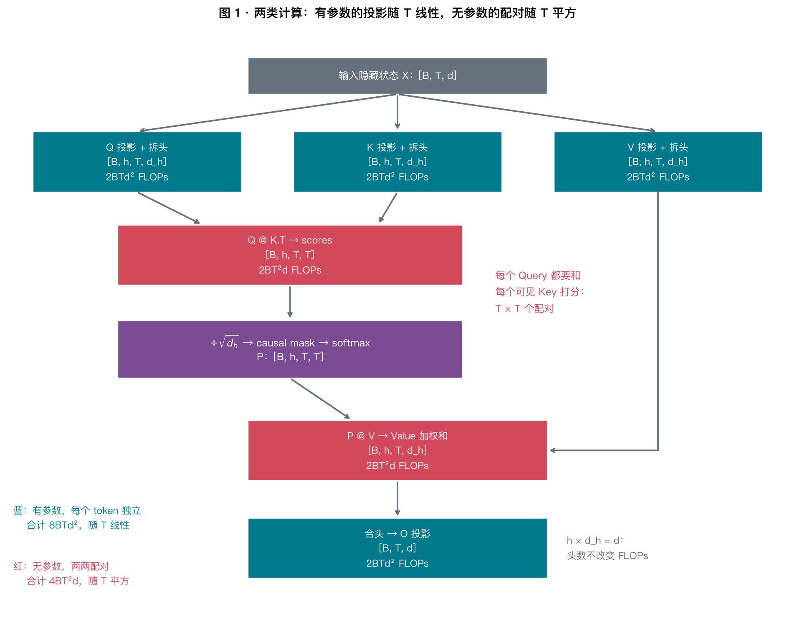
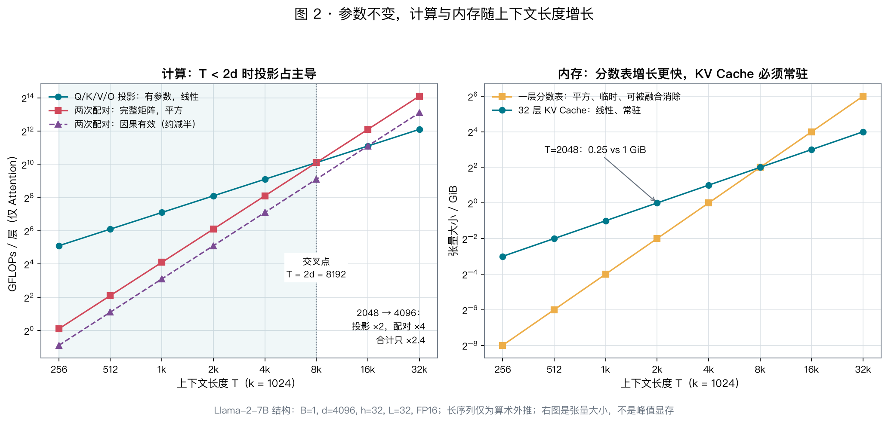
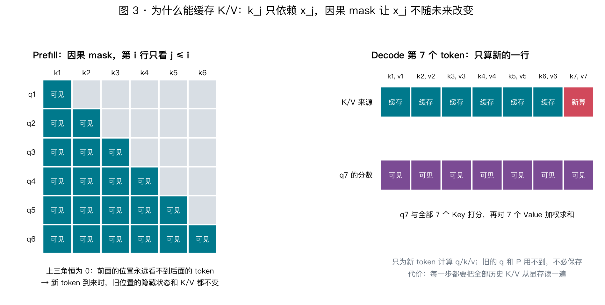
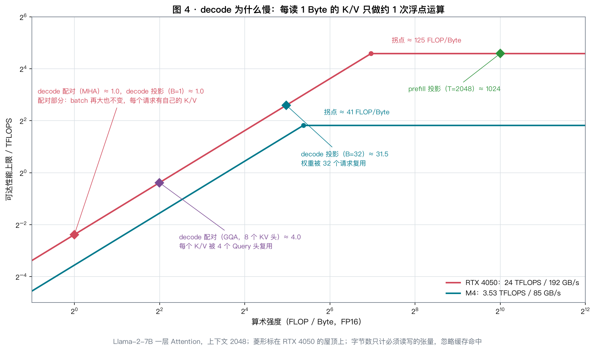

# Day 09 · 注意力的计算图与复杂度：长上下文的代价从哪里来

> **今日目标**：把 Attention 拆成“有参数的投影”和“无参数的两两配对”两类计算，推出 $8BTd^2+4BT^2d$，判断平方项什么时候才是大头；再理解 KV Cache 为什么成立、decode 为什么受带宽限制、GQA 为什么有效。

⏱ 核心思路 20 min · 计算量与内存 25 min · 手算与实验 25 min · 思考 10 min

承接 [Day 08](day08-transformer-anatomy.md)：上一讲问“模型有多少参数”，这一讲问“处理一段输入要做多少计算、占多少内存”。只用纸笔、整数计算器和 CPU 小张量。

---

## 0. 先看结论

今天要建立的三个判断：

1. **Attention 的计算分两类**。Q/K/V/O 投影有参数，每个 token 独立计算，成本随长度 $T$ **线性**增长；$QK^\top$ 和 $PV$ 没有参数，却要计算**每一对位置**，成本随 $T$ **平方**增长。
2. **平方项不一定是大头**。对 Llama-2-7B，只有当 $T>2d=8192$ 时，配对计算才超过投影。“Attention 是 $O(T^2)$”这句话需要配上常数才有意义。
3. **生成阶段的瓶颈往往不是计算，而是读取 KV Cache**。每生成一个 token，都要把全部历史 K/V 从显存读一遍，而每个字节只参与约 1 次浮点运算。

---

## 1. 为什么配对计算是平方的

Day 08 中，Attention 的设计目标是：**按内容决定去哪里取信息**。既然事先不知道该看哪里，就只能让每个 Query 和每个可见 Key 都比较一次：

```text
                 k₁       k₂       k₃       k₄
        q₁     q₁·k₁    q₁·k₂    q₁·k₃    q₁·k₄
        q₂     q₂·k₁    q₂·k₂    q₂·k₃    q₂·k₄
        q₃     q₃·k₁    q₃·k₂    q₃·k₃    q₃·k₄
        q₄     q₄·k₁    q₄·k₂    q₄·k₃    q₄·k₄
```

$T$ 个位置产生 $T^2$ 个分数，长度翻倍，分数变为 4 倍。**平方成本就是“按内容灵活取信息”的代价**，不是实现不够好。

投影则不同：每个 token 各自乘同一组权重，不与其他位置发生关系。长度翻倍，投影计算只翻倍。

---

## 2. 计算图与形状



符号：$B$ 为 batch，$T$ 为序列长度，$d$ 为模型宽度，$h$ 为头数，$d_h=d/h$ 为每头宽度，$L$ 为层数，$b$ 为每个元素的字节数。默认采用 Llama-2-7B 的配置：$d=4096,h=32,d_h=128,L=32$，FP16 时 $b=2$。

固定一个 batch、一个头：

| 步骤 | 形状 | 有参数吗 | 作用 |
|---|---|:---:|---|
| Q/K/V 投影 | $(T,d)(d,d)\to(T,d)$，再拆成 $h$ 头 | ✓ | 读出“找什么 / 能匹配什么 / 交出什么” |
| $QK^\top$ | $(T,d_h)(d_h,T)\to(T,T)$ | ✗ | 所有 Query–Key 配对打分 |
| 缩放 + mask + softmax | $(T,T)\to(T,T)$ | ✗ | 变成每行和为 1 的权重 $P$ |
| $PV$ | $(T,T)(T,d_h)\to(T,d_h)$ | ✗ | 按权重混合 Value |
| 合头 + O 投影 | $(T,d)(d,d)\to(T,d)$ | ✓ | 混合各头结果，写回残差流 |

两点需要注意：

- **行是 Query，列是 Key**。$P_{ij}$ 表示位置 $i$ 从位置 $j$ 取多少，因此 softmax 沿最后一维（Key）计算。
- **拆头不复制数据**。$(T,d)$ 只是被看成 $h$ 份 $(T,d_h)$，总宽度仍为 $d$。

---

## 3. 数 FLOPs：$O(T^2d)$ 前面的常数是多少

### 3.1 一条规则

$(m,k)\times(k,n)$ 的矩阵乘法有 $mn$ 个输出，每个输出做 $k$ 次乘加。一次乘加按 2 FLOPs 计：

$$
F=2mkn
$$

### 3.2 套用到六次矩阵乘

| 算子 | 形状 | FLOPs |
|---|---|---:|
| Q、K、V、O 四次投影 | 每次 $(T,d)(d,d)$，共 $B$ 份 | $4\times2BTd^2=8BTd^2$ |
| $QK^\top$ | $(T,d_h)(d_h,T)$，共 $Bh$ 份 | $2BhT^2d_h=2BT^2d$ |
| $PV$ | $(T,T)(T,d_h)$，共 $Bh$ 份 | $2BhT^2d_h=2BT^2d$ |
| **每层合计** | | $\boxed{8BTd^2+4BT^2d}$ |

所以 Attention 核心部分的完整式是 **$4BT^2d$**：两次矩阵乘，每次乘加计 2 FLOPs。

头数为什么消失了？因为 $h\cdot d_h=d$。固定 $d$ 时，增加头数、缩窄每头宽度，矩阵乘的 FLOPs 不变。

softmax、mask、缩放也有计算，但它们不是矩阵乘，数量级是 $O(BhT^2)$，比 $QK^\top$ 少一个 $d_h$ 因子。本表不计入它们；它们对延迟的影响主要来自访存，Day 29 讨论 FlashAttention 时再展开。

---

## 4. 平方项什么时候才是大头

### 4.1 代入真实尺寸

Llama-2-7B，$B=1,T=2048$，每层：

| 部分 | FLOPs | 占比 |
|---|---:|---:|
| 四次投影 $8BTd^2$ | 274,877,906,944 | 80% |
| 两次配对 $4BT^2d$ | 68,719,476,736 | 20% |
| **每层合计** | **343,597,383,680** | |
| **32 层合计** | **约 11.0 TFLOPs** | |

**在 2K 上下文时，投影是配对计算的 4 倍**。平方项在这里不是主要成本。

### 4.2 交叉点

两部分相等时：

$$
4BT^2d=8BTd^2\quad\Rightarrow\quad T=2d
$$

Llama-2-7B 的交叉点为 $T=8192$。低于它时投影占主导，高于它时配对计算增长更快（见图 3 左）。

由此可以直接回答：**输入从 2048 增加到 4096，Attention 计算量是 4 倍吗？** 不是。投影变为 2 倍，配对计算变为 4 倍，按 4:1 的比例加权后：

$$
\frac{4\times2+1\times4}{4+1}=2.4\ \text{倍}
$$

只看平方项，会高估长度增长带来的代价；当 $T\gg 2d$ 时，平方项才真正主导。

### 4.3 因果 mask 能省多少

位置 $i$ 只能看 $1..i$（包括自己，因为它用当前及之前的 token 预测下一个 token）。有效配对数是：

$$
1+2+\cdots+T=\frac{T(T+1)}2\approx\frac{T^2}2
$$

但只有**配对计算**减半，投影一点也没少——每个 token 仍要完整计算 Q/K/V/O。在 2K 时，因果有效计算量为每层 309,254,422,528 FLOPs，**总量只少约 10%**。

而且这是“数学上有用”的计算量。普通实现先算完整的 $QK^\top$ 再 mask，不会跳过被遮住的部分；能分块跳过上三角的 kernel（如 FlashAttention）才能真正省下这些计算。



---

## 5. 内存：临时分数表与 KV Cache

Attention 有两类随长度增长的存储，性质完全不同：

| | 一层的分数表 scores / $P$ | 全部层的 KV Cache |
|---|---|---|
| 大小 | $BhT^2b$ | $2BLTdb$ |
| 增长 | **平方** | **线性** |
| 生命周期 | 当前层用完即可丢弃 | 跨层、跨生成步保留，直到请求结束 |
| 能否避免 | 能：融合 kernel 分块计算，不写出完整表 | 不能（除非重算），只能压缩 |

默认配置、FP16：

| $T$ | 一层完整分数表 | 32 层 KV Cache |
|---:|---:|---:|
| 2048 | 0.25 GiB | 1 GiB |
| 4096 | 1 GiB | 2 GiB |
| 8192 | 4 GiB | 4 GiB |
| 16384 | 16 GiB | 8 GiB |

分数表增长更快，但它是**可以消除的临时数据**：FlashAttention 通过分块和在线 softmax，从不在显存中写出完整的 $T\times T$ 表（Day 29）。KV Cache 增长较慢，却**必须一直保留**，因此在实际推理服务中，它通常是显存的主要占用者。

> 不要把一层的 0.25 GiB 直接乘以 32 当作峰值显存：分数表是逐层临时使用的。这些数字是张量大小，不是实测的峰值显存。

---

## 6. Decode：KV Cache 为什么成立，又为什么慢

### 6.1 为什么可以缓存 K/V，而不缓存 Q

生成时，每一步只新增一个 token。新 token 需要：自己的 $q$，以及**所有**历史位置的 $k,v$。

历史位置的 $k_j,v_j$ 会变吗？不会，原因有两个：

1. **$k_j=x_jW_K$ 只依赖位置 $j$ 自己**（Day 08 §2.3），与谁来查询无关；
2. **因果 mask 保证 $x_j$ 不受未来 token 影响**。新 token 到来后，前面所有位置在每一层的隐藏状态都保持不变。

所以历史 K/V 算一次、存起来即可。这就是 **KV Cache**。



**那为什么没有 Q Cache？** 缓存的前提是“以后还会再用”。看每一步实际用到了什么：

| 生成步 | 计算 | 用到的 q | 用到的 k, v |
|---|---|---|---|
| 第 4 步 | $o_4=\sum_{j\le4}\operatorname{softmax}(q_4\cdot k_j)\,v_j$ | 只有 $q_4$ | $k_1..k_4,\ v_1..v_4$ |
| 第 5 步 | $o_5=\sum_{j\le5}\operatorname{softmax}(q_5\cdot k_j)\,v_j$ | 只有 $q_5$ | $k_1..k_5,\ v_1..v_5$ |
| 第 6 步 | …… | 只有 $q_6$ | $k_1..k_6,\ v_1..v_6$ |

- $k_1,v_1$ 在**之后的每一步**都会被用到：它们是“被查询的一方”，所有未来的 token 都要来查。
- $q_4$ **只在第 4 步用一次**：它是“发起查询的一方”，用来算出 $o_4$。而因果 mask 保证 $o_4$ 以后不会改变，所以 $q_4$ 再也不会被用到。

这就像搜索引擎：索引（K/V）建好后，每次新搜索都要用它；用户的搜索词（Q）用完即弃，没有人会缓存别人以前的搜索词来回答新的搜索。注意力权重 $P$ 的历史行也一样，算完 $o_4$ 就不再需要。

更进一步：旧位置在各层的隐藏状态也不需要缓存。FFN、Norm、残差都是逐位置计算的，**旧位置向新 token 传递信息的唯一通道就是 Attention 中的 K 和 V**。所以每层的 K/V 正好是旧 token 需要留给未来的全部内容，不多也不少。

> 因果 mask 不只是训练时防止偷看答案，它也是 KV Cache 能成立的前提。双向模型（如 BERT）中，新 token 会改变所有旧位置的表示，缓存就失效了。

### 6.2 单步计算量

设 $T$ 为包含当前 token 在内的可见长度。每头形状变为 $q:(1,d_h)$，$K,V:(T,d_h)$，$P:(1,T)$：

$$
F_{\text{decode}}=\underbrace{8Bd^2}_{\text{投影，只算 1 个 token}}+\underbrace{4BTd}_{\text{配对，随历史线性增长}}
$$

默认配置、$T=2048$：每层 167,772,160 FLOPs，32 层约 5.37 GFLOPs。与 prefill 相比，计算量小得多。

### 6.3 为什么 decode 受带宽限制

用 [Day 02 的 Roofline](../week01/day02-roofline.md) 看配对计算，每层：

```text
计算：4Td        = 4 × 2048 × 4096     = 33,554,432 FLOPs
读取：K 和 V 各 Td 个元素 × 2 Byte     = 33,554,432 Byte
算术强度 ≈ 1 FLOP/Byte
```

每读 1 个字节只做约 1 次浮点运算，远低于 Mac 约 41、RTX 4050 约 125 FLOP/Byte 的拐点，因此是**严重的带宽受限**。原因很直接：MHA 中，每个 K/V 元素只服务一个 Query 头的一个新 token，读进来用一次就结束了。

增大 batch 有帮助吗？对**投影**有帮助：所有请求共用同一份权重，读一次权重可以服务 $B$ 个 token。对**配对计算**没有帮助：每个请求有自己的 KV Cache，batch 再大，每个字节仍只用一次。



图中同一层 Attention 的不同部分落在屋顶的不同位置：prefill 投影远在拐点右侧，属于算力受限；decode 的配对计算和 B=1 投影都在最左端，可达性能不到 RTX 4050 峰值的 1%。

这也解释了为什么推理优化中有大量工作围绕 KV Cache：减小它，或者让读进来的每个字节被多用几次。

### 6.4 GQA：让多个 Query 头共享 K/V

GQA 正是针对上面的问题：$h$ 个 Query 头分成 $h_{kv}$ 组，每组共享一套 K/V。Llama-2-70B、Llama-3 等模型都采用了它。

| $h=32,\ h_{kv}=8$ | 相对 MHA |
|---|---:|
| KV Cache 大小 | **1/4** |
| decode 配对的算术强度 | **约 4 倍**（每个 K/V 被 4 个 Query 头复用） |
| K/V 投影参数与 FLOPs | 1/4 |
| Q/O 投影 | 不变 |
| Query–Key 配对数、配对 FLOPs | **不变**，每个 Query 头仍要独立打分 |

GQA 不减少配对计算，它减少的是**需要存储和读取的 K/V**——而这正是 decode 的瓶颈。代价是 K/V 的表达能力下降，需要在训练时就采用这种结构。注意力变体的设计留到 Day 17。

---

## 7. 手算练习

### Q1 · 小矩阵逐项数

$B=2,T=4,d=16,h=4$，MHA。求一层的四次投影、两次配对（完整 / 因果有效）以及两种总计的 FLOPs。

<details>
<summary>参考答案</summary>

$$
8BTd^2=8\times2\times4\times16^2=16,384
$$

$$
4BT^2d=4\times2\times16\times16=2,048,\qquad
2BT(T+1)d=2\times2\times4\times5\times16=1,280
$$

总计 **18,432**（完整）与 **17,664**（因果有效）。

</details>

### Q2 · 交叉点

某模型 $d=8192$。上下文多长时，Attention 的配对计算才开始超过投影？如果你听到“这个模型处理 4K 上下文主要贵在 Attention 的平方项”，你会怎样回应？

<details>
<summary>参考答案</summary>

交叉点 $T=2d=16384$。4K 时配对计算只有投影的 $T/2d=1/4$，主要成本仍是投影；而且还没有算 FFN，FFN 的计算量是 Attention 投影的 2 倍。

</details>

### Q3 · 真实尺寸的内存

$B=2,T=4096,L=32,d=4096,h=32$，FP16。求 MHA 的全部 KV Cache 和一层的一份完整分数表。KV 头改为 8 后，两者分别怎样变化？

<details>
<summary>参考答案</summary>

$$
\text{KV Cache}=2\times2\times32\times4096\times4096\times2\ \text{Byte}=4\ \text{GiB}
$$

$$
\text{分数表}=2\times32\times4096^2\times2\ \text{Byte}=2\ \text{GiB}
$$

GQA 后 KV Cache 降为 **1 GiB**；分数表仍为 **2 GiB**，因为 Query 头仍有 32 个。

</details>

---

## 8. 动手实验

实验文件：[attention_cost.py](../../labs/day09/attention_cost.py)。

**A · 计算器**（只用标准库，不构造大张量）：

```bash
uv run python labs/day09/attention_cost.py                         # 默认 prefill
uv run python labs/day09/attention_cost.py --seq-len 4096          # 验证 2.4 倍
uv run python labs/day09/attention_cost.py --mode decode --seq-len 2048
uv run python labs/day09/attention_cost.py --kv-heads 8            # GQA
uv run python labs/day09/attention_cost.py \
  --batch 2 --seq-len 4 --width 16 --heads 4 --kv-heads 4 --layers 1   # 核对 Q1
```

| 命令 | 每层完整总计 | 每层因果有效总计 |
|---|---:|---:|
| 默认 | 343,597,383,680 | 309,254,422,528 |
| `--seq-len 4096` | 824,633,720,832 | 687,228,321,792 |
| `--mode decode` | 167,772,160 | 167,772,160 |
| `--kv-heads 8` | 240,518,168,576 | 206,175,207,424 |

**B · 看见分数表**（CPU 小张量，$B=2,T=5,d=16,h=4$）：

```bash
uv run python labs/day09/attention_cost.py --demo
```

观察三件事：$P$ 的上三角为 0；每行和为 1，第一行只能 100% 看自己；**只用最后一个 Query 加上缓存的 K/V，结果与完整前向的最后一行一致**——这就是 §6.1 的数值验证。

**C · 自动核对**：

```bash
uv run python labs/day09/attention_cost.py --check
```

它检查正文中的数字、手写 Attention 与 PyTorch SDPA 的一致性（MHA/GQA/MQA），以及逐 token 缓存 decode 的正确性。

> **为 Day 10 写代码提个醒**：decode 时的 $(1,T)$ 分数行应该**全部可见**。若直接套用左上对齐的下三角 mask（如 `torch.tril`，或对非方形输入使用 SDPA 的 `is_causal=True`），只会保留第一列。正确做法是按绝对位置构造 `key_pos <= query_pos`。

结果记入 [day09-notes.md](day09-notes.md)。重画本章配图：`uv run python scripts/day09_figs.py`。

---

## 9. 思考题

### T1 · 没有参数的地方，为什么值得优化

用“每 token 约 $2N$ FLOPs”估算长上下文的成本，会漏掉什么？漏掉的部分怎样随长度变化？

<details>
<summary>提示</summary>

$2N$ 只统计有参数的矩阵乘。$QK^\top$ 和 $PV$ 没有参数，prefill 时总量随 $T^2$ 增长，decode 时每步随 $T$ 增长；而且 decode 时这部分受带宽限制，实际耗时占比会比 FLOPs 占比更高。

</details>

### T2 · 同样的 FLOPs，为什么延迟不同

固定 $d$，把头数从 16 改为 32。矩阵乘 FLOPs 不变，为什么延迟和显存仍可能变化？

<details>
<summary>提示</summary>

完整分数表大小 $BhT^2$ 翻倍，softmax 的行数也翻倍；每头矩阵变窄，可能降低矩阵乘的硬件效率。FLOPs 相同不代表访存量和 kernel 效率相同。

</details>

### T3 · 长上下文 OOM，先问什么

有人说：“Attention 是平方复杂度，所以把权重量化成 INT4 就能解决长上下文 OOM。”这条建议对症吗？

<details>
<summary>一种分析路线</summary>

先确认显存被谁占用：权重、完整分数表，还是 KV Cache。量化权重只缩小权重；若是分数表，应换用融合 Attention；若是 KV Cache，应考虑 KV 量化、GQA 模型、减小 batch 或上下文长度。

</details>

---

## 10. 一页纸复盘

```text
                         Attention 每层
           ┌─────────────────┴─────────────────┐
     Q/K/V/O 投影：有参数               QKᵀ、PV：无参数，两两配对
     每个 token 独立，线性               “按内容取信息”的代价，平方
           │                                   │
prefill    8BTd²                         4BT²d（因果有效约减半）
decode     8Bd²                          4BTd

交叉点：T = 2d（Llama-2-7B 为 8192），之前投影占主导

内存：  一层分数表 BhT²b —— 平方、临时、可被 FlashAttention 消除
        KV Cache 2BLTdb  —— 线性、常驻、decode 每步都要全部读一遍

KV Cache 成立：k_j 只依赖 x_j  +  因果 mask 使 x_j 不随未来变化
decode 慢：    读 1 Byte KV 只做约 1 FLOP → 带宽受限
GQA：          多个 Query 头共享 K/V → KV 变小，复用率提高；配对数不变
```

**今日一句话**：

> Attention 的平方成本是“按内容取信息”的代价，但只有在 $T>2d$ 时才超过投影；真正让生成变慢的，往往是每一步都要从显存读一遍、却几乎只用一次的 KV Cache。

---

## 11. 延伸阅读

| 材料 | 看什么 |
|---|---|
| [Day 08：Transformer 结构与参数量](day08-transformer-anatomy.md) | Q/K/V 的设计动机，为什么 $k_j$ 只依赖 $x_j$ |
| [Day 02：Roofline](../week01/day02-roofline.md) | 算术强度与拐点，判断 decode 为何带宽受限 |
| [Transformer Inference Arithmetic](https://kipp.ly/transformer-inference-arithmetic/) | 用同样的算法分析推理的 FLOPs、显存与延迟 |
| [GQA 论文](https://arxiv.org/abs/2305.13245) | 为什么共享 K/V 几乎不损失质量 |
| [FlashAttention](https://arxiv.org/abs/2205.14135) | 为什么不写出分数表就能减少访存（Day 29） |
| [X03：Softmax](../extra/x03-softmax.md) | 稳定 softmax、mask 的顺序 |

## 今日检查清单

- [ ] 能说明 Attention 中哪些计算有参数、哪些没有，以及各自随 $T$ 怎样增长
- [ ] 能解释平方成本是“按内容取信息”的代价
- [ ] 能用 $2mkn$ 推出 $8BTd^2+4BT^2d$，并解释头数为什么消失
- [ ] 能算出交叉点 $T=2d$，并解释长度翻倍为什么不是 4 倍
- [ ] 能说明因果 mask 为什么只让总计算量少约 10%
- [ ] 能区分分数表和 KV Cache：增长方式、生命周期、能否避免
- [ ] 能用两条理由解释 KV Cache 为什么成立
- [ ] 能用算术强度解释 decode 为什么受带宽限制，以及 GQA 为什么有效
- [ ] 完成三道手算，运行 `--demo` 与 `--check`
- [ ] 在 [day09-notes.md](day09-notes.md) 留下自己仍讲不清楚的一点

**下一讲 [Day 10](day10-minigpt.md)**：从零手写 GPT。把这两天的设计和形状变成能跑通的前向代码。
