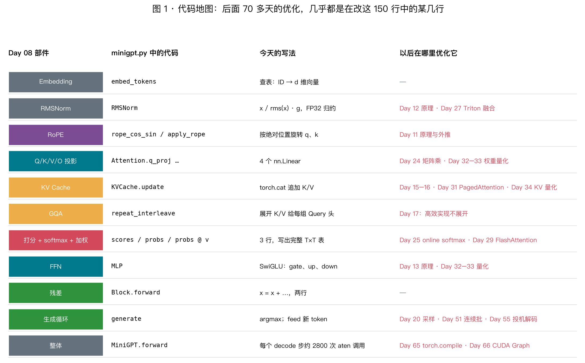
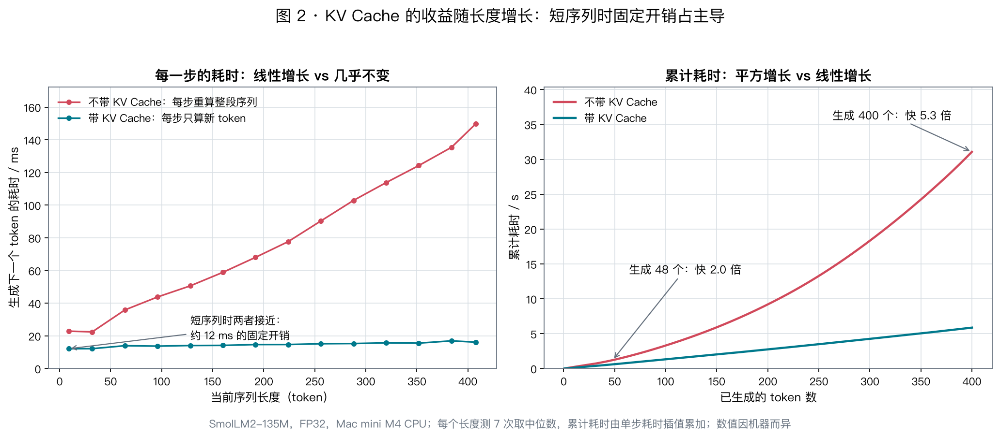

# Day 10 · 从零手写 GPT：把结构图变成能跑、能对账的代码

> **今日目标**：不用 `nn.Transformer`，也不用 Hugging Face 的模型类，用约 150 行 PyTorch 写出 Llama 结构的 GPT；加载真实权重，与 transformers 的输出逐位对上；再加上 KV Cache，用实测验证 Day 09 的分析。

⏱ 读代码 35 min · 对账与实验 25 min · 练习 15 min

实验文件：[minigpt.py](../../labs/day10/minigpt.py)。模型用 [SmolLM2-135M](https://huggingface.co/HuggingFaceTB/SmolLM2-135M)，下载约 270 MB，CPU 即可运行。

---

## 0. 为什么要自己写一遍

**第一，能写出来并且对得上，是检验理解最硬的标准。** Day 08/09 的每个结论——Q/K/V 的形状、GQA 怎样共享、mask 怎样构造、KV Cache 为什么成立——在代码里都会变成一行。哪一行理解错了，输出就和参考实现对不上。

**第二，后面的课程几乎都在改这 150 行中的某几行。** FlashAttention 改的是 Attention 中的三行，PagedAttention 改的是 KV Cache 的存法，量化改的是 `nn.Linear` 的权重，连续批处理改的是生成循环。先有一个自己完全看懂的基线，以后每学一项优化，都能准确说出“它改了哪一行、为什么要改”。



---

## 1. 核心思想：模型 = 一组有名字的张量 + 一段知道怎么用它们的代码

下载下来的模型只有两样东西：

- `config.json`：几个整数，决定每个张量的形状；
- `model.safetensors`：一个“名字 → 张量”的字典，**里面没有任何代码**。

所以“加载模型”其实就是：用代码搭好结构，再按名字把张量放到对应的位置。只要名字和形状全部对上，模型就“活”了。

### 1.1 为什么选 SmolLM2-135M

它和 Llama-2-7B 是**同一种结构**（`LlamaForCausalLM`），只是尺寸小。同一份代码换个 config 就能跑 7B；但 7B 的 FP32 权重要 27 GB，Mac 的 16 GB 内存放不下。

| 配置 | SmolLM2-135M | Llama-2-7B |
|---|---:|---:|
| 宽度 $d$ | 576 | 4096 |
| 层数 $L$ | 30 | 32 |
| Query 头 / KV 头 | 9 / 3（**GQA**） | 32 / 32 |
| 每头宽度 $d_h$ | 64 | 128 |
| FFN 中间宽度 $m$ | 1536 | 11008 |
| 词表 $V$ | 49152 | 32000 |
| 输入输出共享权重 | 是 | 否 |
| 参数量 | 134,515,008 | 6,738,415,616 |

SmolLM2 恰好用了 GQA 和权重共享，这两点在 Day 08 只讲过公式，今天会在代码里真正遇到。134,515,008 和 [Day 08 计算器](../../labs/day08/param_count.py)的结果完全一致。

### 1.2 权重名就是 Day 08 的部件名

一层的全部张量（真实文件中的名字与形状）：

| 张量名（省略 `model.layers.0.`） | 形状 | Day 08 中的部件 |
|---|---|---|
| `self_attn.q_proj.weight` | (576, 576) | $W_Q$：我在找什么 |
| `self_attn.k_proj.weight` | **(192, 576)** | $W_K$：我能匹配什么；GQA 下只有 3 头 × 64 = 192 |
| `self_attn.v_proj.weight` | **(192, 576)** | $W_V$：我交出什么 |
| `self_attn.o_proj.weight` | (576, 576) | $W_O$：混合各头，写回残差流 |
| `mlp.gate_proj.weight` | (1536, 576) | SwiGLU 门控 |
| `mlp.up_proj.weight` | (1536, 576) | 变宽 |
| `mlp.down_proj.weight` | (576, 1536) | 缩回 $d$ |
| `input_layernorm.weight` | (576,) | Attention 前的 RMSNorm |
| `post_attention_layernorm.weight` | (576,) | FFN 前的 RMSNorm |

另外还有 `embed_tokens.weight` (49152, 576) 和最后的 `norm.weight` (576,)。文件里**没有** `lm_head.weight`，因为它与 Embedding 共享。

注意 `nn.Linear` 按 **(输出, 输入)** 存权重，计算的是 $xW^\top$。所以 Day 08 中写作 $(d,d_{kv})$ 的 $W_K$，在文件里是 (192, 576)。

---

## 2. 自顶向下读代码

### 2.1 整个模型：Day 08 §0 的图，逐行对应

```python
def forward(self, ids, caches: list[KVCache] | None = None):            # ids: (B, T)
    start = caches[0].length if caches else 0
    positions = torch.arange(start, start + ids.shape[1], device=ids.device)
    x = self.embed_tokens(ids)                                          # (B, T, d)
    cos, sin = rope_cos_sin(positions, self.cfg.head_dim, self.cfg.rope_theta, x.dtype)
    for i, layer in enumerate(self.layers):
        x = layer(x, cos, sin, positions, caches[i] if caches else None)
    return self.lm_head(self.norm(x))                                   # (B, T, V)
```

token ID → Embedding → $L$ 个 block → Final Norm → LM head。唯一新出现的是 `positions`：有缓存时，新 token 的位置要从**已缓存的长度**开始计数，而不是从 0 开始。

### 2.2 一个 block：两行残差

```python
def forward(self, x, cos, sin, positions, cache=None):
    x = x + self.self_attn(self.input_layernorm(x), cos, sin, positions, cache)  # 取信息
    x = x + self.mlp(self.post_attention_layernorm(x))                            # 加工
    return x
```

这两行就是 Day 08 §4 的残差流：先 Norm，再计算增量，然后加回 `x`。

### 2.3 Attention：Day 08 §2 和 Day 09 的内容都在这 20 行里

```python
def forward(self, x, cos, sin, positions, cache: KVCache | None = None):
    B, T, _ = x.shape
    q = self.q_proj(x).view(B, T, self.h, self.dh).transpose(1, 2)       # (B, h,    T, d_h)
    k = self.k_proj(x).view(B, T, self.h_kv, self.dh).transpose(1, 2)    # (B, h_kv, T, d_h)
    v = self.v_proj(x).view(B, T, self.h_kv, self.dh).transpose(1, 2)
    q, k = apply_rope(q, cos, sin), apply_rope(k, cos, sin)
    if cache is not None:
        k, v = cache.update(k, v)                                        # (B, h_kv, T_k, d_h)
    group = self.h // self.h_kv                                          # GQA：每组共享一套 K/V
    k, v = k.repeat_interleave(group, dim=1), v.repeat_interleave(group, dim=1)

    scores = q @ k.transpose(-2, -1) / math.sqrt(self.dh)               # (B, h, T, T_k)
    key_pos = torch.arange(k.shape[2], device=x.device)
    future = key_pos[None, :] > positions[:, None]                      # 按绝对位置判断
    scores = scores.masked_fill(future, float("-inf"))
    probs = scores.float().softmax(dim=-1).to(q.dtype)                  # 沿 Key 维
    out = (probs @ v).transpose(1, 2).reshape(B, T, self.h * self.dh)   # 合头
    return self.o_proj(out)
```

逐段对照前两天的结论：

| 代码 | 对应的原理 |
|---|---|
| 三个投影，q 是 9 头，k/v 只有 3 头 | Q/K/V 是同一个 $x$ 的三种读法；GQA 只让 K/V 变窄（Day 08 §2.3、§7） |
| `view` + `transpose` | 拆头只是重新解释形状，不复制数据（Day 09 §2） |
| RoPE **只作用于 q 和 k** | 位置只影响“谁和谁匹配”，不影响“交出什么内容”，所以 V 不旋转（Day 11） |
| `cache.update(k, v)` | 只缓存 K/V；q 用完即弃（Day 09 §6.1） |
| `repeat_interleave` | 第 $i$ 个 Query 头使用第 $i\,//\,\text{group}$ 组 K/V |
| `scores` → `masked_fill` → `softmax` → `@ v` | 打分、因果 mask、归一化、加权求和；三行就写出了完整的 $T\times T$ 表（Day 09 §5） |
| `future` 按**绝对位置**计算 | 同一行代码同时适用于 prefill（方阵）、decode（单行）和分块 prefill |
| softmax 在 FP32 中计算 | 指数和求和对精度敏感（Day 05、X03） |
| `o_proj` | 混合各头结果，写回残差流 |

### 2.4 FFN、RMSNorm 与 RoPE

```python
def forward(self, x):                                                   # MLP（SwiGLU）
    return self.down_proj(F.silu(self.gate_proj(x)) * self.up_proj(x))
```

```python
def forward(self, x):                                                   # RMSNorm
    x32 = x.float()                                     # 归约在 FP32 里做
    x32 = x32 * torch.rsqrt(x32.pow(2).mean(-1, keepdim=True) + self.eps)
    return self.weight * x32.to(x.dtype)
```

RoPE 由 `rope_cos_sin` 和 `apply_rope` 两个函数实现，共约 10 行。今天把它当作黑盒：输入绝对位置，按位置旋转 q 和 k。原理留到 Day 11。

### 2.5 生成循环：带不带缓存，只差一行

```python
def generate(model: MiniGPT, ids, steps: int, use_cache: bool = True):
    caches = [KVCache() for _ in model.layers] if use_cache else None
    seq = feed = ids
    for _ in range(steps):
        logits = model(feed, caches)
        next_id = logits[:, -1:].argmax(dim=-1)                             # (B, 1)
        seq = torch.cat([seq, next_id], dim=1)
        feed = next_id if use_cache else seq
    return seq[:, ids.shape[1]:]
```

关键是最后一行 `feed = next_id if use_cache else seq`：

- **不带缓存**：每一步把整段序列重新喂进去，所有历史 token 的 K/V 都要重算一遍；
- **带缓存**：只喂新 token，历史 K/V 从 `KVCache` 中读取。

第一步喂入的是整段提示词，也就是 **prefill**；之后每一步只喂一个 token，也就是 **decode**。两个阶段走的是同一个 `forward`。

`KVCache` 本身只有十几行：每层保存一份 `k` 和 `v`，`update` 用 `torch.cat` 把新的 K/V 拼到末尾。

---

## 3. 怎样证明写对了

```bash
uv run python labs/day10/minigpt.py --check --offline   # 不联网
uv run python labs/day10/minigpt.py --check             # 加上真实权重
```

对账分层进行，每一层回答一个不同的问题：

| 检查 | 回答什么问题 | 实测 |
|---|---|---|
| **随机小模型 vs transformers** | 结构写对了吗？不联网，覆盖 MHA / GQA / MQA 和是否共享权重 | logits 误差约 $10^{-7}$ |
| **真实权重 vs transformers** | 权重名、形状、RoPE 配置都对吗？ | logits 误差 **0**，逐位相同 |
| **参数量 vs Day 08 计算器** | 没有漏掉或多出张量吗？ | 134,515,008 |
| **prefill + 逐 token decode vs 一次完整前向** | 缓存和位置偏移写对了吗？ | 误差约 $10^{-4}$ |
| **生成 token：带缓存 = 不带缓存 = transformers** | 端到端行为一致吗？ | 完全相同 |

两个细节值得理解：

- **为什么用 FP32 对账？** BF16 只有约 3 位有效数字（Day 05），误差在 $10^{-2}$ 量级，足以掩盖很多小 bug。FP32 下，一个正确实现的误差应在 $10^{-5}$ 以下。
- **为什么缓存版本的误差是 $10^{-4}$ 而不是 0？** 两种算法在数学上相同，但矩阵形状不同，累加顺序也不同，浮点舍入因此略有差异。真实权重与 transformers 的误差恰好为 0，是因为两边执行的是完全相同的运算序列。

**只做自洽检查是不够的。** 下面第 6 节的实验 C 会表明：RoPE 写错时，缓存版与完整版依然彼此一致，只有与参考实现对比才能发现问题。

---

## 4. 让 KV Cache 跑起来：Day 09 的预测对不对

```bash
uv run python labs/day10/minigpt.py                   # 默认提示词，生成 48 个 token
uv run python labs/day10/minigpt.py --max-new-tokens 200
```



**左图：每一步的耗时。** 不带缓存时，第 $t$ 步要把 $t$ 个 token 全部重算一遍，单步耗时随长度线性增长（23 ms → 150 ms）。带缓存时只算 1 个新 token，单步耗时几乎不变（12 ms → 16 ms）；那一点增长来自新 Query 要与更多的历史 K/V 配对。

**右图：累计耗时。** 线性增长的单步耗时累加起来，就是平方增长。生成 48 个 token 时，缓存只快 2 倍；生成 400 个 token 时快 5.3 倍。差距会随长度继续拉大。

**为什么短序列时收益不大？** 带缓存的一步约 12 ms，可以用 [Day 02 的 Roofline](../week01/day02-roofline.md) 拆开来看：

- **计算**：约 $2N=0.27$ GFLOPs，对 CPU 来说不到 1 ms；
- **读权重**：FP32 权重共 538 MB，按约 85 GB/s 的带宽算，读一遍约 6 ms；
- **余下的约 6 ms**：每个 decode 步要调用约 2800 次 aten 算子（30 层 × 每层约 95 次），每次调用都有微秒级的固定开销（Day 06）。

这些开销与序列长度无关，短序列时它们占了大头，缓存省下的那部分重复计算反而不显眼。这也预告了后面的两类优化：减少每一步读取的字节数（量化，Day 32–34），以及减少算子调用次数（`torch.compile` 和 CUDA Graph，Day 65–66）。

---

## 5. 最容易写错的地方

| 症状 | 原因 | 背后的原理 |
|---|---|---|
| 加载时报缺少 `lm_head.weight` | 模型共享输入输出权重，文件里只存了一份 | Day 08 §7 |
| 真实权重的 logits 差得很远，随机模型却通过 | 读错了 config，例如 `rope_theta` 用了默认值 | 权重和配置必须同时对上 |
| 只有 GQA 模型对不上 | 用了 `repeat` 而不是 `repeat_interleave`，Query 头与 KV 组的对应关系错位 | Day 08 §7 |
| 完整前向正确，带缓存的 decode 出错 | decode 时位置从 0 重新计数，或对 $(1,T)$ 的分数行套用了左上角 `tril` | Day 09 §8 的提醒 |
| 训练 loss 异常低，生成却是乱码 | 忘了因果 mask，模型在训练时偷看了答案 | Day 08 §2.5 |

---

## 6. 动手实验：故意改错，看哪项检查会失败

每次只改一处，运行 `--check --offline`，记录失败项后再改回来。

**A · 把 `repeat_interleave` 改成 `repeat`**

```python
k, v = k.repeat(1, group, 1, 1), v.repeat(1, group, 1, 1)
```

实测结果：**只有 GQA 配置（h_kv=2）失败**，MHA 和 MQA 都能通过。原因是 MHA 时 `group=1`，MQA 时只有一组 K/V，这两种情况下 `repeat` 与 `repeat_interleave` 的结果恰好相同。这正是测试要覆盖 GQA 的原因：只拿 Llama-2-7B（MHA）来测，这个 bug 永远发现不了。

**B · 删掉 `masked_fill` 那一行**

实测结果：所有配置几乎全部失败，其中“prefill + decode = 完整前向”也失败了。没有 mask 时，完整前向中前面的位置看到了后面的 token；而逐 token decode 时，后面的 token 还不存在。两者的结果不同，正说明因果 mask 是 KV Cache 成立的前提（Day 09 §6.1）。

**C · RoPE 只旋转 q，不旋转 k**

```python
q = apply_rope(q, cos, sin)
```

实测结果：只有“logits 与 transformers 一致”和“top-1 一致”这两项失败，误差约 $10^{-3}$；**缓存版与完整版仍然彼此一致**。自洽不代表正确，必须与参考实现对账。

**D · 在 MPS 上运行**（可选）

```bash
uv run python labs/day10/minigpt.py --device mps
```

记录带缓存与不带缓存的 token/s，并与 CPU 比较。

重画本章配图：`uv run python scripts/day10_figs.py`（会在本机重新测量，约 2 分钟）。

---

## 7. 思考题

### T1 · 为什么 RoPE 只作用于 q 和 k，不作用于 v？

<details>
<summary>提示</summary>

位置信息需要影响的是“谁和谁匹配”，也就是 $q\cdot k$ 的分数；被取走的内容 $v$ 不需要带位置。而且 RoPE 旋转后，$q_i\cdot k_j$ 只依赖相对位置 $i-j$，这正是它的设计目的（Day 11）。

</details>

### T2 · 这份实现浪费了哪些内存和带宽？

至少找出三处，并说出以后哪一天会解决它。

<details>
<summary>提示</summary>

1. `KVCache.update` 每一步都用 `torch.cat` 把整个缓存复制一遍，生成 $n$ 个 token 共复制 $O(n^2)$ 字节 → 预先分配或分页存储（Day 15、Day 31）。
2. `repeat_interleave` 把 K/V 复制了 `group` 倍，抵消了 GQA 省下的读取量 → 让 kernel 直接按组索引（Day 17）。
3. `scores` 与 `probs` 写出完整的 $T\times T$ 表 → FlashAttention（Day 29）。
4. 权重用 FP32 存储，每步要读 538 MB → BF16 / 量化（Day 32–34）。

</details>

### T3 · 用 Day 09 的公式算 SmolLM2 的 KV Cache

上下文 8192，FP16。KV Cache 有多大？与 FP16 权重相比如何？

<details>
<summary>答案</summary>

$$
2\times L\times T\times d_{kv}\times b=2\times30\times8192\times192\times2=188,743,680\ \text{Byte}=180\ \text{MiB}
$$

FP16 权重约 269 MB。8K 上下文的 KV Cache 已接近权重的 70%；如果不用 GQA（$d_{kv}=576$），KV Cache 会是现在的 3 倍，超过权重本身。

</details>

---

## 8. 一页纸复盘

```text
模型 = config（形状） + safetensors（名字 → 张量） + 代码（怎么用它们）

MiniGPT.forward      embed → [Block × L] → norm → lm_head
Block.forward        x = x + Attn(Norm(x));  x = x + MLP(Norm(x))
Attention.forward    q/k/v 投影 → RoPE(q, k) → 缓存 k/v → GQA 展开
                     → q·kᵀ/√d_h → 按绝对位置 mask → softmax → @v → o_proj
generate             feed = next_id if use_cache else seq     ← 有无缓存只差这一行

对账：随机小模型（结构）→ 真实权重（名字与配置）→ 缓存一致性 → 生成一致性
实测：带缓存单步几乎不变，不带缓存单步线性增长；累计耗时一个线性、一个平方
短序列瓶颈：读权重 + 约 2800 次算子调用的固定开销，而不是计算
```

**今日一句话**：

> 模型就是“有名字的张量 + 知道怎么用它们的代码”。约 150 行代码就能复现 Llama 的前向，并与 transformers 逐位一致；带不带 KV Cache 只差一行，收益随生成长度增长。

---

## 9. 延伸阅读

| 材料 | 看什么 |
|---|---|
| [Karpathy：Let's build GPT](https://www.youtube.com/watch?v=kCc8FmEb1nY) | 从零写 GPT 并训练，与今天的“加载权重推理”互补 |
| [nanoGPT](https://github.com/karpathy/nanoGPT) | `model.py`：GPT-2 结构的最小实现，对比 LayerNorm、GELU 和可学习位置编码 |
| [transformers `modeling_llama.py`](https://github.com/huggingface/transformers/blob/main/src/transformers/models/llama/modeling_llama.py) | 今天的参考实现，找到与 `minigpt.py` 每个类对应的代码 |
| [Meta Llama 参考实现](https://github.com/meta-llama/llama/blob/main/llama/model.py) | 预分配的 KV Cache 与 RoPE 的另一种写法 |
| [SmolLM2 模型卡](https://huggingface.co/HuggingFaceTB/SmolLM2-135M) | 模型的训练数据与配置 |

## 今日检查清单

- [ ] 能说出 `config.json` 和 `model.safetensors` 各包含什么，以及“加载模型”具体做了什么
- [ ] 能把一层的 9 个权重名对应到 Day 08 的部件，并解释 `k_proj` 为什么是 (192, 576)
- [ ] 能逐行解释 `Attention.forward`，包括 RoPE 为什么不作用于 v
- [ ] 能说明 mask 为什么要按绝对位置构造
- [ ] 能解释生成循环中“带不带缓存只差一行”
- [ ] 运行 `--check` 全部通过，并理解每项检查回答什么问题
- [ ] 完成实验 A–C，能解释为什么实验 A 只有 GQA 失败、实验 C 的自洽检查仍然通过
- [ ] 能用 Roofline 和算子调用开销解释短序列时缓存收益不大
- [ ] 在 [day10-notes.md](day10-notes.md) 留下自己仍讲不清楚的一点

**下一讲 Day 11**：位置编码。今天当作黑盒的 `apply_rope` 到底在旋转什么？为什么旋转后点积只依赖相对位置？
